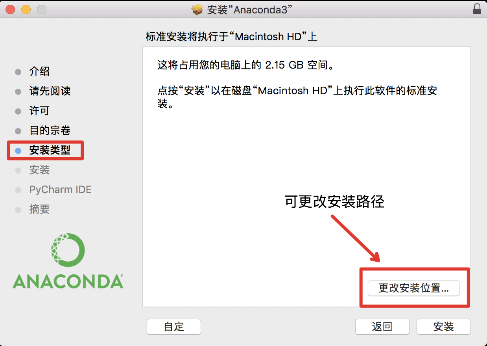

## 2.3.1.1 下载Anaconda     
在Anaconda官网[(https://www.anaconda.com/distribution/)](https://www.anaconda.com/distribution/)选择“MacOS”，并选择与所需python相对应的Anaconda版本进行下载

## 2.3.1.2 安装Anaconda 
***步骤一：安装***      
打开下载的安装包（以.pkl为后缀），根据引导完成安装，在安装过程中可以修改安装路径，具体如下图所示：
<div align=center></div>          
【注意】默认安装在MacOS当前用户主目录下       

***步骤二：设置环境变量***   
在命令行中执行下述命令

```cmd
# 将anaconda的bin目录加入PATH
# 根据安装路径的不同，修改”/Users/anaconda3/bin“
echo 'export PATH="/Users/anaconda3/bin:$PATH"' >> ~/.bash_profile
# 更新bash_profile以立即生效
source ~/.bash_profile
```
## 2.3.1.3 使用Anaconda 
在命令行中执行下述命令
```cmd
# 创建一个名为mypaddle的环境，指定python版本是3.5
conda create -n mypaddle python=3.5
# 创建好后，使用activate进入环境
source activate mypaddle
python --version
# 若上述命令行出现Anaconda字样，则表示安装成功
# 退出环境
source deactivate
```
