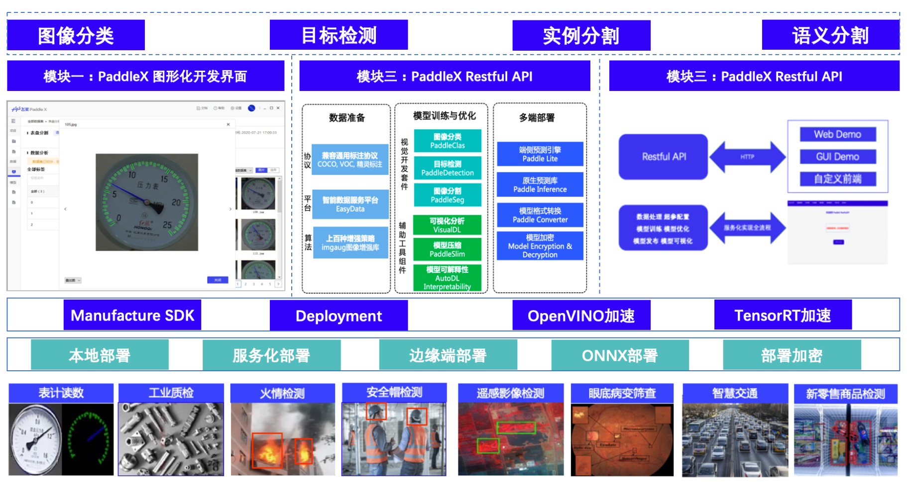
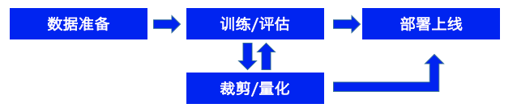

  

 
 PaddleX -- 飞桨全流程开发工具，以低代码的形式支持开发者快速实现产业实际项目落地 

    
    
    
    

## 近期动态
:fire: 发布飞桨低代码开发工具[PaddleX](https://aistudio.baidu.com/intro/paddlex) —— 面向国内外主流AI硬件的飞桨精选模型一站式开发工具。飞桨低代码开发工具沿用旧版本PaddleX（本Repo）的名称和低代码理念，而且做了全面升级。

:fire: 飞桨低代码开发工具PaddleX，具有如下优势：

 - 【产业高精度模型库】：覆盖10个主流AI任务 40+精选模型，丰富齐全。
 - 【特色模型产线】：提供融合大小模型的特色模型产线，精度更高，效果更好。
 - 【低代码开发模式】：图形化界面支持统一开发范式，便捷高效。
 - 【私有化部署多硬件支持】：适配国内外主流AI硬件，支持本地纯离线使用，满足企业安全保密需要。

PaddleX[官网地址](https://aistudio.baidu.com/intro/paddlex) · PaddleX[官方交流频道](https://aistudio.baidu.com/community/channel/610)

## 产品介绍
:hugs: PaddleX 集成飞桨智能视觉领域**图像分类**、**目标检测**、**语义分割**、**实例分割**任务能力，将深度学习开发全流程从**数据准备**、**模型训练与优化**到**多端部署**端到端打通，并提供**统一任务API接口**及**图形化开发界面Demo**。开发者无需分别安装不同套件，以**低代码**的形式即可快速完成飞桨全流程开发。

:factory: **PaddleX** 经过**质检**、**安防**、**巡检**、**遥感**、**零售**、**医疗**等十多个行业实际应用场景验证，沉淀产业实际经验，**并提供丰富的案例实践教程**，全程助力开发者产业实践落地。

  

## 安装与快速体验
PaddleX提供了图像化开发界面、本地API、Restful-API三种开发模式。用户可根据自己的需求选择任意一种开始体验
- [PadldeX GUI开发模式](./docs/quick_start_GUI.md)
- [PaddleX API开发模式](./docs/quick_start_API.md)
- [PaddleX Restful API开发模式](./docs/Resful_API/docs/readme.md)
- [快速产业部署](#4-模型部署)

## 产业级应用示例

- 安防
    - [安全帽检测](./examples/helmet_detection)    |  [火灾/烟雾检测](./examples/fireSmoke_detection)
- 工业视觉
    - [表计读数](./examples/meter_reader)  |  [钢筋计数](./examples/rebar_count)  |  [视觉辅助定位抓取](./examples/robot_grab)

## PaddleX 使用文档
本文档介绍了PaddleX从数据准备、模型训练到模型剪裁量化，及最终部署的全流程使用方法。

  

### 1. 数据准备

- [数据准备流程说明](./docs/data)
- [数据标注](./docs/data/annotation/README.md)
- [数据格式转换](./docs/data/convert.md)
- [数据划分](./docs/data/split.md)

### 2. 模型训练/评估/预测

- [GUI开发模式](./docs/quick_start_GUI.md)
  - 视频教程：[图像分类](./docs/quick_start_GUI.md/#视频教程) | [目标检测](./docs/quick_start_GUI.md/#视频教程) | [语义分割](./docs/quick_start_GUI.md/#视频教程) | [实例分割](./docs/quick_start_GUI.md/#视频教程)
- API开发模式
  - [API文档](./docs/apis)
    - [数据集读取API](./docs/apis/datasets.md)
    - [数据预处理和数据增强API](./docs/apis/transforms/transforms.md)
    - [模型API/模型加载API](./docs/apis/models/README.md)
    - [预测结果可视化API](./docs/apis/visualize.md)
  - [模型训练与参数调整](tutorials/train)
    - [模型训练](tutorials/train)
    - [训练参数调整](./docs/parameters.md)
  - [VisualDL可视化训练指标](./docs/visualdl.md)
  - [加载训好的模型完成预测及预测结果可视化](./docs/apis/prediction.md)
- [Restful API开发模式](./docs/Resful_API/docs)
  - [使用说明](./docs/Resful_API/docs)

### 3. 模型压缩

- [模型剪裁](tutorials/slim/prune)
- [模型量化](tutorials/slim/quantize)

### 4. 模型部署

- [部署模型导出](./docs/apis/export_model.md)
- [部署方式概览](./deploy/README.md)
  - 本地部署
    - C++部署
      - [C++源码编译](./deploy/cpp/README.md)
      - [C#工程化示例](./deploy/cpp/docs/csharp_deploy)
    - [Python部署](./docs/python_deploy.md)
  - 服务化部署
    - [HubServing部署（Python）](./docs/hub_serving_deploy.md)
  - [基于ONNX部署（C++）](./deploy/cpp/docs/compile/README.md)
    - [OpenVINO推理引擎](./deploy/cpp/docs/compile/openvino/README.md)
    - [Triton部署](./deploy/cpp/docs/compile/triton/docker.md)
- [模型加密](./deploy/cpp/docs/demo/decrypt_infer.md)

### 5. 附录

- [PaddleX模型库](./docs/appendix/model_zoo.md)
- [PaddleX指标及日志](./docs/appendix/metrics.md)
- [无联网模型训练](./docs/how_to_offline_run.md)

## 常见问题汇总
- [GUI相关问题](./docs/FAQ/FAQ.md/#GUI相关问题)
- [API训练相关问题](./docs/FAQ/FAQ.md/#API训练相关问题)
- [推理部署问题](./docs/FAQ/FAQ.md/#推理部署问题)

## :hugs: 贡献代码:hugs:

我们非常欢迎您为PaddleX贡献代码或者提供使用建议。如果您可以修复某个issue或者增加一个新功能，欢迎给我们提交Pull Requests。

### 开发者贡献项目

* [工业相机实时目标检测GUI](https://github.com/xmy0916/SoftwareofIndustrialCameraUsePaddle)
（windows系统，基于pyqt5开发）
* [工业相机实时目标检测GUI](https://github.com/LiKangyuLKY/PaddleXCsharp)
（windows系统，基于C#开发）
* 基于QT实现的跨平台图形化部署工具，支持Windows、Linux系统和X86、ARM架构[欢迎体验](https://github.com/cjh3020889729/The-PaddleX-QT-Visualize-GUI)
* 从0-1构建工业级部署线程池，[欢迎体验](https://github.com/ximitiejiang/model_infer_multiThreads)
