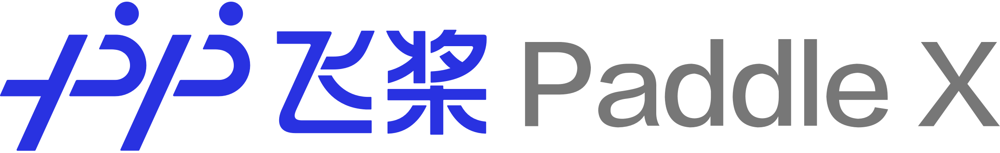

<p align="center">
  
</p>

[](LICENSE)
[](https://github.com/PaddlePaddle/PaddleX/releases)


PaddleX是基于飞桨核心框架、开发套件和工具组件开发的深度学习全流程工具。具备**全流程打通**、**融合产业实践**、**易用易集成**三大特点。

## 特点

- **全流程打通:** 
  - 数据准备：无缝集成[EasyData智能数据服务平台](https://ai.baidu.com/easydata/), 助力开发者高效获取AI开发所需高质量数据。
  - 模型训练：基于飞桨核心框架集成PaddleCls, PaddleDetection, PaddleSeg视觉开发套件，VisualDL可视化分析组件，高效完成模型训练。
  - 多端部署：内置PaddleSlim模型压缩工具和AES模型加密SDK，结合Paddle Inference和Paddle Lite便捷完成可靠且高性能的多端部署。

- **融合产业实践:** 
  - 精选飞桨产业实践的成熟模型结构，开放案例实践教学，加速开发者产业落地。
  - 通过PaddleHub内置丰富的飞桨高质量预训练模型，助力开发者高效实现飞桨Master模式。

- **易用易集成:**
  - PadldeX提供简洁易用的全流程API，几行代码即可实现上百种数据增强、模型可解释性、C++模型部署等功能。
  - 提供以PaddleX API为核心集成的跨平台GUI界面，降低深度学习全流程应用门槛。


## 安装

PaddleX提供两种开发模式，满足不同场景和用户需求：

- **Python开发模式：** 通过Python API方式完成全流程使用或集成，该模型提供全面、灵活、开放的深度学习功能，有更高的定制化空间。

- **GUI开发模式：** 以PaddleX API为核心集成的跨平台GUI客户端，支持`Python开发模式`下的常用功能，以更低门槛的方式快速完成产业验证的模型训练。

开发者可根据自身需要按需选择不同的模式进行安装使用。


### Python开发模式安装

**前置依赖**
* paddlepaddle >= 1.8.0
* python >= 3.5
* cython
* pycocotools

```
pip install paddlex -i https://mirror.baidu.com/pypi/simple
```

### GUI开发模式安装

进入PaddleX官网[下载使用](https://www.paddlepaddle.org.cn/paddle/paddlex)，申请下载绿色安装包，开箱即用。
GUI模式的使用教程可参考[PaddleX GUI模式使用教程](docs/client_use.md)

## 使用文档 

推荐访问[PaddleX在线使用文档](https://paddlex.readthedocs.io/zh_CN/latest/index.html)，快速查阅读使用教程和API文档说明。

- [10分钟快速上手PaddleX模型训练](docs/quick_start.md)
- [PaddleX使用教程](docs/tutorials)
- [PaddleX模型库](docs/model_zoo.md)
- [模型多端部署](docs/deploy.md)

## 在线教程

基于AIStudio平台，快速在线体验PaddleX的Python开发模式教程。

- [PaddleX快速上手——MobileNetV3-ssld 化妆品分类](https://aistudio.baidu.com/aistudio/projectdetail/450220)
- [PaddleX快速上手——Faster-RCNN AI识虫](https://aistudio.baidu.com/aistudio/projectdetail/439888)
- [PaddleX快速上手——DeepLabv3+ 视盘分割](https://aistudio.baidu.com/aistudio/projectdetail/440197)

## 交流与反馈

- 项目官网: https://www.paddlepaddle.org.cn/paddle/paddlex
- PaddleX用户QQ群: 1045148026 (手机QQ扫描如下二维码快速加入)  


## 飞桨技术生态

PaddleX全流程开发工具依赖以下飞桨开发套件与工具组件

- [PaddleDetection](https://github.com/PaddlePaddle/PaddleDetection)
- [PaddleSeg](https://github.com/PaddlePaddle/PaddleSeg)
- [PaddleClas](https://github.com/PaddlePaddle/PaddleClas)
- [PaddleSlim](https://github.com/PaddlePaddle/PaddleSlim)
- [PaddleHub](https://github.com/PaddlePaddle/PaddleHub)
- [Paddle Lite](https://github.com/PaddlePaddle/Paddle-Lite)
- [VisualDL](https://github.com/PaddlePaddle/VisualDL)
