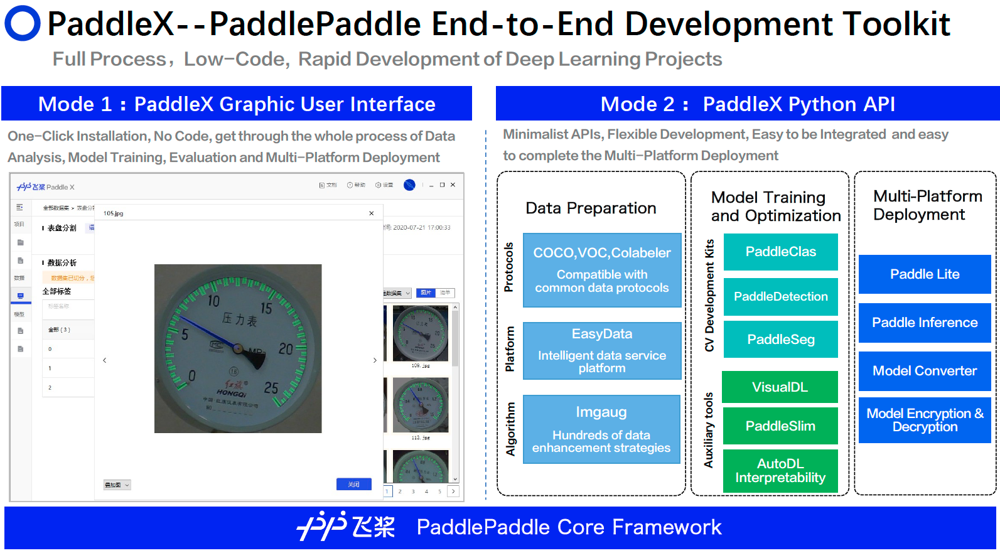

[简体中文](./README.md) | English


<p align="center">
  
</p>


<p align= "center"> PaddleX -- PaddlePaddle End-to-End Development Toolkit, 
  enables developers to implement real industry projects in a low-code form quickly </p>

[](LICENSE)[](https://github.com/PaddlePaddle/PaddleX/releases)


[Complete PaddleX Online Documentation Contents](https://paddlex.readthedocs.io/zh_CN/develop_en/)

It is integrated the abilities of **Image classification**, **Object detection**, **Semantic segmentation**, and **Instance segmentation** in the Paddle CV toolkits, and get through the whole-process development from **Data preparation** and **Model training and optimization** to **Multi-end deployment**. At the same time, PaddleX provides **Succinct APIs** and a **Graphical Ueser Interface**. Developers can quickly complete the end-to-end process development of the Paddle in a form of **low-code**  without installing different libraries.

**PaddleX** has been validated in a dozen of industry application scenarios such as **Quality Inspection**, **Security**, **Patrol Inspection**, **Remote Sensing**, **Retail**,  **Medical** etc.. In addition, it **provides a wealth of case practice tutorials**, to help developer could apply to actual cases easily.



## Recent Contributors
[](https://sourcerer.io/fame/LaraStuStu/PaddlePaddle/Paddlex/links/0)[](https://sourcerer.io/fame/LaraStuStu/PaddlePaddle/Paddlex/links/1)[](https://sourcerer.io/fame/LaraStuStu/PaddlePaddle/Paddlex/links/2)[](https://sourcerer.io/fame/LaraStuStu/PaddlePaddle/Paddlex/links/3)[](https://sourcerer.io/fame/LaraStuStu/PaddlePaddle/Paddlex/links/4)[](https://sourcerer.io/fame/LaraStuStu/PaddlePaddle/Paddlex/links/5)[](https://sourcerer.io/fame/LaraStuStu/PaddlePaddle/Paddlex/links/6)[](https://sourcerer.io/fame/LaraStuStu/PaddlePaddle/Paddlex/links/7)

## Installation

**PaddleX has two development modes to meet different needs of users:**

1.**Python development mode:**

The design of PaddleX Python API taking into account of comprehensive functions, development flexibility, and integration convenience, giving developers the smoothest deep learning development experience.

**Pre-dependence**

> - paddlepaddle >= 1.8.4
> - python >= 3.6
> - cython
> - pycocotools

```
pip install paddlex -i https://mirror.baidu.com/pypi/simple
```
Please refer to the [PaddleX installation](https://paddlex.readthedocs.io/zh_CN/develop/install.html) for detailed installation method.


2. **Padlde GUI(Graphical Ueser Interface) mode:**

It's a all-in-one client enable develops could implement deep learning projects without code. 

- Go to [PaddleX Official Website](https://www.paddlepaddle.org.cn/paddle/paddlex) to download the all-in-one client.

- Go to [PaddleX GUI tutorial](./docs/gui/how_to_use.md ) for details of using it.

- [PaddleX GUI Environment Requirements for Installation](. /docs/gui/download.md)


## Product Module Description

- **Data preparation**: Compatible with common data protocols such as ImageNet, VOC, COCO, and seamlessly interconnecting with Labelme, Colabeler, and [EasyData intelligent data service platform](https://ai.baidu.com/easydata/), to help developers to quickly complete data preparations.
- **Data pre-processing and enhancement**: Provides a minimalist image pre-processing and enhancement method--Transforms. Adapts imgaug which is a powerful image enhancement library, so that PaddleX could supports **Hundreds of data enhancement strategies**, which makes developers quickly alleviate the situation of traing with small sample dataset.
- **Model training**: PaddleX integrates [PaddleClas](https://github.com/PaddlePaddle/PaddleClas), [PaddleDetection](https://github.com/PaddlePaddle/PaddleDetection), and [PaddleSeg](https://github.com/PaddlePaddle/PaddleSeg) etcs. So it provides a large number of selected, industry-proven, high-quality pre-trained models, enabling developers to achieve the industry requirements much more quickly.
- **Model tuning**: Model-interpretability module and [VisualDL](https://github.com/PaddlePaddle/VisualDL) visual analysis tool are integrated as well. It allows developers to understand the model's feature extraction region and the change of the training process parameters more intuitively , so as to quickly optimize the model.
- **Multi-End Secure Deployment**: The built-in model compression tool-- [PaddleSlim](https://github.com/PaddlePaddle/PaddleSlim)  and **Model Encryption Deployment Module**, are seamlessly interconnected with native prediction library **Paddle Inference** and Multi-platform high performance deep learning inference engine-- [Paddle Lite](https://github.com/PaddlePaddle/Paddle-Lite) , to enable developers to quickly implement multi-end, high-performance, secure deployments of the model.


## Full Documentation and API Description

- [Complete PaddleX online documentation contents](https://paddlex.readthedocs.io/zh_CN/develop/index.html)

- [10-Minute Quick Start Tutorial Series](https://paddlex.readthedocs.io/zh_CN/develop/quick_start.html)
- [Collection of PaddleX Model Training Tutorials](https://paddlex.readthedocs.io/zh_CN/develop/train/index.html)
- [PaddleX API Interface Description](https://paddlex.readthedocs.io/zh_CN/develop/apis/index.html)

### Examples of Online Projects

To get developers up to speed with the PaddleX API, we've created a complete series of sample tutorials that you can run PaddleX projects online through the **AIStudio** quickly.

- [PaddleX Quick Start - CV Model Training](https://aistudio.baidu.com/aistudio/projectdetail/450925)
- [PaddleX Quick Start - MobileNetV3-ssld Cosmetics Classification](https://aistudio.baidu.com/aistudio/projectdetail/450220)
- [PaddleX Quick Start - Faster-RCNN AI Bug Recognition](https://aistudio.baidu.com/aistudio/projectdetail/439888)
- [PaddleX Quick Start - DeepLabv3+ Semantic Segmentation](https://aistudio.baidu.com/aistudio/projectdetail/440197)


## Full Process Industry Applications

（continue to be updated）

* Industrial inspections:
  - [Industrial Meter Readings](https://paddlex.readthedocs.io/zh_CN/develop/examples/meter_reader.html)
* Industrial quality control:
  - Battery separator defect detection (Coming Soon)
* [Portrait Segmentation](https://paddlex.readthedocs.io/zh_CN/develop/examples/human_segmentation.html)


## [FAQ](./docs/gui/faq.md)


## Communication and Feedback

- Project official website: https://www.paddlepaddle.org.cn/paddle/paddlex
- PaddleX user group: 957286141 (Scan the following QR code on Mobile QQ to join quickly)

<p align="center">
  
</p>

## Release Note

> [Complete Release Note](https://paddlex.readthedocs.io/zh_CN/develop/change_log.html)
- 2020.09.05 v1.2.0
- 2020.07.13 v1.1.0
- 2020.07.12 v1.0.8
- 2020.05.20 v1.0.0
- 2020.05.17 v0.1.8


## Contribution

You are welcomed to contribute codes to PaddleX or provide suggestions. If you can fix an issue or add a new feature, please feel free to submit Pull Requests.
