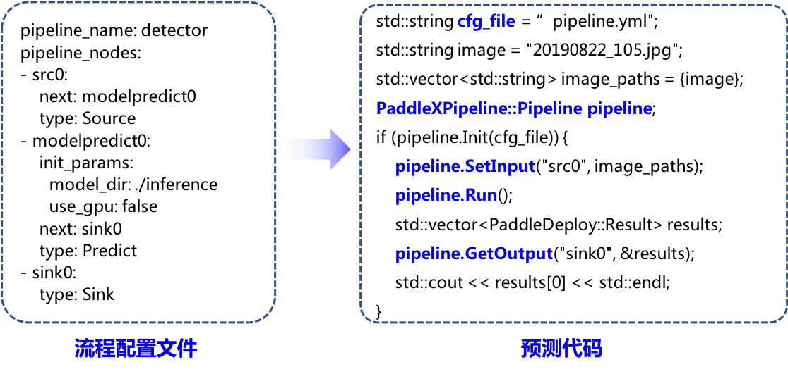

# C++部署

基于飞桨原生推理库PaddleInference，PaddleX推出了统一部署编译方式**PaddleX-Deploy**。

**PaddleX-Deploy**提供了强大的部署性能，可同时兼容飞桨视觉套件PaddleDetection、PaddleClas、PaddleSeg、PaddleX统一部署，支持Windows、Linux等多种系统。同时提供了工业级别的C#部署工程示例。

- [PaddleX Deployment部署方式说明](./docs/deployment.md)
- [C#部署工程示例](./docs/csharp_deploy)
---
为更进一步地提升部署效率，PaddleX部署发布[Manufacture SDK](./docs/manufacture_sdk)，提供工业级多端多平台部署加速的预编译飞桨部署开发包（SDK）。

- 通过配置业务逻辑流程文件即可以**低代码**方式快速完成推理部署。

              

- 通过配置文件，提供了**多模型串联**部署的方式，满足更多生产环境要求，相关使用参考[工业表计读数](./../../examples/meter_reader)。
