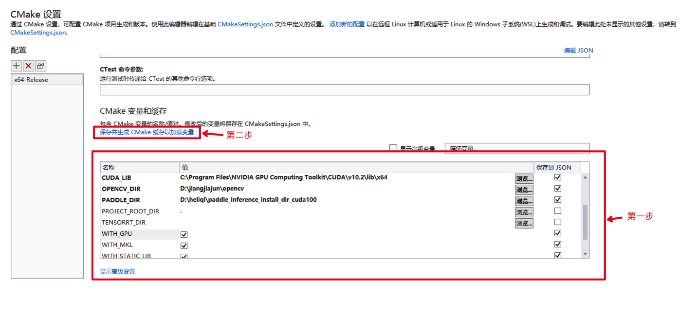

# 基于OpenVINO的推理-Windows环境编译

本文档指引用户如何基于OpenVINO对飞桨模型进行推理，并编译执行。进行以下编译操作前请先安装好OpenVINO，OpenVINO安装请参考官网[OpenVINO-windows](https://docs.openvinotoolkit.org/latest/openvino_docs_install_guides_installing_openvino_windows.html)

**注意：** 

- 我们测试的openvino版本为2021.3，如果你使用其它版本遇到问题，可以尝试切换到该版本
- 当前检测模型转换为openvino格式是有问题的，暂时只支持分割和分类模型

## 1 准备模型

以[ResNet50](https://bj.bcebos.com/paddlex/deploy2/models/resnet50_trt.tar.gz)为例：

### 1.1 导出Paddle Inference模型

通过[PaddleClas模型部署指南](../../models/paddleclas.md) 得到Paddle Inference类型的ResNet50模型，其他套件模型请参考：[PaddleDetection模型部署指南](../../models/paddledetection.md) 、[PaddleSeg模型部署指南](../../models/paddleseg.md)

下载的ResNet50解压后的目录结构如下：

```
ResNet50
  |-- model.pdiparams        # 静态图模型参数
  |-- model.pdiparams.info   # 参数额外信息，一般无需关注
  |-- model.pdmodel          # 静态图模型文件
  |-- resnet50_imagenet.yml  # 配置文件
```

### 1.2 转换为ONNX模型

将paddle inference模型转为onnx模型， 详细可参考[Paddle2ONNX](https://github.com/PaddlePaddle/Paddle2ONNX.git)文档

ResNet50模型转换如下，转换后模型输出在 onnx_models/resnet50_onnx/model.onnx

```
# model_dir需要ResNet50解压后的路径
paddle2onnx --model_dir ResNet50  --save_file onnx_models/resnet50_onnx/model.onnx  --opset_version 9 --enable_onnx_checker True --model_filename model.pdmodel --params_filename model.pdiparams
```

### 1.3 转换为openvino模型

将onnx模型转为openvino模型， 详细可参考官网文档[转换onnx模型](https://docs.openvinotoolkit.org/latest/openvino_docs_MO_DG_prepare_model_convert_model_Convert_Model_From_ONNX.html)

以上文的ResNet50模型为例，转换指令如下:

```
# 使用mo.py 也可以
mo_onnx.py --input_model onnx_models/resnet50_onnx/model.onnx --output_dir openvino_model/resnet50 --input_shape \[1\,3\,224\,224\]
```

转换后的openvino_model/resnet50目录下会出现三个文件， 目录结构如下：

```
resnet50
├── ResNet50.bin
├── ResNet50.mapping
└── ResNet50.xml
```

**注意：**

- 留意模型转换的输出，比如转换onnx时根据提示调整opset_version的值
- paddle inference模型中的配置文件(如 `resnet50_imagenet.yml`)包含了前后处理、标签等信息，对转换后的openvino模型进行推理时还会用到。


## 编译步骤
### Step 1. 获取部署代码
```
git clone https://github.com/PaddlePaddle/PaddleX.git
```
**说明**：`C++`预测代码在`PaddleX/deploy/cpp` 目录，该目录不依赖任何`PaddleX`下其他目录。所有的推理实现代码在`model_deploy`目录下，所有示例代码都在`demo`目录下。

### Step 2. 环境准备
1. 在OpenCV官网下载适用于Windows平台的3.4.6版本  [下载地址](https://bj.bcebos.com/paddleseg/deploy/opencv-3.4.6-vc14_vc15.exe)  
2. 运行下载的可执行文件，将OpenCV解压至指定目录，例如`D:\projects\opencv`
3. 配置环境变量，如下流程所示  
   - 我的电脑->属性->高级系统设置->环境变量
   - 在系统变量中找到Path（如没有，自行创建），并双击编辑
   - 新建，将opencv路径填入并保存，如`D:\projects\opencv\build\x64\vc15\bin`
   - 在进行cmake构建时，会有相关提示，请注意vs2019的输出
4. 点击[下载gflags依赖包](https://bj.bcebos.com/paddlex/deploy/gflags_windows.zip)，解压至`deps`目录

### Step 4. 编译
1. 打开Visual Studio 2019 Community，点击`继续但无需代码`
   
   

2. 点击： `文件`->`打开`->`CMake`


选择C++预测代码所在路径（例如`D:\projects\PaddleX\dygraph\deploy\cpp`），并打开`CMakeList.txt`：


3. 打开项目时，可能会自动构建。由于没有进行下面的依赖路径设置会报错，这个报错可以先忽略。

  点击：`项目`->`CMake设置`(也可能叫`PaddleDeploy`的CMake设置)
  

4. 点击`浏览`，分别设置编译选项指定`gflag`、`OpenCV`、`OpenVINO`的路径（也可以点击右上角的“编辑 JSON”，直接修改json文件，然后保存点 项目->生成缓存）

   
   
  依赖库路径的含义说明如下，注意OpenVINO编译只需要勾选和填写以下参数即可：

| 参数名     | 含义                                                                                                                                                |
| ---------- | --------------------------------------------------------------------------------------------------------------------------------------------------- |
| WITH_OPENVINO  | 是否使用OpenVINO推理引擎，默认为False。 勾选或者json文件填写为True，表示编译OpenVINO推理引擎  |
| OPENCV_DIR | OpenCV的安装路径，例如`D:\\projects\\opencv`   |
| GFLAGS_DIR | gflag的路径,例如`D:\\projects\\PaddleX\\dygraph\\deploy\\cpp\\deps\\gflags` |
| OPENVINO_DIR | OpenVINO的路径,例如`C:\\Program Files (x86)\\Intel\\openvino_2021\\inference_engine` |
| NGRAPH_LIB | OpenVINO的ngraph路径,例如`C:\\Program Files (x86)\\Intel\\openvino_2021\\deployment_tools\\ngraph` |

5. 保存并生成CMake缓存


**设置完成后**, 点击上图中`保存并生成CMake缓存以加载变量`。然后我们可以看到vs的输出会打印CMake生成的过程，出现`CMake 生成完毕`且无报错代表生成完毕。

6. 点击`生成`->`全部生成`，生成demo里的可执行文件。


#### 编译环境无法联网导致编译失败？

- 如果无法联网，请手动点击下载 [yaml-cpp.zip](https://bj.bcebos.com/paddlex/deploy/deps/yaml-cpp.zip)，无需解压，并修改`PaddleX\dygraph\deploy\cpp\cmake\yaml.cmake`中将`URL https://bj.bcebos.com/paddlex/deploy/deps/yaml-cpp.zip` 中的网址替换为第3步中下载的路径，如改为`URL D:\projects\yaml-cpp.zip`。
- 一定要勾选WITH_OPENVINO选项， WITH_GPU、WITH_TENSORRT选项可以取消掉
- 不支持debug编译，注意切换成Release

### Step5: 编译结果

编译后会在`PaddleX/dygraph/deploy/cpp/build/demo`目录下生成`model_infer`可执行二进制文件示例，用于加载模型进行预测。以上面转换的ResNet50模型为例，运行指令如下：

```
./model_infer.exe --xml_file openvino_model/resnet50/ResNet50_vd.xml --bin_file openvino_model/resnet50/ResNet50_vd.bin --cfg_file openvino_model/resnet50/resnet50_imagenet.yml --model_type clas --image test.jpeg
```

**参数说明**

| 参数名称   | 含义                                                         |
| ---------- | ------------------------------------------------------------ |
| xml_file | openvino转换的xml模型文件                                                 |
| bin_file | openvino转换的xml模型文件                                                 |
| cfg_file   | Paddle套件导出的模型配置文件，如`resnet50/deploy.yml`    |
| image      | 需要预测的单张图片的文件路径                                 |
| model_type | 模型来源，det/seg/clas/paddlex，分别表示模型来源于PaddleDetection、PaddleSeg、PaddleClas和PaddleX |
