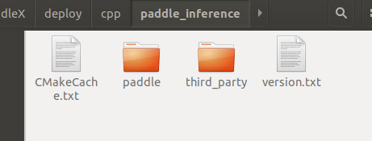

# 基于PaddleInference的推理-Jetson环境编译
本文档指引用户如何基于PaddleInference在Jetson平台上对飞桨模型进行推理，并编译执行。

## 环境依赖
gcc >= 5.4.0
cmake >= 3.5.1

(Jetson环境下)Ubuntu 16.04/18.04

## 编译步骤
### Step1: 获取部署代码
```
git clone https://github.com/PaddlePaddle/PaddleX.git
cd PaddleX/deploy/cpp
```
**说明**：`C++`预测代码在`PaddleX/deploy/cpp` 目录，该目录不依赖任何`PaddleX`下其他目录。所有的公共实现代码在`model_deploy`目录下，所有示例代码都在`demo`目录下。

> 也可手动下载完整的`PaddleX`，进行离线安装(接下来的步骤都相通)

### Step 2. 下载Jetson下PaddlePaddle C++ 预编译预测库
PaddlePaddle C++ 预测库针对是否使用GPU、是否支持TensorRT、以及不同的CUDA版本提供了已经编译好的预测库，目前PaddleX支持Paddle预测库2.0+，最新2.1版本下载链接如下所示:

| 版本说明                               | 预测库(2.1)                                                                                                                   | 编译器  |
| -------------------------------------- | ----------------------------------------------------------------------------------------------------------------------------- | ------- |
| Jetpack4.4: nv-jetson-cuda10.2-cudnn8-trt7(all) | [paddle_inference.tgz](https://paddle-inference-lib.bj.bcebos.com/2.1.1-nv-jetson-jetpack4.4-all/paddle_inference_install_dir.tgz)   | gcc 8.2 |
| Jetpack4.4: nv-jetson-cuda10.2-cudnn8-trt7(nano) | [ paddle_inference.tgz](https://paddle-inference-lib.bj.bcebos.com/2.1.1-nv-jetson-jetpack4.4-nano/paddle_inference_install_dir.tgz)  | gcc 8.2 |
| Jetpack4.4: nv-jetson-cuda10.2-cudnn8-trt7(tx2)	 | [ paddle_inference.tgz](https://paddle-inference-lib.bj.bcebos.com/2.1.1-nv-jetson-jetpack4.4-tx2/paddle_inference_install_dir.tgz) | gcc 8.2 |
| Jetpack4.4: nv-jetson-cuda10.2-cudnn8-trt7(xavier) | [ paddle_inference.tgz](https://paddle-inference-lib.bj.bcebos.com/2.1.1-nv-jetson-jetpack4.4-xavier/paddle_inference_install_dir.tgz) | gcc 8.2 |

请根据实际情况选择下载，如若以上版本不满足您的需求，请至[C++预测库下载列表](https://paddleinference.paddlepaddle.org.cn/v2.1/user_guides/download_lib.html)选择符合的版本。

将预测库解压后，其所在目录（例如解压至`PaddleX/deploy/cpp/paddle_inferenc/`）下主要包含的内容有：
```
|—— CmakeCache.txt
|
├── paddle/ # paddle核心库和头文件
|
├── third_party # 第三方依赖库和头文件
|
└── version.txt # 版本和编译信息(里边有编译时gcc、cuda、cudnn的版本信息)
```
<div>
  
  </div>

### Step 3. 修改编译参数

根据自己的系统环境，修改`PaddleX/deploy/cpp/script/jetson_build.sh`脚本中的参数，主要修改的参数为以下几个
| 参数          | 说明                                                                                 |
| :------------ | :----------------------------------------------------------------------------------- |
| WITH_GPU      | ON或OFF，表示是否使用GPU，当下载的为CPU预测库时，设为OFF                             |
| PADDLE_DIR    | 预测库所在路径，默认为`PaddleX/deploy/cpp/paddle_inference`目录下                    |
| CUDA_LIB      | cuda相关lib文件所在的目录路径 -- 请注意jetson预装的cuda所在路径(如:/usr/local/cuda/lib64) |
| CUDNN_LIB     | cudnn相关lib文件所在的目录路径 -- 请注意jetson预装的cuda所在路径(如:/usr/lib/aarch64-linux-gnu)    |
| WITH_TENSORRT | ON或OFF，表示是否使用开启TensorRT                                                    |
| TENSORRT_DIR  | TensorRT 的路径，如果开启TensorRT开关WITH_TENSORRT，需修改为您实际安装的TensorRT路径     |
| WITH_ENCRYPTION      | ON或OFF，表示是否开启加密模块                             |
| OPENSSL_DIR    | OPENSSL所在路径，解密所需。默认为`PaddleX/deploy/cpp/deps/penssl-1.1.0k`目录下        |

> **要注意相关参数路径不要有误——特别是CUDA_LIB以及CUDNN_LIB，如果需要启动TensorRt，也需指定当前的路径。**

<div>
  
  </div>

> 不需要添加oepncv路径，在jetson中编译可直接使用环境本身预装的opencv进行deploy编译——具体配置在Step4中。


### Step 4. 修改build时需对应的CMakeLists.txt
根据自己的系统环境，修改`PaddleX/deploy/cpp/CMakeLists.txt`脚本中的参数，主要修改的参数为以下几个:位于其中注释`#OPENCV`之后的部分
| 参数          | 说明                                                                                 |
| :------------ | :----------------------------------------------------------------------------------- |
| set(OpenCV_INCLUDE_DIRS "/usr/include/opencv")      | 配置Jetson预置opencv的include路径    |
| file(GLOB OpenCV_LIBS /usr/lib/libopencv_*${CMAKE_SHARED_LIBRARY_SUFFIX})    | 配置opencv动态链接库*.so    |

替换具体如下:(xavier为例)

1. /usr/include/opencv --> /usr/include/opencv4
  > 具体路径，以部署环境中opencv的include路径为准。
  > opencv4 中包含: opencv, opencv2

2. /usr/lib/libopencv_*${CMAKE_SHARED_LIBRARY_SUFFIX} --> /usr/lib/libopencv_*${CMAKE_SHARED_LIBRARY_SUFFIX}
  > 具体路径，以部署环境中opencv的*.so路径为准, 主要修改libopencv_前的路径。

<div>
  
  </div>

### Step 5. 添加yaml库源码
由于Jetson环境下编译还需要yaml，所以这里需要手动下载yaml包，保证编译的正常运行。

> 1. 点击[下载yaml依赖包](https://bj.bcebos.com/paddlex/deploy/deps/yaml-cpp.zip)，无需解压
> 2. 修改`PaddleX/deploy/cpp/cmake/yaml.cmake`文件，将`URL https://bj.bcebos.com/paddlex/deploy/deps/yaml-cpp.zip`中网址替换为第3步中下载的路径，如改为`URL /Users/Download/yaml-cpp.zip`

**这里yaml存放路径为了确保使用最好保证全英文路径**
eg:

<div>
  
  </div>
  
> 其它支持的加密操作以及TensorRT，可参考[Linux环境编译指南](./linux.md).

### Step 6. 编译
以上yaml库添加完成，同时也修改完jetson_build.sh后，即可执行编译， **[注意]**: 以下命令在`PaddleX/deploy/cpp`目录下进行执行

```
sh script/jetson_build.sh
```

> 编译时，如果存在cmake多线程问题——请前往`jetson_build.sh`末尾，将`make -j8`改为`make`或者小于8.


### Step 7. 编译结果

编译后会在`PaddleX/deploy/cpp/build/demo`目录下生成`model_infer`、`multi_gpu_model_infer`和`batch_infer`等几个可执行二进制文件示例，分别用于在单卡/多卡/多batch上加载模型进行预测，示例使用参考如下文档：

- [单卡加载模型预测示例](../../demo/model_infer.md)
- [多卡加载模型预测示例](../../demo/multi_gpu_model_infer.md)

如果编译时开启TensorRT， 会多成一个`tensorrt_infer`二进制文件示例。示例使用参考如下文档：
- [PaddleInference集成TensorRT加载模型预测示例](../../demo/tensorrt_infer.md)

如果编译时开启加密， 会多成一个`decrypt_infer`二进制文件示例。示例使用参考如下文档：
- [模型加密预测示例](../../demo/decrypt_infer.md)


### Step 8. QT界面部署应用Demo

通过修改`PaddleX/deploy/cpp/demo/model_infer.cpp`以及`PaddleX/deploy/cpp/demo/CMakeLists.txt`, 再执行`jetson_build.sh`生成`libmodel_infer.so`动态链接库，用于QT应用调用，执行模型初始化、模型推理预测、模型注销等操作。[现已经在Jetson Xavier上利用原生编译的opencv实现了模型单张预测与文件夹连续预测，由于预编译opencv不支持解析视频格式，因此暂未对视频进行测试——仅在windows上完成了单张图片-文件夹连续预测-视频流预测的全流程验证。]

> 该版本对于MaskRCNN模型的推理需要使用GPU进行推理——如果CPU下进行推理可能由于内存使用问题报错。
> 
> 鉴于Qt跨平台属性，因此如果部署环境下opencv支持视频格式，则该Demo-Gui程序可启动完整的推理可视化功能。

<div>
  
  
  </div>

具体Demo信息可前往如下文档链接:
- [基于QT的Jetson部署Demo](../../../../../examples/jetson-deploy/README.md)
