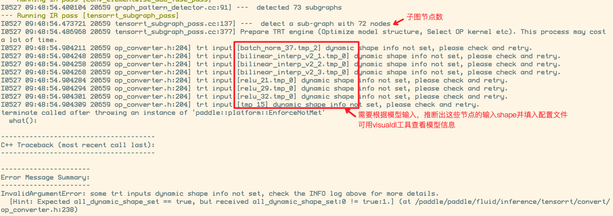

# TensorRT加载模型预测

本文档基于`PaddleX/deploy/cpp/demo/tensorrt_infer.cpp`示例，讲述如何用PaddleInference引擎结合TensorRT部署模型。开发者可基于此demo示例进行二次开发，满足集成的需求。

## 步骤一、编译
参考编译文档
- [Linux系统上编译指南](../compile/paddle/linux.md)
- [Windows系统上编译指南](../compile/paddle/windows.md)

**注意**:  编译时需要把TensorRT开关打开， 并填写TensorRT 路径。TensorRT下载链接：[NVIDIA 官网](https://developer.nvidia.com/nvidia-tensorrt-download)

## 步骤二、准备PaddlePaddle部署模型
开发者可从以下套件获取部署模型，需要注意，部署时需要准备的是导出来的部署模型，一般包含`model.pdmodel`、`model.pdiparams`和`deploy.yml`三个文件，分别表示模型结构、模型权重和各套件自行定义的配置信息。
- [PaddleDetection导出模型](https://github.com/PaddlePaddle/PaddleDetection/blob/release/2.0/deploy/EXPORT_MODEL.md)
- [PaddleSeg导出模型](https://github.com/PaddlePaddle/PaddleSeg/blob/release/v2.0/docs/model_export.md)
- [PaddleClas导出模型](https://github.com/PaddlePaddle/PaddleClas/blob/release/2.1/docs/zh_CN/tutorials/getting_started.md#4-%E4%BD%BF%E7%94%A8inference%E6%A8%A1%E5%9E%8B%E8%BF%9B%E8%A1%8C%E6%A8%A1%E5%9E%8B%E6%8E%A8%E7%90%86)
- [PaddleX导出模型](https://github.com/PaddlePaddle/PaddleX/blob/develop/docs/apis/export_model.md)

用户也可直接下载本教程中从PaddleDetection中导出的YOLOv3模型进行测试，[点击下载](https://bj.bcebos.com/paddlex/deploy2/models/yolov3_mbv1.tar.gz)。

### 模型动态Shape处理

目前有两种方法使用TensorRT部署动态Shape的模型：

1. 在导出模型时，固定shape的大小。

   例如[PaddleDetection模型部署](../models/paddledetection.md)文档中有如何固定shape的导出方法

2. 配置TensorRT的动态shape参数。 PaddleSeg等套件导出模型时没提供固定shape的方法， 需要配置TensorRT参数才能加载模型。

   TensorRT配置参数说明, 动态输入一定要配置`min_input_shape`、`max_input_shape`、`optim_input_shape` 三个参数

   | 参数               | 说明                                                                                                                       |
   | ------------------ | -------------------------------------------------------------------------------------------------------------------------- |
   | precision          | 数据类型， 默认值为0。 0表示FP32 、1表示FP16、2表示INT8                                                                    |
   | max_workspace_size | TensorRT申请的显存空间， 默认值为 1 << 10(1M),  如果大点模型需要提到1 << 30                                                |
   | min_input_shape    | 动态输入的最小shape。 map类型， key为输入名称， value为shape                                                               |
   | max_input_shape    | 动态输入的最大shape。 map类型， key为输入名称， value为shape                                                               |
   | optim_input_shape  | 动态输入的最常出现的shape。 map类型， key为输入名称， value为shape                                                         |
   | min_subgraph_size  | 最小的字图大小，用于过滤节点过小的子图。<br/>设置为10，则小于10个node的子图将不用TensorRT优化，用PaddleInference引擎运行。 |

   可参考`demo/tensorrt_infer.cpp`例子：

```c++
  PaddleDeploy::PaddleEngineConfig engine_config;
  engine_config.use_gpu = true;
  engine_config.use_trt = true;
  engine_config.precision = 0;
  engine_config.min_subgraph_size = 10;
  engine_config.max_workspace_size = 1 << 30;
 // 分类clas和检测detection模型， 一般只需根据实际模型情况修改输入的shape即可
 // seg分割模型一般需要填写额外的其他节点信息， 注意看提示
   if ("clas" == FLAGS_model_type) {
      engine_config.min_input_shape["inputs"] = {1, 3, 224, 224};
      engine_config.max_input_shape["inputs"] = {1, 3, 224, 224};
      engine_config.optim_input_shape["inputs"] = {1, 3, 224, 224};
    } else if ("det" == FLAGS_model_type) {
      // Adjust shape according to the actual model
      engine_config.min_input_shape["image"] = {1, 3, 608, 608};
      engine_config.max_input_shape["image"] = {1, 3, 608, 608};
      engine_config.optim_input_shape["image"] = {1, 3, 608, 608};
    } else if ("seg" == FLAGS_model_type) {
      engine_config.min_input_shape["x"] = {1, 3, 100, 100};
      engine_config.max_input_shape["x"] = {1, 3, 2000, 2000};
      engine_config.optim_input_shape["x"] = {1, 3, 1024, 1024};
      // Additional nodes need to be added, pay attention to the output prompt
    }
```

如果运行时出现以下报错，则需要根据报错将提示的输入节点填入配置中



```c++
    // 上面报错，配置文件填写示例
    engine_config.min_input_shape["x"] = {1,3, 100, 100};
    engine_config.max_input_shape["x"] = {1,3, 2000, 2000};
    engine_config.optim_input_shape["x"] = {1,3, 129, 129};

    engine_config.min_input_shape["batch_norm_37.tmp_2"] = {1,64, 7, 7};
    engine_config.max_input_shape["batch_norm_37.tmp_2"] = {1,64, 125, 125};
    engine_config.optim_input_shape["batch_norm_37.tmp_2"] = {1,64, 12, 12};

    engine_config.min_input_shape["bilinear_interp_v2_1.tmp_0"] = {1,16, 25, 25};
    engine_config.max_input_shape["bilinear_interp_v2_1.tmp_0"] = {1,16, 500, 500};
    engine_config.optim_input_shape["bilinear_interp_v2_1.tmp_0"] = {1,16, 48, 48};

    engine_config.min_input_shape["bilinear_interp_v2_2.tmp_0"] = {1,16, 25, 25};
    engine_config.max_input_shape["bilinear_interp_v2_2.tmp_0"] = {1,16, 500, 500};
    engine_config.optim_input_shape["bilinear_interp_v2_2.tmp_0"] = {1,16, 48, 48};

    engine_config.min_input_shape["bilinear_interp_v2_3.tmp_0"] = {1,32, 13, 13};
    engine_config.max_input_shape["bilinear_interp_v2_3.tmp_0"] = {1,32, 250, 250};
    engine_config.optim_input_shape["bilinear_interp_v2_3.tmp_0"] = {1,32, 24, 24};

    engine_config.min_input_shape["relu_21.tmp_0"] = {1,16, 25, 25};
    engine_config.max_input_shape["relu_21.tmp_0"] = {1,16, 500, 500};
    engine_config.optim_input_shape["relu_21.tmp_0"] = {1,16, 48, 48};

    engine_config.min_input_shape["relu_29.tmp_0"] = {1,64, 7, 7};
    engine_config.max_input_shape["relu_29.tmp_0"] = {1,64, 125, 125};
    engine_config.optim_input_shape["relu_29.tmp_0"] = {1,64, 12, 12};

    engine_config.min_input_shape["relu_32.tmp_0"] = {1,16, 13, 13};
    engine_config.max_input_shape["relu_32.tmp_0"] = {1,16, 250, 250};
    engine_config.optim_input_shape["relu_32.tmp_0"] = {1,16, 24, 24};

    engine_config.min_input_shape["tmp_15"] = {1,32, 13, 13};
    engine_config.max_input_shape["tmp_15"] = {1,32, 250, 250};
    engine_config.optim_input_shape["tmp_15"] = {1,32, 24, 24};
```

## 步骤三、使用编译好的可执行文件预测

以步骤二中下载的YOLOv3模型为例，执行如下命令即可进行模型加载和预测

```sh
# 使用GPU 加参数 --use_gpu=1
build/demo/tensorrt_infer --model_filename=yolov3_mbv1/model/model.pdmodel \
                          --params_filename=yolov3_mbv1/model/model.pdiparams \
                          --cfg_file=yolov3_mbv1/model/infer_cfg.yml \
                          --image=yolov3_mbv1/images/000000010583.jpg \
                          --model_type=det
```
输出结果如下(分别为类别id、标签、置信度、xmin、ymin、w, h)
```
Box(0	person	0.0386442	2.11425	53.4415	36.2138	197.833)
Box(39	bottle	0.0134608	2.11425	53.4415	36.2138	197.833)
Box(41	cup	0.0255145	2.11425	53.4415	36.2138	197.833)
Box(43	knife	0.0824398	509.703	189.959	100.65	93.9368)
Box(43	knife	0.0211949	448.076	167.649	162.924	143.557)
Box(44	spoon	0.0234474	509.703	189.959	100.65	93.9368)
Box(45	bowl	0.0461333	0	0	223.386	83.5562)
Box(45	bowl	0.0191819	3.91156	1.276	225.888	214.273)
```

