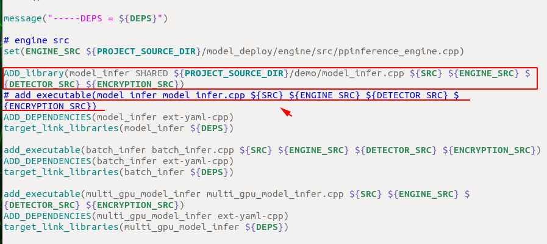
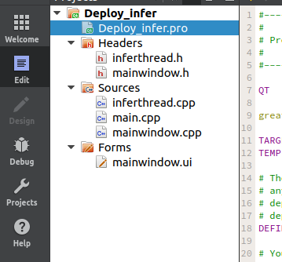
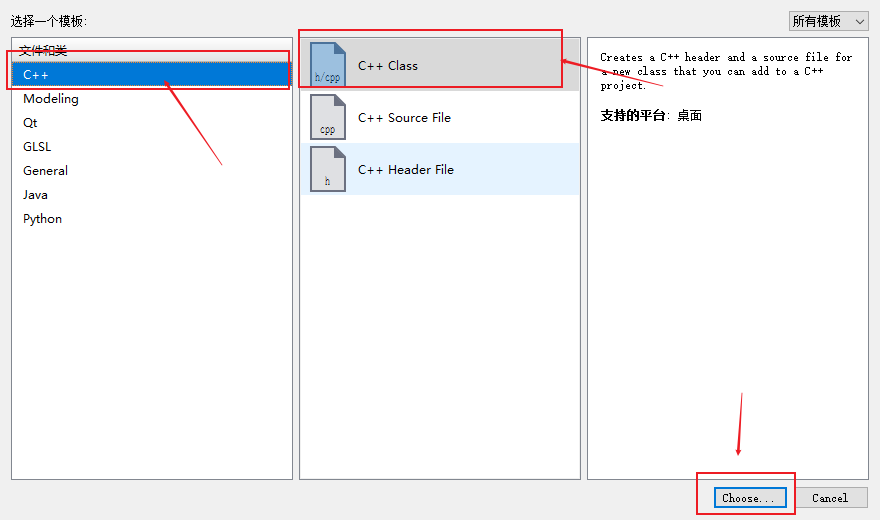
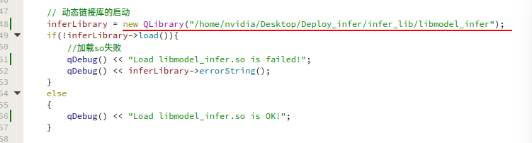
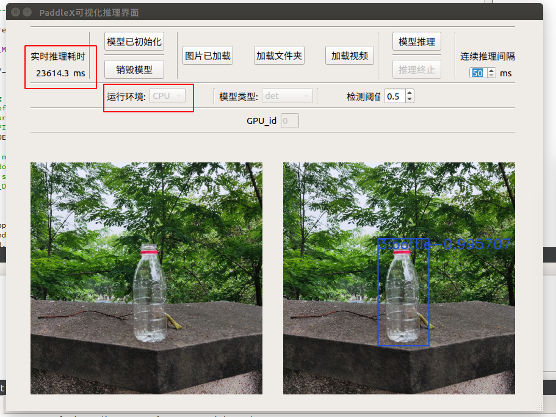
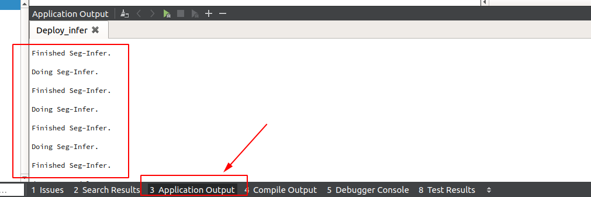
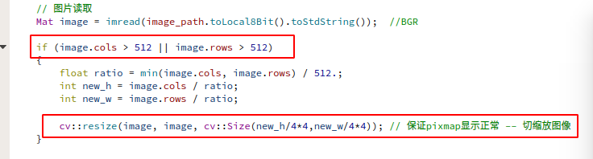
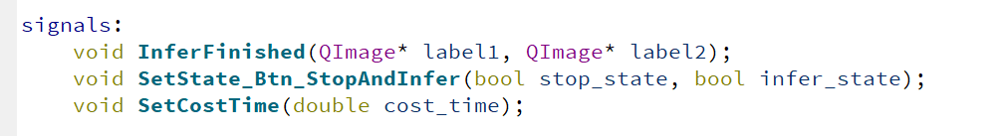

# 基于QT的Jetson Xavier部署Demo

> 该项目中的QT设计代码，也支持其它平台下QT的运行——但需要保证各平台下拥有支持QT的opencv编译库(动态链接库与头文件(include)库)，以及正常编译得到的动态链接库(*.a 或 *.so)，QT设计软件也是必要的.

项目文档目录:

- <a href="### 1 环境准备">1 环境准备</a>
- <a href="### 2 配置编译脚本">2 配置编译脚本</a>
  - <a href="#### 2.1 修改`jetson_build.sh`编译参数">2.1 修改`jetson_build.sh`编译参数</a>
  - <a href="#### 2.2 修改`CMakeList.txt`参数">2.2 修改`CMakeList.txt`参数</a>
  - <a href="#### 2.3 修改`yaml.cmake`参数">2.3 修改`yaml.cmake`参数</a>
- <a href="### 3 代码编译(生成模型预测的动态链接库)">3 代码编译(生成模型预测的动态链接库)</a>
  - <a href="#### 3.1 修改`model_infer.cpp`文件">3.1 修改`model_infer.cpp`文件</a>
  - <a href="#### 3.2 修改`CMakeList.txt`文件">3.2 修改`CMakeList.txt`文件</a>
  - <a href="#### 3.3 执行`jetson_build.sh`编译">3.3 执行`jetson_build.sh`编译</a>
- <a href="### 4 启动并配置QT工程(移植流程)">4 启动并配置QT工程(移植流程)</a>
  - <a href="#### 4.1 启动QT工程项目">4.1 启动QT工程项目</a>
  - <a href="#### 4.2 载入动态链接库">4.2 载入动态链接库</a>
  - <a href="#### 4.3 配置QT的Opencv路径">4.3 配置QT的Opencv路径</a>
- <a href="### 5 启动QT可视化界面">5 启动QT可视化界面</a>
  - <a href="#### 5.1 功能介绍">5.1 功能介绍</a>
  - <a href="#### 5.2 使用说明">5.2 使用说明</a>
  - <a href="#### 5.3 使用效果展示">5.3 使用效果展示</a>
- <a href="### 6 QT开发注解">6 QT开发注解</a>
  - <a href="#### 6.1 利用`QDebug`实现运行日志输出">6.1 利用`QDebug`实现运行日志输出</a>
  - <a href="#### 6.2 本项目的组织结构">6.2 本项目的组织结构</a>
  - <a href="#### 6.3 控制读取图片的推理大小">6.3 控制读取图片的推理大小</a>
  - <a href="#### 6.4 子线程控制主线程控件的建议">6.4 子线程控制主线程控件的建议</a>
  - <a href="#### 6.5 修改model_infer.cpp函数后的动态链接库导入指导">6.5 修改model_infer.cpp函数后的动态链接库导入指导</a>
  - <a href="#### 6.6 QT动态链接库的导入说明">6.6 QT动态链接库的导入说明</a>
  - <a href="#### 6.7 移植小贴士">6.7 移植小贴士</a>
- <a href="### 本项目的Demo的GUI也同时支持Linux、Windows上进行使用，但请自行编译好opencv，安装QT，移植流程区别如下。">本项目的Demo的GUI也同时支持Linux、Windows上进行使用，但请自行编译好opencv，安装QT，移植流程区别如下。</a>


在新版本的PaddleX中，对于CPP的部署代码方式做了非常大的变化：
* 支持用户将PaddleDetection PaddleSeg PaddleClas PaddleX训练出来的模型通过一套部署代码实现快速部署，实现了多个模型的打通。
* 对于一个视觉任务里面既有检测，又有分割来说，极大的简化了使用的流程。

下面我们具体以**Jetson Xavier**系统为例，基于PaddleX的这套CPP(deploy/)，说明一下如何实现QT的部署

项目使用基本环境说明：

* CUDA10.2  Cudnn 8
* Jetson原生opencv4.1.1 / opencv3.4.6等(自行编译的opencv则建议为3.4.6)
* Jetpack4.4: nv-jetson-cuda10.2-cudnn8-trt7(xavier)——PaddleInference 10.2的预测库(2.1.1版本)
* Cmake 3.10.2
* QT5.9.5
* QMake3.1

> 查看Jetpack版本: `cat /usr/local/cuda/include/cudnn.h | grep CUDNN_MAJOR -A 2`
> (4.3可以使用4.4版本的预测库)
> 
> 查看QT版本: `qmake -v`
> 
> 查看CUDA版本: `cat /usr/local/cuda/version.txt`
> 
> 查看Cudnn版本: `cat /usr/include/cudnn_version.h | grep CUDNN_MAJOR -A 2`

## 1 环境准备<a id="## 1 环境准备"/>

* 下载好PaddleX代码和PaddleInference预测库
* 下载QT以及QT-Creater

1. 下载QT:
`sudo apt-get install qt5-default qtcreator -y`

2. 下载PaddleX+PaddleInference预测库:
> 可查看文档: 

- [基于PaddleInference的推理-Jetson环境编译](../compile/paddle/jetson.md)

3. 查看cmake版本: `cmake -version`

> 保证版本大于3.5即可，如小于，可尝试安装`cmake3.10.2`。

**QT-Creater的启动，可以通过`应用搜索`，输入`QT`，在出现的应用图标中选中QTCreater，点击即可启动!**

--------

## 2 配置编译脚本<a id="## 2 配置编译脚本"/>

> 如果已经查看`Jetson环境编译`文档后，并已经成功编译出可执行程序后，可跳过该部分的`deploy/cpp/scripts/jetson_build.sh`、`deploy/cpp/CMakeList.txt`以及`deploy/cpp/cmake/yaml.cmake`的修改说明.

> 以下3部分的修改完全同[基于PaddleInference的推理-Jetson环境编译](../compile/paddle/jetson.md)一样，可前往参阅。

### 2.1 修改`jetson_build.sh`编译参数<a id="### 2.1 修改`jetson_build.sh`编译参数"/>

根据自己的系统环境，修改`PaddleX/deploy/cpp/script/jetson_build.sh`脚本中的参数，主要修改的参数为以下几个
| 参数          | 说明                                                                                 |
| :------------ | :----------------------------------------------------------------------------------- |
| WITH_GPU      | ON或OFF，表示是否使用GPU，当下载的为CPU预测库时，设为OFF                             |
| PADDLE_DIR    | 预测库所在路径，默认为`PaddleX/deploy/cpp/paddle_inference`目录下                    |
| CUDA_LIB      | cuda相关lib文件所在的目录路径 -- 请注意jetson预装的cuda所在路径(如:/usr/local/cuda/lib64) |
| CUDNN_LIB     | cudnn相关lib文件所在的目录路径 -- 请注意jetson预装的cuda所在路径(如:/usr/lib/aarch64-linux-gnu)    |
| WITH_TENSORRT | ON或OFF，表示是否使用开启TensorRT                                                    |
| TENSORRT_DIR  | TensorRT 的路径，如果开启TensorRT开关WITH_TENSORRT，需修改为您实际安装的TensorRT路径     |
| WITH_ENCRYPTION      | ON或OFF，表示是否开启加密模块                             |
| OPENSSL_DIR    | OPENSSL所在路径，解密所需。默认为`PaddleX/deploy/cpp/deps/penssl-1.1.0k`目录下        |

> **要注意相关参数路径不要有误——特别是CUDA_LIB以及CUDNN_LIB，如果需要启动TensorRt，也需指定当前的路径。**

<div>
  
  </div>

> 不需要添加oepncv路径，在jetson中编译可直接使用环境本身预装的opencv进行deploy编译——具体配置在Step4中。

### 2.2 修改`CMakeList.txt`参数<a id="### 2.2 修改`CMakeList.txt`参数"/>

> 该修改仅适合Jetson系统的部署编译。

根据自己的系统环境，修改`PaddleX/deploy/cpp/CMakeLists.txt`脚本中的参数，主要修改的参数为以下几个:位于其中注释`#OPENCV`之后的部分
| 参数          | 说明                                                                                 |
| :------------ | :----------------------------------------------------------------------------------- |
| set(OpenCV_INCLUDE_DIRS "/usr/include/opencv")      | 配置Jetson预置opencv的include路径    |
| file(GLOB OpenCV_LIBS /usr/lib/libopencv_*${CMAKE_SHARED_LIBRARY_SUFFIX})    | 配置opencv动态链接库*.so    |

替换具体如下:(xavier为例)

1. /usr/include/opencv --> /usr/include/opencv4
  > 具体路径，以部署环境中opencv的include路径为准。
  > opencv4 中包含: opencv, opencv2

2. /usr/lib/libopencv_*${CMAKE_SHARED_LIBRARY_SUFFIX} --> /usr/lib/libopencv_*${CMAKE_SHARED_LIBRARY_SUFFIX}
  > 具体路径，以部署环境中opencv的*.so路径为准, 主要修改libopencv_前的路径。

<div>
  
  </div>

### 2.3 修改`yaml.cmake`参数<a id="### 2.3 修改`yaml.cmake`参数"/>

由于Jetson环境下编译还需要yaml，所以这里需要手动下载yaml包，保证编译的正常运行。

> 1. 点击[下载yaml依赖包](https://bj.bcebos.com/paddlex/deploy/deps/yaml-cpp.zip)，无需解压
> 2. 修改`PaddleX/deploy/cpp/cmake/yaml.cmake`文件，将`URL https://bj.bcebos.com/paddlex/deploy/deps/yaml-cpp.zip`中网址替换为第3步中下载的路径，如改为`URL /Users/Download/yaml-cpp.zip`

**这里yaml存放路径为了确保使用最好保证全英文路径**
eg:

<div>
  
  </div>

> TensorRT操作，可参考[Linux环境编译指南](../compile/paddle/linux.md).

-------

## 3 代码编译(生成模型预测的动态链接库)<a id="## 3 代码编译(生成模型预测的动态链接库)"/>

该部分需要修改两个地方，以保证动态链接库的正常生成。

> 接下来的操作，请在执行以下命令正常生成可执行程序后再往下继续配置，以确保修改前的工作是正确可执行的。
> 
```
sh script/jetson_build.sh
```

> 编译时，如果存在cmake多线程问题——请前往`jetson_build.sh`末尾，将`make -j8`改为`make`或者小于8.
>
> 编译后会在`PaddleX/deploy/cpp/build/demo`目录下生成`model_infer`、`multi_gpu_model_infer`和`batch_infer`等几个可执行二进制文件.

### 3.1 修改`model_infer.cpp`文件<a id="### 3.1 修改`model_infer.cpp`文件"/>

接下来我们需要在QT中去调用动态链接库，所以原有的`deploy/cpp/demo/model_infer.cpp`文件生成的可执行文件不能支持QT去进行调用，所以需要对其进行一定的修改。

现已将修改后满足需求的文件放于本文档处，即——**将当前文件的`model_infer.cpp`用于替换`deploy/cpp/demo/model_infer.cpp`即可.**

- 其中主要开辟了多个共享接口函数，分别对应：模型初始化，模型推理(用于推理PaddleDetection、PaddleSeg、PaddleClas、PaddleX产出的部署模型)，模型销毁。

> 该model_infer.cpp仅支持使用一个模型——用于单线程调用
>
> 如需多线程推理，同时创建多个模型用于预测推理，可以参考该项目下cpp的实现: [PaddleDeploy在C#端的多线程推理demo](https://github.com/cjh3020889729/PaddleDeploy-CSharp-ManyThreadInfer-Demo)

- 模型初始化接口: `InitModel(const char* model_type, const char* model_filename, const char* params_filename, const char* cfg_file, bool use_gpu, int gpu_id, char* paddlex_model_type)`

- 目标检测推理接口: `Det_ModelPredict(const unsigned char* img, int nWidth, int nHeight, int nChannel, float* output, int* nBoxesNum, char* LabelList)`

- 语义分割推理接口: `Seg_ModelPredict(const unsigned char* img, int nWidth, int nHeight, int nChannel, unsigned char* output)`

- 图像识别推理接口: `Cls_ModelPredict(const unsigned char* img, int nWidth, int nHeight, int nChannel, float* score, char* category, int* category_id)`

- 实例分割推理接口: `Mask_ModelPredict(const unsigned char* img, int nWidth, int nHeight, int nChannel, float* box_output, unsigned char* mask_output, int* nBoxesNum, char* LabelList)`

- 模型销毁接口: `DestructModel()`

> 详细说明，请查看[`model_infer.cpp`](./model_infer.cpp)的实现.


### 3.2 修改`CMakeList.txt`文件<a id="### 3.2 修改`CMakeList.txt`文件"/>

以上完成了`model_infer.cpp`的修改后，需要修改当前目录下的`CMakeList.txt`文件，位于: `deploy/cpp/demo/CMakeList.txt`.

需要修改的内容，如图所示:

<div>
  
  </div>

用`ADD_library`那句脚本替换下划线那句脚本即可，也可直接使用本项目提供的`CMakeList.txt`进行替换`deploy/cpp/demo/CMakeList.txt`.

### 3.3 执行`jetson_build.sh`编译<a id="### 3.3 执行`jetson_build.sh`编译"/>

运行以下命令行, 编译完成即可获得所需推理接口的动态链接库(libmodel_infer.so)

```
sh script/jetson_build.sh
```

运行完成，会在`PaddleX/deploy/cpp/build/lib`中生成`libmodel_infer.so`动态链接库。

## 4 启动并配置QT工程(移植流程)<a id="## 4 启动并配置QT工程(移植流程)"/>

以下步骤请确保QT安装完成，且可以正常启动QT桌面项目。

### 4.1 启动QT工程项目<a id="### 4.1 启动QT工程项目"/>

1. 首先打开`Qtcreator`，新建项目，取名为`Deploy_infer`，选择项目路径为自己所熟悉的路径即可，然后一直顺着往下不必多设置或者勾选什么，直到`finished`。<div>
    
    </div><div>
    
    </div><div>
    
    </div>

> 如果存在多个编译环境供QT使用，请确保QT使用的编译环境与前边生成动态链接库的编译环境一致——或者至少保证生成的所有库都允许相互调用，即避免出现32位与64位不兼容等情况。

2. 进入QT崭新的工程项目后，工程项目中会存在`*.pro`,`Headers`,`Sources`,`Forms`四个主要组件，其中后三个为项目分支(目录)<div>
    
    </div>
  
3. 右键点击项目，选择`Add New`, 进入子界面选择`c++`，选中`Class`, 点击`choise`.<div>
    
    </div>
  
4. 在新出来的子界面中，输入`InferThread`作为**Class name**, 然后一直往下生成即可.<div>
    
    </div>
  
5. 将本项目qt_demo中的`infer_thread.cpp`与`infer_thread.h`中的内容分别复制过去即可.

     > 注意：此刻创建InferThread类所生成的文件名: **inferthread.h** 与 **inferthread.cpp**， 因此需要修改一下这两个文件名为`infer_thread.cpp`与`infer_thread.h`。

6. 然后，再将本项目`qt_demo`中的`mainwindow.cpp`与`mainwindow.h`中的内容也复制过去.

    - 使用`mainwindow.cpp`进行移植时，请修改代码内容如下：
      - 修改(**319行左右**)`on_btnLoadImg_clicked`函数内的语句（按照注释提示修改即可）: `img_file_ = img_path.url().split("//")[1];`
      - 修改(**398行左右**)`on_btnLoadVideo_clicked`函数内的语句（按照注释提示修改即可）: `video_file_ = video_path.url().split("//")[1];`

7. 最后，将本项目的`mainwindow.ui`替换新建的QT-GUI项目中的空白ui文件.

> 此时，QT项目的移植就完成了——之所以新建项目，看起来比较复杂，是为了避免直接移植导致的QT版本不匹配，发生一些意料之外的问题。
> 
> 此时QT项目中，会出现标红的错误，原因可能如下:
- 1. 还未导入动态链接库
- 2. 还未导入opencv的编译好的库
- 因此，现在暂时不用担心标红的问题

### 4.2 载入动态链接库<a id="### 4.2 载入动态链接库"/>

在创建的QT项目文件夹下新建`infer_lib`文件夹，将生成的`libmodel_infer.so`文件移入其中即可。
<div>
  
  </div>

**然后打开`Qtcreator`, 打开项目选择本QT项目启动**，可观察到QT工程目录结构如图所示:
<div>
  
  </div>

双击`mainwindow.cpp`进入，**确保第一个函数中，导入的动态链接库绝对路径无误!**
<div>
  
  </div>

> 此时QT项目中，会出现标红的错误，原因可能如下:
- 1. 还未导入opencv的编译好的库
- 因此，现在暂时不用担心标红的问题

### 4.3 配置QT的Opencv路径<a id="### 4.3 配置QT的Opencv路径"/>

> 请保证编译opencv的编译环境与当前QT使用的编译环境一致，否则可能无法导入opencv中的函数.

该部分主要配置两个部分: `Include Path` 和 `Lib Path`.

双击`Deploy_infer.pro`进入，按照如图所示写入当前环境下系统原装预编译的`Opencv路径`:

<div>
  
  </div>

- `INCLUDEPATH` : 表示`opencv`的头文件所在路径，包含头文件根目录，`opencv`子目录以及`opencv2`子目录
- `LIBS` : 表示`opencv`的动态链接库`so文件`所在路径，这里使用`正则匹配`，自动匹配路径下的所有`opencv.so`文件

> 在本测试Jetson环境上，**预编译opencv由于没有同ffmpeg一同编译**，因此不支持视频流的处理与预测(无法打开视频文件，如mp4,avi等)
> 
> 如有需要可在此时另外编译opencv，不覆盖原预编译的opencv版本(自行决定是否覆盖)，用于QT程序进行图像/视频的读取和处理。
> 
> 此时编译的新opencv，在编译时要选择编译参数使其支持QT、GL以及ffmpeg.(ffmpeg需要自行编译)
> 
> 该方案的编译指导，可参考网上的`linux下opencv与ffmpeg联合编译`资料。
>
> 因此，本QT的Demo在`Jetson Xavier`上，使用`原生opencv`，仅支持图片以及连续图片的预测，视频预测需要自行编译新的opencv，以支持视频读取——opencv编译后，以上编译**动态链接库**的`opencv路径`需相应修改(**记得更改后重新编译生成**)。

> 此时QT项目中，标红的错误应该会消失——可以稍微等一下QT项目更新项目缓存，记得保存修改！

**PS：**

在运行项目时，请注意，如果报`cv::xxx`未定义，可能为以下情况:
- 1. opencv头文件引入有误，当前采用**非系统库导入**的形式，而非使用系统库导入的"<>"形式，因此，对于引入符号为`""`，还是`<>`需用户根据当前使用的opencv自行调节.

<div>
  
  </div>

- 2. 如果出现导入pro中的`LIBS`有误，显示没有该文件(No Such File or Path)等报错，请查看opencv动态链接库是否配置正确.
- 3. 当前测试中，所有项目以及库的路径均为`英文路径`，因此在使用`中文路径`时请换成`英文路径`重新导入.
- 4. 以上情况外，还可能是QT当前编译环境与opencv被编译时的环境不同所导致，QT无法引用编译好的opencv动态链接库中的内容.

> 注意中文路径！（图片读取等支持中文，但是相关链接库以及QT项目不支持中文，以及文件名中存在多个空格(qmake不支持)。）


## 5 启动QT可视化界面<a id="## 5 启动QT可视化界面"/>

启动后界面如下:
<div>
  
  </div>

### 5.1 功能介绍<a id="### 5.1 功能介绍"/>

- 1.可加载PaddleSeg, PaddleClas, PaddleDetection以及PaddleX导出的部署模型, 分别对应模型选择中的: seg, clas, det, paddlex
- 2.目前也支持`GPU`下加载MaskRCNN进行实例分割可视化推理，需选择模型: mask
- 3.支持CPU与GPU推理，同时支持指定GPU运行 —— 当前在单卡上测试默认为0运行正常，非法指定不存在的id无法初始化模型；且可能引发异常导致程序崩溃
- 4.支持单张图片(png, jpg)、图片文件夹、**视频流(mp4)推理(Jetson原装opencv下不支持，x64 Windows测试无误)**
- 5.支持目标检测时，设定检测结果显示阈值
- 6.支持图片文件夹推理(即连续图片推理)时，设定连续推理间隔，方便观察预测效果
- 7.支持推理中断：图片文件夹推理过程+视频流推理过程

### 5.2 使用说明<a id="### 5.2 使用说明"/>

- 1.选择模型类型:det、seg、clas、mask、paddlex
- 2.选择运行环境:CPU、GPU
- 3.点击初始化模型，选择模型文件夹即可 —— 文件夹格式如下
   - inference_model
       - *.yml
       - *.pdmodel
       - *.pdiparams
       - paddlex的模型含有两个yml，其余套件导出只有一个yml/yaml
- 4.加载图片/图片文件夹/视频流
- 5.模型推理
- 6.(非单张推理时支持)执行提前推理中断
- 7.加载新模型，需要先点击销毁模型，然后再设置模型类型以及运行环境，最后重新初始化新模型
- 8.在目标检测过程中，可设置检测阈值
- 9.在文件夹推理过程中，可设置连续推理间隔时间
- 10.可通过查看左上角实时推理耗时来查看模型预处理+推理-后处理的时间**(Jetson上，CPU推理过慢，建议直接使用GPU推理)**
- 11.可编辑GPU_id，设置初始化时模型运行在指定GPU上——请根据实际硬件设置，默认为0

### 5.3 使用效果展示<a id="### 5.3 使用效果展示"/>

**CPU推理**
<div>
  
  </div>

**GPU推理**
<div>
  
  </div>

-----

## 6 QT开发注解<a id="## 6 QT开发注解"/>

> 一些方便大家修改Demo界面源码，以实现一些适配工作。

### 6.1 利用`QDebug`实现运行日志输出<a id="### 6.1 利用`QDebug`实现运行日志输出"/>

首先在mainwindow.cpp中导入`#include <QDebug>`，以支持QT程序运行过程中输出一些人为添加的日志输出。

实例代码:
<div>
  
  </div>

输出如下:
<div>
  
  </div>

### 6.2 本项目的组织结构<a id="### 6.2 本项目的组织结构"/>

工程目录:
<div>
  
  </div>

- inferthread.cpp/inferthread.h :`推理子线程` —— 包含具体的推理执行函数的实现，以及运行控件状态信号的发出(比如，更新图片显示，与控件的使能与关闭)
- mainwindow.cpp/mainwindow.h :`主线程` —— 包含界面布局控制的实现，推理文件加载(也包含动态链接库)的实现，以及推理线程的启动与中止信号的发出(比如，启动推离线程)

### 6.3 控制读取图片的推理大小<a id="### 6.3 控制读取图片的推理大小"/>

由于QT可视化界面可能用于不同的系统，因此对于可分配运行内存而言是有一定的考量的，因此对于读取的图片在进行推理以及显示前进行一定的缩放，能够减少内存的消耗。

> 不过，显示时要保证图像宽高均可被4整除，否则控件图片显示可能有误。

每一个具体推理的函数里，都有以下操作，对推理前的图片进行缩放:
<div>
  
  </div>

### 6.4 子线程控制主线程控件的建议<a id="### 6.4 子线程控制主线程控件的建议"/>

不要直接使用子线程对主线程控件进行控制，避免导致线程报错，线程问题不易debug——因此，多用信号与槽来实现交互。

实现思路: 
1. 在子线程需要对主线程中控件进行控制时，发送一个信号
2. 主线程在消息循环机制中持续运行时，接收信号，执行对应的槽，实现控件的控制

具体实现流程:
1. 在子线程的.h文件中，编写函数声明即可——不用具体实现。
2. 在主线程的.h文件中，先编写槽函数的声明，然后在.cpp中去实现它，完成信号的传递。
3. 在编写好槽函数定义后，进行connect完成槽函数与信号的链接。

**PS:**
子线程信号声明如下:
<div>
  
  </div>

主线程槽声明如下:
<div>
  
  </div>

### 6.5 修改model_infer.cpp函数后的动态链接库导入指导<a id="### 6.5 修改model_infer.cpp函数后的动态链接库导入指导"/>

1.进入`inferthread.h`与`mainwindow.h`中，使用`typdef定义函数指针`，按照`函数参数格式`进行定义。

即：model_infer.cpp中函数怎么定义的，这边就构建一个相同定义支持的函数指针。

2.`inferthread.h`中的定义展示:
<div>
  
  </div>

3.`mainwindow.h`中的定义展示:
<div>
  
  </div>

### 6.6 QT动态链接库的导入说明<a id="### 6.6 QT动态链接库的导入说明"/>

本项目只需要导入一个自己定义的动态链接库，因此使用QLibrary进行导入，该方法不适用于多动态库的导入，容易代码量多导致混淆。

该项目的导入如下:
<div>
  
  </div>

### 6.7 移植小贴士<a id="### 6.7 移植小贴士"/>

1. 运行环境改变时，注意运行环境对编译的库的影响，配置正确的opencv路径以及编译器版本

  2. 对于linux/jetson，QT使用默认系统gcc进行编译时，不用选择编译器
  3. 对于windows，QT使用MinGW或者MSVC等，此时需要注意QT使用的编译器与opencv、model_infer动态链接库等编译时的编译器是否一致，或者是否可以兼容

2. 避免QT版本移植问题，先创建一个新的项目，然后拷贝已有的旧项目中的ui、cpp与h文件到新项目，同时修改pro文件中的配置一致即可完成跨版本跨平台的移植


## 本项目的Demo的GUI也同时支持Linux、Windows上进行使用，但请自行编译好opencv，安装QT，移植流程区别如下。<a id="## 本项目的Demo的GUI也同时支持Linux、Windows上进行使用，但请自行编译好opencv，安装QT，移植流程区别如下。"/>

> 注意deploy编译所需的流程，可参考PaddleX模型推理部署deploy在Linux以及Windows上的[编译指南](https://github.com/cjh3020889729/PaddleX/tree/develop/deploy/cpp).

> 注意区分不同平台上，动态链接库的命名区别: windows-*.a , linux/jetson-*.so

- x64 Windows平台移植测试完成 -- 自行编译opencv3.4.6/4.1.1，需保证支持QT，GL
  - x64 windows上编译opencv可参考: [为qt编译opencv](http://159.138.37.243/article/z634863434/89950961)
  - 如cmake的configure中出现红字，说找不到ffmpeg相关包，属于网络问题，无法下载该相关dll，需要自行下载后进行相关处理，可参考: [ffmpeg下载失败处理方法](https://www.cxyzjd.com/article/pyt1234567890/106525475)
- Jetson Xavier平台移植测试完成 -- 预编译opencv4.1.1，已支持QT和GL，但无ffmpeg，因此不支持视频流
- Linux平台移植界面测试完成 -- opencv以及模型推理所需的动态链接库(可按照该项目的`CMakeList.txt`与`model_infer.cpp`替换原文件，然后按照[linux编译方法](../../deploy/cpp/docs/compile/paddle/linux.md)进行编译)去自行生成。

PS:
- x64 Windows下部署需要的推理model_infer动态链接库生成，可以参考[C#部署示例](../csharp_deploy)。
