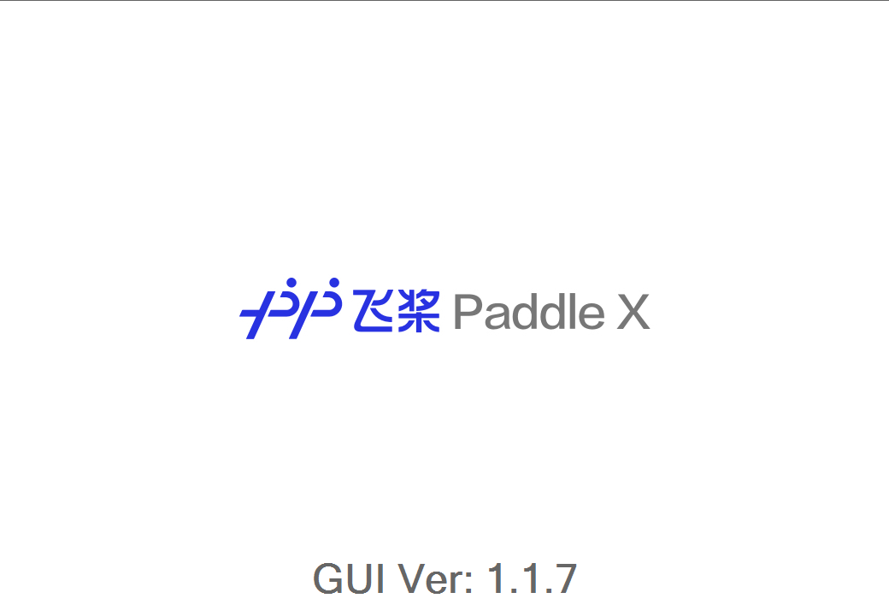
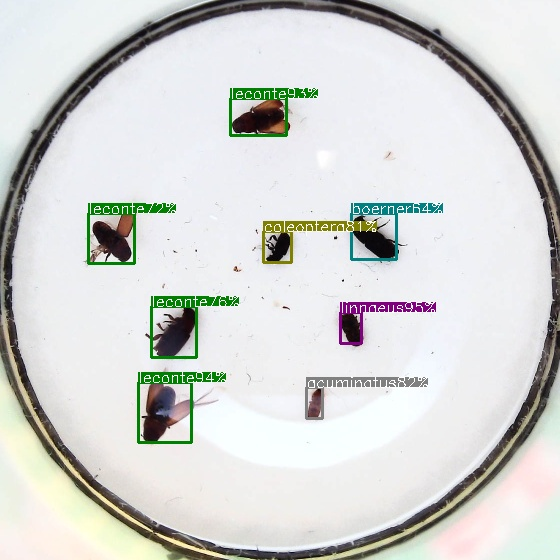
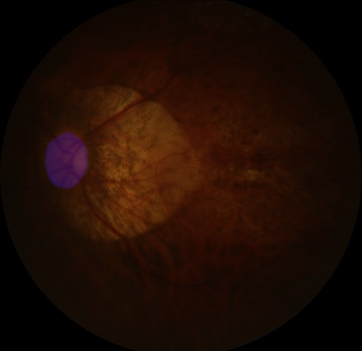

# FAQ(常见问题)

- [GUI相关问题](#GUI相关问题)
- [API训练相关问题](#API训练相关问题)
- [推理部署问题](#推理部署问题)

## GUI相关问题

<details>
  <summary>Q1:  GUI在使用过程中卡死该怎么解决?</summary>

> **A:** 卡死后点击一下这个按钮即可恢复正常
>  <p align="center">
>     
>   </p>
</details>


<details>
  <summary>Q2:  GUI训练时报错怎么办？</summary>

> **A:** 首先打开当前项目的日志文件，查看报错信息。
>
> 例如此前将PaddleX GUI的工作空间设置在`D:/work_space`下，则根据在GUI上的项目ID和任务ID找到当前任务的日志文件，例如`D:/work_space/projects/P0001/T0001/err.log/err.log`和`D:/work_space/projects/P0001/T0001/err.log/out.log`
>
> 如果无法定位出问题，可进一步查看PaddleX GUI的系统日志：例如在`C:/User/User_name/.paddlex/logs/paddlex.log`
>
> 查看上述三个日志文件，基本可以定位出是否是显存不足、或者是数据路径不对等问题。如果是显存不足，请调低batch_size（需同时按比例调低学习率等参数）。其他无法解决的问题，可以前往GitHub[提ISSUE](https://github.com/PaddlePaddle/PaddleX/issues)，描述清楚问题会有工程师及时回复。
</details>

<details>
<summary>Q3: GUI卡死在启动界面，但之前可以正常使用</summary>

> GUI之前可以正常使用，但是本次运行一直处于启动界面，无法进入到主界面，如下所示：
> <p align="center">
>   
> </p>  
>
> **A:** 可以尝试先删除PaddleX GUI的日志目录，例如`C:/User/User_name/.paddlex`，然后再重新更新打开GUI。  
</details>

<details>
  <summary>Q4: 如何及时更新PaddleX GUI 2.0内置的PaddleX API？</summary>

> **A:** 在PaddleX GUI 2.0的执行文件`PaddleX.exe`的同级目录下有个名为`paddlex`的文件夹，请将该文件夹替换成PaddleX github develop分支下的paddlex，即https://github.com/PaddlePaddle/PaddleX/tree/develop/paddlex
</details>

<details>
<summary>Q5: PaddleX GUI 2.0如何无缝切换PaddleX API训练？</summary>

> **A:** 在PaddleX GUI 2.0中已经生成的项目，如果想要换成PaddleX API进行训练，可进行如下步骤：
>
> 1. 找到该项目所在的工作空间，例如`D:/work_space/projects/P0001/T0001/`，该路径下有个名为`script.py`的训练脚本，此脚本包含该项目中的数据集路径和模型参数设置
> 2. 安装PaddleX API，参考[安装文档](../install.md#1-paddlex-api开发模式安装)
> 3. 开启终端，进入到`script.py`所在路径（例如`D:/work_space/projects/P0001/T0001/`），然后运行训练脚本：
> ```
> python script.py
> ```
</details>

<details>
<summary>Q6: Exception: A space is defined as the separator, but it exists in image or label name ...</summary>

> **A:** 图片路径里面存在空格，因为空格作为图片和标注文件之间的空格符，所以需要把路径里的空格删掉。另外需要注意，路径中不要有中文
</details>

## API训练相关问题

<details>
 <summary>Q1: loss为nan时怎么办？</summary>

> **A:** loss为nan表示梯度爆炸，导致loss为无穷大。这时候，需要将学习率（learning rate）调小，或者增大批大小（batch_size）。
</details>

<details>
 <summary>Q2:  YOLO系列为什么要训练这么久？</summary>

> **A:** 像yolo系列的数据增强比较多，所以训练的epoch要求要多一点，具体在不同的数据集上的时候，训练参数需要调整一下。比如我们先前示例给出ppyolo，ppyolov2的训练参数都是针对COCO数据集换算到单卡上的配置，但是在昆虫这份数据集上的效果并不好，后来我们进行了调整，您可以参考我们调整的参数相应调整自己的参数，具体调了哪些可以看我们之前的[pr](https://github.com/PaddlePaddle/PaddleX/pull/853/files)。
</details>

<details>
  <summary>Q3: windows下shapely报错：lgeos = CDLL(os.path.join(sys.prefix, 'Library', 'bin', 'geos_c.dll')) OSError: [WinError 126] 找不到指定的模块</summary>

>  **A:** windows上，在conda环境内通过pip install shapely后会出现该问题，具体可以看shapely issue [Toblerity/Shapely#1032](https://github.com/Toblerity/Shapely/issues/1032)。解决办法：
>
> 1. 卸载pip安装的shapely
>
> ```
> pip uninstall shapely
> ```
>
> 2. 然后用conda安装
>
> ```
> conda install shapely==1.7.1
>
> ```
</details>

<details><summary>Q4: windows下RCNN训练pycocotools报错：Expected 88 from C header, got 80 from PyObject</summary>

> **A:** 将numpy版本更新至1.20.0+可解决该问题
</details>

## 推理部署问题

<details><summary>Q1:  如何在程序中手动释放inference model和占用的显存?</summary>

> **A:** **只要初始化模型的那个进程结束了，占用的显存会自动释放**。
> 当出现显存没有释放的情况时，可能是：在主进程中初始化模型，然后在线程里完成图片的预测，这样在使用上是没有问题的，但是线程退出后显存不会释放，需要等到主进程退出才会释放显存。当然，线程退出后虽然显存没有被释放，但是后续使用是可以继续复用的，显存不会一直增长。
> 所以建议大家在子进程里做模型的初始化和预测，这样在子进程结束后会自动释放显存。
</details>

<details><summary>Q2:  提高预测速度的策略都有哪些？</summary>

> **A:** 1. 可以考虑使用更加轻量的backbone；看看图像预处理和预测结果后处理有没有优化空间；相比于python推理预测，用C++会更快；同时对批量图片进行预测；可以尝试使用加速库，例如在CPU上部署时可以开启mkdldnn，或者使用用OpenVINO推理引擎加速性能，在Nvidia GPU上部署时可以使用TensorRT加速性能；
> 2. 在测试性能时，需要注意给模型进行预热，例如先让模型预测100轮之后，再开始进行性能测试和记录，这样得到的性能指标才准确。
</details>

<details><summary>Q3:  使用python 部署时预测结果如何可视化？</summary>

> **A:** 检测模型的预测结果可以用API`pdx.det.visualize`，分割模型的预测结果可以用API`pdx.seg.visualize`，预测可视化见[Python部署](../python_deploy.md), 可视化API说明见[文档](../apis/prediction.md)，
</details>

<details>
<summary>Q4：使用C++部署时预测结果如何可视化？</summary>

> **A:** 在C++部署环节，我们也提供了简单的可视化接口便于大家调试。因预测结果可视化不是部署上线的必要步骤，所以我们给出的demo中没有默认链接可视化代码，如果需要通过可视化辅助调试，需要按照以下步骤链接可视化接口。这个可视化示例旨在帮助大家快速理解PaddleX Deploy的预测结果结构，如果是更为复杂的可视化功能，需要大家根据业务需求做进一步开发。
>
> **step1: 在Cmakelist.txt中添加可视化代码路径**
>
> 在https://github.com/PaddlePaddle/PaddleX/blob/develop/deploy/cpp/CMakeLists.txt#L52 之后加上：
>
> ```
> aux_source_directory(${PROJECT_SOURCE_DIR}/model_deploy/utils/src DETECTOR_SRC)
> ```
>
> **step2: 在目标检测和语义分割的预测demo中加入Visualize接口**
>
>  * 以昆虫检测([API tutorials](../../tutorialstrain/object_detection/faster_rcnn_r50_fpn.py)对应GUI中的样例工程)为例：
>
>  > 在https://github.com/PaddlePaddle/PaddleX/blob/develop/deploy/cpp/demo/model_infer.cpp#L19 后添加可视化代码的头文件：
>  > ```
>  > #include "model_deploy/utils/include/visualize.h"
>  > ```
>  > [可选]如果需要对低分框过滤，还可以加上过滤框代码的头文件：
>  > ```
>  > #include "model_deploy/utils/include/bbox_utils.h"
>  > ```
>  > 在https://github.com/PaddlePaddle/PaddleX/blob/develop/deploy/cpp/demo/model_infer.cpp#L57 后添加可视化代码：
>  > ```
>  > cv::Mat vis_det;
>  > Visualize(imgs[0], *(results[0].det_result), &vis_det, 6);
>  > cv::imwrite("vis_det.jpg", vis_det);
>  > ```
>  > > 6表示当前数据集的类别数，请根据实际情况设置
>
>  > [可选]如果需要对低分框过滤，添加过滤框和可视化代码：
>  > ```
>  > cv::Mat vis_det;
>  > std::vector<PaddleDeploy::Result> filter_results;
>  > float score_thresh = 0.5;
>  > FilterBbox(results, score_thresh, &filter_results);
>  > Visualize(imgs[0], *(filter_results[0].det_result), &vis_det, 6);
>  > cv::imwrite("vis_det.jpg", vis_det);
>  > ```
>  > > 6表示当前数据集的类别数，请根据实际情况设置
>  >
>  > 我们对昆虫数据集中的0205.jpg预测结果可视化如下：
>  > <p align="center">
>  >   
>  > </p>
>
>  * 以视盘分割([API tutorials](../../tutorials/train/semantic_segmentation/deeplabv3p_resnet50_vd.py)对应GUI中的样例工程)为例：
>  > 在https://github.com/PaddlePaddle/PaddleX/blob/develop/deploy/cpp/demo/model_infer.cpp#L19 后添加可视化代码的头文件：
>  > ```
>  > #include "model_deploy/utils/include/visualize.h"
>  > ```
>  > 在https://github.com/PaddlePaddle/PaddleX/blob/develop/deploy/cpp/demo/model_infer.cpp#L57 后添加可视化代码：
>
>  > ```
>  > cv::Mat vis_seg;
>  > Visualize(imgs[0], *(results[0].seg_result), &vis_seg, 2);
>  > cv::imwrite("vis_seg.jpg", vis_seg);
>  > ```
>  > > 2表示当前数据集的类别数，请根据实际情况设置
>
>  > 我们对视盘数据集中的P0176.jpg预测结果可视化如下：
>  > <p align="center">
>  >   
>  > </p>

</details>

<details>
<summary>Q5:  如何用1.x的部署代码部署2.0的模型？</summary>

> **A:** 2.0版本的cpp部署支持新旧版本的paddlex/gui导出的模型进行部署，但是2.0版本的python部署目前不兼容1.x版本模型。2.0版本PaddleX GUI/API的训练功能对1.x版本也不兼容，1.x版本的训练脚本和模型只能安装1.x版本的PaddleX才能正常运行。
</details>

<details><summary>Q6:  用命令行跑 `.\paddlex_inference\detector.exe` 这个指令没有什么提示，也没有输出，是怎么回事？</summary>

> **A:** 可能是缺少dll，双击执行一下out目录下的detector.exe或model_infer.exe，会有提示。
</details>

