# PaddleX_Restful API --快速搭建私有化训练云服务

* ## 什么是Restful
* ## PaddleX_Restful API 说明
* ## 如何快速使用PaddleX_Restful API 快速搭建私有化训练云平台

## *什么是Restful*

RESTFUL是一种网络应用程序的设计风格和开发方式，基于HTTP，可以使用XML格式定义或JSON格式定义。RESTFUL适用于移动互联网厂商作为业务接口的场景，实现第三方OTT调用移动网络资源的功能，动作类型为新增、变更、删除所调用资源。

简单来说就是用户可以起一个远端的服务，客户端通过http形式进行访问。

## *PaddleX_Restful API 说明*

PaddleX RESTful是基于PaddleX开发的RESTful API。对于开发者来说只需要简单的指令便可开启PaddleX RESTful服务。对于哪些有远程训练要求，同时为了数据保密的开发者来说，PaddleX_Restful API简单易用的操作可以很好的满足上述要求。

开启RESTful服务后可以实现如下功能：

* 通过下载基于RESTful API的GUI连接开启RESTful服务的服务端，实现远程深度学习全流程开发。
* 通过使用web demo连接开启RESTful服务的服务端，实现远程深度学习全流程开发。
* 根据RESTful API来开发您自己个性化的可视化界面。

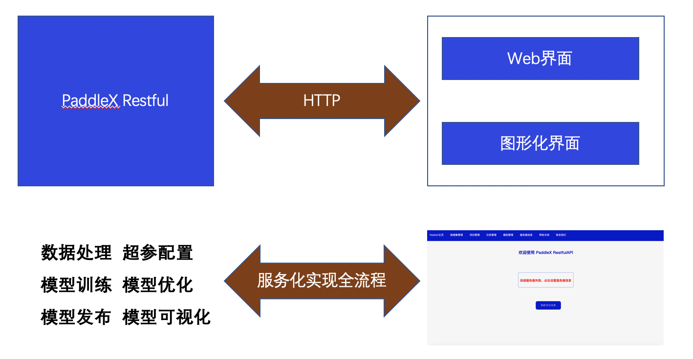              

## *如何快速使用PaddleX_Restful API 快速搭建私有化训练云平台*

在该示例中PaddleX_Restful运行在一台带GPU的linux服务器下，用户通过其他电脑连接该服务器进行远程的操作。
### 1  环境准备

在服务器下载PaddlePaddle和PaddleX及其他依赖

* 下载安装PaddleX>=2.1.0和PaddlePaddle>= 2.2.0

详见[PaddleX API快速安装](../../../docs/quick_start_API.md#PaddleX-200安装)

* 下载pycuda（如果不使用GPU，该项可不进行下载）

pip install pycuda

### 2  启动Restful服务

在服务器上启动如下命令，其中端口号是用户自定义的，`workspace_dir`是用户在服务器创建的

`paddlex_restful --start_restful --port [端口号] --workspace_dir [工作空间地址]`

例如开启一个端口为27000，工作路径在`cv/x/resful_space`的一个服务

`paddlex_restful --start_restful --port 27000 --workspace_dir cv/x/resful_space`

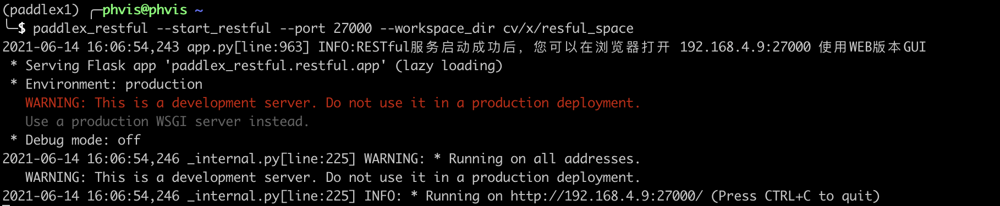              

出现上述图片所示的内容，即为开启服务成功。

### 3 启动客户端进行远程全流程训练

为了方便大家进行远程调试，PaddleX_Restful提供了两张访问形式，一个是Web图形化界面，另一个是客户端的图形化界面
* ## Web图像化界面

### 3.1 打开Web界面
当用户启动Restful服务后，在Web界面的导航栏只需要输入IP地址和端口号即可。例如当前案例的IP地址是222.95.100.37 端口号是25001

即在导航栏输入 `http://222.95.100.37:25001/` 即可出现如下界面

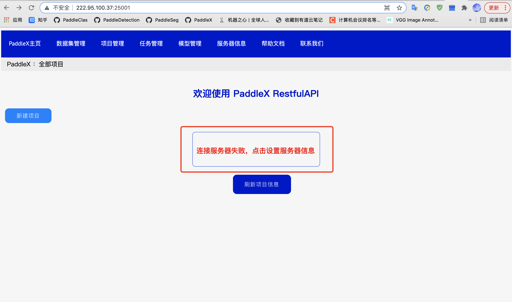              

### 3.2 服务器设置
点击界面中内容，在将服务器进行设置

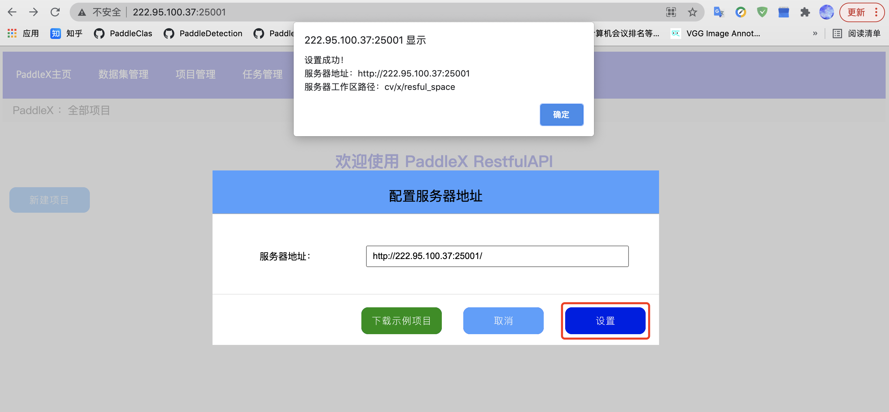              

### 3.3 下载示例项目

用户根据自己的需求，选择是否下载示例项目

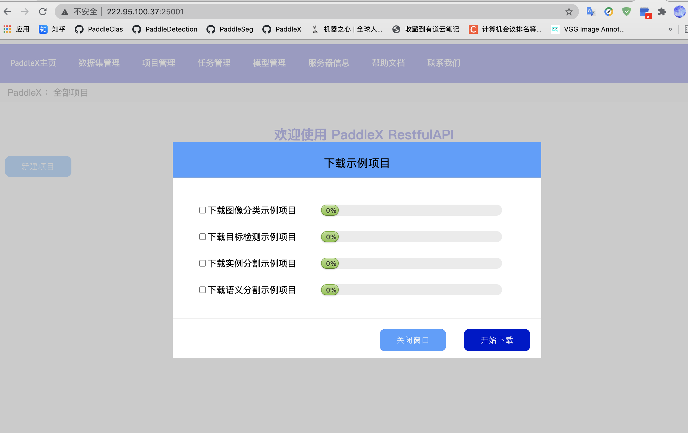              

最终画面如下图所示

              

### 3.4 创建数据集
用户如果要自定义训练，首先需要去创建用户自身的数据集，
在此之前，用户首先需要将数据集上传到服务器上。

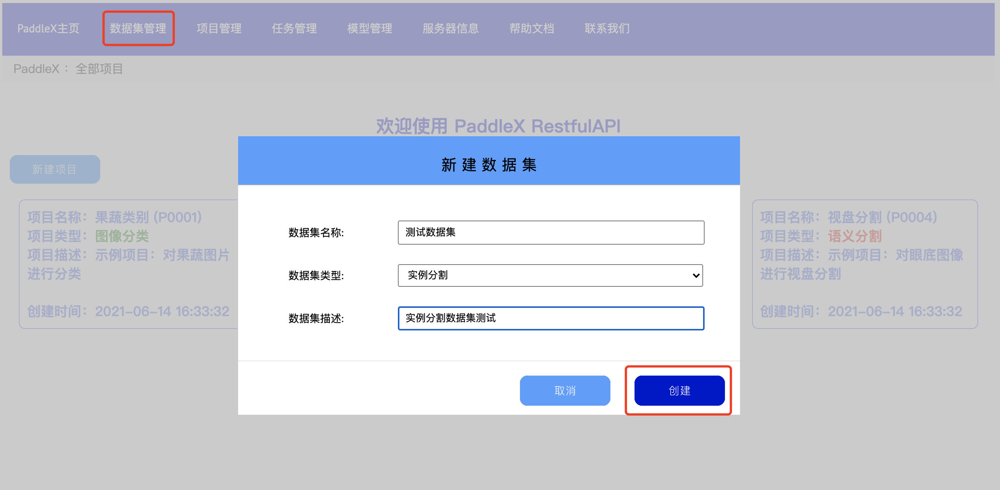              

输入在服务上数据存储的路径，开始导入数据，在服务器上传的数据集，必须是符合PaddleX训练数据的命名格式要求。

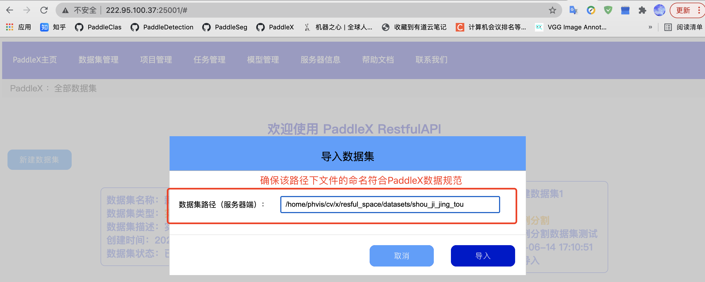              

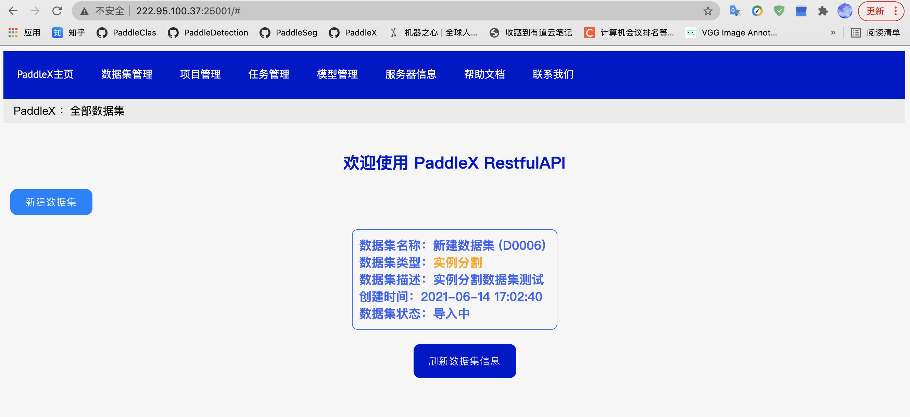              

数据导入成功后，进行数据集划分

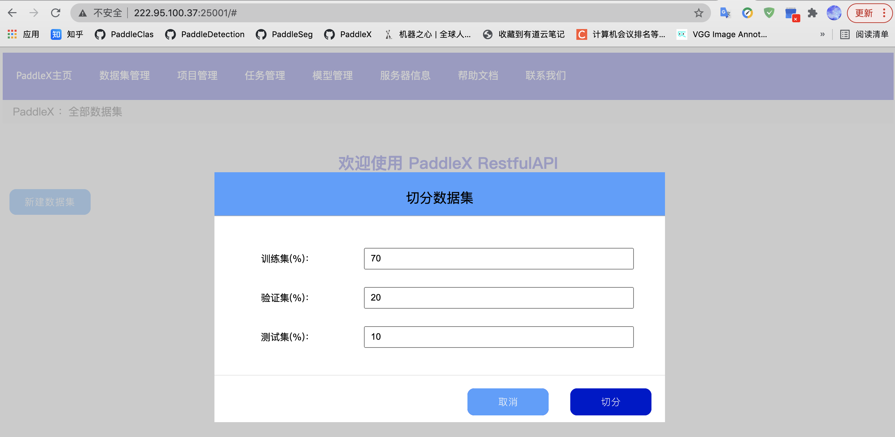              

用户在划分完成数据集后，也可对数据集进行可视化观察

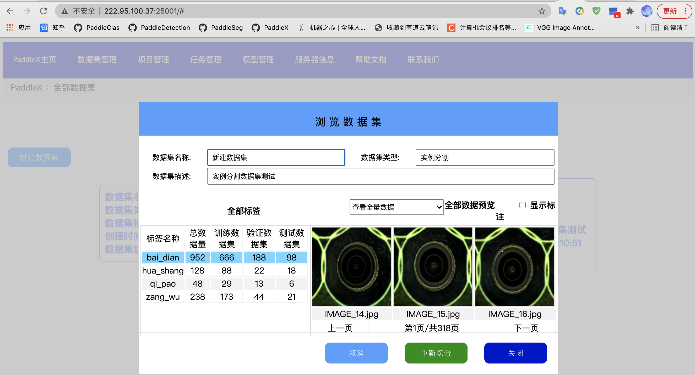              

### 3.5 开始训练

在数据集创建完成后，用户可创建新项目，并进行训练

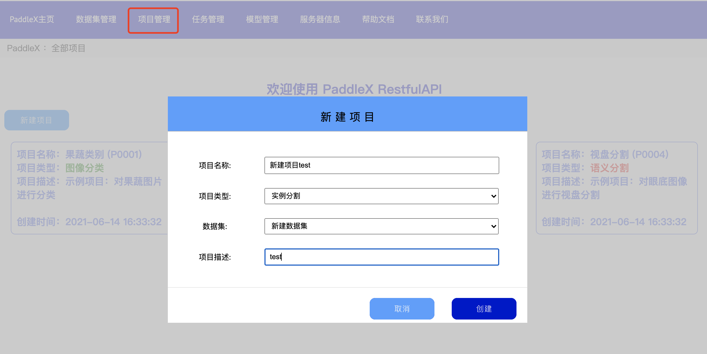              

配置好相关参数后，点击开始训练，便开始进行训练。

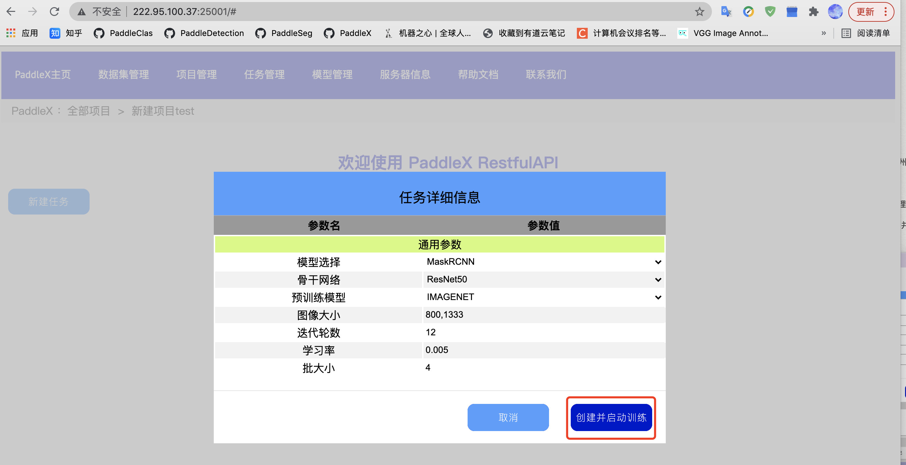              

* ## 客户端图形化界面

客户端操作流程和Web界面基本一致，提供了Windows版本，用户可自行下载并操作

Windows客户端即将到来！

### 4  Restful 二次开发说明

开发者可以使用PaddleX RESTful API 进行二次开发，按照自己的需求开发可视化界面，详细请参考以下文档  

[RESTful API 二次开发简介](../..//gui/restful/restful.md)  

[快速开始](../../gui/restful/quick_start.md)  

[API 参考文档](../../gui/restful/restful_api.md)  

[自定义数据结构](../../gui/restful/data_struct.md)
