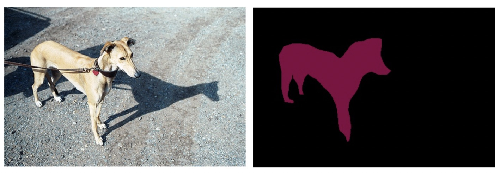

# 加载模型预测

PaddleX可以使用`paddlex.load_model`接口加载模型（包括训练过程中保存的模型，导出的部署模型，量化模型以及裁剪的模型）进行预测，同时PaddleX中也内置了一系列的可视化工具函数，帮助用户方便地检查模型的效果。


## 图像分类

```python
import paddlex as pdx
test_jpg = 'mobilenetv3_small_ssld_imagenet/test.jpg'
model = pdx.load_model('mobilenetv3_small_ssld_imagenet')
result = model.predict(test_jpg)
print("Predict Result: ", result)
```
结果输出如下：
```pythonregexp
Predict Result: [{'category_id': 549, 'category': 'envelope', 'score': 0.29062933}]
```

测试图片如下：


- 分类模型predict接口[说明文档](./models/classification.md#predict)


## 目标检测


```python
import paddlex as pdx
test_jpg = 'yolov3_mobilenetv1_coco/test.jpg'
model = pdx.load_model('yolov3_mobilenetv1_coco')

# predict接口并未过滤低置信度识别结果，用户根据需求按score值进行过滤
result = model.predict(test_jpg)

# 可视化结果存储在./visualized_test.jpg, 见下图
pdx.det.visualize(test_jpg, result, threshold=0.3, save_dir='./')
```
- YOLOv3模型predict接口[说明文档](./apis/models/detection.md#predict)
- 可视化pdx.det.visualize接口[说明文档](https://github.com/PaddlePaddle/PaddleX/blob/develop/paddlex/cv/models/utils/visualize.py#L25)
> 注意：目标检测和实例分割模型在调用`predict`接口得到的结果需用户自行过滤低置信度结果，在`paddlex.det.visualize`接口中，我们提供了`threshold`用于过滤，置信度低于此值的结果将被过滤，不会可视化。


## 实例分割


```python
import paddlex as pdx
test_jpg = 'mask_r50_fpn_coco/test.jpg'
model = pdx.load_model('mask_r50_fpn_coco')

# predict接口并未过滤低置信度识别结果，用户根据需求按score值进行过滤
result = model.predict(test_jpg)

# 可视化结果存储在./visualized_test.jpg, 见下图
pdx.det.visualize(test_jpg, result, threshold=0.5, save_dir='./')
```
- MaskRCNN模型predict接口[说明文档](./apis/models/instance_segmentation.md#predict)
- 可视化pdx.det.visualize接口[说明文档](https://github.com/PaddlePaddle/PaddleX/blob/develop/paddlex/cv/models/utils/visualize.py#L25)

**注意**：目标检测和实例分割模型在调用`predict`接口得到的结果需用户自行过滤低置信度结果，在`paddlex.det.visualize`接口中，我们提供了`threshold`用于过滤，置信度低于此值的结果将被过滤，不会可视化。


## 语义分割


```python
import paddlex as pdx
test_jpg = './deeplabv3p_mobilenetv2_voc/test.jpg'
model = pdx.load_model('./deeplabv3p_mobilenetv2_voc')
result = model.predict(test_jpg)
# 可视化结果存储在./visualized_test.jpg，见下图右(左图为原图)
pdx.seg.visualize(test_jpg, result, weight=0.0, save_dir='./')
```

在上述示例代码中，通过调用`paddlex.seg.visualize`可以对语义分割的预测结果进行可视化，可视化的结果保存在`save_dir`下，见下图。其中`weight`参数用于调整预测结果和原图结果融合展现时的权重，0.0时只展示预测结果mask的可视化，1.0时只展示原图可视化。

- DeepLabv3模型predict接口[说明文档](./apis/models/semantic_segmentation.md#predict)
- 可视化pdx.seg.visualize接口[说明文档](https://github.com/PaddlePaddle/PaddleX/blob/develop/paddlex/cv/models/utils/visualize.py#L50)

