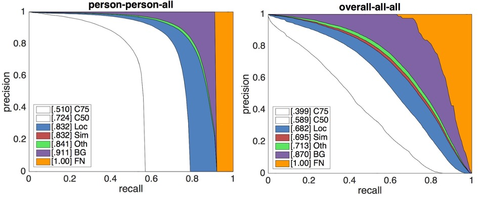
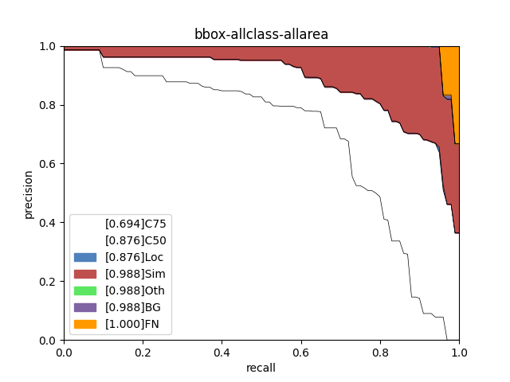

# 预测结果可视化

## 目录

* [paddlex.det.visualize](#1)
* [paddlex.det.draw_pr_curve](#2)
* [paddlex.det.coco_error_analysis](#3)
* [paddlex.seg.visualize](#4)
* [paddlex.visualize_det](#5)
* [paddlex.visualize_seg](#6)


## <h2 id="1">paddlex.det.visualize</h2>

```python
paddlex.det.visualize(image, result, threshold=0.5, save_dir='./', color=None)
```

> 将目标检测/实例分割模型预测得到的Box框和Mask在原图上进行可视化。

>
> **参数**
>
> > - **image** (str|np.ndarray): 原图文件路径或numpy数组(HWC排列，BGR格式)。
> > - **result** (str): 模型预测结果。
> > - **threshold** (float): score阈值，将Box置信度低于该阈值的框过滤不进行可视化。默认0.5
> > - **save_dir** (str): 可视化结果保存路径。若为None，则表示不保存，该函数将可视化的结果以np.ndarray的形式返回；若设为目录路径，则将可视化结果保存至该目录下。默认值为’./’。
> > - **color** (list|tuple|np.array): 各类别的BGR颜色值组成的数组，形状为Nx3（N为类别数量），数值范围为[0, 255]。例如针对2个类别的[[255, 0, 0], [0, 255, 0]]。若为None，则自动生成各类别的颜色。默认值为None。


使用示例：
```
import paddlex as pdx
model = pdx.load_model('xiaoduxiong_epoch_12')
result = model.predict('./xiaoduxiong_epoch_12/xiaoduxiong.jpeg')
pdx.det.visualize('./xiaoduxiong_epoch_12/xiaoduxiong.jpeg', result, save_dir='./')
# 预测结果保存在./visualize_xiaoduxiong.jpeg

```


## <h2 id="2">paddlex.det.draw_pr_curve</h2>
> 目标检测/实例分割准确率-召回率可视化
```
paddlex.det.draw_pr_curve(eval_details_file=None, gt=None, pred_bbox=None, pred_mask=None, iou_thresh=0.5, save_dir='./')
```
将目标检测/实例分割模型评估结果中各个类别的准确率和召回率的对应关系进行可视化，同时可视化召回率和置信度阈值的对应关系。
> 注：PaddleX在训练过程中保存的模型目录中，均包含`eval_result.json`文件，可将此文件路径传给`eval_details_file`参数，设定`iou_threshold`即可得到对应模型在验证集上的PR曲线图。

### 参数
> * **eval_details_file** (str): 模型评估结果的保存路径，包含真值信息和预测结果。默认值为None。
> * **gt** (list): 数据集的真值信息。默认值为None。
> * **pred_bbox** (list): 模型在数据集上的预测框。默认值为None。
> * **pred_mask** (list): 模型在数据集上的预测mask。默认值为None。
> * **iou_thresh** (float): 判断预测框或预测mask为真阳时的IoU阈值。默认值为0.5。
> * **save_dir** (str): 可视化结果保存路径。默认值为'./'。

**注意：**`eval_details_file`的优先级更高，只要`eval_details_file`不为None，就会从`eval_details_file`提取真值信息和预测结果做分析。当`eval_details_file`为None时，则用`gt`、`pred_mask`、`pred_mask`做分析。

### 使用示例
点击下载如下示例中的[模型](https://bj.bcebos.com/paddlex/2.0/faster_rcnn_e12.tar.gz)和[数据集](https://bj.bcebos.com/paddlex/datasets/insect_det.tar.gz)

> 方式一：分析训练过程中保存的模型文件夹中的评估结果文件`eval_details.json`，例如[模型](https://bj.bcebos.com/paddlex/models/insect_epoch_270.zip)中的`eval_details.json`。
```
import paddlex as pdx
eval_details_file = 'faster_rcnn_e12/eval_details.json'
pdx.det.draw_pr_curve(eval_details_file, save_dir='./insect')
```
> 方式二：分析模型评估函数返回的评估结果。

```
import paddlex as pdx
from paddlex import transforms as T

model = pdx.load_model('faster_rcnn_e12')
eval_dataset = pdx.datasets.VOCDetection(
    data_dir='insect_det',
    file_list='insect_det/val_list.txt',
    label_list='insect_det/labels.txt',
    transforms=model.test_transforms)
metrics, evaluate_details = model.evaluate(eval_dataset, batch_size=1, return_details=True)
gt = evaluate_details['gt']
bbox = evaluate_details['bbox']
pdx.det.draw_pr_curve(gt=gt, pred_bbox=bbox, save_dir='./insect')
```

预测框的各个类别的准确率和召回率的对应关系、召回率和置信度阈值的对应关系可视化如下：
.png)


## <h2 id="3">paddlex.det.coco_error_analysis</h2>
> 分析模型预测错误的原因

```
paddlex.det.coco_error_analysis(eval_details_file=None, gt=None, pred_bbox=None, pred_mask=None, save_dir='./output')
```
逐个分析模型预测错误的原因，并将分析结果以图表的形式展示。分析结果图表示例如下：



左图显示的是`person`类的分析结果，有图显示的是所有类别整体的分析结果。

分析图表展示了7条Precision-Recall（PR）曲线，每一条曲线表示的Average Precision （AP）比它左边那条高，原因是逐步放宽了评估要求。以`person`类为例，各条PR曲线的评估要求解释如下：

* C75: 在IoU设置为0.75时的PR曲线, AP为0.510。
* C50: 在IoU设置为0.5时的PR曲线，AP为0.724。C50与C75之间的白色区域面积代表将IoU从0.75放宽至0.5带来的AP增益。
* Loc: 在IoU设置为0.1时的PR曲线，AP为0.832。Loc与C50之间的蓝色区域面积代表将IoU从0.5放宽至0.1带来的AP增益。蓝色区域面积越大，表示越多的检测框位置不够精准。
* Sim: 在Loc的基础上，如果检测框与真值框的类别不相同，但两者同属于一个亚类，则不认为该检测框是错误的，在这种评估要求下的PR曲线, AP为0.832。Sim与Loc之间的红色区域面积越大，表示子类间的混淆程度越高。
* Oth: 在Sim的基础上，如果检测框与真值框的亚类不相同，则不认为该检测框是错误的，在这种评估要求下的PR曲线，AP为0.841。Oth与Sim之间的绿色区域面积越大，表示亚类间的混淆程度越高。
* BG: 在Oth的基础上，背景区域上的检测框不认为是错误的，在这种评估要求下的PR曲线，AP为91.1。BG与Oth之间的紫色区域面积越大，表示背景区域被误检的数量越多。
* FN: 在BG的基础上，漏检的真值框不认为是错误的，在这种评估要求下的PR曲线，AP为1.00。FN与BG之间的橙色区域面积越大，表示漏检的真值框数量越多。

更为详细的说明参考[COCODataset官网给出分析工具说明](https://cocodataset.org/#detection-eval)

### 参数
> * **eval_details_file** (str): 模型评估结果的保存路径，包含真值信息和预测结果。默认值为None。
> * **gt** (list): 数据集的真值信息。默认值为None。
> * **pred_bbox** (list): 模型在数据集上的预测框。默认值为None。
> * **pred_mask** (list): 模型在数据集上的预测mask。默认值为None。
> * **save_dir** (str): 可视化结果保存路径。默认值为'./output'。

**注意：**`eval_details_file`的优先级更高，只要`eval_details_file`不为None，就会从`eval_details_file`提取真值信息和预测结果做分析。当`eval_details_file`为None时，则用`gt`、`pred_mask`、`pred_mask`做分析。

### 使用示例
点击下载如下示例中的[模型](https://bj.bcebos.com/paddlex/models/insect_epoch_270.zip)和[数据集](https://bj.bcebos.com/paddlex/datasets/insect_det.tar.gz)

> 方式一：分析训练过程中保存的模型文件夹中的评估结果文件`eval_details.json`，例如[模型](https://bj.bcebos.com/paddlex/models/insect_epoch_270.zip)中的`eval_details.json`。
```
import paddlex as pdx
eval_details_file = 'insect_epoch_270/eval_details.json'
pdx.det.coco_error_analysis(eval_details_file, save_dir='./insect')
```
> 方式二：分析模型评估函数返回的评估结果。

```
import paddlex as pdx
from paddlex import transforms as T

model = pdx.load_model('insect_epoch_270')
eval_dataset = pdx.datasets.VOCDetection(
    data_dir='insect_det',
    file_list='insect_det/val_list.txt',
    label_list='insect_det/labels.txt',
    transforms=model.test_transforms)
metrics, evaluate_details = model.evaluate(eval_dataset, batch_size=8, return_details=True)
gt = evaluate_details['gt']
bbox = evaluate_details['bbox']
pdx.det.coco_error_analysis(gt=gt, pred_bbox=bbox, save_dir='./insect')
```
所有类别整体的分析结果示例如下：




## <h2 id="4">paddlex.seg.visualize</h2>

```python
paddlex.seg.visualize(image, result, weight=0.6, save_dir='./', color=None)
```

> 将语义分割模型预测得到的Mask在原图上进行可视化。

>
> **参数**
>
> > - **image** (str|np.ndarray): 原图文件路径或numpy数组(HWC排列，BGR格式)。
> > - **result** (str): 模型预测结果。
> > - **weight**(float): mask可视化结果与原图权重因子，weight表示原图的权重。默认0.6。
> > - **save_dir** (str): 可视化结果保存路径。若为None，则表示不保存，该函数将可视化的结果以np.ndarray的形式返回；若设为目录路径，则将可视化结果保存至该目录下。默认值为’./’。
> > - **color** (list): 各类别的BGR颜色值组成的列表。例如两类时可设置为[255, 255, 255, 0, 0, 0]。默认值为None，则使用默认生成的颜色列表。

使用示例：

```
import paddlex as pdx
model = pdx.load_model('cityscape_deeplab')
result = model.predict('city.png')
pdx.seg.visualize('city.png', result, save_dir='./')
# 预测结果保存在./visualize_city.png
```


## <h2 id="5">paddlex.visualize_det</h2>

> 是paddlex.det.visualize的别名，接口说明同 [paddlex.det.visualize](./visualize.md#paddlex.det.visualize)

## <h2 id="6">paddlex.visualize_seg</h2>

> 是paddlex.seg.visualize的别名，接口说明同 [paddlex.seg.visualize](./visualize.md#paddlex.seg.visualize)
