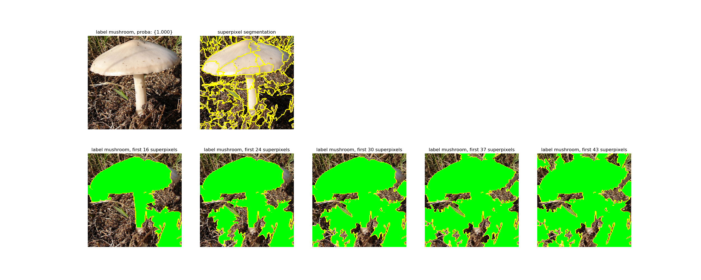
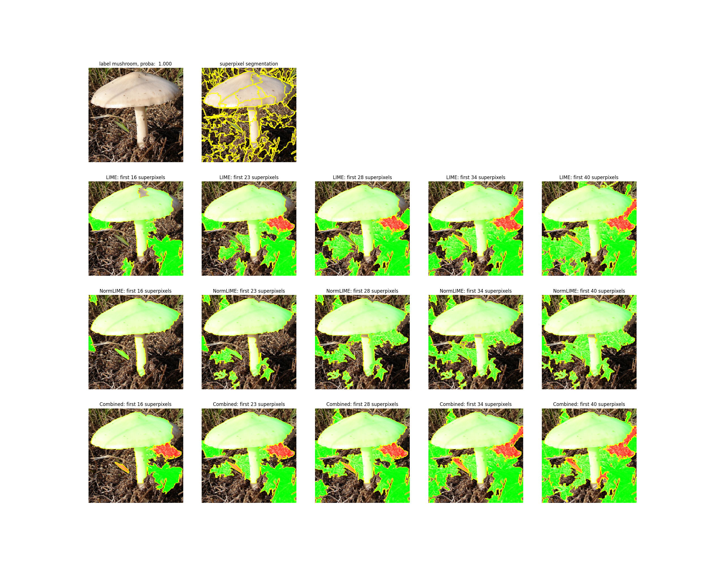

# PaddleX可解释性

目前深度学习模型普遍存在一个问题，因为使用模型预测还是一个黑盒，几乎无法去感知它的内部工作状态，预测结果的可信度一直遭到质疑。为此，PadlleX提供了2种对图像分类预测结果进行可解释性研究的算法：LIME和NormLIME。

## LIME
LIME全称Local interpretable model-agnostic explanations，表示一种与模型无关的局部可解释性。其实现步骤主要如下：
1. 获取图像的超像素。  
2. 以输入样本为中心，在其附近的空间中进行随机采样，每个采样即对对象中的超像素进行随机遮掩（每个采样的权重和该采样与原样本的距离成反比）。  
3. 每个采样通过预测模型得到新的输出，这样得到一系列的输入`X`和对应的输出`Y`。  
4. 将`X`转换为超像素特征`F`，用一个简单的、可解释的模型`Model`（这里使用岭回归）来拟合`F`和`Y`的映射关系。  
5. `Model`将得到`F`每个输入维度的权重（每个维度代表一个超像素），以此来解释模型。  

LIME的使用方式可参见[代码示例](https://github.com/PaddlePaddle/PaddleX/blob/develop/tutorials/interpret/lime.py)和[api介绍](../apis/visualize.html#lime)。在使用时，参数中的`num_samples`设置尤为重要，其表示上述步骤2中的随机采样的个数，若设置过小会影响可解释性结果的稳定性，若设置过大则将在上述步骤3耗费较长时间；参数`batch_size`则表示在计算上述步骤3时，预测的batch size，若设置过小将在上述步骤3耗费较长时间，而上限则根据机器配置决定。  

最终LIME可解释性算法的可视化结果如下所示：  
  
图中绿色区域代表起正向作用的超像素，红色区域代表起反向作用的超像素，"First n superpixels"代表前n个权重比较大的超像素（由上述步骤5计算所得结果）。

## NormLIME
NormLIME是在LIME上的改进，LIME的解释是局部性的，是针对当前样本给的特定解释，而NormLIME是利用一定数量的样本对当前样本的一个全局性的解释，有一定的降噪效果。其实现步骤如下所示：  
1. 下载Kmeans模型参数和ResNet50_vc网络前三层参数。（ResNet50_vc的参数是在ImageNet上训练所得网络的参数；使用ImageNet图像作为数据集，每张图像从ResNet50_vc的第三层输出提取对应超象素位置上的平均特征和质心上的特征，训练将得到此处的Kmeans模型）  
2. 使用测试集中的数据计算normlime的权重信息（如无测试集，可用验证集代替）:  
    对每张图像的处理：
    (1) 获取图像的超像素。
    (2) 使用ResNet50_vc获取第三层特征，针对每个超像素位置，组合质心特征和均值特征`F`。  
    (3) 把`F`作为Kmeans模型的输入，计算每个超像素位置的聚类中心。  
    (4) 使用训练好的分类模型，预测该张图像的`label`。  
    对所有图像的处理：  
    (1) 以每张图像的聚类中心信息组成的向量（若某聚类中心出现在盖章途中设置为1，反之为0）为输入，
        预测的`label`为输出，构建逻辑回归函数`regression_func`。  
    (2) 由`regression_func`可获得每个聚类中心不同类别下的权重，并对权重进行归一化。  
3. 使用Kmeans模型获取需要可视化图像的每个超像素的聚类中心。  
4. 对需要可视化的图像的超像素进行随机遮掩构成新的图像。   
5. 对每张构造的图像使用预测模型预测label。  
6. 根据normlime的权重信息，每个超像素可获不同的权重，选取最高的权重为最终的权重，以此来解释模型。   

NormLIME的使用方式可参见[代码示例](https://github.com/PaddlePaddle/PaddleX/blob/develop/tutorials/interpret/normlime.py)和[api介绍](../apis/visualize.html#normlime)。在使用时，参数中的`num_samples`设置尤为重要，其表示上述步骤2中的随机采样的个数，若设置过小会影响可解释性结果的稳定性，若设置过大则将在上述步骤3耗费较长时间；参数`batch_size`则表示在计算上述步骤3时，预测的batch size，若设置过小将在上述步骤3耗费较长时间，而上限则根据机器配置决定；而`dataset`则是由测试集或验证集构造的数据。  

最终NormLIME可解释性算法的可视化结果如下所示：  
  
图中绿色区域代表起正向作用的超像素，红色区域代表起反向作用的超像素，"First n superpixels"代表前n个权重比较大的超像素（由上述步骤5计算所得结果）。图中最后一行代表把LIME和NormLIME对应超像素权重相乘的结果。