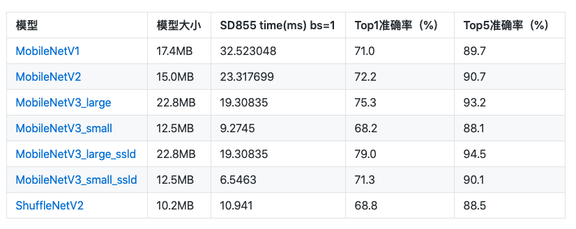
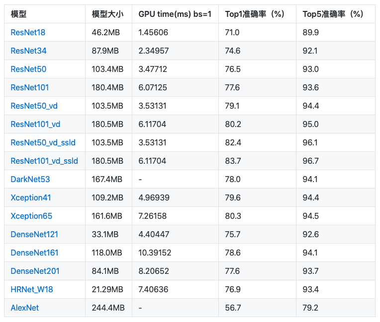
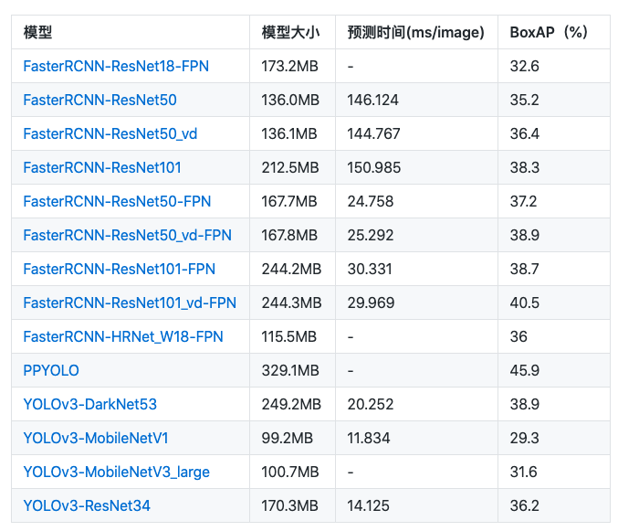
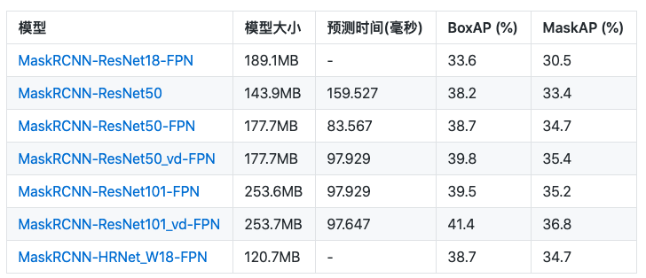
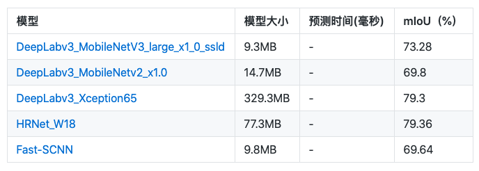

# PaddleX模型库

## 图像分类模型

> 表中模型准确率均为在ImageNet数据集上测试所得，表中符号`-`表示相关指标暂未测试，预测速度测试环境如下所示:

* CPU的评估环境基于骁龙855（SD855）。
* GPU评估环境基于T4机器，在FP32+TensorRT配置下运行500次测得（去除前10次的warmup时间）。

### 移动端系列

### 其他系列

## 目标检测模型

> 表中模型精度BoxAP通过`evaluate()`接口测试MSCOCO验证集得到，符号`-`表示相关指标暂未测试，预测时间在以下环境测试所的：

- 测试环境:
  - CUDA 9.0
  - CUDNN 7.5
  - PaddlePaddle v1.6
  - TensorRT-5.1.2.2
  - GPU分别为: Tesla V100
- 测试方式:
  - 为了方便比较不同模型的推理速度，输入采用同样大小的图片，为 3x640x640。
  - Batch Size=1
  - 去掉前10轮warmup时间，测试100轮的平均时间，单位ms/image，包括输入数据拷贝至GPU的时间、计算时间、数据拷贝至CPU的时间。
  - 采用Fluid C++预测引擎，开启FP32 TensorRT配置。
  - 测试时开启了 FLAGS_cudnn_exhaustive_search=True，使用exhaustive方式搜索卷积计算算法。

## 实例分割模型

> 表中模型精度BoxAP/MaskAP通过`evaluate()`接口测试MSCOCO验证集得到，符号`-`表示相关指标暂未测试，预测时间在以下环境测试所的

- 测试环境:
  - CUDA 9.0
  - CUDNN 7.5
  - PaddlePaddle v1.6
  - TensorRT-5.1.2.2
  - GPU分别为: Tesla V100
- 测试方式:
  - 为了方便比较不同模型的推理速度，输入采用同样大小的图片，为 3x640x640。
  - Batch Size=1
  - 去掉前10轮warmup时间，测试100轮的平均时间，单位ms/image，包括输入数据拷贝至GPU的时间、计算时间、数据拷贝至CPU的时间。
  - 采用Fluid C++预测引擎，开启FP32 TensorRT配置。
  - 测试时开启了 FLAGS_cudnn_exhaustive_search=True，使用exhaustive方式搜索卷积计算算法。

## 语义分割模型

> 以下指标均在MSCOCO验证集上测试得到，表中符号`-`表示相关指标暂未测试。

> 以下指标均在Cityscapes验证集上测试得到，表中符号`-`表示相关指标暂未测试。

