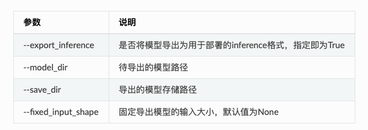

# 部署模型导出

在服务端部署模型时需要将训练过程中保存的模型导出为inference格式模型，导出的inference格式模型包括`__model__`、`__params__`和`model.yml`三个文件，分别表示模型的网络结构、模型权重和模型的配置文件（包括数据预处理参数等）。

> **检查你的模型文件夹**，如果里面是`model.pdparams`， `model.pdmodel`和`model.yml`3个文件时，那么就需要按照下面流程进行模型导出

在安装完PaddleX后，在命令行终端使用如下命令将模型导出。可直接下载小度熊分拣模型来测试本文档的流程[xiaoduxiong_epoch_12.tar.gz](https://bj.bcebos.com/paddlex/models/xiaoduxiong_epoch_12.tar.gz)。

```
paddlex --export_inference --model_dir=./xiaoduxiong_epoch_12 --save_dir=./inference_model
```



使用TensorRT预测时，需固定模型的输入大小，通过`--fixed_input_shape `来制定输入大小[w,h]。

**注意**：
- 分类模型的固定输入大小请保持与训练时的输入大小一致；
- 指定[w,h]时，w和h中间逗号隔开，不允许存在空格等其他字符。

```
paddlex --export_inference --model_dir=./xiaoduxiong_epoch_12 --save_dir=./inference_model --fixed_input_shape=[640,960]
```
