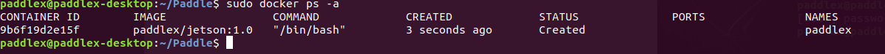

# Nvidia Jetson开发板Docker部署
本文档介绍了如何用Docker在Jetson开发板上部署PaddleX模型，通过Docker的方式部署，用户可以有效的避免可能因为系统环境导致编译或者运行的错误  

提供了在Jeston上用于编译或者运行PaddleX部署代码的Docker，主要有如下功能：
- 编译PaddleX部署代码：用户可以通过Docker编译PaddleX部署代码
- 部署PaddleX模型：通过Docker使用编译好的可执行文件部署


## 准备工作
在编译与运行之前的准备工作，主要是下载Docker与创建容器  

### Step1: 下载Jetson开发板Docker
运行如下命令下载Docker  

```
docker pull paddlex/jetson:1.0
```  

下载成功后，通过如下命令查看docker的镜像

```
docker images
```
可以看到，存在一个REPOSITORY为`paddlex/jetson`、TAG为`1.0`的docker镜像
  

### Step2: 容器创建
创建容器之前，需要先准备好需要编译的部署代码与训练好的PaddleX部署模型

建议用户在HOME目录下创建infer文件夹，将需要部署的代码与模型拷贝到该目录下用于挂载到容器内  

本文档以PaddleX提供的jetson部署代码为示例：
```
#通过如下命令下载代码，Jetson部署代码在 `PaddleX/deploy/cpp` 目录下面
git clone https://github.com/PaddlePaddle/PaddleX.git

#在HOME目录下创建infer文件夹，将cpp文件夹拷贝到infer目录下面
mkdir ~/infer
cp -r PaddleX/deploy/cpp ~/infer/
```

**创建容器**：通过如下命令创建容器，同时将HOME目录下包含部署代码的infer文件夹挂载到容器内
 ```
 docker create -it -v ~/infer/:/infer -v /tmp/.X11-unix:/tmp/.X11-unix -e DISPLAY=$DISPLAY --net=host --name paddlex --runtime nvidia paddlex/jetson:1.0 /bin/bash
 ```
查看创建的容器
 ```
 docker ps -a
 ```  

   


创建好容器后需要运行容器
```
docker start paddlex
```

## 编译
通过如下命令可以编译infer文件夹内的部署代码
```
docker exec -it paddlex /bin/bash -c 'cd /infer/cpp && sh scripts/jetson_build.sh'
```
**注意**：
- 对于直接使用容内编译好的可执行文件进行部署的用户不需要进行编译
- '`cd /infer/cpp`'表示进入到部署代码目录，用户需要根据实际情况自己修改


## 部署
对于图片预测，编译的可执行文件在`/infer/cpp/build/demo/detector`，`infer/cpp/build/demo/classifier`，`infer/cpp/build/demo/segmenter`,其主要命令参数说明如下：

|  参数   | 说明  |
|  ----  | ----  |
| model_dir  | 导出的预测模型所在路径 |
| image  | 要预测的图片文件路径 |
| image_list  | 按行存储图片路径的.txt文件 |
| use_gpu  | 是否使用 GPU 预测, 支持值为0或1(默认值为0) |
| use_trt  | 是否使用 TensorRT 预测, 支持值为0或1(默认值为0) |
| gpu_id  | GPU 设备ID, 默认值为0 |
| save_dir | 保存可视化结果的路径, 默认值为"output"，**classfier无该参数** |
| batch_size | 预测的批量大小，默认为1 |
| thread_num | 预测的线程数，默认为cpu处理器个数 |  

对于视频预测，编译的可执行文件在`/infer/cpp/build/demo/video_detector`，`infer/cpp/build/demo/video_classifier`，`infer/cpp/build/demo/video_segmenter`,其主要命令参数说明如下：

|  参数   | 说明  |
|  ----  | ----  |
| model_dir  | 导出的预测模型所在路径 |
| use_camera | 是否使用摄像头预测，支持值为0或1(默认值为0) |
| camera_id | 摄像头设备ID，默认值为0 |
| video_path | 视频文件的路径 |
| use_gpu  | 是否使用 GPU 预测, 支持值为0或1(默认值为0) |
| use_trt  | 是否使用 TensorRT 预测, 支持值为0或1(默认值为0) |
| gpu_id  | GPU 设备ID, 默认值为0 |
| show_result | 对视频文件做预测时，是否在屏幕上实时显示预测可视化结果(因加入了延迟处理，故显示结果不能反映真实的帧率)，支持值为0或1(默认值为0) |
| save_result | 是否将每帧的预测可视结果保存为视频文件，支持值为0或1(默认值为1) |
| save_dir | 保存可视化结果的路径, 默认值为"output" |

**设置show_result为1之前请执行如下命令确保容器有显示权限**
```
sudo xhost +
```  

**注意：若系统无GUI，则不要将show_result设置为1。当使用摄像头预测时，按`ESC`键可关闭摄像头并推出预测程序。**

**对于使用用户编译的可执行文件进行部署的命令如下：**  
```
docker exec -it paddlex /bin/bash -c 'cd [部署代码目录] && .build/demo/[可执行文件名] [命令参数]'
```

### 样例
在用户编译完部署代码后，可按如下流程运行测试模型样例

- 1)下载PaddleX预训练模型及测试图片[下载地址](https://paddlex.readthedocs.io/zh_CN/develop/train/prediction.html)，本文档下载了YOLOv3-MobileNetV1模型与测试图片  
- 2)将模型导出为部署模型格式 [导出部署模型步骤](https://paddlex.readthedocs.io/zh_CN/develop/deploy/export_model.html)
- 3)将部署模型和测试图片copy到`~/infer`文件夹
- 4)使用如下命令，通过容器进行预测

```
docker exec -it paddlex /bin/bash -c 'cd /infer/cpp && ./build/demo/detector --model_dir /infer/yolov3_mobilenetv1_coco --image /infer/yolov3_mobilenetv1_coco/test.jpg --use_gpu 1'
```
