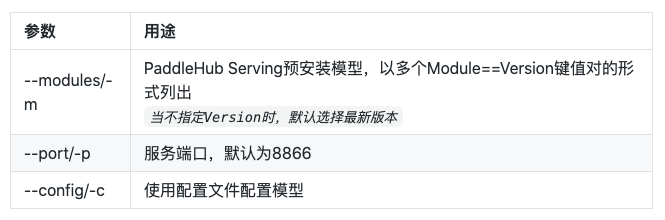
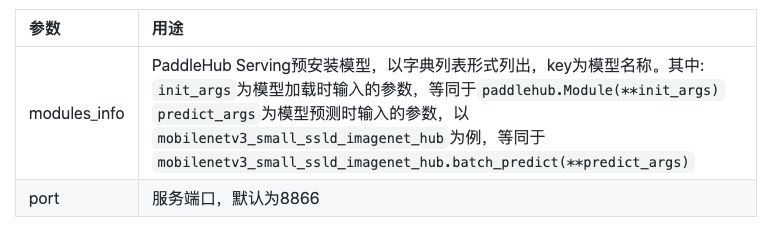

# Android平台

PaddleX的安卓端部署基于Paddle Lite实现，部署的流程如下，首先将训练好的模型导出为inference model，然后对模型进行优化，最后使用Paddle Lite预测库进行部署，Paddle Lite的详细介绍和使用可参考：[Paddle Lite文档](https://paddle-lite.readthedocs.io/zh/latest/)

> PaddleX --> Inference Model --> Paddle Lite Opt --> Paddle Lite Inference

文章简介：
- 1.介绍如何将PaddleX导出为inference model
- 2.使用Paddle Lite的OPT模块对模型进行优化
- 3.介绍基于PaddleX Android SDK的安卓demo，以及如何快速部署训练好的模型
- 4.介绍PaddleX Android SDK和二次开发

## 1. 将PaddleX模型导出为inference模型

参考[导出inference模型](../export_model.md)将模型导出为inference格式模型。

## 2. 将inference模型优化为Paddle Lite模型

目前提供了两种方法将Paddle模型优化为Paddle Lite模型:

- 1. python脚本优化模型，简单上手，目前支持最新的Paddle Lite 2.6.1版本
- 2. bin文件优化模型(linux)，支持develop版本(Commit Id:11cbd50e)，**部署语义分割`DeepLab模型`和`Unet模型`时只能采用bin文件优化方式**。

### 2.1 使用python脚本优化模型

```bash
pip install paddlelite
python export_lite.py --model_dir /path/to/inference_model --save_file /path/to/lite_model_name --place place/to/run
```
> 其中`export_lite.py`脚本请至github下载：https://github.com/PaddlePaddle/PaddleX/blob/develop/deploy/lite/export_lite.py



### 2.3 使用bin文件优化模型(linux)

首先下载并解压: [模型优化工具opt](https://bj.bcebos.com/paddlex/deploy/lite/model_optimize_tool_11cbd50e.tar.gz)

``` bash
./opt --model_file=<model_path> \
      --param_file=<param_path> \
      --valid_targets=arm \
      --optimize_out_type=naive_buffer \
      --optimize_out=model_output_name
```



详细的使用方法和参数含义请参考: [使用opt转化模型](https://paddle-lite.readthedocs.io/zh/latest/user_guides/opt/opt_bin.html)

## 3. 移动端（Android）Demo

PaddleX提供了基于PaddleX Android SDK的安卓demo，位于`/PaddleX/deploy/lite/android/demo`，该demo已预置了MobilenetV2的模型参数，用户可直接将该demo导入Android Studio后运行体验，同时也支持用户将预置的Mobilenetv2模型参数替换成其他PaddleX导出的检测或分割模型进行预测。

### 3.1 要求

- Android Studio 3.4
- Android手机或开发板

### 3.2 分类Demo

#### 3.2.1 导入工程并运行

- 打开Android Studio，在"Welcome to Android Studio"窗口点击"Open an existing Android Studio project"，在弹出的路径选择窗口中进入`/PaddleX/deploy/lite/android/demo`目录，然后点击右下角的"Open"按钮，导入工程；
- 通过USB连接Android手机或开发板；
- 载入工程后，点击菜单栏的Run->Run 'App'按钮，在弹出的"Select Deployment Target"窗口选择已经连接的Android设备，然后点击"OK"按钮；
- 运行成功后，Android设备将加载一个名为PaddleX Demo的App，默认会加载一个测试图片，同时还支持拍照和从图库选择照片进行预测；

**注意**：在工程构建的过程中会远程下载Mobilenetv2模型、yml配置文件、测试的图片，以及PaddleX Android SDK。

### 3.3 部署自定义模型

该demo还支持用户自定义模型来进行预测，可帮助用户快速验证自己训练好的模型，首先我们已经根据step1~step2描述，准备好了Lite模型(.nb文件)和yml配置文件(注意：导出Lite模型时需指定--place=arm)，然后在Android Studio的project视图中：

- 将.nb文件拷贝到`/src/main/assets/model/`目录下, 根据.nb文件的名字，修改文件`/src/main/res/values/strings.xml`中的`MODEL_PATH_DEFAULT`；
- 将.yml文件拷贝到`/src/main/assets/config/`目录下，根据.yml文件的名字，修改文件`/src/main/res/values/strings.xml`中的`YAML_PATH_DEFAULT`；
- 可根据需要替换测试图片，将图片拷贝到`/src/main/assets/images/`目录下，根据图片文件的名字，修改文件`/src/main/res/values/strings.xml`中的`IMAGE_PATH_DEFAULT`；
- 将工程导入后，点击菜单栏的Run->Run 'App'按钮，在弹出的"Select Deployment Target"窗口选择已经连接的Android设备，然后点击"OK"按钮。

## 4. PaddleX Android SDK和二次开发

PaddleX Android SDK是PaddleX基于Paddle Lite开发的安卓端AI推理工具，以PaddleX导出的Yaml配置文件为接口，针对不同的模型实现图片的预处理，后处理，并进行可视化，开发者可集成到业务中。
该SDK自底向上主要包括：Paddle Lite推理引擎层，Paddle Lite接口层以及PaddleX业务层。

- Paddle Lite推理引擎层，是在Android上编译好的二进制包，只涉及到Kernel 的执行，且可以单独部署，以支持极致轻量级部署。
- Paddle Lite接口层，以Java接口封装了底层c++推理库。
- PaddleX业务层，封装了PaddleX导出模型的预处理，推理和后处理，以及可视化，支持PaddleX导出的检测、分割、分类模型。


### 4.1 SDK安装

首先下载并解压[PaddleX Android SDK](https://bj.bcebos.com/paddlex/deploy/lite/paddlex_lite_11cbd50e.tar.gz)，得到paddlex.aar文件，将拷贝到android工程目录app/libs/下面，然后为app的build.gradle添加依赖：

```
dependencies {
    implementation fileTree(include: ['*.jar','*aar'], dir: 'libs')
}

```

### 4.2 SDK使用用例
```
import com.baidu.paddlex.Predictor;
import com.baidu.paddlex.config.ConfigParser;
import com.baidu.paddlex.postprocess.DetResult;
import com.baidu.paddlex.postprocess.SegResult;
import com.baidu.paddlex.postprocess.ClsResult;
import com.baidu.paddlex.visual.Visualize;

// Predictor
Predictor predictor = new Predictor();
// model config
ConfigParser configParser = new ConfigParser();
// Visualize
Visualize visualize = new Visualize();
// image to predict
Mat predictMat;

// initialize
configParser.init(context, model_path, yaml_path, cpu_thread_num, cpu_power_mode);
visualize.init(configParser.getNumClasses());
predictor.init(context, configParser)

// run model
if (predictImage != null && predictor.isLoaded()) {
    predictor.setInputMat(predictMat);
    runModel();
}

// get result & visualize
if (configParser.getModelType().equalsIgnoreCase("segmenter")) {
    SegResult segResult = predictor.getSegResult();
    Mat visualizeMat  = visualize.draw(segResult, predictMat, predictor.getImageBlob());
} else if (configParser.getModelType().equalsIgnoreCase("detector")) {
    DetResult detResult = predictor.getDetResult();
    Mat visualizeMat = visualize.draw(detResult, predictMat);
} else if (configParser.getModelType().equalsIgnoreCase("classifier")) {
    ClsResult clsResult = predictor.getClsResult();
}
```
### 4.3 Result成员变量

**注意**：Result所有的成员变量以java bean的方式获取。

```java
com.baidu.paddlex.postprocess.ClsResult
```

##### Fields
> * **type** (String|static): 值为"cls"。
> * **categoryId** (int): 类别ID。
> * **category** (String): 类别名称。
> * **score** (float): 预测置信度。

```java
com.baidu.paddlex.postprocess.DetResult
```
##### Nested classes
> * **DetResult.Box** 模型预测的box结果。

##### Fields
> * **type** (String|static): 值为"det"。
> * **boxes** (List<DetResult.Box>): 模型预测的box结果。

```java
com.baidu.paddlex.postprocess.DetResult.Box
```
##### Fields
> * **categoryId** (int): 类别ID。
> * **category** (String): 类别名称。
> * **score** (float): 预测框的置信度。
> * **coordinate** (float[4]): 预测框的坐标值{xmin, ymin, xmax, ymax}。

```java
com.baidu.paddlex.postprocess.SegResult
```
#####  Nested classes
> * **SegResult.Mask**: 模型预测的mask结果。

##### Fields
> * **type** (String|static): 值为"Seg"。
> * **mask** (SegResult.Mask): 模型预测的mask结果。

```java
com.baidu.paddlex.postprocess.SegResult.Mask
```
##### Fields
> * **scoreData** (float[]): 模型预测在各个类别的置信度，长度为: 1 * numClass *  H * W
> * **scoreShape** (long[4]): scoreData的shape信息，[1, numClass, H, W]
> * **labelData** (long[]): 模型预测置信度最高的label，长度为: 1 * H * W * 1
> * **labelShape** (long[4]): labelData的shape信息，[1, H, W, 1]

### 4.4 SDK二次开发

- 打开Android Studio新建项目(或加载已有项目)。点击菜单File->New->Import Module，导入工程`/PaddleX/deploy/lite/android/sdk`, Project视图会新增名为sdk的module
- 在app的build.grade里面添加依赖:
 ```
  dependencies {
      implementation project(':sdk')
  }
 ```

- 源代码位于sdk/main/java/下，修改源码进行二次开发后，点击菜单栏的Build->Run 'sdk'按钮可编译生成aar，文件位于sdk/build/outputs/aar/路径下。
