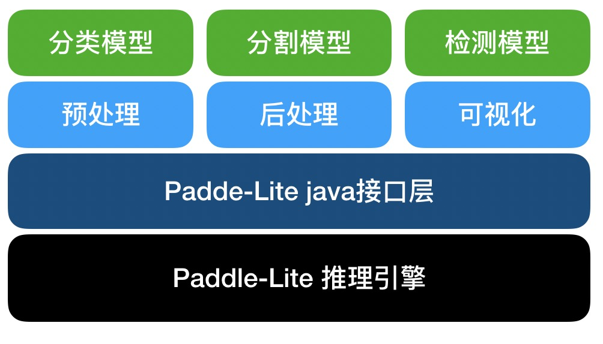

# Android platform

The Android deployment of PaddleX is based on Paddle Lite, the deployment process is as follows: export the trained model as reference model, then optimize the model, and finally use the Paddle Lite prediction library to perform the deployment. For the detailed introduction and use of Paddle Lite, see the [Paddle Lite document](https://paddle-lite.readthedocs.io/zh/latest/).

> PaddleX --> Inference Model --> Paddle Lite Opt --> Paddle Lite Inference

Introduction:
- 1. Describes how to export PaddleX to an inference model.
- 2. Optimizes the model using Paddle Lite's OPT module.
- 3. Describes the Android demo based on PaddleX Android SDK and how to quickly deploy the trained model.
- 4. Describes the PaddleX Android SDK and Secondary Development

## 1. Export the PaddleX model to an inference model.

Refer to the [export inference model](../export_model.md) to export the model to an inference format.

## 2. Optimize the inference model to a Paddle Lite model

Two methods are available to optimize the Paddle model to the Paddle Lite model:

- 1. The python script optimization model features ease-of-use. Currently, the latest version is Paddle Lite version 2.6.1.
- 2. The bin file optimization model (Linux) supports the develop version (Commit Id:11cbd50e) .**Only bin file optimization can be used in the deployment of the semantic segmentation `DeepLab model` and `Unet model`**.

### 2.1 Using python script optimization model

```bash
pip install paddlelite
python export_lite.py --model_dir /path/to/inference_model --save_file /path/to/lite_model_name --place place/to/run
```
> For the `export_lite.py` script, download it by accessing the github: https://github.com/PaddlePaddle/PaddleX/blob/develop/deploy/lite/export_lite.py

| Parameters | Description |
|  ----  | ----  |
| --model_dir | Path of predication model. It contains "\_\_model\_\_", "\_\_params\_\_", "model.yml" file. |
| --save_file | Name of model output. If it is /path/to/lite_model_name, the output path is /path/to/lite_model_name.nb. |
| --place | Platform for running. Options: arm\|opencl\|x86\|npu\|xpu\|rknpu\|apu. For the Android deployment, select arm |

### 2.3 Optimizing models with bin files (Linux)

First download and decompress: [Model Optimizer opt](https://bj.bcebos.com/paddlex/deploy/lite/model_optimize_tool_11cbd50e.tar.gz)

```bash
./opt --model_file=<model_path> \
      --param_file=<param_path> \
      --valid_targets=arm \
      --optimize_out_type=naive_buffer \
      --optimize_out=model_output_name
```

| Parameters | Description |
|  ----  | ----  |
| --model_file | Export the network structure file contained in the inference model: the path where `__model__` is located. |
| --param_file | Export the parameter file contained in the inference model: the path where `__params__` is located. |
| --valid_targets | Specify the model executable backend. Here it is specified as `arm`. |
| --optimize_out_type | Output model type. Currently supports two types: protobuf and naive_buffer`, where naive_buffer is a more lightweight serialization/deserialization. Here it is specified as naive_buffer`. |

For detailed usage and parameter meaning, refer to [Using the opt conversion model] (https://paddle-lite.readthedocs.io/zh/latest/user_guides/opt/opt_bin.html)

## 3 Mobile (Android) Demo

PaddleX provides an Android demo based on PaddleX Android SDK, located in `/PaddleX/deploy/lite/android/demo`. This demo is preset with the MobilenetV2 model parameters. Users can directly import the demo into Android Studio and run the experience. The user can replace the preset Mobilenetv2 model parameters with other detection or segmentation models exported by PaddleX for prediction.

### 3.1 Requirements

- Android Studio 3.4
- Android phone or development panel

### 3.2 Category Demo

#### 3.2.1 Importing the project and running

- Start the Android Studio and click "Open an existing Android Studio project" in the "Welcome to Android Studio" window. In the pop-up path selection window, access the `/PaddleX/deploy/lite/android/demo` directory. At the bottom right corner, click "Open" to import the project.
- Connect an Android phone or development panel through a USB port.
- After loading the project, choose Run->Run 'App'. In the pop-up "Select Deployment Target" window, select the connected Android device and click "OK".
- Upon successful operation, the Android device loads an App called PaddleX Demo. By default, a test image is uploaded. In addition, the prediction is supported by taking photos and selecting photos from the gallery.

**Note**: In the project construction process, the system remotely downloads the Mobilenetv2 model, yml configuration file, test pictures, and PaddleX Android SDK.

### 3.3 Deploy a customized model

The demo also supports user-defined models to perform predictions. This can help users quickly verify the trained models. First, you have prepared the Lite model (.nb file) and yml configuration file as described in Step 1 to Step 2 (Note: specify --place=arm when exporting the Lite model). In the project view of Android Studio:

- Copy the .nb file to the `/src/main/assets/model/` directory, and modify the `MODEL_PATH_DEFAULT` in the `/src/main/res/values/strings.xml` file according to the name of the .nb file.
- Copy the .yml file to the `/src/main/assets/config/` directory, and modify the `YAML_PATH_DEFAULT` in the `/src/main/res/values/strings.xml` file according to the name of the .yml file.
- You can replace the test image as required, copy the image to the `/src/main/assets/images/` directory, and modify the `IMAGE_PATH_DEFAULT` in the file `/src/main/res/values/strings.xml` according to the name of the image file.
- After importing the project, click the Run->Run 'App' button in the menu bar. In the displayed "Select Deployment Target" window, select the connected Android device, and then click "OK".

## 4. PaddleX Android SDK and secondary development

PaddleX Android SDK is an Android AI reasoning tool developed by PaddleX based on Paddle Lite. It uses the Yaml configuration file exported by PaddleX as an interface to realize image preprocessing, postprocessing, and visualization for different models. Developers can integrate it into the services.
The SDK mainly includes Paddle Lite inference engine layer, Paddle Lite interface layer, and PaddleX service layer from bottom to top.

- The Paddle Lite inference engine layer is a binary package compiled on Android. It only involves the execution of the Kernel and can be deployed separately to support extremely lightweight deployment.
- The Paddle Lite interface layer encapsulates the underlying C++ inference library with a Java interface.
- The PaddleX service layer encapsulates the pre-processing, inference and post-processing, and visualization of the PaddleX export model. It supports the detection, segmentation, and classification models exported by PaddleX.



### 4.1 SDK installation

First, download and decompress the [PaddleX Android SDK](https://bj.bcebos.com/paddlex/deploy/lite/paddlex_lite_11cbd50e.tar.gz), to obtain the paddlex.aar file, copy it to the android project directory app/libs/, and then add dependencies for the build.gradle of the APP:

```
dependencies {
    implementation fileTree(include: ['*.jar','*aar'], dir: 'libs')
```

### 4.2 SDK example
```
import com.baidu.paddlex.Predictor;
import com.baidu.paddlex.config.ConfigParser;
import com.baidu.paddlex.postprocess.DetResult;
import com.baidu.paddlex.postprocess.SegResult;
import com.baidu.paddlex.postprocess.ClsResult;
import com.baidu.paddlex.visual.Visualize;

// Predictor
Predictor predictor = new Predictor();
// model config
ConfigParser configParser = new ConfigParser();
// Visualize
Visualize visualize = new Visualize();
// image to predict
Mat predictMat;

// initialize
configParser.init(context, model_path, yaml_path, cpu_thread_num, cpu_power_mode);
visualize.init(configParser.getNumClasses());
predictor.init(context, configParser)

// run model
if (predictImage != null && predictor.isLoaded()) {
    predictor.setInputMat(predictMat);
    runModel();
}

// get result & visualize
if (configParser.getModelType().equalsIgnoreCase("segmenter")) {
    SegResult segResult = predictor.getSegResult();
    Mat visualizeMat  = visualize.draw(segResult, predictMat, predictor.getImageBlob());
} else if (configParser.getModelType().equalsIgnoreCase("detector")) {
    DetResult detResult = predictor.getDetResult();
    Mat visualizeMat = visualize.draw(detResult, predictMat);
} else if (configParser.getModelType().equalsIgnoreCase("classifier")) {
    ClsResult clsResult = predictor.getClsResult();
}
```
### 4.3 Result member variables

**Note**: All the member variables of Result are obtained by way of java bean.

```java
com.baidu.paddlex.postprocess. ClsResult
```

##### Fields
> * **type** (String|static): The value is "cls".
> * **categoryId** (int): category ID.
> * **category** (String): category name.
> * **score** (float): prediction confidence.


```java
com.baidu.paddlex.postprocess. DetResult
```
##### Nested classes
> The box result predicted by the * **DetResult.Box** .


##### Fields
> * **type** (String|static): The value is "det".
> * **boxes** (List<DetResult. Box>): The box result predicted by the model.


```java
com.baidu.paddlex.postprocess. DetResult. Box
```
##### Fields
> * **categoryId** (int): category ID.
> * **category** (String): category name.
> * **score** (float): the confidence of the prediction box.
> * **coordinate** (float[4]): The coordinate value of the prediction box {xmin, ymin, xmax, ymax}.


```java
com.baidu.paddlex.postprocess. SegResult
```
##### Nested classes
> * **SegResult. Mask**: The mask result predicted by the model.


##### Fields
> * **type** (String|static): The value is "Seg".
> * **mask** (SegResult. Mask): The mask result predicted by the model.


```java
com.baidu.paddlex.postprocess. SegResult. Mask
```
##### Fields
> * **scoreData** (float[]): the confidence of the model prediction in each category. The length is: 1 * numClass * H * W
> * **scoreShape** (long[4]): shape information of scoreData, [1, numClass, H, W]
> * **labelData** (long[]): The label with the highest model prediction confidence, the length is: 1 * H * W * 1
> * **labelShape** (long[4]): shape information of labelData, [1, H, W, 1]


### 4.4 SDK secondary development

- Open Android Studio to create a new project (or load an existing project). Choose File->New->Import Module, and import the project `/PaddleX/deploy/lite/android/sdk`. The Project view is added with a module named sdk.
- Add dependency in build.grade of the APP:
```
  dependencies {
      implementation project(':sdk')
  }
```

- The source code is located in sdk/main/java/. After modifying the source code for secondary development, choose Build->Run 'sdk' button in the menu bar to compile and generate aar. The file is located in the sdk/build/outputs/aar/path.
