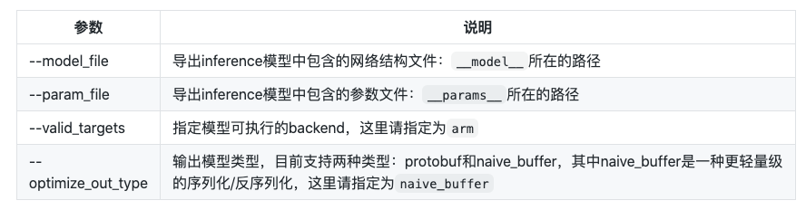

# Paddle-Lite模型转换
将PaddleX模型转换为Paddle-Lite的nb模型，模型转换主要包括PaddleX转inference model和inference model转Paddle-Lite nb模型
### Step1：导出inference模型
PaddleX模型转Paddle-Lite模型之前需要先把PaddleX模型导出为inference格式模型，导出的模型将包括__model__、__params__和model.yml三个文件名。具体方法请参考[Inference模型导出](../export_model.md)。
### Step2：导出Paddle-Lite模型
Paddle-Lite模型需要通过Paddle-Lite的opt工具转出模型，下载并解压: [模型优化工具opt（2.6.1-linux）](https://bj.bcebos.com/paddlex/deploy/Rasoberry/opt.zip)，在Linux系统下运行：
``` bash
./opt --model_file=<model_path> \
      --param_file=<param_path> \
      --valid_targets=arm \
      --optimize_out_type=naive_buffer \
      --optimize_out=model_output_name
```



若安装了python版本的Paddle-Lite也可以通过如下方式转换
``` 
./paddle_lite_opt --model_file=<model_path> \
      --param_file=<param_path> \
      --valid_targets=arm \
      --optimize_out_type=naive_buffer \
      --optimize_out=model_output_name
```

更多详细的使用方法和参数含义请参考: [使用opt转化模型](https://paddle-lite.readthedocs.io/zh/latest/user_guides/opt/opt_bin.html)，更多opt预编译版本请参考[Paddle-Lite Release Note](https://github.com/PaddlePaddle/Paddle-Lite/releases)

**注意**：opt版本需要跟预测库版本保持一致，如使2.6.0版本预测库，请从上面Release Note中下载2.6.0版本的opt转换模型
