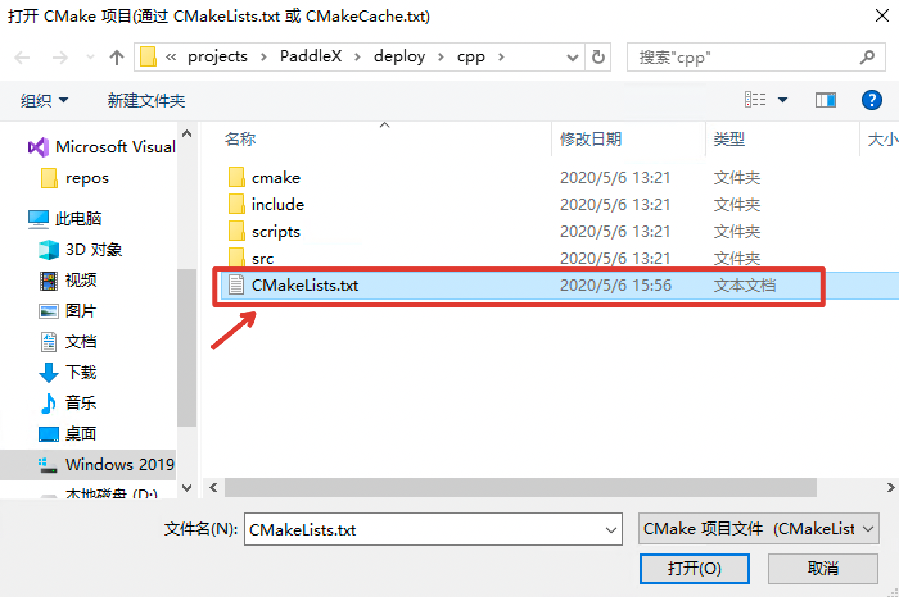
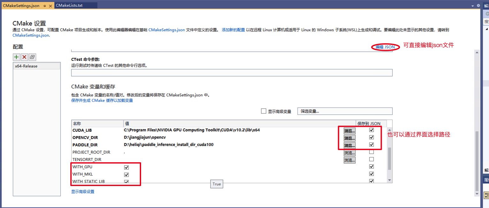
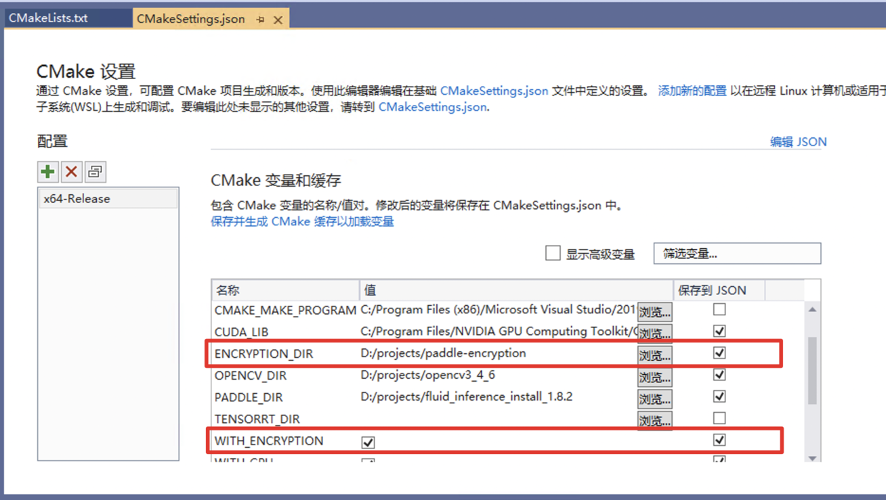

# Windows平台部署

## 说明
Windows 平台下，我们使用`Visual Studio 2019 Community` 进行了测试。微软从`Visual Studio 2017`开始即支持直接管理`CMake`跨平台编译项目，但是直到`2019`才提供了稳定和完全的支持，所以如果你想使用CMake管理项目编译构建，我们推荐你使用`Visual Studio 2019`环境下构建。

## 前置条件
* Visual Studio 2019
* CUDA 9.0 / CUDA 10.0, CUDNN 7+ （仅在使用GPU版本的预测库时需要）
* CMake 3.0+

请确保系统已经安装好上述基本软件，我们使用的是`VS2019`的社区版。

**下面所有示例以工作目录为 `D:\projects`演示。**

### Step1: 下载PaddleX预测代码

```shell
d:
mkdir projects
cd projects
git clone https://github.com/PaddlePaddle/PaddleX.git
```

**说明**：其中`C++`预测代码在`PaddleX\deploy\cpp` 目录，该目录不依赖任何`PaddleX`下其他目录。


### Step2: 下载PaddlePaddle C++ 预测库 paddle_inference

PaddlePaddle C++ 预测库针对是否使用GPU、是否支持TensorRT、以及不同的CUDA版本提供了已经编译好的预测库，目前PaddleX依赖于Paddle 1.8，基于Paddle 1.8的Paddle预测库下载链接如下所示:

|  版本说明   | 预测库(1.8.2版本)  | 编译器 | 构建工具| cuDNN | CUDA |
|  ----  |  ----  |  ----  |  ----  | ---- | ---- |
| cpu_avx_mkl  | [paddle_inference](https://paddle-wheel.bj.bcebos.com/1.8.2/win-infer/mkl/cpu/fluid_inference_install_dir.zip) | MSVC 2015 update 3 | CMake v3.16.0 |
| cpu_avx_openblas  | [paddle_inference](https://paddle-wheel.bj.bcebos.com/1.8.2/win-infer/open/cpu/fluid_inference_install_dir.zip) | MSVC 2015 update 3 | CMake v3.16.0 |
| cuda9.0_cudnn7_avx_mkl  | [paddle_inference](https://paddle-wheel.bj.bcebos.com/1.8.2/win-infer/mkl/post97/fluid_inference_install_dir.zip) | MSVC 2015 update 3 | CMake v3.16.0 | 7.4.1 | 9.0 |
| cuda9.0_cudnn7_avx_openblas  | [paddle_inference](https://paddle-wheel.bj.bcebos.com/1.8.2/win-infer/open/post97/fluid_inference_install_dir.zip) | MSVC 2015 update 3 | CMake v3.16.0 | 7.4.1 | 9.0 |
| cuda10.0_cudnn7_avx_mkl  | [paddle_inference](https://paddle-wheel.bj.bcebos.com/1.8.2/win-infer/mkl/post107/fluid_inference_install_dir.zip) | MSVC 2015 update 3 | CMake v3.16.0 | 7.5.0 | 9.0 |

请根据实际情况选择下载，如若以上版本不满足您的需求，请至[C++预测库下载列表](https://www.paddlepaddle.org.cn/documentation/docs/zh/develop/advanced_guide/inference_deployment/inference/windows_cpp_inference.html)选择符合的版本。

将预测库解压后，其所在目录（例如`D:\projects\fluid_inference\`）下主要包含的内容有：
```
├── \paddle\ # paddle核心库和头文件
|
├── \third_party\ # 第三方依赖库和头文件
|
└── \version.txt # 版本和编译信息
```

### Step3: 安装配置OpenCV

1. 在OpenCV官网下载适用于Windows平台的3.4.6版本， [下载地址](https://bj.bcebos.com/paddleseg/deploy/opencv-3.4.6-vc14_vc15.exe)  
2. 运行下载的可执行文件，将OpenCV解压至指定目录，例如`D:\projects\opencv`
3. 配置环境变量，如下流程所示  
    - 我的电脑->属性->高级系统设置->环境变量
    - 在系统变量中找到Path（如没有，自行创建），并双击编辑
    - 新建，将opencv路径填入并保存，如`D:\projects\opencv\build\x64\vc14\bin`

### Step4: 使用Visual Studio 2019直接编译CMake

1. 打开Visual Studio 2019 Community，点击`继续但无需代码`

2. 点击： `文件`->`打开`->`CMake`


选择C++预测代码所在路径（例如`D:\projects\PaddleX\deploy\cpp`），并打开`CMakeList.txt`：

3. 点击：`项目`->`CMake设置`

4. 点击`浏览`，分别设置编译选项指定`CUDA`、`OpenCV`、`Paddle预测库`的路径

依赖库路径的含义说明如下（带*表示仅在使用**GPU版本**预测库时指定, 其中CUDA库版本尽量与Paddle预测库的对齐，例如Paddle预测库是**使用9.0、10.0版本**编译的，则编译PaddleX预测代码时**不使用9.2、10.1等版本**CUDA库）：

|  参数名   | 含义  |
|  ----  | ----  |
| *CUDA_LIB  | CUDA的库路径, 注：请将CUDNN的cudnn.lib文件拷贝到CUDA_LIB路径下 |
| OPENCV_DIR  | OpenCV的安装路径， |
| PADDLE_DIR | Paddle c++预测库的路径 |

**注意：**
1. 如果使用`CPU`版预测库，请把`WITH_GPU`的`值`去掉勾
2. 如果使用的是`openblas`版本，请把`WITH_MKL`的`值`去掉勾
3. Windows环境下编译会自动下载YAML，如果编译环境无法访问外网，可手动下载： [yaml-cpp.zip](https://bj.bcebos.com/paddlex/deploy/deps/yaml-cpp.zip)。YAML文件下载后无需解压，在`cmake/yaml.cmake`中将`URL https://bj.bcebos.com/paddlex/deploy/deps/yaml-cpp.zip` 中的网址，改为下载文件的路径。
4. 如果需要使用模型加密功能，需要手动下载[Windows预测模型加密工具](https://bj.bcebos.com/paddlex/tools/win/paddlex-encryption.zip)。例如解压到`D:/projects`，解压后目录为`D:/projects/paddlex-encryption`。编译时需勾选`WITH_EBNCRYPTION`并且在`ENCRTYPTION_DIR`填入`D:/projects/paddlex-encryption`。


**设置完成后**, 点击上图中`保存并生成CMake缓存以加载变量`。
5. 点击`生成`->`全部生成`


### Step5: 预测及可视化

**在加载模型前，请检查你的模型目录中文件应该包括`model.yml`、`__model__`和`__params__`三个文件。如若不满足这个条件，请参考[部署模型导出](../../export_model.md)将模型导出为部署格式。**  

上述`Visual Studio 2019`编译产出的可执行文件在`out\build\x64-Release`目录下，打开`cmd`，并切换到该目录：

```
D:
cd D:\projects\PaddleX\deploy\cpp\out\build\x64-Release
```

编译成功后，预测demo的入口程序为`paddlex_inference\detector.exe`，`paddlex_inference\classifier.exe`，`paddlex_inference\segmenter.exe`，用户可根据自己的模型类型选择，其主要命令参数说明如下：

|  参数   | 说明  |
|  ----  | ----  |
| model_dir  | 导出的预测模型所在路径 |
| image  | 要预测的图片文件路径 |
| image_list  | 按行存储图片路径的.txt文件 |
| use_gpu  | 是否使用 GPU 预测, 支持值为0或1(默认值为0) |
| gpu_id  | GPU 设备ID, 默认值为0 |
| save_dir | 保存可视化结果的路径, 默认值为"output"，classifier无该参数 |
| key | 加密过程中产生的密钥信息，默认值为""表示加载的是未加密的模型 |
| batch_size | 预测的批量大小，默认为1 |
| thread_num | 预测的线程数，默认为cpu处理器个数 |
| use_ir_optim | 是否使用图优化策略，支持值为0或1（默认值为1，图像分割默认值为0）|

## 样例

可使用[小度熊识别模型](../../export_model.md)中导出的`inference_model`和测试图片进行预测, 例如导出到`D:\projects`，模型路径为`D:\projects\inference_model`。

> 关于预测速度的说明：加载模型后前几张图片的预测速度会较慢，这是因为运行启动时涉及到内存显存初始化等步骤，通常在预测20-30张图片后模型的预测速度达到稳定。


### 样例一：(使用未加密的模型对单张图像做预测)

不使用`GPU`测试图片  `D:\images\xiaoduxiong.jpeg`  

```
.\paddlex_inference\detector.exe --model_dir=D:\projects\inference_model --image=D:\images\xiaoduxiong.jpeg --save_dir=output

```
图片文件`可视化预测结果`会保存在`save_dir`参数设置的目录下。


### 样例二：(使用未加密的模型对图像列表做预测)

使用`GPU`预测多个图片`D:\images\image_list.txt`，image_list.txt内容的格式如下：
```
D:\images\xiaoduxiong1.jpeg
D:\images\xiaoduxiong2.jpeg
...
D:\images\xiaoduxiongn.jpeg
```
```
.\paddlex_inference\detector.exe --model_dir=D:\projects\inference_model --image_list=D:\images\image_list.txt --use_gpu=1 --save_dir=output --batch_size=2 --thread_num=2
```
图片文件`可视化预测结果`会保存在`save_dir`参数设置的目录下。

### 样例三：(使用加密后的模型对单张图片进行预测)

如果未对模型进行加密，请参考[加密PaddleX模型](../encryption.html#paddlex)对模型进行加密。例如加密后的模型所在目录为`D:\projects\encrypted_inference_model`。

```
.\paddlex_inference\detector.exe --model_dir=D:\projects\encrypted_inference_model --image=D:\images\xiaoduxiong.jpeg --save_dir=output --key=kLAl1qOs5uRbFt0/RrIDTZW2+tOf5bzvUIaHGF8lJ1c=
```

`--key`传入加密工具输出的密钥，例如`kLAl1qOs5uRbFt0/RrIDTZW2+tOf5bzvUIaHGF8lJ1c=`, 图片文件可视化预测结果会保存在`save_dir`参数设置的目录下。
