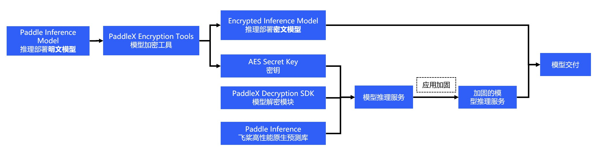

# Model encryption deployment

PaddleX provides a lightweight model encryption deployment solution to encrypt inference models through PaddleX's built-in model encryption tool. The Prediction Deployment SDK supports direct loading of cryptographic models and implements the inference to enhance the security of AI model deployment.

**The encryption solution currently supports Windows and Linux systems.**

## 1 Introduction to the solution

### 1.1 Introduction

(1) Selection of encryption algorithms and supported libraries

The OpenSSL library is generally used to support the encryption and decryption of data. The OpenSSL provides a large number of encryption and decryption algorithms, including symmetric encryption algorithms (for example, AES) and asymmetric encryption algorithms (for example, RSA).

The two algorithms are used in different scenarios. The asymmetric encryption algorithm is generally used in digital signature and key negotiation scenarios. The symmetric encryption algorithm is generally used in pure data encryption scenarios, and features better performance. The symmetric encryption algorithm is used in the encryption process of the model.

In the following model encryption scenario, AES symmetric encryption algorithm is used based on the development of a C/C++ library. In order to quickly determine whether the decryption is successful before and after encryption and decryption, AES-GCM encryption and decryption mode is used, with key data of a length of 256 bits.

(2) General steps to perform model protection:



The following is a description of the internal implementation of the provided C/C++ encryption/decryption library. Refer to the following steps to implement a set of encryption/decryption libraries to apply to your scenario, and to load into the Paddle Inference prediction library from memory data

> 1) With the consideration of loading data from memory after decrypting the encrypted model file, the conbine mode is used to generate the model file and parameter file.
> 
> 2) The project is integrated with OpenSSL in the use of the static library.
> 
> 3) Implement the AES algorithm interface, with the help of the EVP interface provided by OpenSSL, and specify the algorithm type in the EVP interface. The algorithm uses AES in the symmetric encryption and decryption algorithm. The encryption and decryption mode uses AES-GCM, the key length is 256 bits. For the implementation of AES-GCM, refer to the official example to encapsulate the interface: [AES-GCM implementation] (https://wiki.openssl.org/index.php/EVP_Authenticated_Encryption_and_Decryption).
> 
> 4) Use the OpenSSL library to implement SHA256 digest algorithm. The following part is useful (optional). For the SHA256 hash algorithm, refer to the example provided by OpenSSL: [OpenSSL info Digest example] (https://wiki.openssl.org/index.php/EVP_Message_Digests)
> 
> 5) In the model encryption, the data content of the model file and params file is encrypted directly and then saved to a new file. In order to distinguish and iterate the new file, header information is added in addition to the encrypted data. For example, use a fixed magic number as the file header to determine the file type; write the version number to show the difference to facilitate iterations later; store the encrypted key after SHA256 calculation in order to determine whether the same key is used when decrypting. These three parts constitute the header information of the currently encrypted file. The encrypted file contains the header information + key text information.
> 
> 6) In the model decryption, the relevant encrypted data is read into the memory according to the encrypted file. The memory data is decrypted using AES algorithm. Note that when decrypting, you need to use the same encryption algorithm and encryption mode as the encryption, as well as the data and length of the key. Otherwise, it causes data error after decryption.
> 
> 7) For the C/C++ library integrating the model prediction, the specific use of prediction usually involves paddle:: AnalysisConfig and paddle:: Predictor. In order to load the decrypted model plaintext data directly from the memory data (to avoid creating temporary files after the model is decrypted), the model loading function of AnalysisConfig needs to be replaced from SetModel to SetModelBuffer. This method can realize that model data is loaded from memory.

Note that in this solution, the key is integrated in the code of the upper-level prediction service. Therefore, the security strength of the model is equal to the strength of the code against reverse debugging. In order to protect the security of the key and model, the developer also needs to harden and protect the application. Common application hardening methods include code obfuscation, binary file shelling, and so on. Alternatively, change the encryption mechanism to AES white box encryption technology to protect the key. There are a large number of commercial and open source products available in the technology field. The details are not described here.

### 1.2 Encryption tools

[For the Linux-based PaddleX model encryption tool](https://bj.bcebos.com/paddlex/tools/1.2.0/paddlex-encryption.zip), the compiling script automatically downloads this version of the encryption tool. You can also choose to download manually.

[For the Windows-based PaddleX model encryption tool](https://bj.bcebos.com/paddlex/tools/win/1.2.0/paddlex-encryption.zip), this version of the encryption tool needs to be downloaded manually. If you already downloaded the tool during the compilation of C++ prediction codes using Visual Studio 2019, you do not need to repeat the download here.

The Linux encryption tool contains the following:
```
paddlex-encryption
├── include # header file: paddle_model_decrypt.h (decrypt) and paddle_model_encrypt.h (encrypt) 
| 
├── lib # libpmodel-encrypt.so and libpmodel-decrypt.so dynamic libraries 
| 
└── tool # paddle_encrypt_tool
```

The Windows encryption tool contains the following:
```
paddlex-encryption 
├── include # header file: paddle_model_decrypt.h (decrypt) and paddle_model_encrypt.h (encrypt)
|
├─ lib # pmodel-encrypt.dll and pmodel-decrypt.dll dynamic libraries pmodel-encrypt.lib and pmodel-encrypt.lib static libraries
| 
└── tool # paddle_encrypt_tool.exe Model Encryption Tool
```
### 1.3 Encrypting the PaddleX model

After encrypting the model, the encryption tool generates a random key (used for AES encryption and decryption). It is used for decryption when the encryption is deployed later.
> The key is composed of 32-byte key + 16-byte iv. Note that the key is base64 encoded to extend the range of key selection.

Linux platform:
```
# Assume that the model is under /root/projects 
/paddlex-encryption/tool/paddle_encrypt_tool -model_dir /root/projects/paddlex_inference_model -save_dir /root/projects/paddlex_encrypted_model
```

Windows platform:
```
# Assume that the model is under D:/projects
\paddlex-encryption\tool\paddle_encrypt_tool.exe -model_dir D:\projects\paddlex_inference_model -save_dir D:\projects\paddlex_encrypted_model
```

`-model_dir`: Specify the inference model path (refer to [Export inference model](../export_model.md) to export the model to an inference format model). You can use the `inference_model` exported from the export of the [DUDU recognition model](../export_model.md). After the encryption is completed, the encrypted model is saved to the specified `-save_dir`, including the files `__model__.encrypted`, `__params__.encrypted` and `model.yml`. The key is generated at the same time. The command output is shown in the following figure. The key is `kLAl1qOs5uRbFt0/RrIDTZW2+tOf5bzvUIaHGF8lJ1c=`


## 2 PaddleX C++ Encryption Deployment

### 2.1 Using the Linux platform
Refer to the [Linux platform compilation guide](cpp/linux.md) to compile C++ deployment code. After successful compiling, the executables for the predicted demo are `build/demo/detector`, `build/demo/classifier`, and `build/demo/segmenter`. You can choose according to their model types. The main command parameters are described below.

| Parameters | Description |
|  ----  | ----  |
| model_dir | The path of the exported prediction model |
| image | The path of the image file to be predicted |
| image_list | .txt file of storing image paths by line |
| use_gpu | Whether to use GPU prediction (value is 0 (default) or 1) |
| use_trt | Whether to use TensorRT for prediction, the value is 0 or 1 (the default value is 0) |
| gpu_id | GPU device ID (default value is 0) |
| save_dir | The path to save the visualization result. The default value is "output", and classifier has no such parameter. |
| key | Key information generated during the encryption process, default value is "" the unencrypted model is loaded. |
| batch_size | Prediction batch size, default is 1 |
| thread_num | Number of predicted threads. By default, it is the number of CPU processors |
| use_ir_optim | Whether to use a graph optimization policy, the value is 0 or 1 (default value is 1, default value for image segmentation is 0) |


### Example

Predictions can be made using a test image [exported from the DUDU recognition model] (../export_model.md).

#### Example 1:

Not using `GPU` test images: `/root/projects/images/xiaoduxiong.jpeg`

```shell
./build/demo/detector --model_dir=/root/projects/paddlex_encrypted_model --image=/root/projects/xiaoduxiong.jpeg --save_dir=output --key=kLAl1qOs5uRbFt0/RrIDTZW2+tOf5bzvUIaHGF8lJ1c=
```
`--key`: pass in the key output from the encryption tool, for example, `kLAl1qOs5uRbFt0/RrIDTZW2+tOf5bzvUIaHGF8lJ1c=`, the image file visual prediction result will be saved in the directory where the `save_dir` parameter is set.


#### Example 2:

Using the `GPU` to predict multiple images `/root/projects/image_list.txt`. The content of image_list.txt is in the following format:
```
/root/projects/images/xiaoduxiong1.jpeg
/root/projects/xiaoduxiong2.jpeg
```
/root/projects/xiaoduxiongn.jpeg
```shell
./build/demo/detector --model_dir=/root/projects/models/paddlex_encrypted_model --image_list=/root/projects/images_list.txt --use_gpu=1 --save_dir=output --key=kLAl1qOs5uRbFt0/RrIDTZW2+tOf5bzvUIaHGF8lJ1c=
```
`--key`: pass in the key output from the encryption tool, for example, `kLAl1qOs5uRbFt0/RrIDTZW2+tOf5bzvUIaHGF8lJ1c=`, the image file `visual prediction result` will be saved in the directory where the `save_dir` parameter is set.

### 2.2 Using Windows platform
Refer to the [compilation guide of Windows platform] (cpp/windows.md). You need to download the Windows PaddleX encryption tool compression package, decompress it, and check WITH_ENCRYPTION in the CMake settings based on the compilation process of the compilation guide. Set ENCRYPTION_DIR to the directory after the encryption tool package is decompressed, and then carry out the compiling. The parameters are consistent with those in the Linux prediction deployment. The entry programs for the prediction demo are paddlex_inference\detector.exe, paddlex_inference\classifier.exe, and paddlex_inference\segmenter.exe.

### Example

Predictions can be made using a test image exported from the DUDU recognition model.[](../export_model.md)

#### Example 1:

Test a single image without using the `GPU`. For example, the image is `D:\images\xiaoduxiong.jpeg`, and the model directory after encryption is `D:\projects\paddlex_encrypted_model` 

```shell
.\paddlex_inference\detector.exe --model_dir=D:\projects\paddlex_encrypted_model --image=D:\images\xiaoduxiong.jpeg --save_dir=output --key=kLAl1qOs5uRbFt0/RrIDTZW2+tOf5bzvUIaHGF8lJ1c=
```
`--key`: pass in the key output from the encryption tool, for example, `kLAl1qOs5uRbFt0/RrIDTZW2+tOf5bzvUIaHGF8lJ1c=`, the image file visual prediction result will be saved in the directory where the `save_dir` parameter is set.


#### Example 2:

Using the `GPU` to predict the image list`, for example, the image list is `D:\projects\`image_list.txt` and the content of `image_list.txt` is as follows. 
```
D:\projects\images\xiaoduxiong1.jpeg
D:\projects\images\xiaoduxiong2.jpeg
...
D:\projects\images\xiaoduxiongn.jpeg
```

Model directory after encryption: `D:\projects\paddlex_encrypted_model `

```
.\paddlex_inference\detector.exe --model_dir=D:\projects\paddlex_encrypted_model --image_list=D:\projects\images_list.txt --use_gpu=1 --save_dir=output --key=kLAl1qOs5uRbFt0/RrIDTZW2+tOf5bzvUIaHGF8lJ1c=
```
`--key`: pass in the key output from the encryption tool, for example, `kLAl1qOs5uRbFt0/RrIDTZW2+tOf5bzvUIaHGF8lJ1c=`, the image file `visual prediction result` will be saved in the directory where the `save_dir` parameter is set.
