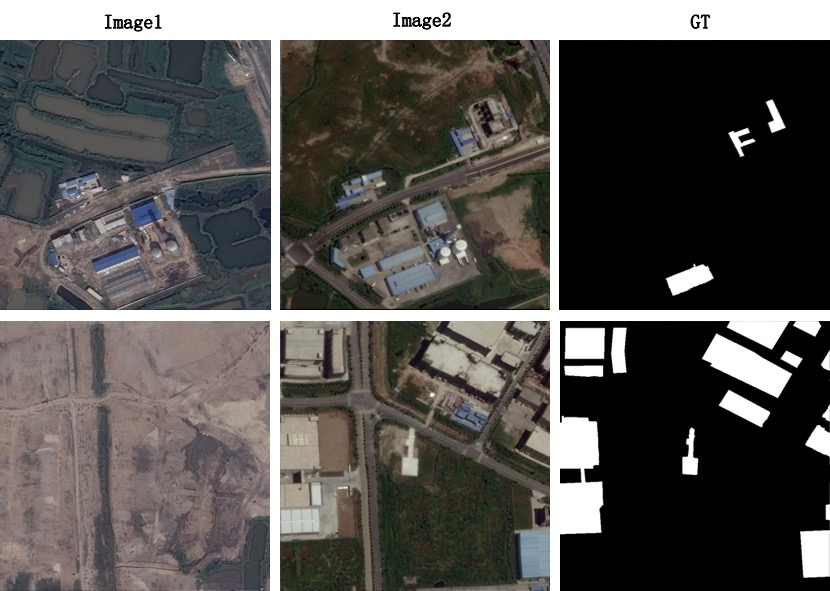
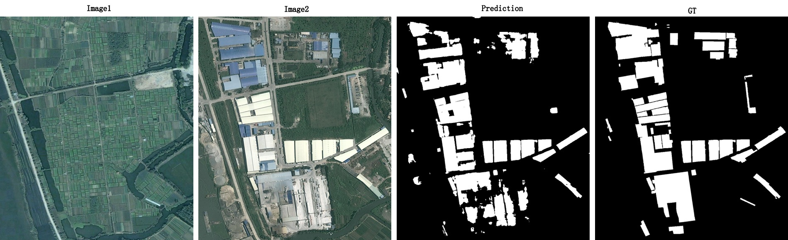

# 地块变化检测

本案例基于PaddleX实现地块变化检测，将同一地块的前期与后期两张图片进行拼接，而后输入给语义分割网络进行变化区域的预测。在训练阶段，使用随机缩放尺寸、旋转、裁剪、颜色空间扰动、水平翻转、竖直翻转多种数据增强策略。在验证和预测阶段，使用滑动窗口预测方式，以避免在直接对大尺寸图片进行预测时显存不足的发生。

#### 前置依赖

* Paddle paddle >= 1.8.4
* Python >= 3.5
* PaddleX >= 1.3.0

安装的相关问题参考[PaddleX安装](../install.md)

下载PaddleX源码:

```
git clone https://github.com/PaddlePaddle/PaddleX
```

该案例所有脚本均位于`PaddleX/examples/change_detection/`，进入该目录：

```
cd PaddleX/examples/change_detection/
```

## 数据准备

本案例使用[Daifeng Peng等人](https://ieeexplore.ieee.org/document/9161009)开放的[Google Dataset](https://github.com/daifeng2016/Change-Detection-Dataset-for-High-Resolution-Satellite-Imagery), 该数据集涵盖了广州部分区域于2006年至2019年期间的房屋建筑物的变化情况，用于分析城市化进程。一共有20对高清图片，图片有红、绿、蓝三个波段，空间分辨率为0.55m，图片大小有1006x1168至4936x5224不等。

由于Google Dataset仅标注了房屋建筑物是否发生变化，因此本案例是二分类变化检测任务，可根据实际需求修改类别数量即可拓展为多分类变化检测。

本案例将15张图片划分入训练集，5张图片划分入验证集。由于图片尺寸过大，直接训练会发生显存不足的问题，因此以滑动窗口为(1024，1024)、步长为(512, 512)对训练图片进行切分，切分后的训练集一共有743张图片。以滑动窗口为(769, 769)、步长为(769，769)对验证图片进行切分，得到108张子图片，用于训练过程中的验证。

运行以下脚本，下载原始数据集，并完成数据集的切分：

```
python prepare_data.py
```

切分后的数据示意如下：




**注意：**

* tiff格式的图片PaddleX统一使用gdal库读取，gdal安装可参考[文档](https://paddlex.readthedocs.io/zh_CN/develop/examples/multi-channel_remote_sensing/README.html#id2)。若数据是tiff格式的三通道RGB图像，如果不想安装gdal，需自行转成jpeg、bmp、png格式图片。

* label文件需为单通道的png格式图片，且标注从0开始计数，标注255表示该类别不参与计算。例如本案例中，0表示`unchanged`类，1表示`changed`类。

## 模型训练

由于数据量较小，分割模型选择较好兼顾浅层细节信息和深层语义信息的UNet模型。运行以下脚本，进行模型训练：

```
python train.py
```

本案例使用0,1,2,3号GPU卡完成训练，可根据实际显存大小更改训练脚本中的GPU卡数量和`train_batch_size`的设置值，按`train_batch_size`的调整比例相应地调整学习率`learning_rate`，例如`train_batch_size`由16减少至8时，`learning_rate`则由0.1减少至0.05。此外，不同数据集上能获得最优精度所对应`learning_rate`可能有所不同，可以尝试调整。

也可以跳过模型训练步骤，直接下载预训练模型进行后续的模型评估和预测：

```
wget https://bj.bcebos.com/paddlex/examples/change_detection/models/google_change_det_model.tar.gz
tar -xvf google_change_det_model.tar.gz
```

## 模型评估

在训练过程中，每隔10个迭代轮数会评估一次模型在验证集的精度。由于已事先将原始大尺寸图片切分成小块，相当于使用无重叠的滑动窗口预测方式，最优模型精度:

| mean_iou | category__iou | overall_accuracy | category_accuracy | category_F1-score | kappa |
| -- | -- | -- | -- | --| -- |
| 84.24% | 97.54%、70.94%| 97.68% | 98.50%、85.99% | 98.75%、83% | 81.76% |

category分别对应`unchanged`和`changed`两类。

运行以下脚本，将采用有重叠的滑动窗口预测方式，重新评估原始大尺寸图片的模型精度，此时模型精度为：

| mean_iou | category__iou | overall_accuracy | category_accuracy | category_F1-score | kappa |
| -- | -- | -- | -- | --| -- |
| 85.33% | 97.79%、72.87% | 97.97% | 98.66%、87.06% | 98.99%、84.30% | 83.19% |


```
python eval.py
```

滑动窗口预测接口说明详见[API说明](https://paddlex.readthedocs.io/zh_CN/develop/apis/models/semantic_segmentation.html#overlap-tile-predict)，已有的使用场景可参考[RGB遥感分割案例](https://paddlex.readthedocs.io/zh_CN/develop/examples/remote_sensing.html#id4)。可根据实际显存大小修改评估脚本中`tile_size`，`pad_size`和`batch_size`。

## 模型预测

执行以下脚本，使用有重叠的滑动预测窗口对验证集进行预测。可根据实际显存大小修改评估脚本中`tile_size`，`pad_size`和`batch_size`。

```
python predict.py
```

预测可视化结果如下图所示:


