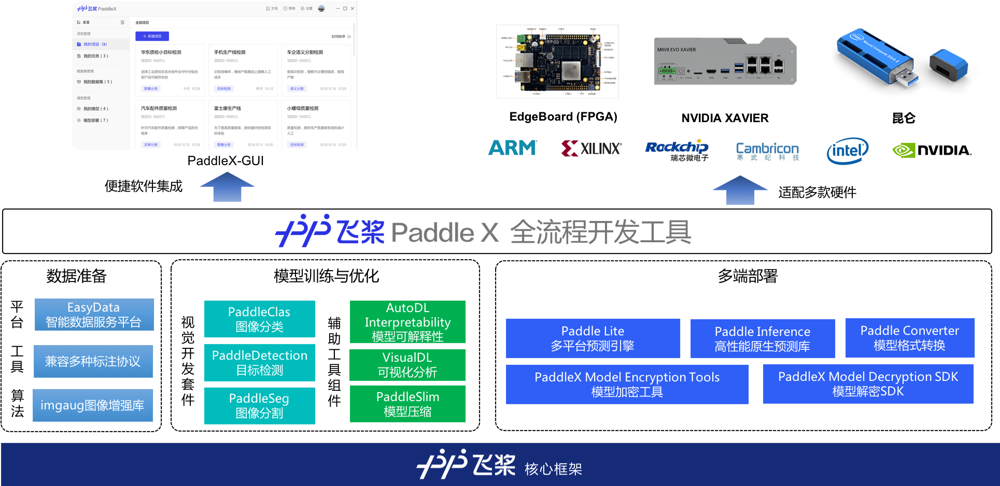

产业案例集
=======================================

PaddleX精选飞桨视觉开发套件在产业实践中的成熟模型结构，提供统一易用的全流程API和模型部署SDK，打通模型在各种硬件设备上的部署流程，开放从模型训练到多端安全部署的全流程案例实践教程。

.. toctree::
   :maxdepth: 2
   :caption: 文档目录:

   solutions.md
   meter_reader.md
   human_segmentation.md
   multi-channel_remote_sensing/README.md
   remote_sensing.md
   change_detection.md
