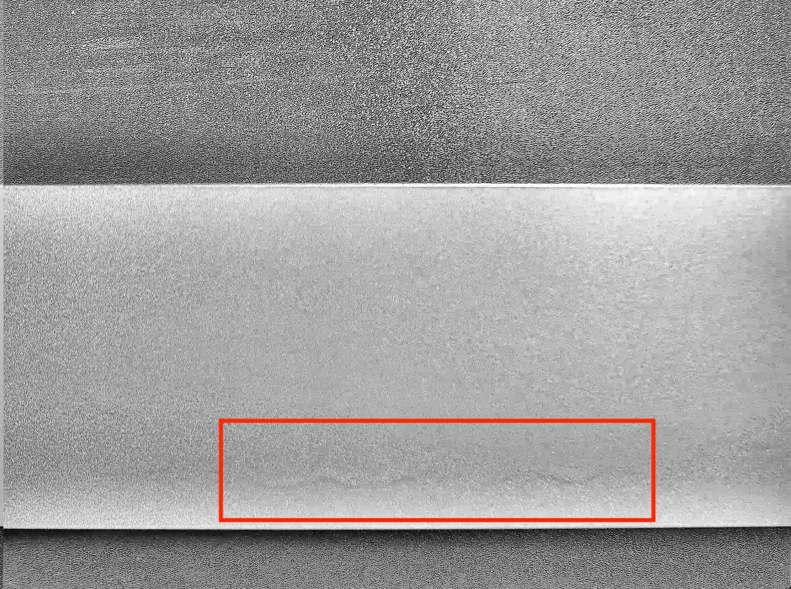

# Precision Optimization

本小节侧重展示在模型迭代过程中优化精度的思路，在本案例中，有些优化策略获得了精度收益，而有些没有。在其他质检场景中，可根据实际情况尝试这些优化策略。

## (1) Baseline model selection

相较于单阶段检测模型，二阶段检测模型的精度更高但是速度更慢。考虑到是部署到GPU端，本案例选择二阶段检测模型FasterRCNN作为基线模型，其骨干网络选择ResNet50_vd，并使用基于PaddleClas中SSLD蒸馏方案训练得到的ResNet50_vd预训练模型(ImageNet1k验证集上Top1 Acc为82.39%)。训练完成后，模型在验证集上的精度VOC mAP为73.36%。

## (2) Model effect analysis

使用PaddleX提供的[paddlex.det.coco_error_analysis](https://paddlex.readthedocs.io/zh_CN/develop/apis/visualize.html#paddlex-det-coco-error-analysis)接口对模型在验证集上预测错误的原因进行分析，分析结果以图表的形式展示如下：

| all classes| 擦花 | 杂色 | 漏底 | 不导电 | 桔皮 | 喷流 | 漆泡 | 起坑 | 脏点 | 角位漏底 |
| -- | -- | -- | -- | -- | -- | -- | -- | -- | -- | -- |
|  |  |  |  |  |  |  |  |  |  |  |

分析图表展示了7条Precision-Recall（PR）曲线，每一条曲线表示的Average Precision （AP）比它左边那条高，原因是逐步放宽了评估要求。以擦花类为例，各条PR曲线的评估要求解释如下：

* C75: 在IoU设置为0.75时的PR曲线, AP为0.001。
* C50: 在IoU设置为0.5时的PR曲线，AP为0.622。C50与C75之间的白色区域面积代表将IoU从0.75放宽至0.5带来的AP增益。
* Loc: 在IoU设置为0.1时的PR曲线，AP为0.740。Loc与C50之间的蓝色区域面积代表将IoU从0.5放宽至0.1带来的AP增益。蓝色区域面积越大，表示越多的检测框位置不够精准。
* Sim: 在Loc的基础上，如果检测框与真值框的类别不相同，但两者同属于一个亚类，则不认为该检测框是错误的，在这种评估要求下的PR曲线, AP为0.742。Sim与Loc之间的红色区域面积越大，表示子类间的混淆程度越高。VOC格式的数据集所有的类别都属于同一个亚类。
* Oth: 在Sim的基础上，如果检测框与真值框的亚类不相同，则不认为该检测框是错误的，在这种评估要求下的PR曲线，AP为0.742。Oth与Sim之间的绿色区域面积越大，表示亚类间的混淆程度越高。VOC格式的数据集中所有的类别都属于同一个亚类，故不存在亚类间的混淆。
* BG: 在Oth的基础上，背景区域上的检测框不认为是错误的，在这种评估要求下的PR曲线，AP为92.1。BG与Oth之间的紫色区域面积越大，表示背景区域被误检的数量越多。
* FN: 在BG的基础上，漏检的真值框不认为是错误的，在这种评估要求下的PR曲线，AP为1.00。FN与BG之间的橙色区域面积越大，表示漏检的真值框数量越多。

从分析图表中可以看出，杂色、桔皮、起坑三类检测效果较好，角位漏底存在少许检测框没有达到IoU 0.5的情况，问题较多的是擦花、不导电、喷流、漆泡、脏点。擦花类最严重的问题是误检、位置不精准、漏检，不导电类最严重的问题是漏检、位置不精准，喷流类和漆泡类最严重的问题是位置不精准、误检，脏点类最严重的问题是误检、漏检。为进一步理解造成这些问题的原因，将验证集上的预测结果进行了可视化，然后发现数据集标注存在以下问题：

* 轻微的缺陷不视为缺陷，但轻微的界定不明确，有些轻微的缺陷被标注了，造成误检较多
* 不导电、漏底、角位漏底外观极其相似，肉眼难以区分，导致这三类极其容易混淆而使得评估时误检或漏检的产生
* 有些轻微的擦花和脏点被标注了，有些明显的反而没有被标注，造成了这两类误检和漏检情况都较为严重
* 喷流和漆泡多为连续性的缺陷，一处喷流，其水平线上还会有其他喷流，一个气泡，其水平线上还会有一排气泡。但有时候把这些连续性的缺陷标注成一个目标，有时候又单独地标注不同的部分。导致模型有时候检测单独部分，有时候又检测整体，造成这两类位置不精准、误检较多。

## (3) Data review

为了减少原始数据标注的诸多问题对模型优化的影响，需要对数据进行复核。复核准则示例如下：

* 擦花：不明显的擦花不标注，面状擦花以同一个框表示，条状擦花一条擦花以一个框表示
* 漏底、角位漏底、不导电：三者过于相似，归为一类
* 桔皮：忽略不是大颗粒状的表面
* 喷流：明显是一条喷流的就用一个框表示，不是的话用多个框表示
* 漆泡：不要单独标一个点，一连串点标一个框
* 脏点：忽略轻微脏点

对数据集复核并重新标注后，将FasterRCNN-ResNet50_vd_ssld重新在训练集上进行训练，模型在验证集上的VOC mAP为81.05%。

## (4) Deformable convolution join

由于喷流、漆泡的形态不规则，导致这两类的很多预测框位置不精准。为了解决该问题，选择在骨干网络ResNet50_vd中使用可变形卷积(DCN)。重新训练后，模型在验证集上的VOC mAP为88.09%，喷流的VOC AP由57.3%提升至78.7%，漆泡的VOC AP由74.7%提升至96.7%。

## (5) Data enhancement options

在(4)的基础上，选择加入一些数据增强策略来进一步提升模型的精度。本案例选择同时使用[RandomHorizontalFlip](https://paddlex.readthedocs.io/zh_CN/develop/apis/transforms/det_transforms.html#randomhorizontalflip)、[RandomDistort](https://paddlex.readthedocs.io/zh_CN/develop/apis/transforms/det_transforms.html#randomdistort)、[RandomCrop](https://paddlex.readthedocs.io/zh_CN/develop/apis/transforms/det_transforms.html#randomcrop)这三种数据增强方法，重新训练后的模型在验证集上的VOC mAP为90.23%。

除此之外，还可以尝试的数据增强方式有[MultiScaleTraining](https://paddlex.readthedocs.io/zh_CN/develop/apis/transforms/det_transforms.html#resizebyshort)、[RandomExpand](https://paddlex.readthedocs.io/zh_CN/develop/apis/transforms/det_transforms.html#randomexpand)。本案例使用的铝材表面缺陷检测数据集中，同一个类别的尺度变化不大，使用MultiScaleTraining或者RandomExpand反而使得原始数据分布发生改变。对此，本案例也进行了实验验证，使用RandomHorizontalFlip + RandomDistort + RandomCrop + MultiScaleTraining数据增强方式训练得到的模型在验证集上的VOC mAP为87.15%，使用RandomHorizontalFlip + RandomDistort + RandomCrop + RandomExpand数据增强方式训练得到的模型在验证集上的的VOC mAP为88.56%。

## (6) Background image added

本案例将数据集中提供的背景图片按9:1切分成了1116张、135张两部分，并使用(5)中训练好的模型在135张背景图片上进行测试，发现图片级误检率高达21.5%。为了降低模型的误检率，使用[paddlex.datasets.VOCDetection.add_negative_samples](https://paddlex.readthedocs.io/zh_CN/develop/apis/datasets.html#add-negative-samples)接口将1116张背景图片加入到原本的训练集中，重新训练后图片级误检率降低至4%。为了不让训练被背景图片主导，本案例通过将`train_list.txt`中的文件路径多写了一遍，从而增加有目标图片的占比。

| 模型 | VOC mAP (%) | 有缺陷图片级召回率 | 背景图片级误检率 |
| -- | -- | -- | -- |
| FasterRCNN-ResNet50_vd_ssld + DCN + RandomHorizontalFlip + RandomDistort + RandomCrop | 90.23 | 95.5 | 21.5 |
| FasterRCNN-ResNet50_vd_ssld + DCN + RandomHorizontalFlip + RandomDistort + RandomCrop + 背景图片 | 88.87 | 95.2 | 4 |

【名词解释】

* 图片级别的召回率：只要在有目标的图片上检测出目标（不论框的个数），该图片被认为召回。批量有目标图片中被召回图片所占的比例，即为图片级别的召回率。
* 图片级别的误检率：只要在无目标的图片上检测出目标（不论框的个数），该图片被认为误检。批量无目标图片中被误检图片所占的比例，即为图片级别的误检率。

## (7) Selection of classification loss function

降低误检率的措施除了(6)中提到的将背景图片加入训练，还可以将RPN部分的分类损失函数选择为`SigmoidFocalLoss`，将更多的anchors加入训练，增加难分样本的在损失函数的比重进而降低误检率。在定义模型[FasterRCNN](https://paddlex.readthedocs.io/zh_CN/develop/apis/models/detection.html#paddlex-det-fasterrcnn)类时将参数`rpn_cls_loss`设置为'SigmoidFocalLoss'，同时需要调整参数`rpn_focal_loss_alpha`、`rpn_focal_loss_gamma`、`rpn_batch_size_per_im`、`rpn_fg_fraction`的设置。

## (8) Selection of loss function in position regression

RCNN部分的位置回归损失函数除了'SmoothL1Loss'以外，还可以选择'CIoULoss'，使用方式在定义模型[FasterRCNN](https://paddlex.readthedocs.io/zh_CN/develop/apis/models/detection.html#paddlex-det-fasterrcnn)类时设置参数`rcnn_bbox_loss`即可。在本案例中，选择'CIoULoss'并没有带来精度收益，故还是选择'SmoothL1Loss'。其他质检场景下，也可尝试使用'CIoULoss'。

## (9) Selection of positive and negative sampling methods

当目标物体的区域只占图像的一小部分时，可以考虑采用[LibraRCNN](https://arxiv.org/abs/1904.02701)中提出的IoU-balanced Sampling采样方式来获取更多的难分负样本。使用方式在定义模型[FasterRCNN](https://paddlex.readthedocs.io/zh_CN/develop/apis/models/detection.html#paddlex-det-fasterrcnn)类时将参数`bbox_assigner`设置为'LibraBBoxAssigner'即可。

## (10) Contrast enhancement in pretreatment

工业界常用灰度相机采集图片，会存在目标与周围背景对比度不明显而无法被检测出的情况。在这种情况下，可以在定义预处理的时候使用[paddlex.det.transforms.CLAHE](https://paddlex.readthedocs.io/zh_CN/develop/apis/transforms/det_transforms.html#clahe)对灰度图像的对比度进行增强。

灰度图：

对比度增加后的灰度图:

 |

## (11) Sample generation

对于数量较少的类别或者小目标，可以通过把这些目标物体粘贴在背景图片上来生成新的图片和标注文件，并把这些新的样本加入到训练中从而提升模型精度。目前PaddleX提供了实现该功能的接口，详细见[paddlex.det.paste_objects](https://paddlex.readthedocs.io/zh_CN/develop/apis/tools.html#paddlex-det-paste-objects)，需要注意的是，前景目标颜色与背景颜色差异较大时生成的新图片才会比较逼真。
