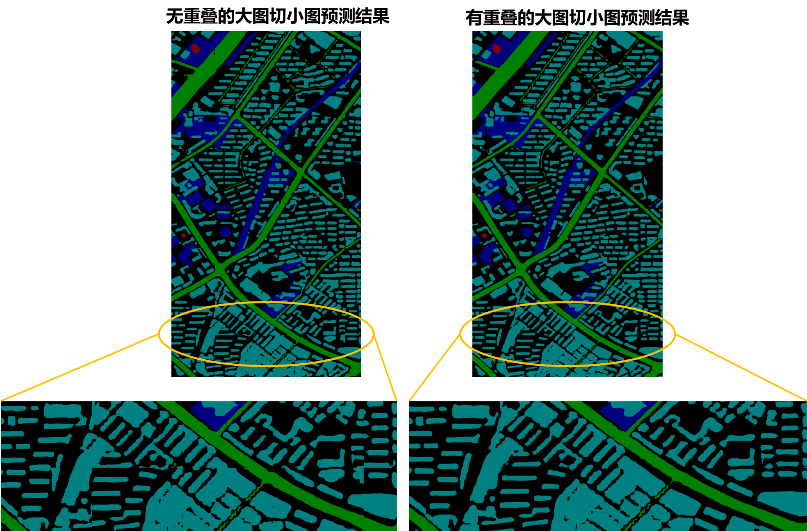

# 遥感影像分割

本案例基于PaddleX实现遥感影像分割，提供无重叠的大图切小图以及有重叠的大图切小图两种预测方式。

## 前置依赖

* Paddle paddle >= 1.8.4
* Python >= 3.5
* PaddleX >= 1.1.0

安装的相关问题参考[PaddleX安装](../install.md)

下载PaddleX源码:

```
git clone https://github.com/PaddlePaddle/PaddleX
```

该案例所有脚本均位于`PaddleX/examples/remote_sensing/`，进入该目录：

```
cd PaddleX/examples/remote_sensing/
```

## 数据准备

本案例使用2015 CCF大数据比赛提供的高清遥感影像，包含5张带标注的RGB图像，图像尺寸最大有7969 × 7939、最小有4011 × 2470。该数据集共标注了5类物体，分别是背景（标记为0）、植被（标记为1）、建筑（标记为2）、水体（标记为3）、道路 （标记为4）。

本案例将前4张图片划分入训练集，第5张图片作为验证集。为增加训练时的批量大小，以滑动窗口为(1024，1024)、步长为(512, 512)对前4张图片进行切分，加上原本的4张大尺寸图片，训练集一共有688张图片。直接对大图片进行验证会导致显存不足，为避免此类问题的出现，针对验证集，以滑动窗口为(769, 769)、步长为(769，769)对第5张图片进行切分，得到40张子图片。

运行以下脚本，下载原始数据集，并完成数据集的切分：

```
python3 prepare_data.py
```

## 模型训练

分割模型选择Backbone为MobileNetv3_large_ssld的Deeplabv3模型，该模型兼备高性能高精度的优点。运行以下脚本，进行模型训练：
```
python3 train.py
```

## 模型预测

直接对大图片进行预测会导致显存不足，为避免此类问题的出现，本案例提供了两种预测方式：无重叠的大图切小图和有重叠的大图切小图。

* 无重叠的大图切小图

将大图像切分成互不重叠多个小块，分别对每个小块进行预测，最后将小块预测结果拼接成大图预测结果。由于每个小块边缘部分的预测效果会比中间部分的差，因此每个小块拼接处可能会有明显的裂痕感。

该预测方式的API接口详见[tile_predict](../apis/models/semantic_segmentation.html#tile-predict)。

* 有重叠的大图切小图

Unet论文作者提出一种有重叠的大图切小图策略（Overlap-tile strategy）来消除拼接处的裂痕感。每次划分小块时向四周扩展面积，例如下图中的蓝色部分区域，到拼接大图时取小块中间部分的预测结果，例如下图中的黄色部分区域，对于处于原始图像边缘处的小块，其扩展面积下的像素则通过将边缘部分像素镜像填补得到。

该预测方式的API接口说明详见[overlap_tile_predict](../apis/models/semantic_segmentation.html#overlap-tile-predict)。


相比无重叠的大图切小图，有重叠的大图切小图策略将本案例的模型精度miou从80.58%提升至81.52%，并且将预测可视化结果中裂痕感显著消除，可见下图中两种预测方式的效果对比。



运行以下脚本使用有重叠的大图切小图预测方式进行预测。如需使用无重叠的大图切小图的预测方式，参考以下脚本中的注释修改模型预测接口：
```
python3 predict.py
```

## 模型评估

在训练过程中，每隔10个迭代轮数会评估一次模型在验证集的精度。由于已事先将原始大尺寸图片切分成小块，此时相当于使用无重叠的大图切小图预测方式，最优模型精度miou为80.58%。运行以下脚本，将采用有重叠的大图切小图的预测方式，重新评估原始大尺寸图片的模型精度，此时miou为81.52%。
```
python3 eval.py
```
