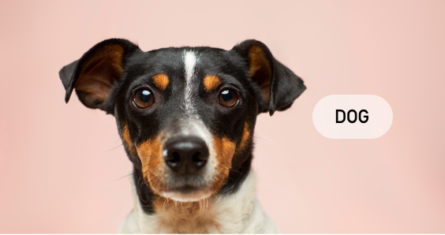
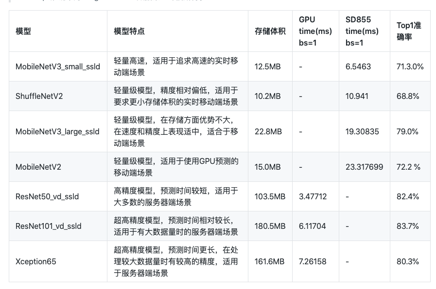
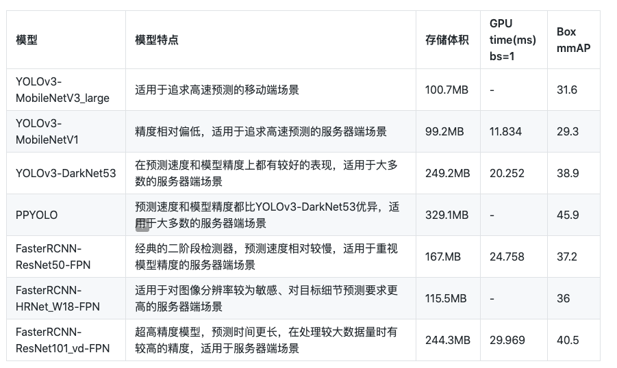
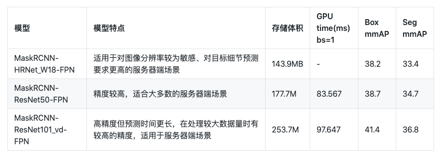
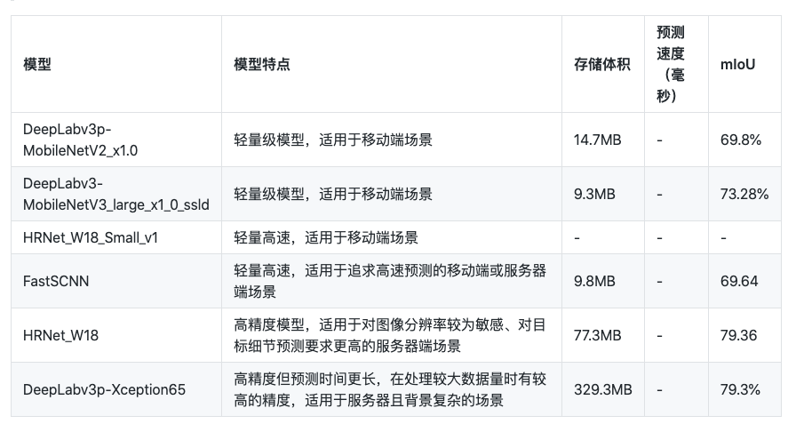

# PaddleX模型介绍

PaddleX针对图像分类、目标检测、实例分割和语义分割4种视觉任务提供了丰富的模型算法，用户根据在实际场景中的需求选择合适的模型。

## 图像分类
图像分类任务指的是输入一张图片，模型预测图片的类别，如识别为风景、动物、车等。

对于图像分类任务，针对不同的应用场景，PaddleX提供了百度改进的模型，见下表所示:

> * GPU预测速度的评估环境基于T4机器，在FP32+TensorRT配置下运行500次测得（去除前10次的warmup时间）。
> * CPU预测速度的的评估环境基于骁龙855（SD855）。
> * Top1准确率为ImageNet-1000数据集上评估所得。

包括上述模型，PaddleX支持近20种图像分类模型，其余模型可参考[PaddleX模型库](../appendix/model_zoo.md)

## 目标检测
目标检测任务指的是输入图像，模型识别出图像中物体的位置（用矩形框框出来，并给出框的位置），和物体的类别，如在手机等零件质检中，用于检测外观上的瑕疵等。

对于目标检测，针对不同的应用场景，PaddleX提供了主流的YOLOv3模型和Faster-RCNN模型，见下表所示

> * GPU预测速度评估环境基于Tesla V100机器，在FP32+TensorRT配置下运行100次测得（去除前10次warmup时间)。
> * Box mmAP为MSCOCO数据集上评估所得。

除上述模型外，YOLOv3和Faster RCNN还支持其他backbone，详情可参考[PaddleX模型库](../appendix/model_zoo.md)

### 实例分割
在目标检测中，模型识别出图像中物体的位置和物体的类别。而实例分割则是在目标检测的基础上，做了像素级的分类，将框内的属于目标物体的像素识别出来。

PaddleX目前提供了实例分割MaskRCNN模型，支持5种不同的backbone网络，详情可参考[PaddleX模型库](../appendix/model_zoo.md)

> * GPU预测速度评估环境基于Tesla V100机器，在FP32+TensorRT配置下运行100次测得（去除前10次warmup时间)。
> * Box mmAP为MSCOCO数据集上评估所得。

## 语义分割
语义分割用于对图像做像素级的分类，应用在人像分类、遥感图像识别等场景。  

对于语义分割，PaddleX也针对不同的应用场景，提供了不同的模型选择，如下表所示

> * mIoU为Cityscapes数据集上评估所得。

