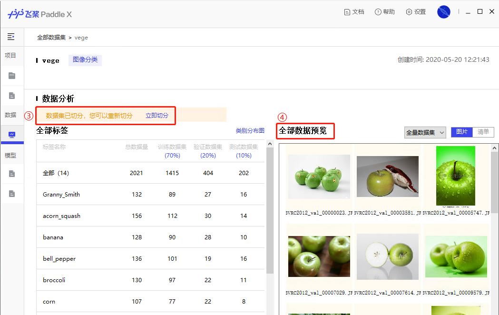
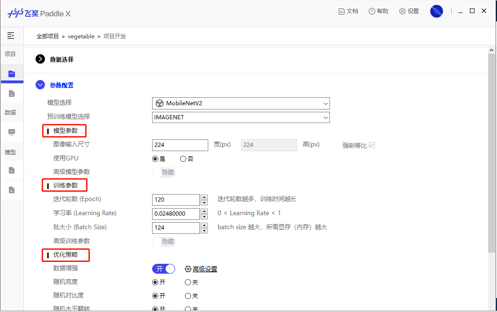
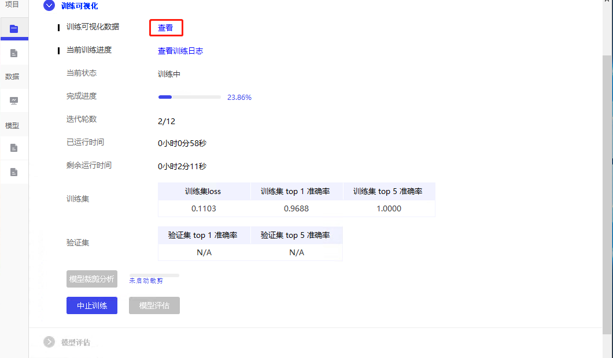
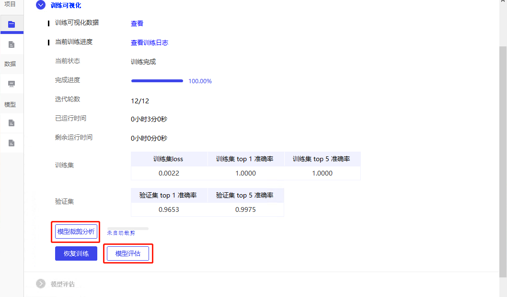
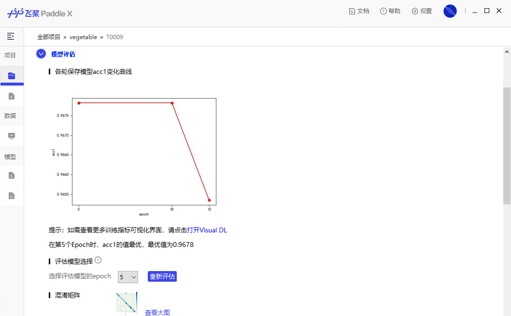

# 使用方法

*注：如果你的系统是 Mac OS 10.15.5及以上，在双击客户端icon后，需要在Terminal中执行 sudo xattr -r -d com.apple.quarantine /Users/username/PaddleX ，并稍等几秒来启动客户端，其中 /Users/username/PaddleX 为您保存PaddleX的文件夹路径*

## 准备和导入数据

**第一步: 准备数据**
在开始模型训练前，您需要根据不同的任务类型，将数据标注为相应的格式。目前PaddleX支持【图像分类】、【目标检测】、【语义分割】、【实例分割】四种任务类型。  
开发者可以参考PaddleX使用文档中的[2.数据准备-数据标注](../data/annotations/index.html)来进行数据标注和转换工作。 如若开发者自行准备数据，请注意数据格式与PaddleX支持四种数据格式是否一致。

**第二步：导入的据集**

①数据标注完成后，您需要根据不同的任务，将数据和标注文件，按照客户端提示更名并保存到正确的文件中。

②在客户端新建数据集，选择与数据集匹配的任务类型，并选择数据集对应的路径，将数据集导入。

③选定导入数据集后，客户端会自动校验数据及标注文件是否合规，校验成功后，您可根据实际需求，将数据集按比例划分为训练集、验证集、测试集。

④您可在「数据分析」模块按规则预览您标注的数据集，双击单张图片可放大查看。

## 创建项目和任务

**第一步：创建项目**

① 在完成数据导入后，您可以点击「新建项目」创建一个项目。

② 您可根据实际任务需求选择项目的任务类型，需要注意项目所采用的数据集也带有任务类型属性，两者需要进行匹配。

**第二步：项目开发**

① **数据选择**：项目创建完成后，您需要选择已载入客户端并校验后的数据集，并点击下一步，进入参数配置页面。

② **参数配置**：主要分为**模型参数**、**训练参数**、**优化策略**三部分。您可根据实际需求选择模型结构、骨架网络及对应的训练参数、优化策略，使得任务效果最佳。

## 任务模型训练

参数配置完成后，点击启动训练，模型开始训练并进行效果评估。

① **训练可视化**：在训练过程中，您可通过VisualDL查看模型训练过程参数变化、日志详情，及当前最优的训练集和验证集训练指标。模型在训练过程中通过点击"中止训练"随时中止训练过程。

模型训练结束后，可选择进入『模型剪裁分析』或者直接进入『模型评估』。

> 模型训练是最容易出错的步骤，经常遇到的原因为电脑无法联网下载预训练模型、显存不够。训练检测模型\实例分割模型对于显存要求较高，**建议用户通过在Windows/Mac/Ubuntu的命令行终端（Windows的Cmd命令终端）执行`nvidia-smi`命令**查看显存情况，请不要使用系统自带的任务管理器查看。  

## 任务模型裁剪训练

此步骤可选，模型裁剪训练相对比普通的任务模型训练，需要消耗更多的时间，需要在正常任务模型训练的基础上，增加『**模型裁剪分类**』和『**模型裁剪训练**』两个步骤。  

裁剪过程将对模型各卷积层的敏感度信息进行分析，根据各参数对模型效果的影响进行不同比例的裁剪，再进行精调训练获得最终裁剪后的模型。  
裁剪训练后的模型体积，计算量都会减少，并且可以提升模型在低性能设备的预测速度，如移动端，边缘设备，CPU。

在可视化客户端上，**用户训练好模型后**，在训练界面，
- 首先，点击『模型裁剪分析』，此过程将会消耗较长的时间
- 接着，点击『开始模型裁剪训练』，客户端会创建一个新的任务，无需修改参数，直接再启动训练即可

## 模型效果评估

在模型评估页面，您可查看训练后的模型效果。评估方法包括混淆矩阵、精度、召回率等。

您还可以选择『数据集切分』时留出的『测试数据集』或从本地文件夹中导入一张/多张图片，将训练后的模型进行测试。根据测试结果，您可决定是否将训练完成的模型保存为预训练模型并进入模型发布页面，或返回先前步骤调整参数配置重新进行训练。

## 模型发布

当模型效果满意后，您可根据实际的生产环境需求，选择将模型发布为需要的版本。  
> 如若要部署到移动端/边缘设备，对于部分支持量化的模型，还可以根据需求选择是否量化。量化可以压缩模型体积，提升预测速度

**如果您有任何问题或建议，欢迎以issue的形式，或加入PaddleX官方QQ群（1045148026）直接反馈您的问题和需求**

