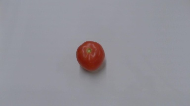

# PaddleX python轻量级服务化部署
## 简介
借助`PaddleHub-Serving`，可以将`PaddleX`的`Inference Model`进行快速部署，以提供在线预测的能力。

关于`PaddleHub Serving`的更多信息，可参照 [PaddleHub Serving](https://github.com/PaddlePaddle/PaddleHub/blob/release/v2.1/docs/docs_ch/tutorial/serving.md) 。

**注意：使用此方式部署，需确保自己Python环境中PaddleHub的版本高于2.1.0, 可在命令终端输入`pip show paddlehub`确认版本信息。**


下面，我们按照步骤，实现将一个图像分类模型 [MobileNetV3_small](https://bj.bcebos.com/paddlex/2.0/mobilenetv3_small.tar.gz) 转换成`PaddleHub`的预训练模型，并利用`PaddleHub-Serving`实现一键部署。


## 模型部署

### 1 部署模型准备
部署模型的格式均为目录下包含`model.pdmodel`，`model.pdiparams`和`model.yml`三个文件，如若不然，则参照[部署模型导出文档](./apis/export_model.md)进行导出。

### 2 模型转换
首先，我们将`PaddleX`的`Inference Model`转换成`PaddleHub`的预训练模型，使用命令`hub convert`即可一键转换，对此命令的说明如下：

```commandline
hub convert --model_dir XXXX \
            --module_name XXXX \
            --module_version XXXX \
            --output_dir XXXX
```
**参数**：

| 参数              | 用途                  |
| :---------------- | :---------------------- |
|--model_dir|`PaddleX Inference Model`所在的目录|
|--module_name|生成预训练模型的名称|
|--module_version|生成预训练模型的版本，默认为`1.0.0`|
|--output_dir|生成预训练模型的存放位置，默认为`{module_name}_{timestamp}`|

因此，我们仅需要一行命令即可完成预训练模型的转换。

```commandline
hub convert --model_dir mobilenetv3_small --module_name mobilenetv3_small_hub
```

转换成功后会打印提示信息，如下：
```commandline
The converted module is stored in `mobilenetv3_small_hub_1632637919.0820115`.
```
等待生成成功的提示后，我们就在输出目录中得到了一个`PaddleHub`的一个预训练模型。

### 3 模型安装
在模型转换一步中，我们得到了一个`.tar.gz`格式的预训练模型压缩包，在进行部署之前需要先安装到本机，使用命令`hub install`即可一键安装，对此命令的说明如下：
```shell
$ hub install ${MODULE}
```
其中${MODULE}为要安装的预训练模型文件路径。

因此，我们使用`hub install`命令安装：
```commandline
hub install mobilenetv3_small_hub_1632637919.0820115/mobilenetv3_small_hub.tar.gz
```
安装成功后会打印提示信息，如下：
```commandline
Successfully installed Successfully installed mobilenetv3_small_hub-1.0.0
```

### 4 模型部署
下面，我们只需要使用`hub serving`命令即可完成模型的一键部署，对此命令的说明如下：
```commandline
hub serving start --modules [Module1==Version1, Module2==Version2, ...] \
                  --port XXXX
                  --config XXXX
```

**参数**：

| 参数              | 用途                  |
| :---------------- | :---------------------- |
|--modules|PaddleHub Serving预安装模型，以多个Module==Version键值对的形式列出<br>*`当不指定Version时，默认选择最新版本`*|
|--port|服务端口，默认为8866|
|--config|使用配置文件配置模型|

因此，我们仅需要一行代码即可完成模型的部署，如下：

```commandline
hub serving start --modules mobilenetv3_small_hub
```
等待模型加载后，此预训练模型就已经部署在机器上了。

我们还可以使用配置文件对部署的模型进行更多配置，配置文件格式如下：
```json
{
  "modules_info": {
    "mobilenetv3_small_hub": {
      "init_args": {
        "version": "1.0.0"
      },
      "predict_args": {
        "topk": 3,
        "warmup_iters": 30,
        "repeats": 5
      }
    }
  },
  "port": 8866
}
```

| 参数              | 用途                  |
| :---------------- | :---------------------- |
|modules_info|PaddleHub Serving预安装模型，以字典列表形式列出，key为模型名称。其中:<br>`init_args`为模型加载时输入的参数，等同于`paddlehub.Module(**init_args)`<br>`predict_args`为模型预测时输入的参数，以`mobilenetv3_small_hub`为例，等同于`mobilenetv3_small_hub.predict(**predict_args)`
|port|服务端口，默认为8866|

### 5 测试
在第二步模型安装的同时，会生成一个客户端请求示例，存放在模型安装目录，默认为`${HUB_HOME}/.paddlehub/modules`，对于此例，我们可以在`~/.paddlehub/modules/mobilenetv3_small_hub`找到此客户端示例`serving_client_demo.py`，代码如下：

```python
# coding: utf8
import requests
import json
import cv2
import base64


def cv2_to_base64(image):
    data = cv2.imencode('.jpg', image)[1]
    return base64.b64encode(data.tostring()).decode('utf8')


if __name__ == '__main__':
    # 获取图片的base64编码格式
    img1 = cv2_to_base64(cv2.imread("IMAGE_PATH1"))
    img2 = cv2_to_base64(cv2.imread("IMAGE_PATH2"))
    data = {'images': [img1, img2]}
    # 指定content-type
    headers = {"Content-type": "application/json"}
    # 发送HTTP请求
    url = "http://127.0.0.1:8866/predict/mobilenetv3_small_hub"
    r = requests.post(url=url, headers=headers, data=json.dumps(data))

    # 打印预测结果
    print(r.json()["results"])
```
使用的测试图片如下：



将代码中的`IMAGE_PATH1`改成想要进行预测的图片路径后，在命令行执行：
```commandline
python ~/.paddlehub/modules/mobilenetv3_small_hub/serving_client_demo.py
```
即可收到预测结果，如下：
```commandline
[[{'category': 'xihongshi', 'category_id': 4, 'score': 0.9999966621398926}]]
```
**注意：**
 - 语义分割模型返回的`label_map`和`score_map`经过Base64编码处理，可通过如下方式解码：
```python
import base64
import numpy as np
import cv2


def base64_to_cv2(b64str):
    data = base64.b64decode(b64str.encode('utf8'))
    data = np.frombuffer(data, np.uint8)
    data = cv2.imdecode(data, cv2.IMREAD_COLOR)
    return data

def base64_to_np(b64tuple):
    data, shape = b64tuple
    data = base64.b64decode(data.encode('utf8'))
    data = np.frombuffer(data, np.float32).reshape(shape)
    return data

decoded_label_map = base64_to_cv2(label_map)
decoded_score_map = base64_to_np(score_map)
```

 - 实例分割模型返回的`mask`经过Base64编码处理，可通过如下方式解码：
```python
import base64
import numpy as np
import cv2


def base64_to_cv2(b64str):
    data = base64.b64decode(b64str.encode('utf8'))
    data = np.frombuffer(data, np.uint8)
    data = cv2.imdecode(data, cv2.IMREAD_COLOR)
    return data

decoded_mask = base64_to_cv2(mask)
```

到此，我们就完成了`PaddleX`模型的PaddleHub Serving一键部署。
