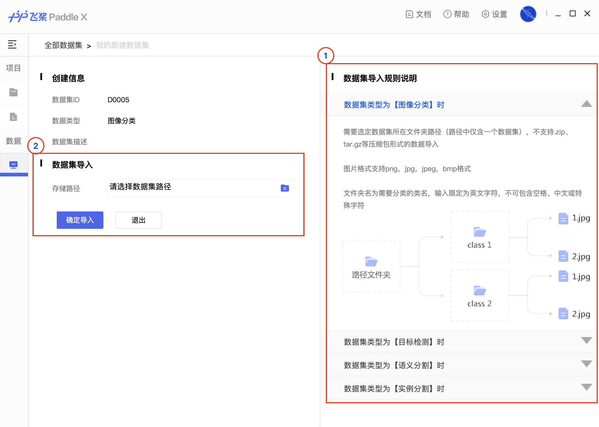
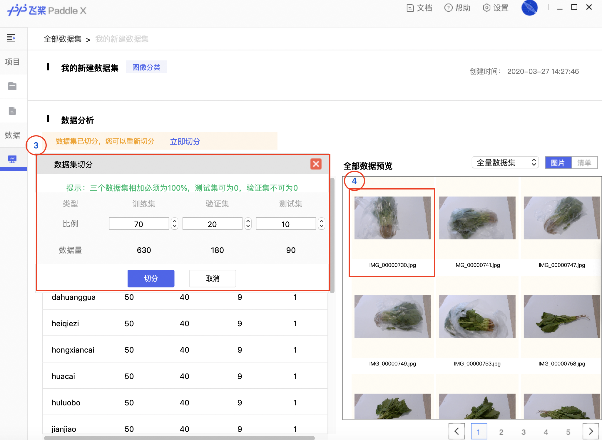
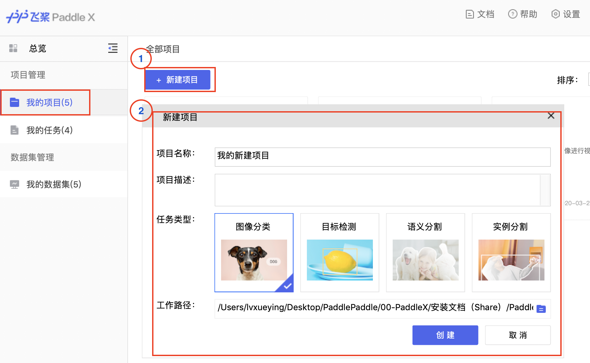
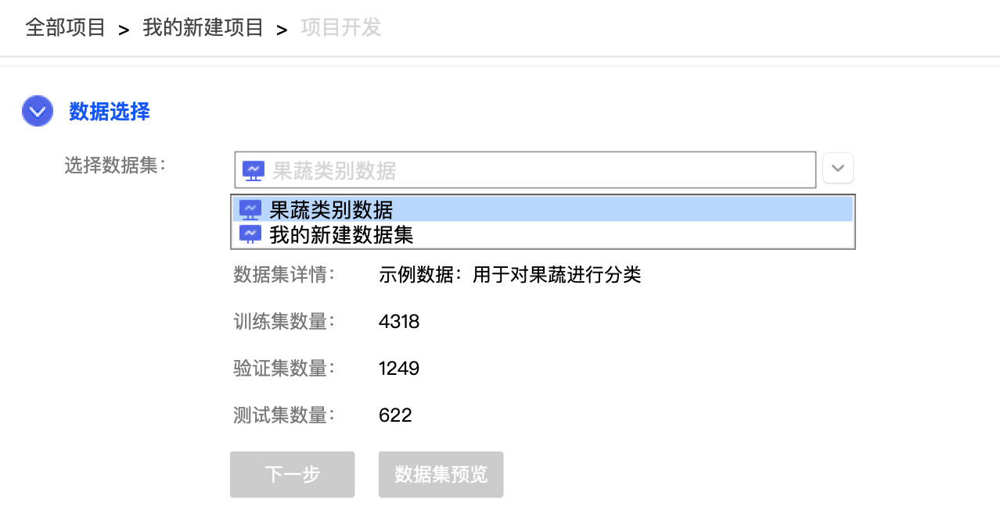
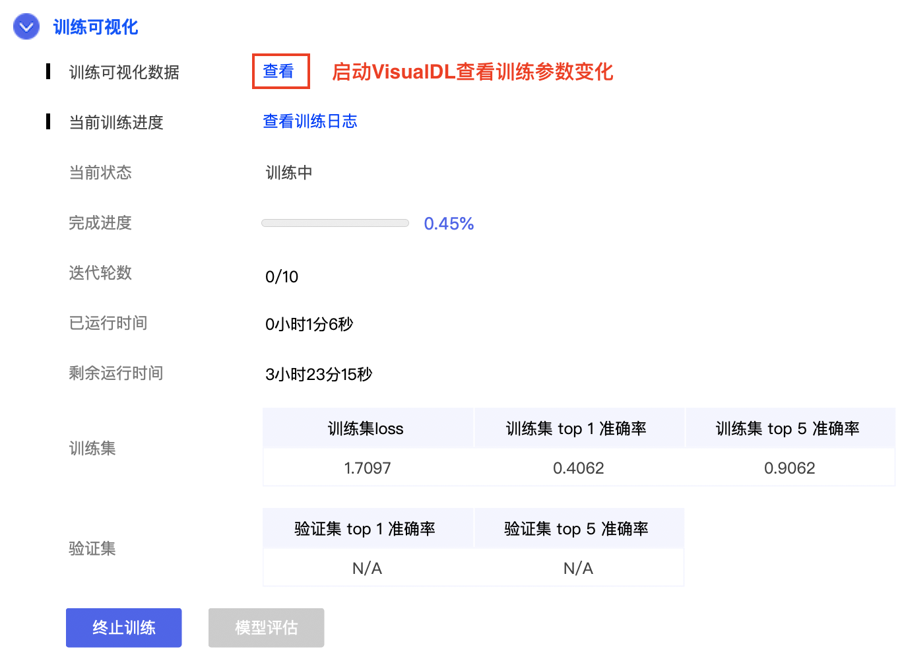
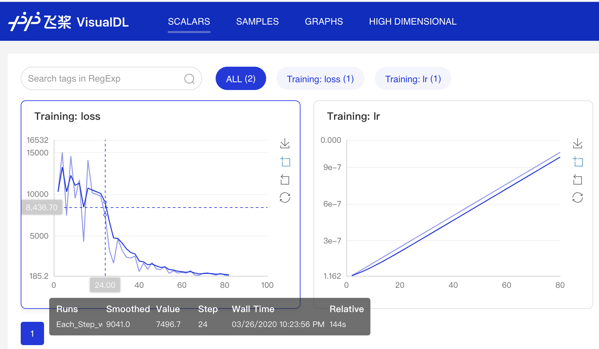
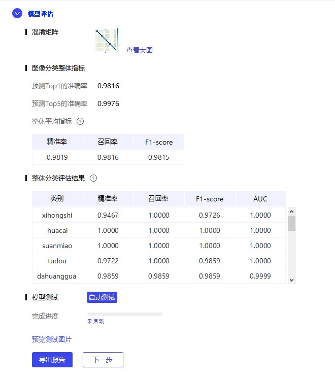
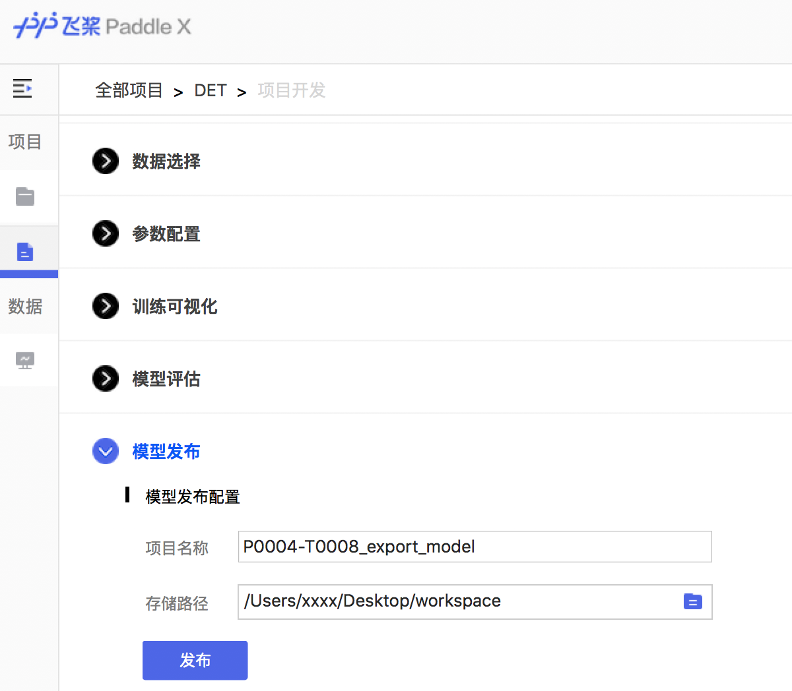

# PaddleX-GUI使用文档

**第一步：下载PaddleX客户端**

您需要前往 [官网](https://www.paddlepaddle.org.cn/paddle/paddlex)填写基本信息后下载试用PaddleX客户端

**第二步：准备数据**

在开始模型训练前，您需要根据不同的任务类型，将数据标注为相应的格式。目前PaddleX支持【图像分类】、【目标检测】、【语义分割】、【实例分割】四种任务类型。不同类型任务的数据处理方式可查看[数据标注方式](https://github.com/PaddlePaddle/PaddleX/tree/master/DataAnnotation/AnnotationNote)。

**第三步：导入我的数据集**

① 数据标注完成后，您需要根据不同的任务，将数据和标注文件，按照客户端提示更名并保存到正确的文件中。

② 在客户端新建数据集，选择与数据集匹配的任务类型，并选择数据集对应的路径，将数据集导入。

③ 选定导入数据集后，客户端会自动校验数据及标注文件是否合规，校验成功后，您可根据实际需求，将数据集按比例划分为训练集、验证集、测试集。

④ 您可在「数据分析」模块按规则预览您标注的数据集，双击单张图片可放大查看。

**第四步：创建项目**

① 在完成数据导入后，您可以点击「新建项目」创建一个项目。

② 您可根据实际任务需求选择项目的任务类型，需要注意项目所采用的数据集也带有任务类型属性，两者需要进行匹配。

**第五步：项目开发**

① **数据选择**：项目创建完成后，您需要选择已载入客户端并校验后的数据集，并点击下一步，进入参数配置页面。

② **参数配置**：主要分为**模型参数**、**训练参数**、**优化策略**三部分。您可根据实际需求选择模型结构及对应的训练参数、优化策略，使得任务效果最佳。

参数配置完成后，点击启动训练，模型开始训练并进行效果评估。

③ **训练可视化**：

在训练过程中，您可通过VisualDL查看模型训练过程时的参数变化、日志详情，及当前最优的训练集和验证集训练指标。模型在训练过程中通过点击"终止训练"随时终止训练过程。

模型训练结束后，点击”下一步“，进入模型评估页面。

④ **模型评估**

在模型评估页面，您可将训练后的模型应用在切分时留出的「验证数据集」以测试模型在验证集上的效果。评估方法包括混淆矩阵、精度、召回率等。在这个页面，您也可以直接查看模型在测试数据集上的预测效果。

根据评估结果，您可决定进入模型发布页面，或返回先前步骤调整参数配置重新进行训练。

⑤**模型发布**

当模型效果满意后，您可根据实际的生产环境需求，选择将模型发布为需要的版本。

