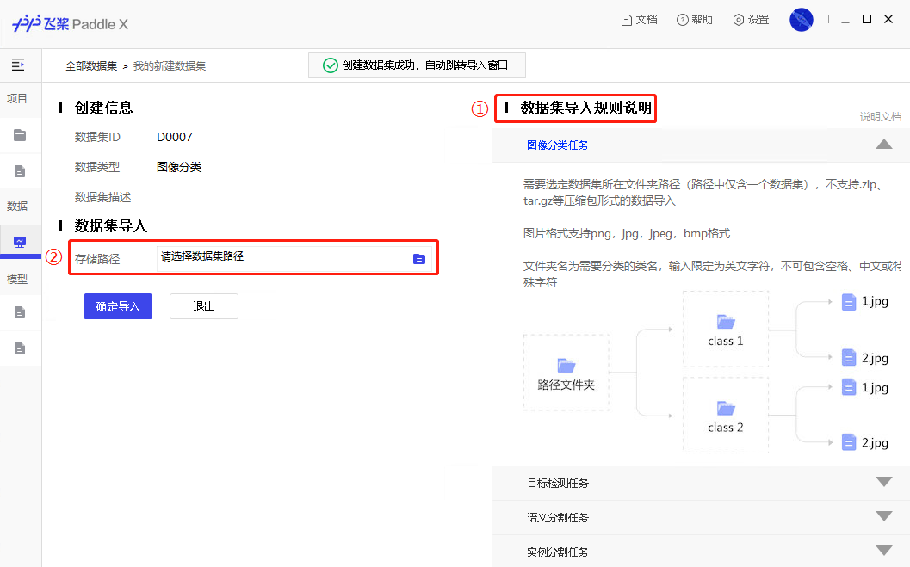
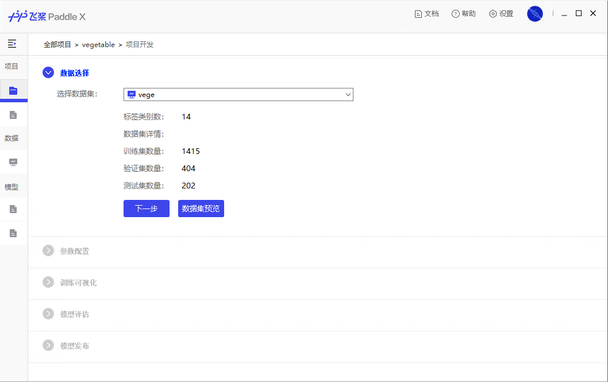
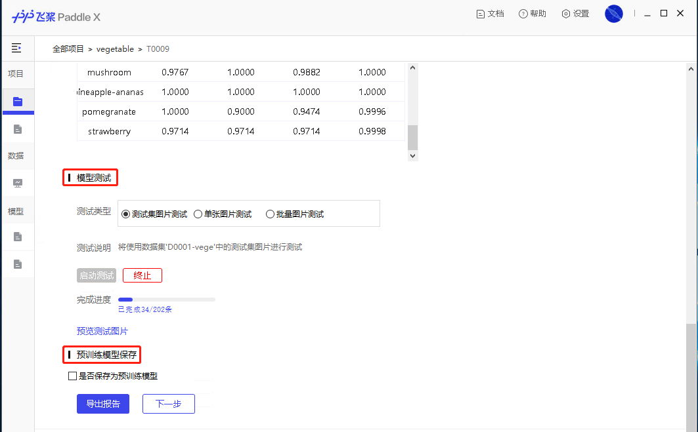

# PaddleX GUI使用文档

飞桨全流程开发工具，集飞桨核心框架、模型库、工具及组件等深度学习开发全流程所需能力于一身，易用易集成，是开发者快速入门深度学习、提升深度学习项目开发效率的最佳辅助工具。

PaddleX GUI是一个应用PaddleX实现的一个图形化开发客户端产品，它使得开发者通过键入式输入即可完成深度学习模型全流程开发，可大幅度提升项目开发效率。飞桨团队期待各位开发者基于PaddleX，实现出各种符合自己产业实际需求的产品。

我们诚挚地邀请您前往 [官网](https://www.paddlepaddle.org.cn/paddlex)下载试用PaddleX GUI，并获得您宝贵的意见或开源项目贡献。

## 目录

* **产品特性**
* **PaddleX GUI可视化前端**
* **FAQ**

## 产品特性

\-  **全流程打通**

将深度学习开发全流程打通，并提供可视化开发界面， 省去了对各环节API的熟悉过程及重复的代码开发，极大地提升了开发效率。

\-  **易用易集成**

提供功能最全、最灵活的Python API开发模式，完全开源开放，易于集成和二次开发。键入式输入的图形化开发界面，使得非专业算法人员也可快速进行业务POC。

\-  **融合产业实践经验**

融合飞桨产业落地经验，精选高质量的视觉模型方案，开放实际的案例教学，手把手带您实现产业需求落地。

\-  **教程与服务**

从数据集准备到上线部署，为您提供业务开发全流程的文档说明及技术服务。开发者可以通过QQ群、微信群、GitHub社区等多种形式与飞桨团队及同业合作伙伴交流沟通。

## PaddleX GUI 可视化前端

**第一步：准备数据**

在开始模型训练前，您需要根据不同的任务类型，将数据标注为相应的格式。目前PaddleX支持【图像分类】、【目标检测】、【语义分割】、【实例分割】四种任务类型。不同类型任务的数据处理方式可查看[数据标注方式](https://paddlex.readthedocs.io/zh_CN/latest/appendix/datasets.html)。

**第二步：导入我的数据集**

①数据标注完成后，您需要根据不同的任务，将数据和标注文件，按照客户端提示更名并保存到正确的文件中。

②在客户端新建数据集，选择与数据集匹配的任务类型，并选择数据集对应的路径，将数据集导入。

③选定导入数据集后，客户端会自动校验数据及标注文件是否合规，校验成功后，您可根据实际需求，将数据集按比例划分为训练集、验证集、测试集。

④您可在「数据分析」模块按规则预览您标注的数据集，双击单张图片可放大查看。

**第三步：创建项目**

① 在完成数据导入后，您可以点击「新建项目」创建一个项目。

② 您可根据实际任务需求选择项目的任务类型，需要注意项目所采用的数据集也带有任务类型属性，两者需要进行匹配。

**第四步：项目开发**

① **数据选择**：项目创建完成后，您需要选择已载入客户端并校验后的数据集，并点击下一步，进入参数配置页面。

② **参数配置**：主要分为**模型参数**、**训练参数**、**优化策略**三部分。您可根据实际需求选择模型结构、骨架网络及对应的训练参数、优化策略，使得任务效果最佳。

参数配置完成后，点击启动训练，模型开始训练并进行效果评估。

③ **训练可视化**：在训练过程中，您可通过VisualDL查看模型训练过程参数变化、日志详情，及当前最优的训练集和验证集训练指标。模型在训练过程中通过点击"中止训练"随时中止训练过程。

模型训练结束后，可选择进入『模型剪裁分析』或者直接进入『模型评估』。

④ **模型裁剪**：如果开发者希望减少模型的体积、计算量，提升模型在设备上的预测性能，可以采用PaddleX提供的模型裁剪策略。裁剪过程将对模型各卷积层的敏感度信息进行分析，根据各参数对模型效果的影响进行不同比例的裁剪，再进行精调训练获得最终裁剪后的模型。

⑤ **模型评估**：在模型评估页面，您可查看训练后的模型效果。评估方法包括混淆矩阵、精度、召回率等。

您还可以选择『数据集切分』时留出的『测试数据集』或从本地文件夹中导入一张/多张图片，将训练后的模型进行测试。根据测试结果，您可决定是否将训练完成的模型保存为预训练模型并进入模型发布页面，或返回先前步骤调整参数配置重新进行训练。

**第五步：模型发布**

当模型效果满意后，您可根据实际的生产环境需求，选择将模型发布为需要的版本。

## FAQ

1. **为什么训练速度这么慢？**

   PaddleX完全采用您本地的硬件进行计算，深度学习任务确实对算力要求较高，为了使您能快速体验应用PaddleX进行开发，我们适配了CPU硬件，但强烈建议您使用GPU以提升训练速度和开发体验。

2. **我可以在服务器或云平台上部署PaddleX么？**

   PaddleX GUI是一个适配本地单机安装的客户端，无法在服务器上直接进行部署，您可以直接使用PaddleX API，或采用飞桨核心框架进行服务器上的部署。如果您希望使用公有算力，强烈建议您尝试飞桨产品系列中的 [EasyDL](https://ai.baidu.com/easydl/) 或 [AI Studio](https://aistudio.baidu.com/aistudio/index)进行开发。

3. **PaddleX支持EasyData标注的数据吗？**

   支持，PaddleX可顺畅读取EasyData标注的数据。但当前版本的PaddleX GUI暂时无法支持直接导入EasyData数据格式，您可以参照文档，将[数据集进行转换](https://paddlex.readthedocs.io/zh_CN/latest/appendix/how_to_convert_dataset.html)再导入PaddleX GUI进行后续开发。
   同时，我们也在紧密开发PaddleX GUI可直接导入EasyData数据格式的功能。

4. **为什么模型裁剪分析耗时这么长？**

   模型裁剪分析过程是对模型各卷积层的敏感度信息进行分析，根据各参数对模型效果的影响进行不同比例的裁剪。此过程需要重复多次直至FLOPS满足要求，最后再进行精调训练获得最终裁剪后的模型，因此耗时较长。有关模型裁剪的原理，可参见文档[剪裁原理介绍](https://paddlepaddle.github.io/PaddleSlim/algo/algo.html#2-%E5%8D%B7%E7%A7%AF%E6%A0%B8%E5%89%AA%E8%A3%81%E5%8E%9F%E7%90%86)

5. **如何调用后端代码？**

   PaddleX 团队为您整理了相关的API接口文档，方便您学习和使用。具体请参见[PaddleX API说明文档](https://paddlex.readthedocs.io/zh_CN/latest/apis/index.html)

**如果您有更多问题或建议，欢迎以issue的形式，或加入PaddleX官方QQ群（1045148026）直接反馈您的问题和需求**

