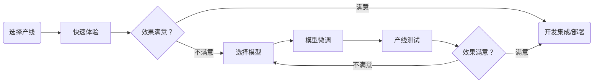

简体中文 | [English](pipeline_develop_guide_en.md)

# PaddleX模型产线使用概览

若您已经体验过PaddleX中的预训练模型产线效果，希望直接进行模型微调，可以跳转到[模型选择](#3模型选择可选)

完整的PaddleX模型产线开发流程如下图所示：

**<center>PaddleX 模型产线开发流程图</center>**



PaddleX 所提供的预训练的模型产线均可以**快速体验效果**，如果产线效果可以达到您的要求，您可以直接将预训练的模型产线进行**开发集成/部署**，如果效果不及预期，可以使用私有数据对产线中的模型进行**微调**，直到达到满意的效果。

下面，让我们以登机牌识别的任务为例，介绍PaddleX模型产线工具的本地使用过程，在使用前，请确保您已经按照[PaddleX本地安装教程](../installation/installation.md)完成了PaddleX的安装。

## 1、选择产线

PaddleX中每条产线都可以解决特定任务场景的问题如目标检测、时序预测、语义分割等，您需要根据具体任务选择后续进行开发的产线。例如此处为登机牌识别任务，对应 PaddleX 的[通用OCR产线](./tutorials/ocr_pipelines/OCR.md)。更多任务与产线的对应关系可以在 [PaddleX产线列表(CPU/GPU)](../support_list/pipelines_list.md)查询。

## 2、快速体验

PaddleX的每条产线都集成了众多预训练模型，您可以先体验PaddleX的预训练模型产线的效果，如果预训练模型产线的效果符合您的预期，即可直接进行[开发集成/部署](#6开发集成部署)，如果不符合，再根据后续步骤对产线的效果进行优化。

PaddleX提供了三种可以快速体验产线效果的方式，您可以根据需要选择合适的方式进行产线效果体验：

* 在线快速体验地址：[PaddleX产线列表(CPU/GPU)](../support_list/pipelines_list.md)
* 命令行快速体验：[PaddleX产线命令行使用说明](../pipeline_usage/instructions/pipeline_CLI_usage.md)
* Python脚本快速体验：[PaddleX产线Python脚本使用说明](../pipeline_usage/instructions/pipeline_python_API.md)

以实现登机牌识别任务的通用OCR产线为例，一行命令即可快速体验产线效果,使用 [测试文件](https://paddle-model-ecology.bj.bcebos.com/paddlex/imgs/demo_image/general_ocr_002.png)，并将 `--input` 替换为本地路径，进行预测：

```bash
paddlex --pipeline OCR --input general_ocr_002.png --device gpu:0
```
参数说明：

```bash
--pipeline：产线名称，此处为OCR产线
--input：待处理的输入图片的本地路径或URL
--device 使用的GPU序号（例如gpu:0表示使用第0号GPU，gpu:1,2表示使用第1、2号GPU），也可选择使用CPU（--device cpu）
```

运行后，得到的结果为：

```bash
{'input_path': '/root/.paddlex/predict_input/general_ocr_002.png', 'dt_polys': [array([[ 6, 13],
       [64, 13],
       [64, 31],
       [ 6, 31]], dtype=int16), array([[210,  14],
       [238,  14],
        ......
       [830, 445],
       [830, 464],
       [338, 473]], dtype=int16)], 'dt_scores': [0.7629529090100092, 0.7717284653547034, 0.7139251666762622, 0.8057611181556994, 0.8840947658872964, 0.793295938183885, 0.8342027855884783, 0.8081378522874861, 0.8436969344212185, 0.8500845646497226, 0.7932189714842249, 0.8875924621248228, 0.8827884273639948, 0.8322404317386042, 0.8614796803023563, 0.8804252994596097, 0.9069978945305474, 0.8383917914190059, 0.8495824076580516, 0.8825556800041383, 0.852788927706737, 0.8379584696974435, 0.8633519228646618, 0.763234473595298, 0.8602154244410916, 0.9206341882426813, 0.6341425973804049, 0.8490156149797171, 0.758314821564747, 0.8757849788793592, 0.772485060565334, 0.8404023012596349, 0.8190037953773427, 0.851908529295617, 0.6126112758079643, 0.7324388418218587], 'rec_text': ['www.9', '5', '登机牌', 'BOARDING', 'PASS', '舱位', '', 'CLASS', '序号SERIALNO', '座位号', 'SEAT NO', '航班 FLIGHT', '日期 DATE', '03DEC', 'W', '035', 'MU 2379', '始发地', 'FROM', '登机口', 'GATE', '登机时间BDT', '目的地TO', '福州', 'TAIYUAN', 'G11', 'FUZHOU', '身份识别IDNO', '姓名NAME', 'ZHANGQIWEI', '票号TKTNO', '张祺伟', '票价FARE', 'ETKT7813699238489/1', '登机口于起飞前10分钟关闭', 'GATES CLOSE 1O MINUTESBEFOREDEPARTURE TIME'], 'rec_score': [0.683099627494812, 0.23417049646377563, 0.9969978928565979, 0.9945957660675049, 0.9787729382514954, 0.9983421564102173, 0.0, 0.9896272420883179, 0.9927973747253418, 0.9976049065589905, 0.9330753684043884, 0.9562691450119019, 0.9312669038772583, 0.9749765396118164, 0.9749416708946228, 0.9988260865211487, 0.9319792985916138, 0.9979889988899231, 0.9956836700439453, 0.9991750717163086, 0.9938803315162659, 0.9982991218566895, 0.9701204299926758, 0.9986245632171631, 0.9888408780097961, 0.9793729782104492, 0.9952947497367859, 0.9945247173309326, 0.9919753670692444, 0.991995632648468, 0.9937331080436707, 0.9963390827178955, 0.9954304695129395, 0.9934715628623962, 0.9974429607391357, 0.9529641270637512]}
```
可视化结果如下：


在执行上述命令时，加载的是默认的OCR产线配置文件，若您需要自定义配置文件，可执行如下命令获取：

```bash
paddlex --get_pipeline_config OCR
```

执行后，OCR产线配置文件将被保存在当前路径。若您希望自定义保存位置，可执行如下命令（假设自定义保存位置为 `./my_path`）：

```bash
paddlex --get_pipeline_config OCR --save_path ./my_path
```

获取产线配置文件后，可将 `--pipeline` 替换为配置文件保存路径，即可使配置文件生效。例如，若配置文件保存路径为 `./ocr.yaml`，只需执行：

```bash
paddlex --pipeline ./ocr.yaml --input general_ocr_002.png
```
其中，`--model`、`--device` 等参数无需指定，将使用配置文件中的参数。若依然指定了参数，将以指定的参数为准。


## 3、模型选择（可选）

由于一个产线中可能包含一个或多个单功能模块，在进行模型微调时，您需要根据测试的情况确定微调其中的哪个模块的模型。以此处登机牌识别任务的OCR产线为例，该产线包含文本检测模型（如 `PP-OCRv4_mobile_det`）和文本识别模型（如 `PP-OCRv4_mobile_rec`），如发现文字的定位不准，则需要微调文本检测模型，如果发现文字的识别不准，则需要微调文本识别模型。如果您不清楚产线中包含哪些模型，可以查阅[模型列表](../support_list/models_list.md)。

## 4、模型微调（可选）

在确定好需要微调的模型后，您需要用私有数据集对模型进行训练，以文本识别模型（ `PP-OCRv4_mobile_rec`）为例，一行命令即可完成模型的训练：

```bash
python main.py -c paddlex/configs/text_recognition/PP-OCRv4_mobile_rec.yaml \
    -o Global.mode=train \
    -o Global.dataset_dir=your/dataset_dir
```
此外，对于模型微调中私有数据集的准备、单模型的推理等内容，PaddleX也提供了详细的教程，详细请参考[PaddleX模块使用教程](../../README.md#-文档)

## 5、产线测试（可选）

当您使用私有数据集完成微调训练后，可获得本地模型权重文件。

若您需要使用微调后的模型权重，只需对产线配置文件做修改，将微调后模型权重的本地路径替换至产线配置文件中的对应位置即可：

```bash
......
Pipeline:
  det_model: PP-OCRv4_server_det  #可修改为微调后文本检测模型的本地路径
  det_device: "gpu"
  rec_model: PP-OCRv4_server_rec  #可修改为微调后文本识别模型的本地路径
  rec_batch_size: 1
  rec_device: "gpu"
......
```
随后， 参考[快速体验](#2快速体验)中的命令行方式或[Python脚本方式](#6开发集成部署)，加载修改后的产线配置文件即可。

如果效果满意，即可将微调后的产线进行[开发集成/部署](#6开发集成部署)，如果不满意，即可回到[模型选择](#3模型选择可选)尝试继续微调其他任务模块的模型，直到达到满意的效果。

## 6、开发集成/部署

PaddleX提供了简洁的Python API，用几行代码即可将模型产线集成到您的项目中。此处用于集成登机牌识别的OCR产线示例代码如下：

```bash
from paddlex import create_pipeline
pipeline = create_pipeline(pipeline="OCR")
output = pipeline.predict("https://paddle-model-ecology.bj.bcebos.com/paddlex/imgs/demo_image/general_ocr_001.png")
for res in output:
    res.print(json_format=False)
    res.save_to_img("./output/")
    res.save_to_json("./output/res.json")
```
更详细的模型产线Python集成方法请参考[PaddleX产线Python脚本使用说明](../pipeline_usage/instructions/pipeline_python_API.md)

同时，PaddleX提供了三种部署方式及详细的部署教程：

🚀 **高性能推理**：在实际生产环境中，许多应用对部署策略的性能指标（尤其是响应速度）有着较严苛的标准，以确保系统的高效运行与用户体验的流畅性。为此，PaddleX 提供高性能推理插件，旨在对模型推理及前后处理进行深度性能优化，实现端到端流程的显著提速，详细的高性能部署流程请参考[PaddleX高性能部署指南](../pipeline_deploy/high_performance_deploy.md)。

☁️ **服务化部署**：服务化部署是实际生产环境中常见的一种部署形式。通过将推理功能封装为服务，客户端可以通过网络请求来访问这些服务，以获取推理结果。PaddleX 支持用户以低成本实现产线的服务化部署，详细的服务化部署流程请参考[PaddleX服务化部署指南](../pipeline_deploy/service_deploy.md)。

📱 **端侧部署**：端侧部署是一种将计算和数据处理功能放在用户设备本身上的方式，设备可以直接处理数据，而不需要依赖远程的服务器。PaddleX 支持将模型部署在 Android 等端侧设备上，详细的端侧部署流程请参考[PaddleX端侧部署指南](../pipeline_deploy/lite_deploy.md)。
您可以根据需要选择合适的方式部署模型产线，进而进行后续的 AI 应用集成。


> ❗ PaddleX为每个产线都提供了详细的使用说明，您可以根据需要进行选择，所有产线对应的使用说明如下：

| 产线名称           | 详细说明                                                                                                      |
|--------------------|----------------------------------------------------------------------------------------------------------------|
| 文档场景信息抽取v3   | [文档场景信息抽取v3产线使用教程](./tutorials/information_extration_pipelines/document_scene_information_extraction.md) |
| 通用图像分类       | [通用图像分类产线使用教程](./tutorials/cv_pipelines/image_classification.md) |
| 通用目标检测       | [通用目标检测产线使用教程](./tutorials/cv_pipelines/object_detection.md) |
| 通用实例分割       | [通用实例分割产线使用教程](./tutorials/cv_pipelines/instance_segmentation.md) |
| 通用语义分割       | [通用语义分割产线使用教程](./tutorials/cv_pipelines/semantic_segmentation.md) |
| 通用图像多标签分类 | [通用图像多标签分类产线使用教程](./tutorials/cv_pipelines/image_multi_label_classification.md) |
| 小目标检测         |  [小目标检测产线使用教程](./tutorials/cv_pipelines/small_object_detection.md) |
| 图像异常检测       | [图像异常检测产线使用教程](./tutorials/cv_pipelines/image_anomaly_detection.md) |
| 通用OCR            | [通用OCR产线使用教程](./tutorials/ocr_pipelines/OCR.md) |
| 通用表格识别       | [通用表格识别产线使用教程](./tutorials/ocr_pipelines/table_recognition.md) |
| 公式识别       | [公式识别产线使用教程](./tutorials/ocr_pipelines/formula_recognition.md) |
| 印章识别       | [印章识别产线使用教程](./tutorials/ocr_pipelines/seal_recognition.md) |
| 时序预测       | [通用时序预测产线使用教程](./tutorials/time_series_pipelines/time_series_forecasting.md) |
| 时序异常检测   | [通用时序异常检测产线使用教程](./tutorials/time_series_pipelines/time_series_anomaly_detection.md) |
| 时序分类       | [通用时序分类产线使用教程](./tutorials/time_series_pipelines/time_series_classification.md) |

