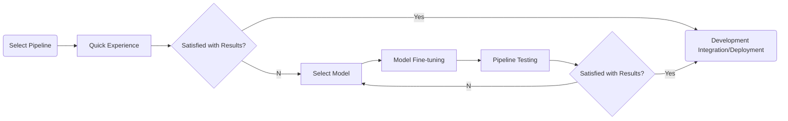

[简体中文](pipeline_develop_guide.md) | English

# Overview of PaddleX Model Pipeline Usage

If you have already experienced the pre-trained model pipeline effects in PaddleX and wish to proceed directly with model fine-tuning, you can jump to [Model Selection](#3-model-selection-optional).

The complete PaddleX model pipeline development process is illustrated in the following diagram:

**<center>PaddleX Model Pipeline Development Flowchart</center>**



The pre-trained model pipelines provided by PaddleX allow for **quick experience of effects**. If the pipeline effects meet your requirements, you can directly proceed with **development integration/deployment** of the pre-trained model pipeline. If the effects are not as expected, you can use your private data to **fine-tune** the models within the pipeline until satisfactory results are achieved.

Below, let's take the task of boarding pass recognition as an example to introduce the local usage process of the PaddleX model pipeline tool. Before use, please ensure you have completed the installation of PaddleX according to the [PaddleX Local Installation Tutorial](../installation/installation_en.md).

## 1. Select Pipeline

Each pipeline in PaddleX can solve specific task scenarios such as object detection, time series prediction, semantic segmentation, etc. You need to select the pipeline for subsequent development based on the specific task. For example, for the boarding pass recognition task, the corresponding PaddleX pipeline is the **General OCR Pipeline**. More task-pipeline correspondences can be found in the [PaddleX Models List (CPU/GPU)](../support_list/models_list_en.md).

## 2. Quick Start

Each pipeline in PaddleX integrates numerous pre-trained models. You can first experience the effects of the PaddleX pre-trained model pipeline. If the effects of the pre-trained model pipeline meet your expectations, you can proceed directly with [Development Integration/Deployment](#6-development-integration-and-deployment). If not, optimize the pipeline effects according to the subsequent steps.

PaddleX provides three ways to quickly experience pipeline effects. You can choose the appropriate method based on your needs:

* Online Quick Experience URL: [PaddleX Pipeline List (CPU/GPU)](../support_list/pipelines_list_en.md)
* Command Line Quick Experience: [PaddleX Pipeline Command Line Usage Instructions](../pipeline_usage/instructions/pipeline_CLI_usage_en.md)
* Python Script Quick Experience: [PaddleX Pipeline Python API Usage Instructions](../pipeline_usage/instructions/pipeline_python_API_en.md)

To demonstrate the OCR pipeline for the boarding pass recognition task, you can quickly experience the pipeline's effect with a single command line, using [this test file](https://paddle-model-ecology.bj.bcebos.com/paddlex/imgs/demo_image/general_ocr_002.png), and replace `--input` with your local path for prediction:

```bash
paddlex --pipeline OCR --input /path/to/general_ocr_002.png --device gpu:0
```
Parameter explanation:

```bash
--pipeline: The name of the pipeline, which is the OCR pipeline in this case.
--input: The local path or URL of the input image to be processed.
--device: The sequence number of the GPU to be used (for example, gpu:0 means using the 0th GPU, gpu:1,2 means using the 1st and 2nd GPUs), you can also choose to use the CPU (--device cpu).
```

After running, the result obtained is:

```bash
{'input_path': '/root/.paddlex/predict_input/general_ocr_002.png', 'dt_polys': [array([[ 6, 13],
       [64, 13],
       [64, 31],
       [ 6, 31]], dtype=int16), array([[210,  14],
       [238,  14],
        ......
       [830, 445],
       [830, 464],
       [338, 473]], dtype=int16)], 'dt_scores': [0.7629529090100092, 0.7717284653547034, 0.7139251666762622, 0.8057611181556994, 0.8840947658872964, 0.793295938183885, 0.8342027855884783, 0.8081378522874861, 0.8436969344212185, 0.8500845646497226, 0.7932189714842249, 0.8875924621248228, 0.8827884273639948, 0.8322404317386042, 0.8614796803023563, 0.8804252994596097, 0.9069978945305474, 0.8383917914190059, 0.8495824076580516, 0.8825556800041383, 0.852788927706737, 0.8379584696974435, 0.8633519228646618, 0.763234473595298, 0.8602154244410916, 0.9206341882426813, 0.6341425973804049, 0.8490156149797171, 0.758314821564747, 0.8757849788793592, 0.772485060565334, 0.8404023012596349, 0.8190037953773427, 0.851908529295617, 0.6126112758079643, 0.7324388418218587], 'rec_text': ['www.9', '5', 'boarding pass', 'BOARDING', 'PASS', 'seat class', '', 'CLASS', 'serial number SERIALNO', 'seat number SEAT NO', 'FLIGHT NUMBER FLIGHT', 'DATE DATE', '03DEC', 'W', '035', 'MU 2379', 'origin', 'FROM', 'boarding gate GATE', 'boarding time BDT', 'destination TO', 'Fuzhou', 'TAIYUAN', 'G11', 'FUZHOU', 'ID number IDNO', 'name NAME', 'ZHANGQIWEI', 'ticket number TKTNO', 'Zhang Qiwei', 'fare FARE', 'ETKT7813699238489/1', 'The boarding gate closes 10 minutes before departure time', 'GATES CLOSE 10 MINUTES BEFORE DEPARTURE TIME'], 'rec_score': [0.683099627494812, 0.23417049646377563, 0.9969978928565979, 0.9945957660675049, 0.9787729382514954, 0.9983421564102173, 0.0, 0.9896272420883179, 0.9927973747253418, 0.9976049065589905, 0.9330753684043884, 0.9562691450119019, 0.9312669038772583, 0.9749765396118164, 0.9749416708946228, 0.9988260865211487, 0.9319792985916138, 0.9979889988899231, 0.9956836700439453, 0.9991750717163086, 0.9938803315162659, 0.9982991218566895, 0.9701204299926758, 0.9986245632171631, 0.9888408780097961, 0.9793729782104492, 0.9952947497367859, 0.9945247173309326, 0.9919753670692444, 0.991995632648468, 0.9937331080436707, 0.9963390827178955, 0.9954304695129395, 0.9934715628623962, 0.9974429607391357, 0.9529641270637512]}
```
Visualization result is as follows:

 

When executing the above command, the default OCR pipeline configuration file is loaded. If you need to customize the configuration file, you can execute the following command to obtain it:

```bash
paddlex --get_pipeline_config OCR
```

After execution, the OCR pipeline configuration file will be saved in the current path. If you wish to customize the save location, you can execute the following command (assuming the custom save location is `./my_path`):

```bash
paddlex --get_pipeline_config OCR --save_path ./my_path
```

After obtaining the pipeline configuration file, you can replace `--pipeline` with the configuration file save path to make the configuration file take effect. For example, if the configuration file save path is `./ocr.yaml`, just execute:

```bash
paddlex --pipeline ./ocr.yaml --input /path/to/general_ocr_002.png
```
In this case, parameters such as `--model`, `--device` are not required, and the parameters in the configuration file will be used. If parameters are still specified, they will take precedence.


## 3. Model Selection (Optional)

Since a pipeline may contain one or more models, when fine-tuning models, you need to determine which model to fine-tune based on testing results. Taking the OCR pipeline for boarding pass recognition as an example, this pipeline includes a text detection model (e.g., `PP-OCRv4_mobile_det`) and a text recognition model (e.g., `PP-OCRv4_mobile_rec`). If the text positioning is inaccurate, you need to fine-tune the text detection model. If the text recognition is inaccurate, you need to fine-tune the text recognition model. If you are unsure which models are included in the pipeline, you can refer to the [PaddleX Models List (CPU/GPU)](../support_list/models_list_en.md)

## 4. Model Fine-tuning (Optional)

After determining the model to fine-tune, you need to train the model with your private dataset. PaddleX provides a single-model development tool that can complete model training with a single command:

```bash
python main.py -c paddlex/configs/text_recognition/PP-OCRv4_mobile_rec.yaml \
    -o Global.mode=train \
    -o Global.dataset_dir=your/dataset_dir
```
In addition, PaddleX provides detailed tutorials for preparing private datasets for model fine-tuning, single-model inference, and more. For details, please refer to the [PaddleX Modules Tutorials](../../README_en.md#-documentation)

## 5. Pipeline Testing (Optional)

After fine-tuning your model with a private dataset, you will obtain local model weight files.

To use the fine-tuned model weights, simply modify the production line configuration file by replacing the local paths of the fine-tuned model weights with the corresponding paths in the configuration file:

```bash
......
Pipeline:
  det_model: PP-OCRv4_server_det  # Can be modified to the local path of the fine-tuned text detection model
  det_device: "gpu"
  rec_model: PP-OCRv4_server_rec  # Can be modified to the local path of the fine-tuned text recognition model
  rec_batch_size: 1
  rec_device: "gpu"
......
```
Then, refer to the [command line method](#2-quick-start) or [Python script](#6-development-integration-and-deployment) method to load the modified pipeline configuration file.

If the results are satisfactory, proceed with [Development Integration/Deployment](#6-development-integration-and-deployment). If not, return to [Model Selection](#3-model-selection-optional) to continue fine-tuning other task modules until you achieve satisfactory results.

## 6. Development Integration and Deployment

PaddleX provides concise Python APIs that allow you to integrate model pipelines into your projects with just a few lines of code. Here's an example code snippet for integrating a boarding pass recognition OCR pipeline:

```bash
from paddlex import create_pipeline
pipeline = create_pipeline(pipeline="OCR")
output = pipeline.predict("https://paddle-model-ecology.bj.bcebos.com/paddlex/imgs/demo_image/general_ocr_001.png")
for res in output:
    res.print(json_format=False)
    res.save_to_img("./output/")
    res.save_to_json("./output/res.json")
```
For more detailed Python integration methods for model pipelines, refer to [PaddleX Pipeline Python API Usage Instructions](./instructions/pipeline_python_API_en.md)

PaddleX also provides three deployment methods with detailed deployment tutorials:

🚀 **High-Performance Deployment**: In actual production environments, many applications have stringent standards for the performance metrics (especially response speed) of deployment strategies to ensure efficient system operation and smooth user experience. To this end, PaddleX provides high-performance inference plugins that aim to deeply optimize model inference and pre/post-processing for significant speedups in the end-to-end process. Refer to the [PaddleX High-Performance Deployment Guide](../pipeline_deploy/high_performance_deploy_en.md) for detailed high-performance deployment procedures.

☁️ **Service-Oriented Deployment**: Service-oriented deployment is a common deployment form in actual production environments. By encapsulating inference functions as services, clients can access these services through network requests to obtain inference results. PaddleX supports users in achieving low-cost service-oriented deployment of pipelines. Refer to the [PaddleX Service-Oriented Deployment Guide](../pipeline_deploy/service_deploy_en.md) for detailed service-oriented deployment procedures.

📱 **Edge Deployment**: Edge deployment is a method that places computing and data processing capabilities on user devices themselves, allowing devices to process data directly without relying on remote servers. PaddleX supports deploying models on edge devices such as Android. Refer to the [PaddleX Edge Deployment Guide](../pipeline_deploy/lite_deploy_en.md) for detailed edge deployment procedures.

Choose the appropriate deployment method for your model pipeline based on your needs, and proceed with subsequent AI application integration.


> ❗ PaddleX provides detailed usage instructions for each pipeline. You can choose according to your needs. Here are all the pipelines and their corresponding detailed instructions:

| Pipeline Name          | Detailed Description                                                                                                      |
|------------------------|---------------------------------------------------------------------------------------------------------------------------|
| PP-ChatOCR-doc v3   | [PP-ChatOCR-doc v3 Pipeline Usage Tutorial](./tutorials/information_extration_pipelines/document_scene_information_extraction_en.md) |
| Image Classification       | [Image Classification Pipeline Usage Tutorial](./tutorials/cv_pipelines/image_classification_en.md) |
| Object Detection       | [Object Detection Pipeline Usage Tutorial](./tutorials/cv_pipelines/object_detection_en.md) |
| Instance Segmentation       | [Instance Segmentation Pipeline Usage Tutorial](./tutorials/cv_pipelines/instance_segmentation_en.md) |
| Semantic Segmentation       | [Semantic Segmentation Pipeline Usage Tutorial](./tutorials/cv_pipelines/semantic_segmentation_en.md) |
| Image Multi-label Classification | [Image Multi-label Classification Pipeline Usage Tutorial](./tutorials/cv_pipelines/image_multi_label_classification_en.md) |
| Small Object Detection         |  [Small Object Detection Pipeline Usage Tutorial](./tutorials/cv_pipelines/small_object_detection_en.md) |
| Image Anomaly Detection       | [Image Anomaly Detection Pipeline Usage Tutorial](./tutorials/cv_pipelines/image_anomaly_detection_en.md) |
| OCR            | [OCR Pipeline Usage Tutorial](./tutorials/ocr_pipelines/OCR_en.md) |
| Table Recognition       | [Table Recognition Pipeline Usage Tutorial](./tutorials/ocr_pipelines/table_recognition_en.md) |
| Time Series Forecasting       | [Time Series Forecasting Pipeline Usage Tutorial](./tutorials/time_series_pipelines/time_series_forecasting_en.md) |
| Time Series Anomaly Detection   | [Time Series Anomaly Detection Pipeline Usage Tutorial](./tutorials/time_series_pipelines/time_series_anomaly_detection_en.md) |
| Time Series Classification       | [Time Series Classification Pipeline Usage Tutorial](./tutorials/time_series_pipelines/time_series_classification_en.md) |
| Formula Recognition       | [Formula Recognition Pipeline Usage Tutorial](./tutorials/ocr_pipelines/formula_recognition_en.md) |

