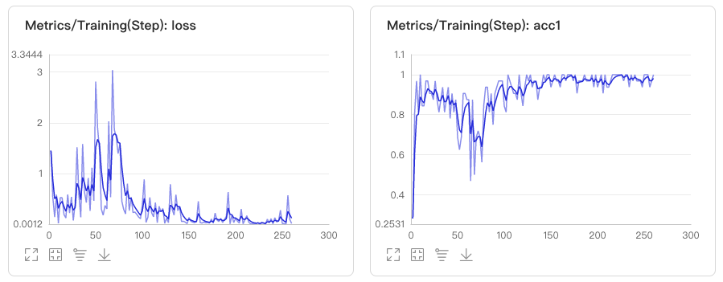

# 10分钟快速上手使用

本文档在一个小数据集上展示了如何通过PaddleX进行训练，您可以阅读PaddleX的**使用教程**来了解更多模型任务的训练使用方式。本示例同步在AIStudio上，可直接[在线体验模型训练](https://aistudio.baidu.com/aistudio/projectdetail/439860)


## 1. 安装PaddleX
> 安装相关过程和问题可以参考PaddleX的[安装文档](./install.md)。
```
pip install paddlex -i https://mirror.baidu.com/pypi/simple
```

## 2. 准备蔬菜分类数据集
```
wget https://bj.bcebos.com/paddlex/datasets/vegetables_cls.tar.gz
tar xzvf vegetables_cls.tar.gz
```

## 3. 训练代码开发
PaddleX的所有模型训练和预测均只涉及到5个API接口，分别是
> - [transforms](apis/transforms/index) 图像数据处理
> - [datasets](apis/datasets.md) 数据集加载
> - [models](apis/models.md) 模型类型定义
> - [train](apis/models.md) 开始训练
> - [predict](apis/models.md) 模型预测 
 
在本示例，通过如下`train.py`代码进行训练, 训练环境为1张Tesla P40 GPU卡。  

### 3.1 定义`transforms`数据处理流程
由于训练时数据增强操作的加入，因此模型在训练和验证过程中，数据处理流程需要分别进行定义。如下所示，代码在`train_transforms`中加入了[RandomCrop](apis/transforms/cls_transforms.html#RandomCrop)和[RandomHorizontalFlip](apis/transforms/cls_transforms.html#RandomHorizontalFlip)两种数据增强方式
```
from paddlex.cls import transforms
train_transforms = transforms.Compose([
    transforms.RandomCrop(crop_size=224),
    transforms.RandomHorizontalFlip(),
    transforms.Normalize()
])
eval_transforms = transforms.Compose([
    transforms.ResizeByShort(short_size=256),
    transforms.CenterCrop(crop_size=224),
    transforms.Normalize()
])
```

> 定义数据集，`pdx.datasets.ImageNet`表示读取ImageNet格式的分类数据集
```
train_dataset = pdx.datasets.ImageNet(
    data_dir='vegetables_cls',
    file_list='vegetables_cls/train_list.txt',
    label_list='vegetables_cls/labels.txt',
    transforms=train_transforms,
    shuffle=True)
eval_dataset = pdx.datasets.ImageNet(
    data_dir='vegetables_cls',
    file_list='vegetables_cls/val_list.txt',
    label_list='vegetables_cls/labels.txt',
    transforms=eval_transforms)
```
> 模型训练

```
num_classes = len(train_dataset.labels)
model = pdx.cls.MobileNetV2(num_classes=num_classes)
model.train(num_epochs=10,
            train_dataset=train_dataset,
            train_batch_size=32,
            eval_dataset=eval_dataset,
            lr_decay_epochs=[4, 6, 8],
            learning_rate=0.025,
            save_dir='output/mobilenetv2',
            use_vdl=True)
```

## 3. 模型训练
> `train.py`与解压后的数据集目录`vegetables_cls`放在同一目录下，在此目录下运行`train.py`即可开始训练。如果您的电脑上有GPU，这将会在10分钟内训练完成，如果为CPU也大概会在30分钟内训练完毕。
```
python train.py
```
## 4. 训练过程中查看训练指标
> 模型在训练过程中，所有的迭代信息将以标注输出流的形式，输出到命令执行的终端上，用户也可通过visualdl以可视化的方式查看训练指标的变化，通过如下方式启动visualdl后，在浏览器打开https://0.0.0.0:8001即可。
```
visualdl --logdir output/mobilenetv2/vdl_log --port 8000
```

## 5. 训练完成使用模型进行测试
> 如使用训练过程中第8轮保存的模型进行测试
```
import paddlex as pdx
model = pdx.load_model('output/mobilenetv2/epoch_8')
result = model.predict('vegetables_cls/bocai/100.jpg', topk=3)
print("Predict Result:", result)
```
> 预测结果输出如下，预测按score进行排序，得到前三分类结果
```
Predict Result: Predict Result: [{'score': 0.9999393, 'category': 'bocai', 'category_id': 0}, {'score': 6.010089e-05, 'category': 'hongxiancai', 'category_id': 2}, {'score': 5.593914e-07, 'category': 'xilanhua', 'category_id': 5}]
```

## 其它推荐
- 1.[目标检测模型训练](tutorials/train/detection.md)
- 2.[语义分割模型训练](tutorials/train/segmentation.md)
- 3.[实例分割模型训练](tutorials/train/instance_segmentation.md)
- 3.[模型太大，想要更小的模型，试试模型裁剪吧!](tutorials/compress/classification.md)
