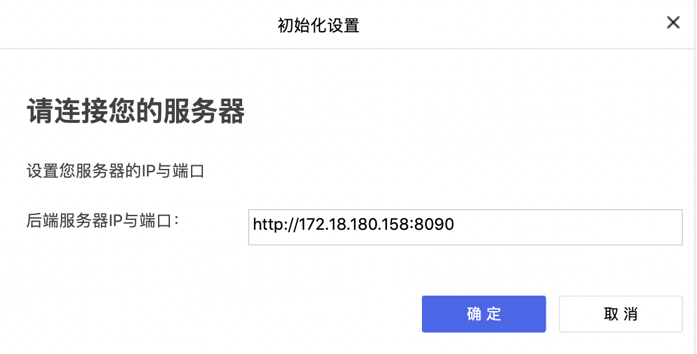

# 介绍与使用
PaddleX RESTful是基于PaddleX开发的RESTful API。  

<<<<<<< HEAD:docs/gui/introduction.md
对于开发者来说通过如下指令启动PaddleX RESTful服务，开启RESTful服务后可以通过下载Remote版本的GUI或者是web demo连接开启RESTful服务的服务端完成深度学习全流程开发。  
=======
对于开发者来说可以通过如下指令启动PaddleX RESTful服务  
**paddlex --start_restful --port [端口号] --workspace_dir [工作空间地址]**

开启RESTful服务后可以实现如下功能：

- 通过下载基于RESTful API的GUI连接开启RESTful服务的服务端，实现远程深度学习全流程开发。
- 通过使用web demo连接开启RESTful服务的服务端，实现远程深度学习全流程开发。
- 根据RESTful API来开发您自己个性化的可视化界面。  

>>>>>>> dae8c7c... fix docs:docs/restful/introduction.md

同样您还可以根据RESTful API来开发自己的可视化界面。  

**paddlex --start_restful --port [端口号] --workspace_dir [工作空间地址]**

## PaddleX Remote GUI
PaddleX Remote GUI是针对PaddleX RESTful开发的可视化客户端。开发者可以通过客户端连接开启RESTful服务的服务端，通过GUI实现深度学习全流程：**数据处理** 、 **超参配置** 、 **模型训练及优化** 、 **模型发布**，无需开发一行代码，即可得到高性深度学习推理模型。  
### 客户端下载地址
- [MAC](https://bj.bcebos.com/paddlex/PaddleX_Remote_GUI/mac/PaddleX_Remote_GUI.zip)
- [Windows](https://bj.bcebos.com/paddlex/PaddleX_Remote_GUI/windows/PaddleX_Remote_GUI.zip)

### 客户端使用流程

#### step1：安装PaddleX  
```
pip install paddlex
```  
**注意**：若需要使用GPU请安装pycuda
```
pip install pycuda
```

#### step2：开启restful 服务
```
paddlex --start_restful --port [端口号] --workspace_dir [工作空间地址]
```

<<<<<<< HEAD:docs/gui/introduction.md
#### setp3：根据上面的连接下载Remote版本的客户端

#### step4：运行客户端、如图所示填写开启RESTful后端的ip与端口,点击确定遍可正常使用GUI



## PaddleX Web Demo
PaddleX Web Demo是针对PaddleX RESTful开发的web可视化客户端。
[Wed demo](../../paddlex/restful/frontend_demo/paddlex_restful_demo.html)
=======
#### setp3：根据上面的链接下载支持RESTful版本的GUI

#### step4：运行客户端，如图所示填写开启RESTful后端的ip与端口，点击确定便可正常使用GUI


## PaddleX Web Demo
PaddleX Web Demo是针对PaddleX RESTful开发的Web可视化客户端。  
[Wed demo传送门](https://github.com/PaddlePaddle/PaddleX/blob/develop/paddlex/restful/frontend_demo/paddlex_restful_demo.html)
>>>>>>> dae8c7c... fix docs:docs/restful/introduction.md

### Web DEMO使用流程

#### step1：安装paddlex  
```
pip install paddlex
```  
**注意**：若需要使用GPU请安装pycuda
```
pip install pycuda
```

#### step2：开启restful 服务
```
paddlex --start_restful --port [端口号] --workspace_dir [工作空间地址]
```

<<<<<<< HEAD:docs/gui/introduction.md
#### step3：通过浏览器打开demo文件


#### step4：点击设置服务器信息，填写正确的后端ip与端口
=======
#### step3：通过浏览器打开[Demo](https://github.com/PaddlePaddle/PaddleX/blob/develop/paddlex/restful/frontend_demo/paddlex_restful_demo.html)文件


#### step4：点击设置服务器信息，填写正确的后端ip与端口

>>>>>>> dae8c7c... fix docs:docs/restful/introduction.md

## PaddleX RESTful API 二次开发
开发者可以使用PaddleX RESTful API 进行二次开发，按照自己的需求开发可视化界面，详细请参考以下文档  

[RESTful API 二次开发简介](./restful.md)  

[快速开始](./quick_start.md)  

[API 参考文档](./restful_api.md)  

[自定义数据结构](./data_struct.md)
