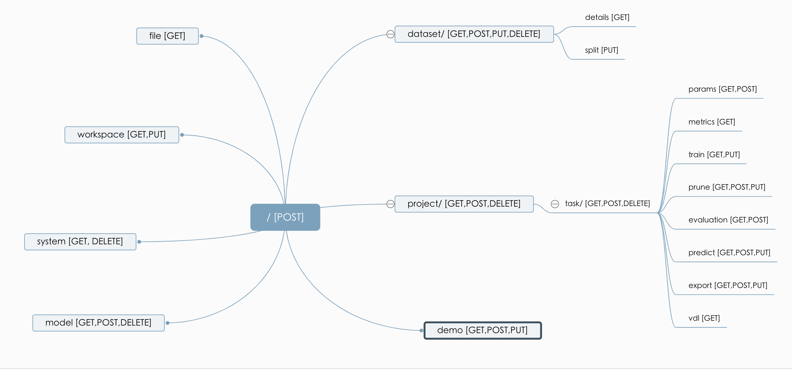

# API 参考文档
## API 总览

图片包含目前PaddleX restful模块提供所有的restful api以及api支持的https请求方式：

- /workspace: 工作空间相关
- /dataset：数据集操作
- /project: 项目操作
- /project/task: 任务相关操作
- /model: 模型相关操作
- /file： 文件传输
- /demo: 示例


## api 接口文档
**说明**：
- 后续例子中https请求通过requests完成，url代表运行paddlex restful服务的主机ip
- 所有的请求，通过ret.status_code是否为200，判断是否正确给Server执行
- 在status_code为200的前提下，如果ret.json()['status']为-1，则表明出错，出错信息在ret.json()['message']里面，如果执行成功， status是1


### /workspace [GET,PUT]
```
methods=='GET':获取工作目录中项目、数据集、任务的属性
	Args：
		struct(str)：结构类型，可以是'dataset', 'project'或'task'，
		id(str)：结构类型对应的id
		attr_list(list):需要获取的属性的列表
	Return：
		status
		if Not Args:
			'dirname' : RESTful服务初始化时指定的工作目录
		else:
			attr(dict):key为属性，value为属性的值

	Example：
		#获取任务id为'T0001'的任务对应的path的值
		params = {'struct': 'task', 'id': 'T0001', 'attr_list': ['path']}
		ret = requests.get(url + '/workspace', json=params)
		if (ret.json()['status'] == 1):
			task_path = ret.json()['attr']['path']
		else:
			print("failed to get path)

methods=='PUT':修改工作目录中项目、数据集、任务的属性
	Args:
		struct(str)：结构类型，可以是'dataset', 'project'或'task'
		id(str)：结构类型对应的id
		attr_dict(dict):key:需要修改的属性，value：需要修改属性的值
	Return:
		status
	Example
		#为id为'P0001'的项目绑定id为'D0001'的数据集
		attr_dict = {'did': 'D0001'}
		params = {'struct': 'project', 'id': 'P0001', 'attr_dict': attr_dict}
		ret = requests.post(url + '/workspace', json=params)
```
**说明：对于可以获取和修改的属性请参考[Protobuf结构化数据](./data_struct.md#Protobuf结构化数据)**


### /dataset
methods = [GET,POST,PUT,DELETE]
```
methods=='GET':获取所有数据集或者单个数据集的信息
	Args：
		did(str, optional):数据集id（可选），如果存在就返回数据集id对应数据集的信息
	Ruturn：
		status
		if 'did' in Args：
			id(str):数据集id，
			dataset_status(int):数据集状态(DatasetStatus)枚举变量的值
			message(str)：数据集状态信息
			attr(dict):数据集属性
		else:
			datasets(list):所有数据集属性的列表
    Example1：
        #获取数据集id为'D0001'数据集的信息
        params = {'did': 'D0001'}
        ret = requests.get(url + '/dataset', json=params)
        #状态码转换为Enum类型
        ret.json()['dataset_status'] = DatasetStatus(ret.json()['dataset_status'])
    Example2：
        #获取所有数据集信息
        ret = requests.get(url + '/dataset')
    Ruturn中的自定数据结构:
		数据集属性attr，为dict对于其中的key包括如下
		attr{
			'type'(str): 数据集类型
			'id'(str): 数据集id
			'name'(str): 数据集名字
			'path'(str): 数据集路径
			'desc'(str): 数据集描述
			'create_time'(str): 数据集创建时间
			'pids'(list): 数据集绑定的项目列表
		}
		所有数据集属性datasets，为list，dataset_list[idx]包含:
		dataset_list[idx]{
			"id": 数据集id
			"attr": 数据集属性
		}
		其中数据集属性attr，为dict对于其中的key包括如下，注意与获取单个数据集的属性区分
		attr{
			"type": 数据集类型,
            "id": 数据集id,
            "name": 数据集名字,
            "path": 数据集路径,
            "desc": 数据集描述,
            "create_time": 数据集创建时间
			'dataset_status': 数据集状态(DatasetStatus)枚举变量的值
            'message' : 数据集状态信息

		}

methods=='POST':创建一个新的数据集
	Args:
		name(str):数据集名字
		desc(str):数据集描述
		dataset_type(str):数据集类型，可以是['classification', 'detection', 'segmentation','instance_segmentation','remote_segmentation']
	Return:
		did(str):数据集id
		status
	Example:
		#新建一个分类数据集
		params = {'name' : '我的数据集', 'desc' : '数据集描述'， 'dataset_type' ： 'classification'}
		ret = requests.post(url + '/dataset'， json=params)
		#获得数据集id
		did = ret.json()['did']

methods=='PUT':异步，向数据集导入数据，支持分类、检测、语义分割、实例分割、摇杆分割数据集类型
	Args：
		did(str)：数据集id
		path(str)：数据集路径
	Return:
		status
	Example:
		#为id为'D0001'的数据集导入数据集
		params = {'did':'D0001'， 'path'：'/path/to/dataset'}
		ret = requests.put(url + '/dataset'， json=params)

methods=='DELETE':删除已有的某个数据集
	Args:
		did(str)：数据集id
	Return:
		status
	Example:
		#删除数据集id为'D0001'的数据集
		params = {'did':'D0001'}
		ret = requests.delete(url + '/dataset'， json=params)
```

### /dataset/details [GET]
```
methods=='GET':获取某个数据集的详细信息
	Args：
		did(str)：数据集id
	Return:
		details(dict)：数据集详细信息，
		status
	Example:
		#获取数据集id为'D0001'的数据集的详细信息
		params = {'did':'D0001'}
		ret = requests.get(url + '/dataset/details'， json=params)
	Ruturn中的自定数据结构:
		数据集详细信息(details)，其中的key包括如下:
		details{
			'file_info'(dict): 全量数据集文件与标签映射表,
			'label_info'(dict): 标签与全量数据集文件映射表,
			'labels'(list): 标签列表,
			'train_files'(list): 训练集文件列表,
			'val_files'(list): 验证集文件列表,
			'test_files'(list): 测试集文件列表
		}
```

### /dataset/split [PUT]
```
methods=='PUT':切分某个数据集
	Args：
		did(str)：数据集id
		val_split(float): 验证集比例
		test_split(float): 测试集比例
	Return:
		status
	Example:
		#按照训练集，验证集，测试集，7：2：1的形式切分D0001数据集
		params = {'did':'D0001', 'val_split': 0.2, 'test_split': 0.1}
		ret = requests.put(url + '/dataset/split'， json=params)
```

### /file [GET]
```
methods=='GET':获取服务端的文件，目前支持图片、xml格式文件
	Args：
		'path'(str):文件在服务端的路径
		'did'(str, optional):可选，数据集id仅在文件为图片时有效。若存在返回图片带label可视化。注意当前不支持分类数据集数据的标注可视化
	Return:
		#数据为图片
		img_data(str)： base64图片数据
		status
		#数据为xml文件
		ret:数据流
		#数据为log文件
		ret:json数据
	Example1:
		#获取图片，目前支持的图片格式有：
		#{'JPEG', 'jpeg', 'JPG', 'jpg', 'BMP', 'bmp', 'PNG', 'png'}
		#图片通过based64编码
		params = {'path' : '/path/to/img'}
		ret = requests.get(url + '/file', json=params)
		#图片数据
		img_data = base64.b64decode(ret.json()['img_data'])
		#图片解码
		#opencv
		img_array = np.frombuffer(img_data, np.uint8)
        img = cv2.imdecode(img_array, cv2.COLOR_RGB2BGR)
        #PIL
        img = Image.open(BytesIO(img_data))
	Example2:
		#获取xml数据
		params = {'path' : '/path/to/xml'}
		ret = requests.get(url + '/file', json=params)
		#xml数据
		xml_file = ret.text
```

### /project [GET,POST,DELETE]
```
methods=='GET':获取指定项目id的信息
	Args:
		'id'(str, optional):项目id，可选，如果存在就返回项目id对应项目的信息
	Return:
		status,
		if 'id' in Args：
			attr(dict):项目属性
		else:
			projects(list):所有项目属性
	Example1:
		#获取id为P0001项目的信息
		params = {'id' : 'P0001'}
		ret = requests.get(url + '/project', json=params)
	Example2:
		#获取所有项目信息
		ret = requests.get(url + '/project', json=params)

methods=='POST':创建一个项目
	Args:
		name(str): 项目名
		desc(str)：项目描述
		project_type(str)：项目类型
	Return:
		pid(str):项目id
		status
	Example:
		#创建一个新的项目，project_type支持{'classification', 'detection', 'segmentation', 'instance_segmentation', 'remote_segmentation')}
		params = {'name' : '分类项目'，'desc': '一个新的项目'，project_type}
		ret = requests.post(url + '/project', json=params)
		#获取项目id
		pid = ret.json()['pid']

methods=='DELETE':删除一个项目，以及项目相关的task
	Args：
		pid(str)：项目id
	Return:
		status
	Example:
		#删除id为'P0001'的项目
		params = {'pid' : 'P0001'}
		ret = requests.delete(url + '/project', json=params)
```

### /project/task [GET,POST,DELETE]
```
methods=='GET':#获取某个任务的信息或者所有任务的信息
	Args：
		tid(str, optional)：任务id，可选，若存在即返回id对应任务的信息
		resume(str, optional):获取是否可以恢复训练的状态，可选，需在存在tid的情况下才生效
		pid(str, optional)：项目id，可选，若存在即返回该项目id下所有任务信息
	Return:
		status
		if 'tid' in Args：
			task_status(int):任务状态(TaskStatus)枚举变量的值
			message(str)：任务状态信息
			resumable(bool):仅Args中存在resume时返回，任务训练是否可以恢复
			max_saved_epochs(int):仅Args中存在resume时返回，当前训练模型保存的最大epoch
		else:
			tasks(list):所有任务属性
	Example1：
		#获取任务id为"T0001"的信息
		params = {'tid' : 'T0001'}
		ret = requests.get(url + '/project/task', json=params)
	Example2：
		#获取所有任务的信息
		ret = requests.get(url + '/project/task')

methods=='POST':#创建任务(训练或者裁剪)
	Args:
		pid(str)：项目id
		train(dict)：训练参数
		desc(str, optional):任务描述，可选
		parent_id(str, optional):可选，若存在即表示新建的任务为裁剪任务，parent_id的值为裁剪任务对应的训练任务id
	Return：
		tid(str):任务id
		status
	Example:
		#在P0001项目下创建一个任务
		params = {'pid' : 'POOO1'}
		ret = requests.post(url + '/project/task')
		#获取任务id
		tid = ret.json()['tid']

methods=='DELETE':#删除任务
	Args:
		tid（str）:任务id
	Return:
		status
	Example:
		#删除id为T0001的任务
		params = {'tid' : 'T0001'}
		ret = requests.delete(url + '/project/task')
```

### /project/task/params [GET,POST]
```
methods=='GET':#获取任务id对应的参数，或者获取项目默认参数
	Args:
		tid（str, optional）:获取任务对应的参数
		pid(str，optional)：获取项目对应的默认参数
		model_type(str，optional)：pid存在下有效，对应项目下获取指定模型的默认参数
		gpu_list(list，optional):pid存在下有效，默认值为[0]，使用指定的gpu并获取相应的默认参数
	Return:
		train(dict):训练或者裁剪的参数
		status
	Example1:
		获取任务id为T0001的任务对应的参数
		params = {'tid' : 'T0001'}
		ret = requests.get(url + '/project/task/params',json=params)
	Example2:
		获取项目id为P0001的检测项目，PPYOLO模型的默认参数
		params = {'pid' : 'P0001', 'model_type' : 'PPYOLO'}
		ret = requests.get(url + '/project/task/params',json=params)
		#获取参数dict
		train_dict = ret.json()['train']
		ret = requests.get(url + '/project/task/params',json=params)  

methods=='POST':#设置任务参数，将前端用户设置训练参数dict保存在后端的pkl文件中
	Args:
		tid(str):任务id
		train(dict)：训练参数
	Return:
		status
	Example:
		#设置训练参数
		params = {'tid': 'T0001', 'train': train_dict}
		ret = requests.post(url + '/project/task/params',json=params)
```

### /project/task/train [POST,PUT]
```
methods=='POST':#异步，启动训练或者裁剪任务
	Args：
		tid(str):任务id
		eval_metric_loss(int，optional):可选，裁剪任务时可用，裁剪任务所需的评估loss
	Return:
		status
	Example:
		#启动任务id为T0001的任务的训练
		params = {'tid':'T0001'}
		ret = requests.post(url + '/project/task/train',json=params)

methods=='PUT':#改变任务训练的状态，即终止训练或者恢复训练
	Args：
		tid(str)：任务id
		act(str)：[stop,resume]暂停或者恢复
		epoch(int)：(resume下可以设置)恢复训练的起始轮数
    Return:
		status
	Example:
		#停止任务id为T0001的任务的训练
		params = {'tid':'T0001', 'act': 'stop'}
		ret = requests.put(url + '/project/task/train',json=params)
```

### /project/task/prune [GET,POST,PUT]
```
methods=='GET':#获取裁剪任务的状态
	Args：
		tid(str):任务id
	Return:
		prune_status(int): 裁剪任务状态(PruneStatus)枚举变量的值
		status
	Example:
		#启动任务id为T0001的任务的训练
		params = {'tid':'T0001'}
		ret = requests.get(url + '/project/task/prune',json=params)

methods=='POST':#异步，创建一个裁剪分析，对于启动裁剪任务前需要先启动裁剪分析
	Args：
		tid(str):任务id
	Return:
		status
	Example:
		#对任务id为T0001的任务启动裁剪分析任务
		params = {'tid':'T0001'}
		ret = requests.post(url + '/project/task/prune',json=params)

methods=='PUT':#改变裁剪分析任务的状态
	Args：
		tid(str):任务id
		act(str):[stop],目前仅支持停止一个裁剪分析任务
	Return
		status
	Example:
		#停止T0001的任务的裁剪分析
		params = {'tid':'T0001', 'act': 'stop'}
		ret = requests.put(url + '/project/task/prune',json=params)
```

### /project/task/evaluate [GET,POST]
```
methods=='GET':#获取模型评估的结果
	Args：
		tid(str):任务id
	Return:
		evaluate_status(int): 任务状态(TaskStatus)枚举变量的值
		message(str)：描述评估任务的信息
		result(dict)：如果评估成功，返回评估结果的dict，否则为None
		status
	Example:
		#获取任务id为T0001的任务的评估数据
		params = {'tid':'T0001'}
		ret = requests.get(url + '/project/task/evaluate',json=params)
		result = ret.json()['result']

methods=='POST':#异步，创建一个评估任务
	Args：
		tid(str):任务id
		epoch(int,optional):需要评估的epoch，如果为None则会评估训练时指标最好的epoch
		topk(int,optional):分类任务topk指标,如果为None默认输入为5
		score_thresh(float):检测任务类别的score threshhold值，如果为None默认输入为0.5
		overlap_thresh(float):实例分割任务IOU threshhold值，如果为None默认输入为0.3
	Return:
		status
	Example:
		#对任务id为T0001的分类任务进行评估，topk=5
		params = {'tid':'T0001', 'epoch': None, 'topk': 5, 'score_thresh': None, 'overlap_thresh': None}
		ret = requests.post(url + '/project/task/evaluate',json=params)
```

### /project/task/metrics [GET]
```
methods=='GET':#获取日志数据
	Args:
		tid(str):任务id
		type(str):可以获取日志的类型，[train,eval,sensitivities,prune]，包括训练，评估，敏感度与模型裁剪率关系图，裁剪的日志
	Return:
		status
		if type == 'train':
			train_log(dict): 训练日志
		elif type == 'eval':
			eval_metrics(dict): 评估结果
		elif type == 'sensitivities':
			sensitivities_loss_img(dict): 敏感度与模型裁剪率关系图
		elif type == 'prune':
			prune_log(dict):裁剪日志
	Example:
		#获取训练日志
		paramas = {'tid': 'T0002', 'type': 'train'}
		ret = requests.get(url + '/project/task/metrics',json=params)
```

### /project/task/predict [GET, POST]
```
methods=='GET':#获取预测状态
	Args：
		tid(str):任务id
	Return:
		predict_status(int): 预测任务状态(PredictStatus)枚举变量的值
		message(str): 预测信息
		status
	Example:
		#获取预测状态
		paramas = {'tid': 'T0002'}
		ret = requests.get(url + '/project/task/predict',json=params)
		predict_status = PredictStatus(ret.json()['predict_status'])

methods=='POST':#创建预测任务，目前仅支持单张图片的预测
	Args:
		tid(str):任务id
		image_data(str):base64编码的image数据
		score_thresh(float，optional):可选，检测任务时有效，检测类别的score threashold值默认是0.5
		epoch(int,float，optional):可选，选择需要做预测的ephoch，默认为评估指标最好的那一个epoch
	Return:
		path(str):服务器上保存预测结果图片的路径
		status
	Example:
		#对一张图片进行预测并取回预测结果
		import base64
		import cv2
		#对图片进行base64编码
		img_path = 'path to img need to be predict'
		f = open(img_path, 'rb')
		base64_data = base64.b64encode(f.read())
		base64_str = str(base64_data,'utf-8')
		params[tid: 'T0001', 'image_data', base64_str]
		#进行预测
		ret = requests.post(url + '/project/task/predict',json=params)
		result_path = ret.json()['path']
		#判断预测是否完成
		paramas = {'tid': 'T0001'}
		ret = requests.get(url + '/project/task/predict',json=params)
		predict_status = PredictStatus(ret.json()['predict_status'])
		if (predict_status == PredictStatus.XPREDONE):
		#取回预测结果图片
			params = {'path' : result_path}
			ret = requests.get(url + '/file',json=params)
			img_data = ret.json()['img_data']

methods=='PUT':#创建预测任务，目前仅支持单张图片的预测
	Args:
		tid(str):任务id
	Return:
	    status
		predict_status:评估的状态
```

### /project/task/export [GET,POST,PUT]

```
methods=='GET':#获取导出模型的状态
	Args：
		tid(str):任务id
		quant(str,optional)可选，[log,result]，导出量模型导出状态，若值为log则返回量化的日志；若值为result则返回量化的结果
	Return:
		status
		if quant == 'log':
			quant_log(dict):量化日志
		if quant == 'result'
			quant_result(dict):量化结果
		if quant not in Args：
			export_status(int):模型导出状态(PredictStatus)枚举变量的值
			message(str):模型导出提示信息
	Example:
		#获取模型导出状态信息
		params = {'tid':'T0002'}
		ret = requests.get(url + '/project/task/export',json=params)

methods=='POST':#导出inference模型或者导出lite模型
	Args:
		tid(str):任务id
		type(str):保存模型的类别[infer,lite]，支持inference模型导出和lite的模型导出
		save_dir(str):保存模型的路径
		quant(bool,optional)可选，type为infer有效，是否导出量化后的模型
		model_path(str,optional)可选，type为lite时有效，inference模型的地址
	Return:
		status
		if type == 'infer':
			save_dir:模型保存路径
		if type == 'lite':
			message:模型保存信息
	Example:
		#导出inference模型
		params = {tid:'T0001', type:'infer', save_dir:'path to save', 'quant': False}
		ret = requests.post(url + '/project/task/export',json=params)
methods=='PUT':#停止导出模型
	Args:
		tid(str):任务id
	Return:
		export_status(int):模型导出状态(PredictStatus)枚举变量的值
		message(str):停止模型导出提示信息
		status
	Example:
		#停止导出模型
		params = {tid:'T0001'}
		ret = requests.put(url + '/project/task/export',json=params)
```

### /project/task/vdl [GET]
```
methods=='GET':#打开某个任务的可视化分析工具(VisualDL)
	Args:
		tid(str):任务id
	Return:
		url(str):vdl地址
		status
	Example:
		#打开任务T0002的vdl
		params = {tid:'T0002'}
		ret = requests.get(url + '/project/task/vdl',json=params)
		#获取打开vdl的url
		url = ret.json()['url']
```

### /system [GET,DELETE]
```
methods=='GET':#获取系统GPU、CPU信息
	Args:
		type(str):[machine_info,gpu_memory_size]选择需要获取的系统信息
	Return:
		status
		if type=='machine_info'
			info(dict):服务端信息
		if type=='gpu_memory_size'
			gpu_mem_infos(list):GPU内存信息
	Example1:
		#获取服务器gpu与cpu信息
		params = {'type': 'machine_info'}
		ret = requests.get(url + 'system', json=params)
		info  = ret.json()['info']
	Example2:
		#获取服务器gpu显存信息
		params = {'type': 'gpu_memory_size'}
		ret = requests.get(url + 'system', json=params)
		gpu_mem_infos = ret.json()['gpu_mem_infos']
#info(dict):服务端信息
info={
	message(str):获取提示信息
	cpu_num(int):cpu个数
	gpu_num(int):gpu个数
	sysstr(str):服务器系统信息
}
#gpu_mem_infos(list):GPU内存信息，对于list里面第i个元素表示第i个GPU的显存信息，包含：
	free:可用显存
	used:已经使用的显存
	total:总共的显存
```

### /demo [GET,POST,PUT]
```
methods=='GET':#获取demo下载进度
	Args:
		prj_type(int):项目类型ProjectType枚举变量的int值
	Return:
		status
		attr(dict):demo下载信息
	Example:
		#分类项目示例demo下载
		params = {'prj_type' = 0}
		ret = requests.get(url + 'demo', json=params)
#attr(dict):demo下载信息，包含
attr={
	status(int):demo下载状态枚举变量DownloadStatus的int值
	progress(float):demo下载进度
}

methods=='POST':#下载或创建demo工程
	Args:
		type(str):{download,load}下载或者创建样例
		prj_type(int):项目类型ProjectType枚举变量的int值
	Return:
		status
		if type=='load':
			did:数据集id
			pid:项目id
	Example1:
		#下载分类demo样例
		params = {'type': 'download', 'prj_type': 0}
		ret = requests.post(url + 'demo', json=params)
	Example2:
		#创建分类demo样例工程
		params = {'type': 'load', 'prj_type': 0}
		ret = requests.post(url + 'demo', json=params)

methods=='PUT':#停止下载或创建demo工程
	Args:
		prj_type(int):项目类型ProjectType枚举变量的int值
	Return:
		status
	Example:
		#停止分类demo下载或者创建
		params = {'prj_type': 0}
		ret = requests.put(url + 'demo', json=params)
```

### /model [GET,POST,DELETE]
```
methods=='GET':#获取一个或者所有模型的信息
	Args:
		mid(str,optional)可选，若存在则返回某个模型的信息
		type(str,optional)可选，[pretrained,exported].若存在则返回对应类型下所有的模型信息
	Return:
		status
		if mid in Args:
			dataset_attr(dict):数据集属性
			task_params(dict):模型训练参数
			eval_result(dict):模型评估结果
		if type in Args and type == 'pretrained':
			pretrained_models(list):所有预训练模型信息
		if type in Args and type == 'exported':
			exported_models(list):所有inference模型的信息
	Example:
		#获取所有保存的预训练模型信息
		params = {'type': 'exported'}
		ret = requests.get(url + 'model', json=params)

methods=='POST':#创建一个模型
	Args:
		pid(str):项目id
		tid(str):任务id
		name(str):模型名字
		type(str):创建模型的类型,[pretrained,exported],pretrained代表创建预训练模型、exported代表创建inference或者lite模型
		source_path(str):仅type为pretrained时有效，训练好的模型的路径
		path(str):仅type为exported时有效，inference或者lite模型的路径
		exported_type(int):0为inference模型，1为lite模型
		eval_results(dict，optional):可选，仅type为pretrained时有效，模型评估的指标
	Return:
		status
		if type == 'pretrained':
			pmid(str):预训练模型id
		if type == 'exported':
			emid(str):inference模型id
	Exampe:
		#创建一个预训练模型
		params={
			pid : 'P0001',
			tid : 'T0001',
			name : 'Pretrain_model',
			type : 'pretrained',
			source_path : '/path/to/pretrian_model',
		}
		ret = requests.post(url + 'model', json=params)

methods=='DELETE':删除一个模型
	Args:
		type(str):删除模型的类型，[pretrained,exported]，pretrained代表创建预训练模型、exported代表创建inference或者lite模型
		if type='pretrained':
			pmid:预训练模型id
		if type='exported':
			emid:inference或者lite模型id
	Return:
		status
	Example:
		#删除模型id为EM0001的inference模型
		params = {'type': 'exported', 'emid': 'EM0001'}
		ret = requests.delete(url + 'model', json=params)
```
