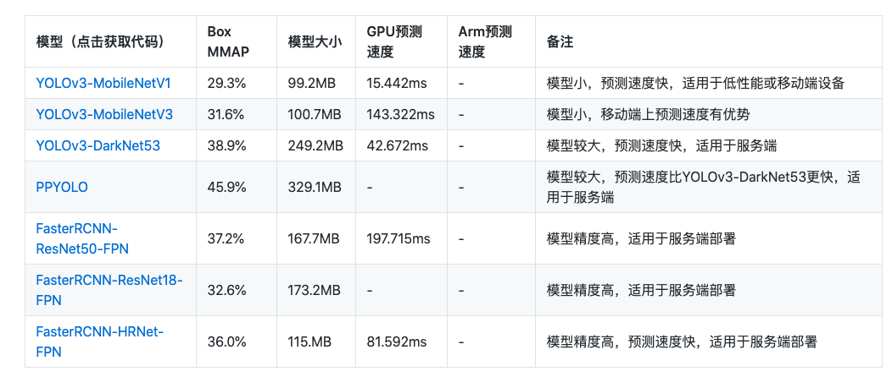

# 目标检测

## 介绍

PaddleX目前提供了FasterRCNN和YOLOv3两种检测结构，多种backbone模型，可满足开发者不同场景和性能的需求。

- **Box MMAP**: 模型在COCO数据集上的测试精度
- **预测速度**：单张图片的预测用时（不包括预处理和后处理)
- "-"表示指标暂未更新



## 开始训练

将代码保存到本地后运行（代码下载链接位于上面的表格），**代码会自动下载训练数据并开始训练**。如保存为`yolov3_mobilenetv1.py`，执行如下命令即可开始训练:

```
python yolov3_mobilenetv1.py
```


## 相关文档

- 【**重要**】针对自己的机器环境和数据，调整训练参数？先了解下PaddleX中训练参数作用。[——>>传送门](../appendix/parameters.md)
- 【**有用**】没有机器资源？使用AIStudio免费的GPU资源在线训练模型。[——>>传送门](https://aistudio.baidu.com/aistudio/projectdetail/450925)
- 【**拓展**】更多目标检测模型，查阅[PaddleX模型库](../appendix/model_zoo.md)和[API使用文档](../apis/models/detection.md)。
