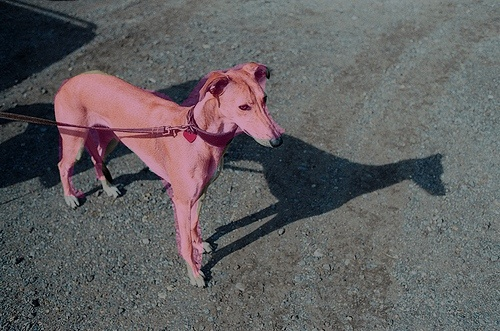

# Loading a model for inference

PaddleX may use `paddlex.load_model` API to load models (including models saved during training, exported deployment models, quantitative models and pruned models) for inference. PaddleX also has a series of built-in visualization tool functions to help you check model effects easily.

**Note**: A model loaded by the `paddlex.load_model` API is used for model inference only. If you want to continue the training on the basis of this model, you can use this model as a pre-training model. The specific procedure is to specify the `pretrain_weights` parameter in the train function as a pre-training model path in the training codes.

## Image classification

[Click to download] the model in the following example codes (https://bj.bcebos.com/paddlex/models/mobilenetv3_small_ssld_imagenet.tar.gz)

```
import paddlex as pdx
test_jpg = 'mobilenetv3_small_ssld_imagenet/test.jpg'
model = pdx.load_model('mobilenetv3_small_ssld_imagenet')
result = model.predict(test_jpg)
print("Predict Result: ", result)
```
The results are outputted as follows:
```
Predict Result: [{'category_id': 549, 'category': 'envelope', 'score': 0.29062933}]
```

The test picture is as follows:


- Classification model predict API [Description document] (../apis/models/classification.html#predict)


## Object detection

[Click to download] the model in the following example codes (https://bj.bcebos.com/paddlex/models/yolov3_mobilenetv1_coco.tar.gz)

```
import paddlex as pdx
test_jpg = 'yolov3_mobilenetv1_coco/test.jpg'
model = pdx.load_model('yolov3_mobilenetv1_coco')

# The predict API does not filter low-confidence recognition results. You shall perform filtering by score value according to requirements
result = model.predict(test_jpg) 

# The visualization results are stored in . /visualized_test.jpg, as shown in the following figure 
pdx.det.visualize(test_jpg, result, threshold=0.3, save_dir='. /')
```
- YOLOv3 model predict API [Description document] (../apis/models/detection.html#predict)
- Visualization pdx.det.visualize API [Description document] (../apis/visualize.html#paddlex-det-visualize)
> Note: For results obtained by calling the `predict` API for object detection and instance segmentation models, you must filter low-confidence results. In the `paddlex.det.visualize` API, we provide a `threshold` for filtering. Any result of which the confidence is smaller than this value will be filtered and will not be visualized.


## Instance segmentation

[Click to download] the model in the following example codes](https://bj.bcebos.com/paddlex/models/mask_r50_fpn_coco.tar.gz)

```
import paddlex as pdx
test_jpg = 'mask_r50_fpn_coco/test.jpg'
model = pdx.load_model('mask_r50_fpn_coco')

# The predict API does not filter low-confidence recognition results. You shall perform filtering by score value according to requirements
result = model.predict(test_jpg) 

# The visualization results are stored in . /visualized_test.jpg, as shown in the following figure
pdx.det.visualize(test_jpg, result, threshold=0.5, save_dir='./')
```
- MaskRCNN model predict API [Description document] (../apis/models/instance_segmentation.html#predict)
- Visualization pdx.det.visualize API [Description document] (../apis/visualize.html#paddlex-det-visualize)

**Note**: For results obtained by calling the `predict` API for object detection and instance segmentation models, you must filter low-confidence results. In the `paddlex.det.visualize` API, we provide a `threshold` for filtering. Any result of which the confidence is smaller than this value will be filtered and will not be visualized. 


## Semantic segmentation

[Click to download] the model in the following example codes (https://bj.bcebos.com/paddlex/models/deeplabv3p_mobilenetv2_voc.tar.gz)

```
import paddlex as pdx 
test_jpg = '. /deeplabv3p_mobilenetv2_voc/test.jpg'
model = pdx.load_model('. /deeplabv3p_mobilenetv2_voc')
result = model.predict(test_jpg)
# The visualization results are stored in . /visualized_test.jpg, as shown in the following figure on the right (The figure on the left is the original figure)
pdx.seg.visualize(test_jpg, result, weight=0.0, save_dir='. /')
```

In the above-mentioned example codes, the inference results of semantic segmentation can be visualized by calling `paddlex.seg.visualize` and the results of the visualization are saved under `save_dir`, as shown in the following figure. The `weight` parameter is used to adjust a weight during the mixed presentation of inference results and original figure results. Only the visualization of inference results mask is shown at 0.0. Only the visualization of the original figure is shown at 1.0.



## Downloading of trained models on public datasets

PaddleX provides some trained models on public datasets. After directly downloading them, you can load and use them by referring to this document.

| Type | Model (Click to download) | Dataset | Size | Index | Index Value |
|:--- | :----------  | :-----------  | :----------  | :---------- | :------------- |
| Image Classification | [MobileNetV3_small_ssld](https://bj.bcebos.com/paddlex/models/mobilenetv3_small_ssld_imagenet.tar.gz) | ImageNet | 13 MB | Accuracy | 71.3% |
| Image Classification | [ResNet50_vd_ssld](https://bj.bcebos.com/paddlex/models/resnet50_vd_ssld_imagenet.tar.gz) | ImageNet | 110MB | Accuracy | 82.4% |
| Object Detection | [FasterRCNN-ResNet50-FPN](https://bj.bcebos.com/paddlex/models/faster_r50_fpn_coco.tar.gz) | MSCOCO | 179MB | Box MAP | 37.7% |
| Object Detection | [YOLOv3-MobileNetV1](https://bj.bcebos.com/paddlex/models/yolov3_mobilenetv1_coco.tar.gz) | MSCOCO | 106MB | Box MAP | 29.3% |
| Object Detection | [YOLOv3-DarkNet53](https://bj.bcebos.com/paddlex/models/yolov3_darknet53_coco.tar.gz) | MSCOCO | 266MB | Box MAP | 34.8% |
| Object Detection | [YOLOv3-MobileNetV3](https://bj.bcebos.com/paddlex/models/yolov3_mobilenetv3_coco.tar.gz) | MSCOCO | 101 MB | Box MAP | 31.6% |
| Instance Segmentation | [MaskRCNN-ResNet50-FPN](https://bj.bcebos.com/paddlex/models/mask_r50_fpn_coco.tar.gz) | MSCOCO | 193 MB | Box MAP/Seg MAP | 38.7% / 34.7% |
| Semantic Segmentation | [DeepLabv3p-Xception65](https://bj.bcebos.com/paddlex/examples/human_seg/models/humanseg_server_params.tar) | Portrait Segmentation | - | mIOU | - |
| Semantic Segmentation | [HRNet_w18_small](https://bj.bcebos.com/paddlex/examples/human_seg/models/humanseg_mobile_params.tar) | Portrait Segmentation | - | mIOU | - |

The `load_model` API of PaddleX can meet your general requirements for model investigation. For inference deployments with higher performance, refer to the following documents

- [Server Python deployment](../deploy/server/python.md)
- [Server C++ deployment](../deploy/server/cpp/index.html)
