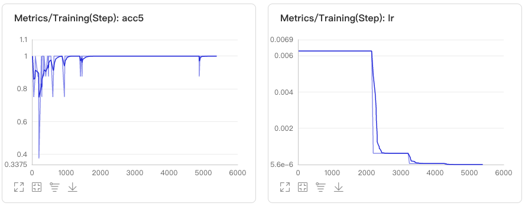
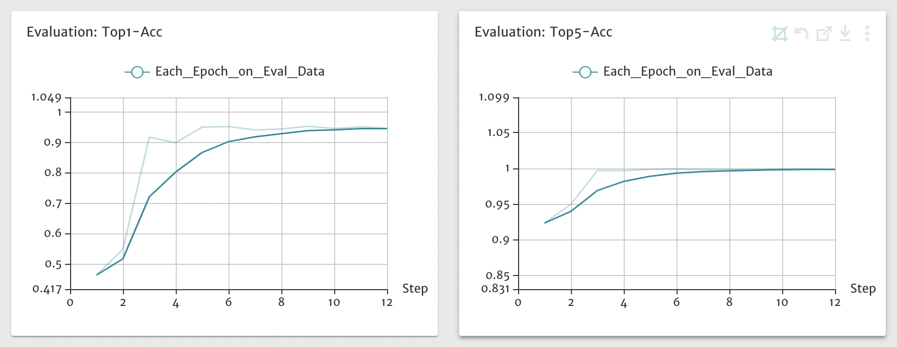

# VisualDL visual training index
In the process of training a model using PaddleX, the training and evaluation indexes are directly output to the standard output stream. At the same time, the indexes in the training process can be visualized through VisualDL by setting the `use_vdl` parameter to `True` when the `train` function is called, as shown in the following codes.
```
model = paddlex.cls. ResNet50(num_classes=1000)
model.train(num_epochs=120, train_dataset=train_dataset,
            train_batch_size=32, eval_dataset=eval_dataset,
            log_interval_steps=10, save_interval_epochs=10,
            save_dir='. /output', use_vdl=True)
```

The `vdl_log` directory is generated under `save_dir` during model training. VisualDL is started by executing the following command at the command line terminal.
```
visualdl --logdir=output/vdl_log --port=8008
```
Open `http://0.0.0.0:8008` on the browser and you can directly view the indexes which dynamically change with training iteration. (0.0.0.0 indicates starting the IP address of the server where VisualDL is located. The local machine uses 0.0.0.0.) 

The example graph of performing visualization using VisualDL during the training of classification models is shown below.

> Change trend of `Loss` and the corresponding `Top1 accuracy rate` in each step during training:


> Change trend of `learning rate` lr and the corresponding `Top5 accuracy rate` in each step during training:


> `Top1 accuracy rate and `Top5 accuracy rate` of the model on the validation dataset every time the model is saved during training:

