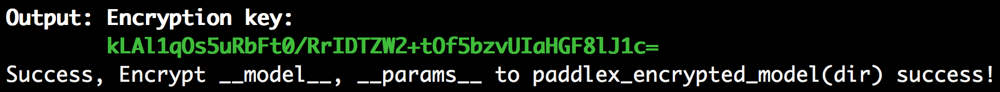

# 模型加密

飞桨团队推出模型加密方案，使用业内主流的AES加密技术对最终模型进行加密。飞桨用户可以通过PaddleX导出模型后，使用该方案对模型进行加密，预测时使用解密SDK进行模型解密并完成推理，大大提升AI应用安全性和开发效率。

**注意：目前加密方案仅支持Linux系统**

## 1. 方案简介

### 1.1 简介

（1）加密算法的选择和支持的库

一般使用OpenSSL库来支持数据的加解密，OpenSSL提供了大量的加解密算法，包括对称加密算法（AES等）和非对称加密算法（RSA等）。

两种算法使用的场景不同，非对称加密算法一般应用于数字签名和密钥协商的场景下，而对称加密算法一般应用于纯数据加密场景，性能更优。在对模型的加密过程中使用对称加密算法。

以下对模型加密场景实现的说明中以开发一个C/C++库为基础，采用AES对称加密算法，为了加解密前后能够快速判断解密是否成功，使用AES-GCM加解密模式，在密钥的安全性上使用长度为256位的密钥数据。

（2）实现模型保护的一般步骤：


下面是对提供的C/C++加解密库内部实现的中文描述，参考以下步骤可以实现 一套加解密库 来适应自己的场景并通过内存数据load到paddlepaddle中（c/c++预测服务）

> 1）考虑到加密的模型文件解密后需要从内存加载数据，使用conbine的模式生成模型文件和参数文件。
>
> 2）项目集成OpenSSL，使用静态库的形式。
>
> 3）实现AES算法接口，借助OpenSSL提供的EVP接口，在EVP接口中指定算法类型，算法使用对称加解密算法中的AES，加解密模式使用AES-GCM， 密钥长度为256位，AES-GCM的实现可以参考官方提供的例子自己进行封装接口：https://wiki.openssl.org/index.php/EVP_Authenticated_Encryption_and_Decryption。
>
> 4）利用OpenSSL库实现SHA256摘要算法，这部分下面有用（可选）。关于SHA256的hash计算可以参考OpenSSL提供的example：https://wiki.openssl.org/index.php/EVP_Message_Digests
>
> 5）在模型加密环节直接对model文件和params文件的数据内容进行加密后保存到新的文件，为了新的文件能够被区分和可迭代，除了加密后的数据外还添加了头部信息，比如为了判断该文件类型使用固定的魔数作为文件的开头；为了便于后面需求迭代写入版本号以示区别；为了能够在解密时判断是否采用了相同的密钥将加密时的密钥进行SHA256计算后存储；这三部分构成了目前加密后文件的头部信息。加密后的文件包含头部信息 + 密文信息。
>
> 6）在模型解密环节根据加密后的文件读取相关的加密数据到内存中，对内存数据使用AES算法进行解密，注意解密时需要采用与加密时一致的加密算法和加密的模式，以及密钥的数据和长度，否则会导致解密后数据错误。
>
> 7）集成模型预测的C/C++库，在具体使用paddlepaddle预测时一般涉及paddle::AnalysisConfig和paddle:Predictor，为了能够从内存数据中直接load解密后的模型明文数据（避免模型解密后创建临时文件），这里需要将AnalysisConfig的模型加载函数从SetModel替换为SetModelBuffer来实现从内存中加载模型数据。

需要注意的是，在本方案中，密钥集成在上层预测服务的代码中。故模型的安全强度等同于代码抵御逆向调试的强度。为了保护密钥和模型的安全，开发者还需对自己的应用进行加固保护。常见的应用加固手段有：代码混淆，二进制文件加壳 等等，亦或将加密机制更改为AES白盒加密技术来保护密钥。这类技术领域内有大量商业和开源产品可供选择，此处不一一赘述。

### 1.2 加密工具

[PaddleX模型加密工具](https://bj.bcebos.com/paddlex/tools/paddlex-encryption.zip)。在编译部署代码时，编译脚本会自动下载加密工具，您也可以选择手动下载。

加密工具包含内容为：
```
paddlex-encryption
├── include # 头文件：paddle_model_decrypt.h（解密）和paddle_model_encrypt.h（加密）
|
├── lib # libpmodel-encrypt.so和libpmodel-decrypt.so动态库
|
└── tool # paddlex_encrypt_tool
```

### 1.3 加密PaddleX模型

对模型完成加密后，加密工具会产生随机密钥信息(用于AES加解密使用），需要在后续加密部署时传入该密钥来用于解密。
> 密钥由32字节key + 16字节iv组成， 注意这里产生的key是经过base64编码后的，这样可以扩充key的选取范围

```
./paddlex-encryption/tool/paddlex_encrypt_tool -model_dir /path/to/paddlex_inference_model -save_dir /path/to/paddlex_encrypted_model
```

`-model_dir`用于指定inference模型路径（参考[导出inference模型](deploy_python.html#inference)将模型导出为inference格式模型），可使用[导出小度熊识别模型](deploy_python.html#inference)中导出的`inference_model`。加密完成后，加密过的模型会保存至指定的`-save_dir`下，包含`__model__.encrypted`、`__params__.encrypted`和`model.yml`三个文件，同时生成密钥信息，命令输出如下图所示，密钥为`kLAl1qOs5uRbFt0/RrIDTZW2+tOf5bzvUIaHGF8lJ1c=`


## 2. PaddleX C++加密部署

参考[Linux平台编译指南](deploy_cpp/deploy_cpp_linux.html#linux)编译C++部署代码。编译成功后，预测demo的可执行程序分别为`build/demo/detector`，`build/demo/classifer`，`build/demo/segmenter`，用户可根据自己的模型类型选择，其主要命令参数说明如下：

|  参数   | 说明  |
|  ----  | ----  |
| model_dir  | 导出的预测模型所在路径 |
| image  | 要预测的图片文件路径 |
| image_list  | 按行存储图片路径的.txt文件 |
| use_gpu  | 是否使用 GPU 预测, 支持值为0或1(默认值为0) |
| use_trt  | 是否使用 TensorTr 预测, 支持值为0或1(默认值为0) |
| gpu_id  | GPU 设备ID, 默认值为0 |
| save_dir | 保存可视化结果的路径, 默认值为"output"，classfier无该参数 |
| key | 加密过程中产生的密钥信息，默认值为""表示加载的是未加密的模型 |


## 样例

可使用[导出小度熊识别模型](deploy_python.html#inference)中的测试图片进行预测。

`样例一`：

不使用`GPU`测试图片 `/path/to/xiaoduxiong.jpeg`  

```shell
./build/demo/detector --model_dir=/path/to/inference_model --image=/path/to/xiaoduxiong.jpeg --save_dir=output --key=kLAl1qOs5uRbFt0/RrIDTZW2+tOf5bzvUIaHGF8lJ1c=
```
`--key`传入加密工具输出的密钥，例如`kLAl1qOs5uRbFt0/RrIDTZW2+tOf5bzvUIaHGF8lJ1c=`, 图片文件`可视化预测结果`会保存在`save_dir`参数设置的目录下。


`样例二`:

使用`GPU`预测多个图片`/path/to/image_list.txt`，image_list.txt内容的格式如下：
```
/path/to/images/xiaoduxiong1.jpeg
/path/to/images/xiaoduxiong2.jpeg
...
/path/to/images/xiaoduxiongn.jpeg
```
```shell
./build/demo/detector --model_dir=/path/to/models/inference_model --image_list=/root/projects/images_list.txt --use_gpu=1 --save_dir=output --key=kLAl1qOs5uRbFt0/RrIDTZW2+tOf5bzvUIaHGF8lJ1c=
```
`--key`传入加密工具输出的密钥，例如`kLAl1qOs5uRbFt0/RrIDTZW2+tOf5bzvUIaHGF8lJ1c=`, 图片文件`可视化预测结果`会保存在`save_dir`参数设置的目录下。
