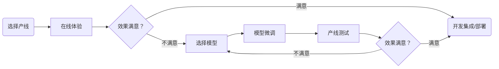

# PaddleX 模型产线开发流程

PaddleX 提供了丰富的模型产线，模型产线由一个或多个模型组合实现，每个模型产线都能够解决特定的场景任务问题。PaddleX 所提供的模型产线均支持在线体验，如果效果不及预期，也同样支持使用私有数据微调模型，并且 PaddleX 提供了 Python API，方便将产线集成到个人项目中。具体步骤如下：

1. 【**选择产线**】：了解 PaddleX 支持的模型产线[模型产线列表](./support_pipeline_list.md)，根据场景任务选择对应的产线；
2. 【**在线体验**】点击对应产线的“星河社区体验地址”，前往[AI Studio 星河社区](https://aistudio.baidu.com/pipeline/mine)进行在线体验；
3. 【**选择模型**】（可选）对产线中效果不及预期的模块进行微调，首先根据模块参考文档[模型选择](./model_select.md)选择可替换的模型；
4. 【**模型微调**】（可选）选择好对应的模型后，即可进行模型训练，具体参考[模型训练、评估和推理](../base/README.md)；
5. 【**产线测试**】（可选）将产线中的模型替换为微调后的模型进行测试，具体参考[模型产线开发工具推理预测](./pipeline_inference_tools.md);
6. 【**开发集成/部署**】使用 PaddleX Python API，将模型产线集成到个人项目中，具体参考[模型产线推理 Python API 文档](./pipeline_inference_api.md)。

**PaddleX 模型产线开发流程图**

