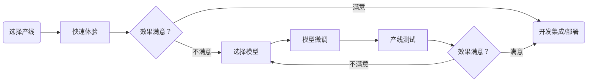

# PaddleX 模型产线开发工具

**<center>PaddleX 模型产线开发流程图</center>**



PaddleX 提供了丰富的模型产线，模型产线由一个或多个模型组合实现，每个模型产线都能够解决特定的场景任务问题。PaddleX 所提供的模型产线均支持快速体验，如果效果不及预期，也同样支持使用私有数据微调模型，并且 PaddleX 提供了 Python API，方便将产线集成到个人项目中。在使用之前，您首先需要安装 PaddleX， 安装方式请参考[PaddleX 安装](../INSTALL.md)。此处以一个车牌识别的任务为例子，介绍模型产线工具的使用流程。

- 1.【**选择产线**】：首先，需要根据您的任务场景，选择对应的 PaddleX 产线，此处为车牌识别，需要了解到这个任务属于 OCR 任务，对应 PaddleX 的通用 OCR 产线。如果无法确定任务和产线的对应关系，您可以在 PaddleX 支持的模型产线[模型产线列表](./support_pipeline_list.md)中了解相关产线的能力介绍。
- 2.【**快速体验**】PaddleX 提供了两种体验的方式，一种是可以直接通过 PaddleX wheel 包在本地体验，另外一种是可以在**AI Studio 星河社区**上体验。
  - 本地体验方式：
    ```bash
    paddlex --pipeline OCR --model PP-OCRv4_mobile_det PP-OCRv4_mobile_rec --input https://paddle-model-ecology.bj.bcebos.com/paddlex/imgs/demo_image/general_ocr_002.png --device gpu:0
    ```
    **注：** 通用 OCR 产线是一个多模型串联的产线，包含文本检测模型（如 `PP-OCRv4_mobile_det`）和文本识别模型（如 `PP-OCRv4_mobile_rec`），因此需要指定两个模型进行体验。
  - 星河社区体验方式：前往[AI Studio 星河社区](https://aistudio.baidu.com/pipeline/mine)，点击【创建产线】，创建**通用 OCR** 产线进行快速体验；
- 3.【**选择模型**】（可选）当体验完该产线之后，需要确定产线是否符合预期（包含精度、速度等），产线包含的模型是否需要继续微调，如果模型的速度或者精度不符合预期，则需要根据[模型选择](./model_select.md)选择可替换的模型继续测试，确定效果是否满意。如果最终效果均不满意，则需要微调模型。在确定微调的模型时，需要根据测试的情况确定微调其中的哪个模型，如发现文字的定位不准，则需要微调文本检测模型，如果发现文字的识别不准，则需要微调文本识别模型。  
- 4.【**模型微调**】（可选）在第 3 步选择好对应的模型后，即可使用**单模型开发工具**以低代码的方式进行模型微调训练和优化，如此处需要优化文本识别模型（`PP-OCRv4_mobile_rec`），则只需要完成【数据校验】和【模型训练】，二者命令如下：

  ```bash
  # 数据校验
  python main.py -c paddlex/configs/text_recognition/PP-OCRv4_mobile_rec.yaml \
      -o Global.mode=check_dataset \
      -o Global.dataset_dir=your/dataset_dir
  # 模型训练
  python main.py -c paddlex/configs/text_recognition/PP-OCRv4_mobile_rec.yaml \
      -o Global.mode=train \
      -o Global.dataset_dir=your/dataset_dir
  ```
  关于模型更多的训练和优化内容，请参考[PaddleX 单模型开发工具](../models/model_develop_tools.md)；
- 5.【**产线测试**】（可选）将产线中的模型替换为微调后的模型进行测试，如：
    ```bash
    paddlex --pipeline OCR --model PP-OCRv4_mobile_det PP-OCRv4_mobile_rec --model_dir None "your/model_dir" --input https://paddle-model-ecology.bj.bcebos.com/paddlex/imgs/demo_image/general_ocr_002.png --device gpu:0
    ```
  此处更多内容，参考[模型产线推理预测](./pipeline_inference.md)，此处如果效果满意，可以跳到第 6 步，如果效果不满意，则可以回到第 4 步继续微调模型。
- 6.【**开发集成/部署**】

  此处提供轻量级的 PaddleX Python API 的集成方式，也提供高性能推理/服务化部署的方式部署模型。 PaddleX Python API 的集成方式如下：

  ```python
    import cv2
    from paddlex import OCRPipeline
    from paddlex import PaddleInferenceOption
    from paddlex.pipelines.OCR.utils import draw_ocr_box_txt

    # 实例化 PaddleInferenceOption 设置推理配置
    kernel_option = PaddleInferenceOption()
    kernel_option.set_device("gpu:0")

    pipeline = OCRPipeline(
        'PP-OCRv4_mobile_det',
        'PP-OCRv4_mobile_rec',
        text_det_kernel_option=kernel_option,
        text_rec_kernel_option=kernel_option,)
    result = pipeline.predict(
        {"input_path": "https://paddle-model-ecology.bj.bcebos.com/paddlex/imgs/demo_image/general_ocr_002.png"},
    )

    draw_img = draw_ocr_box_txt(result['original_image'], result['dt_polys'], result["rec_text"])
    cv2.imwrite("ocr_result.jpg", draw_img[:, :, ::-1])
  ```
  其他产线的 Python API 集成方式可以参考[PaddleX 模型产线推理预测](./pipeline_inference.md)。

  PadleX 同样提供了高性能的离线部署和服务化部署方式，具体参考[基于 FastDeploy 的模型产线部署](./pipeline_deployment_with_fastdeploy.md)。
