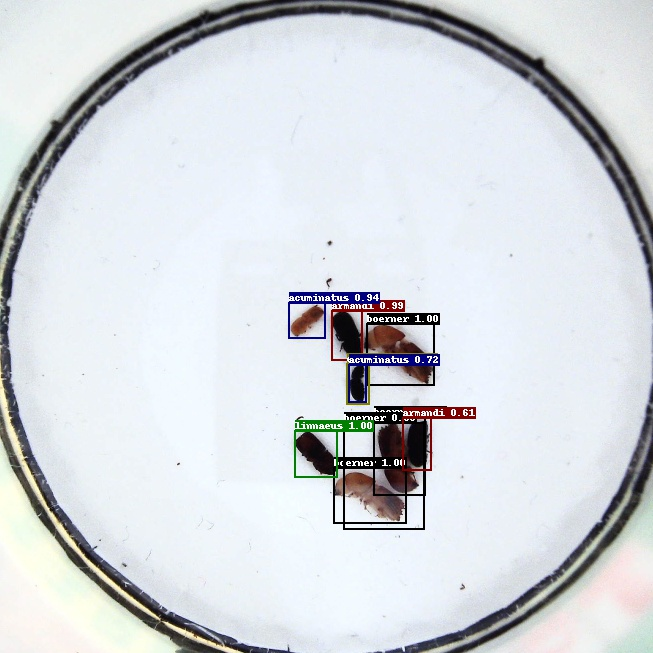

# 训练目标检测模型

------

更多检测模型在VOC数据集或COCO数据集上的训练代码可参考[代码tutorials/train/detection/faster_rcnn_r50_fpn.py](https://github.com/PaddlePaddle/PaddleX/blob/develop/tutorials/train/detection/faster_rcnn_r50_fpn.py)、[代码tutorials/train/detection/yolov3_darknet53.py](https://github.com/PaddlePaddle/PaddleX/blob/develop/tutorials/train/detection/yolov3_darknet53.py)。

**1.下载并解压训练所需的数据集**

> 使用1张显卡训练并指定使用0号卡。

```python
import os
os.environ['CUDA_VISIBLE_DEVICES'] = '0'
import paddlex as pdx
```

> 这里使用昆虫数据集，训练集、验证集和测试集共包含217个样本，6个类别。

```python
insect_dataset = 'https://bj.bcebos.com/paddlex/datasets/insect_det.tar.gz'
pdx.utils.download_and_decompress(insect_dataset, path='./')
```

**2.定义训练和验证过程中的数据处理和增强操作**

> 在训练过程中使用`RandomHorizontalFlip`进行数据增强，由于接下来选择的模型是带FPN结构的Faster RCNN，所以使用`Padding`将输入图像的尺寸补齐到32的倍数，以保证FPN中两个需做相加操作的特征层的尺寸完全相同。transforms的使用见[paddlex.det.transforms](../../apis/transforms/det_transforms.md)

```python
from paddlex.det import transforms
train_transforms = transforms.Compose([
    transforms.RandomHorizontalFlip(),
    transforms.Normalize(),
    transforms.ResizeByShort(short_size=800, max_size=1333),
    transforms.Padding(coarsest_stride=32)
])

eval_transforms = transforms.Compose([
    transforms.Normalize(),
    transforms.ResizeByShort(short_size=800, max_size=1333),
    transforms.Padding(coarsest_stride=32),
])
```

**3.创建数据集读取器，并绑定相应的数据预处理流程**

> 数据集读取器的介绍见文档[paddlex.datasets](../../apis/datasets.md)

```python
train_dataset = pdx.datasets.VOCDetection(
    data_dir='insect_det',
    file_list='insect_det/train_list.txt',
    label_list='insect_det/labels.txt',
    transforms=train_transforms,
    shuffle=True)
eval_dataset = pdx.datasets.VOCDetection(
    data_dir='insect_det',
    file_list='insect_det/val_list.txt',
    label_list='insect_det/labels.txt',
    transforms=eval_transforms)
```

**4.创建Faster RCNN模型，并进行训练**

> 创建带FPN结构的Faster RCNN模型，`num_classes` 需要设置为包含背景类的类别数，即: 目标类别数量(6) + 1

```python
num_classes = len(train_dataset.labels) + 1
model = pdx.det.FasterRCNN(num_classes=num_classes)
```

> 模型训练默认下载并使用在ImageNet数据集上训练得到的Backone，用户也可自行指定`pretrain_weights`参数来设置预训练权重。训练过程每间隔`save_interval_epochs`会在`save_dir`保存一次模型，与此同时也会在验证数据集上计算指标。检测模型的接口可见文档[paddlex.cv.models](../../apis/models.md#fasterrcnn)

```python
model.train(
    num_epochs=12,
    train_dataset=train_dataset,
    train_batch_size=2,
    eval_dataset=eval_dataset,
    learning_rate=0.0025,
    lr_decay_epochs=[8, 11],
    save_dir='output/faster_rcnn_r50_fpn',
    use_vdl=True)
```

> 将`use_vdl`设置为`True`时可使用VisualDL查看训练指标。按以下方式启动VisualDL后，浏览器打开 https://0.0.0.0:8001即可。其中0.0.0.0为本机访问，如为远程服务, 改成相应机器IP。

```shell
visualdl --logdir output/faster_rcnn_r50_fpn/vdl_log --port 8001
```

**5.验证或测试**

> 训练完利用模型可继续在验证集上进行验证。

```python
eval_metrics = model.evaluate(eval_dataset, batch_size=2)
print("eval_metrics:", eval_metrics)
```

> 结果输出：

```python
eval_metrics: {'bbox_map': 76.085371}

```

> 训练完用模型对图片进行测试。

```python
predict_result = model.predict('./insect_det/JPEGImages/1968.jpg')
```

> 可视化测试结果：

```python
pdx.det.visualize('./insect_det/JPEGImages/1968.jpg', predict_result, threshold=0.5, save_dir='./output/faster_rcnn_r50_fpn')
```


