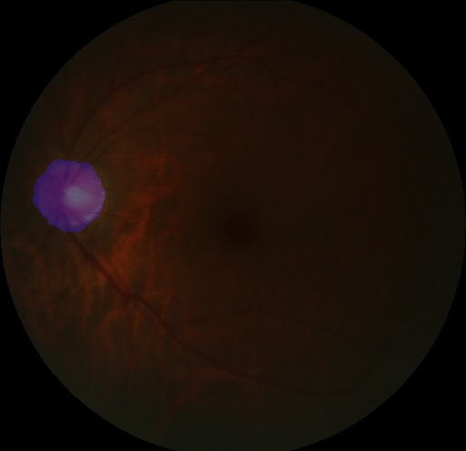

# 训练语义分割模型

---
更多语义分割模型在视盘数据集上的训练代码可参考[代码tutorials/train/segmentation/deeplabv3p.py](https://github.com/PaddlePaddle/PaddleX/blob/develop/tutorials/train/segmentation/deeplabv3p.py)。

**1.下载并解压训练所需的数据集**

> 使用1张显卡训练并指定使用0号卡。

```python
import os
os.environ['CUDA_VISIBLE_DEVICES'] = '0'
import paddlex as pdx
```

> 这里使用视盘分割数据集，训练集、验证集和测试集共包含343个样本，2个类别。

```python
optic_dataset = 'https://bj.bcebos.com/paddlex/datasets/optic_disc_seg.tar.gz'
pdx.utils.download_and_decompress(optic_dataset, path='./')
```

**2.定义训练和验证过程中的数据处理和增强操作**

> 在训练过程中使用`RandomHorizontalFlip`和`RandomPaddingCrop`进行数据增强，transforms的使用见[paddlex.seg.transforms](../../apis/transforms/seg_transforms.md)

```python
train_transforms = transforms.Compose([
    transforms.RandomHorizontalFlip(),
    transforms.Resize(target_size=512),
    transforms.RandomPaddingCrop(crop_size=500),
    transforms.Normalize()
])
eval_transforms = transforms.Compose([
    transforms.Resize(512),
    transforms.Normalize()
])
```

**3.创建数据集读取器，并绑定相应的数据预处理流程**

> 数据集读取器的介绍见文档[paddlex.cv.datasets](../../apis/datasets.md)

```python
train_dataset = pdx.datasets.SegDataset(
    data_dir='optic_disc_seg',
    file_list='optic_disc_seg/train_list.txt',
    label_list='optic_disc_seg/labels.txt',
    transforms=train_transforms,
    shuffle=True)
eval_dataset = pdx.datasets.SegDataset(
    data_dir='optic_disc_seg',
    file_list='optic_disc_seg/val_list.txt',
    label_list='optic_disc_seg/labels.txt',
    transforms=eval_transforms)
```

**4.创建DeepLabv3+模型，并进行训练**

> 创建DeepLabv3+模型，`num_classes` 需要设置为不包含背景类的类别数，即: 目标类别数量(1)，详细代码可参见[demo](https://github.com/PaddlePaddle/PaddleX/blob/develop/tutorials/train/segmentation/deeplabv3p.py#L44)。

```python
num_classes = num_classes
model = pdx.seg.DeepLabv3p(num_classes=num_classes)
```

> 模型训练默认下载并使用在ImageNet数据集上训练得到的Backone，用户也可自行指定`pretrain_weights`参数来设置预训练权重。
训练过程每间隔`save_interval_epochs`会在`save_dir`保存一次模型，与此同时也会在验证数据集上计算指标。
检测模型的接口可见文档[paddlex.seg.models](../../apis/models.md)。

```python
model.train(
    num_epochs=40,
    train_dataset=train_dataset,
    train_batch_size=4,
    eval_dataset=eval_dataset,
    learning_rate=0.01,
    save_dir='output/deeplab',
    use_vdl=True)
```

> 将`use_vdl`设置为`True`时可使用VisualDL查看训练指标。按以下方式启动VisualDL后，浏览器打开 https://0.0.0.0:8001即可。其中0.0.0.0为本机访问，如为远程服务, 改成相应机器IP。

```shell
visualdl --logdir output/deeplab/vdl_log --port 8001
```

**5.验证或测试**

> 训练完利用模型可继续在验证集上进行验证。

```python
eval_metrics = model.evaluate(eval_dataset, batch_size=2)
print("eval_metrics:", eval_metrics)
```

> 结果输出：

```python
eval_metrics: {'miou': 0.8915175875548873, 'category_iou': [0.9956445981924432, 0.7873905769173314], 'macc': 0.9957137358816046, 'category_acc': [0.9975360650317765, 0.8948120441157331], 'kappa': 0.8788684558629085}
```

> 训练完用模型对图片进行测试。

```python
image_name = 'optic_disc_seg/JPEGImages/H0005.jpg'
predict_result = model.predict(image_name)
```

> 可视化测试结果：

```python
import paddlex as pdx
pdx.seg.visualize(image_name, predict_result, weight=0.4)
```


