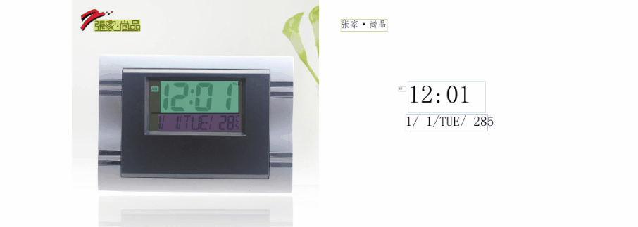

# 通用OCR产线使用教程

## 1. OCR产线介绍
OCR（光学字符识别，Optical Character Recognition）是一种将图像中的文字转换为可编辑文本的技术。它广泛应用于文档数字化、信息提取和数据处理等领域。OCR 可以识别印刷文本、手写文本，甚至某些类型的字体和符号。

通用 OCR 产线用于解决文字识别任务，提取图片中的文字信息以文本形式输出，PP-OCRv4 是一个端到端 OCR 串联系统，可实现 CPU 上毫秒级的文本内容精准预测，在通用场景上达到开源SOTA。基于该项目，产学研界多方开发者已快速落地多个 OCR 应用，使用场景覆盖通用、制造、金融、交通等各个领域。




**通用OCR产线中包含了文本检测模块和文本识别模块**，每个模块中包含了若干模型，具体使用哪些模型，您可以根据下边的 benchmark 数据来选择。**如您更考虑模型精度，请选择精度较高的模型，如您更考虑模型推理速度，请选择推理速度较快的模型，如您更考虑模型存储大小，请选择存储大小较小的模型**。

<table>
  <tr>
    <th>产线模块</th>
    <th>具体模型</th>
    <th>精度</th>
    <th>GPU推理耗时 (ms)</th>
    <th>CPU推理耗时</th>
    <th>模型存储大小 (M)</th>
    <th>配置文件</th>
  </tr>
  <tr>
    <td rowspan="2">文本检测</td>
    <td>PP-OCRv4_mobile_det</td>
    <td>77.79</td>
    <td>2.719474</td>
    <td>79.1097</td>
    <td>15</td>
    <td>PP-OCRv4_server_det.yaml</td>
  </tr>
  <tr>
    <td>PP-OCRv4_server_det</td>
    <td>82.69</td>
    <td>22.20346</td>
    <td>2662.158</td>
    <td>198</td>
    <td>PP-OCRv4_mobile_det.yaml</td>
  </tr>
  <tr>
    <td rowspan="5">文本识别</td>
    <td>PP-OCRv4_mobile_rec</td>
    <td>78.20</td>
    <td>2.719474</td>
    <td>79.1097</td>
    <td>15</td>
    <td>PP-OCRv4_mobile_rec.yaml</td>
  </tr>
  <tr>
    <td>PP-OCRv4_server_rec</td>
    <td>79.20</td>
    <td>22.20346</td>
    <td>2662.158</td>
    <td>198</td>
    <td>PP-OCRv4_server_rec.yaml</td>
  </tr>
  <tr>
    <td>ch_RepSVTR_rec</td>
    <td>65.07</td>
    <td></td>
    <td></td>
    <td>22.1 M</td>
    <td>ch_RepSVTR_rec.yaml</td>
  </tr>
  <tr>
    <td>ch_SVTRv2_rec</td>
    <td>68.81</td>
    <td></td>
    <td></td>
    <td>73.9 M</td>
    <td>ch_SVTRv2_rec.yaml</td>
  </tr>
</table>


**注：文本检测模型精度指标为 Hmean(%)，文本识别模型精度指标为 Accuracy(%)。**

## 2. 快速开始
PaddleX 所提供的预训练的模型产线均可以快速体验效果，你可以在线体验通用OCR产线的效果，也可以在本地使用命令行或 Python 体验通用 OCR 产线的效果。

### 2.1 在线体验
您可以[在线体验](https://aistudio.baidu.com/community/app/91660/webUI?source=appMineRecent)通用 OCR 产线的效果，用官方提供的 Demo 图片进行识别，例如：


如果您对产线运行的效果满意，可以直接对产线进行集成部署，您可以直接从云端下载部署包，也可以使用[2.2节本地集成](#3-开发集成部署)的方式。如果不满意，您也可以利用私有数据**对产线中的模型进行在线微调**。

### 2.2 本地体验
> ❗ 在本地使用通用OCR产线前，请确保您已经按照[PaddleX安装教程](../../../installation/installation.md)完成了PaddleX的wheel包安装。

#### 2.2.1 命令行方式体验
* 一行命令即可快速体验OCR产线效果:

```bash
paddlex --pipeline OCR --input https://paddle-model-ecology.bj.bcebos.com/paddlex/imgs/demo_image/general_ocr_002.png --device gpu:0
```
参数说明：

```
--pipeline：产线名称，此处为OCR产线
--input：待处理的输入图片的本地路径或URL
--device 使用的GPU序号（例如gpu:0表示使用第0块GPU，gpu:1,2表示使用第1、2块GPU），也可选择使用CPU（--device cpu）
```

> ❗ 执行后，将提示选择 OCR 产线配置文件保存路径，默认保存至*当前目录*，也可 *自定义路径*。此外，也可在执行命令时加入 `-y` 参数，则可跳过路径选择，直接将产线配置文件保存至当前目录。

* 获取产线配置文件后，可将 `--pipeline` 替换为配置文件保存路径，即可使配置文件生效。例如，若配置文件保存路径为 `./ocr.yaml`，只需执行：

```bash
paddlex --pipeline ./ocr.yaml --input https://paddle-model-ecology.bj.bcebos.com/paddlex/imgs/demo_image/general_ocr_002.png
```
其中，`--model`、`--device` 等参数无需指定，将使用配置文件中的参数。若依然指定了参数，将以指定的参数为准。

运行后，得到的结果为：
<details>
   <summary> 👉点击展开</summary>

```bash
{'img_path': '/root/.paddlex/predict_input/general_ocr_002.png', 'dt_polys': [[[5, 12], [88, 10], [88, 29], [5, 31]], [[208, 14], [249, 14], [249, 22], [208, 22]], [[695, 15], [824, 15], [824, 60], [695, 60]], [[158, 27], [355, 23], [356, 70], [159, 73]], [[421, 25], [659, 19], [660, 59], [422, 64]], [[337, 104], [460, 102], [460, 127], [337, 129]], [[486, 103], [650, 100], [650, 125], [486, 128]], [[675, 98], [835, 94], [835, 119], [675, 124]], [[64, 114], [192, 110], [192, 131], [64, 134]], [[210, 108], [318, 106], [318, 128], [210, 130]], [[82, 140], [214, 138], [214, 163], [82, 165]], [[226, 136], [328, 136], [328, 161], [226, 161]], [[404, 134], [432, 134], [432, 161], [404, 161]], [[509, 131], [570, 131], [570, 158], [509, 158]], [[730, 138], [771, 138], [771, 154], [730, 154]], [[806, 136], [817, 136], [817, 146], [806, 146]], [[342, 175], [470, 173], [470, 197], [342, 199]], [[486, 173], [616, 171], [616, 196], [486, 198]], [[677, 169], [813, 166], [813, 191], [677, 194]], [[65, 181], [170, 177], [171, 202], [66, 205]], [[96, 208], [171, 205], [172, 230], [97, 232]], [[336, 220], [476, 215], [476, 237], [336, 242]], [[507, 217], [554, 217], [554, 236], [507, 236]], [[87, 229], [204, 227], [204, 251], [87, 254]], [[344, 240], [483, 236], [483, 258], [344, 262]], [[66, 252], [174, 249], [174, 271], [66, 273]], [[75, 279], [264, 272], [265, 297], [76, 303]], [[459, 297], [581, 295], [581, 320], [459, 322]], [[101, 314], [210, 311], [210, 337], [101, 339]], [[68, 344], [165, 340], [166, 365], [69, 368]], [[345, 350], [662, 346], [662, 368], [345, 371]], [[100, 459], [832, 444], [832, 465], [100, 480]]], 'dt_scores': [0.8183103704439653, 0.7609575621092027, 0.8662357274035412, 0.8619508290334809, 0.8495855993183273, 0.8676840017933314, 0.8807986687956436, 0.822308525056085, 0.8686617037621976, 0.8279022169854463, 0.952332847006758, 0.8742692553015098, 0.8477013022907575, 0.8528771493227294, 0.7622965906848765, 0.8492388224448705, 0.8344203789965632, 0.8078477124353284, 0.6300434587457232, 0.8359967356998494, 0.7618617265751318, 0.9481573079350023, 0.8712182945408912, 0.837416955846334, 0.8292475059403851, 0.7860382856406026, 0.7350527486717117, 0.8701022267947695, 0.87172526903969, 0.8779847108088126, 0.7020437651809734, 0.6611684983372949], 'rec_text': ['www.997', '151', 'PASS', '登机牌', 'BOARDING', '舱位 CLASS', '序号SERIALNO.', '座位号SEATNO', '航班 FLIGHT', '日期DATE', 'MU 2379', '03DEC', 'W', '035', 'F', '1', '始发地FROM', '登机口 GATE', '登机时间BDT', '目的地TO', '福州', 'TAIYUAN', 'G11', 'FUZHOU', '身份识别IDNO.', '姓名NAME', 'ZHANGQIWEI', '票号TKTNO.', '张祺伟', '票价FARE', 'ETKT7813699238489/1', '登机口于起飞前10分钟关闭GATESCLOSE1OMINUTESBEFOREDEPARTURETIME'], 'rec_score': [0.9617719054222107, 0.4199012815952301, 0.9652514457702637, 0.9978302121162415, 0.9853208661079407, 0.9445787072181702, 0.9714463949203491, 0.9841841459274292, 0.9564052224159241, 0.9959094524383545, 0.9386572241783142, 0.9825271368026733, 0.9356589317321777, 0.9985442161560059, 0.3965512812137604, 0.15236201882362366, 0.9976775050163269, 0.9547433257102966, 0.9974752068519592, 0.9646636843681335, 0.9907559156417847, 0.9895358681678772, 0.9374122023582458, 0.9909093379974365, 0.9796401262283325, 0.9899340271949768, 0.992210865020752, 0.9478569626808167, 0.9982215762138367, 0.9924325942993164, 0.9941263794898987, 0.96443772315979]}
......
```
</details>

可视化结果如下：

可视化图片默认保存在 `output` 目录下，您也可以通过 `--save_path` 进行自定义。
#### 2.2.2 Python脚本方式集成 
* 几行代码即可完成产线的快速推理，以通用 OCR 产线为例：

```python
from paddlex import create_pipeline

pipeline = create_pipeline(pipeline="ocr")

output = pipeline.predict("pre_image.jpg")
for batch in output:
    for item in batch:
        res = item['result']
        res.print()
        res.save_to_img("./output/")
        res.save_to_json("./output/")
```
> ❗ Python脚本运行得到的结果与命令行方式相同。

在上述 Python 脚本中，执行了如下几个步骤：

（1）实例化 `create_pipeline` 实例化 OCR 产线对象：具体参数说明如下：
  
|参数|参数说明|参数类型|默认值|
|-|-|-|-|
|`pipeline`|产线名称或是产线配置文件路径。如为产线名称，则必须为 PaddleX 所支持的产线。|`str`|无|
|`device`|产线模型推理设备。支持：“gpu”，“cpu”。|`str`|`gpu`|
|`enable_hpi`|是否启用高性能推理，仅当该产线支持高性能推理时可用。|`bool`|`False`|

（2）调用OCR产线对象的 `predict` 方法进行推理预测：`predict` 方法参数为`x`，用于输入待预测数据，支持多种输入方式，具体示例如下：

| 参数类型      | 参数说明                                                                                                  |
|---------------|-----------------------------------------------------------------------------------------------------------|
| "Python Var"    | "支持直接传入Python变量，如numpy.ndarray表示的图像数据。"                                                    |
| "str"           | "支持传入待预测数据文件路径，如图像文件的本地路径：`/root/data/img.jpg`。"                                   |
| "str"           | "支持传入待预测数据文件URL，如图像文件的网络URL：[示例](https://paddle-model-ecology.bj.bcebos.com/paddlex/imgs/demo_image/general_ocr_001.png)。" |
| "str"           | "支持传入本地目录，该目录下需包含待预测数据文件，如本地路径：`/root/data/`。"                                |
| "dict"          | "支持传入字典类型，字典的key需与具体任务对应，如图像分类任务对应\"img\"，字典的val支持上述类型数据，例如：`{\"img\": \"/root/data1\"}`。" |
| "list"          | "支持传入列表，列表元素需为上述类型数据，如[numpy.ndarray, numpy.ndarray]，`[\"/root/data/img1.jpg\", \"/root/data/img2.jpg\"]`，`[\"/root/data1\", \"/root/data2\"]`，`[{\"img\": \"/root/data1\"}, {\"img\": \"/root/data2/img.jpg\"}]`。"|

（3）调用`predict`方法获取预测结果：`predict` 方法为`generator`，因此需要通过调用获得预测结果，`predict`方法以batch为单位对数据进行预测，因此预测结果为list形式表示的一组预测结果
（4）对预测结果进行处理：每个样本的预测结果均为`dict`类型，且支持打印，或保存为文件，支持保存的类型与具体产线相关，如：

| 方法         | 说明                        | 方法参数                                                                                               |
|--------------|-----------------------------|--------------------------------------------------------------------------------------------------------|
| print        | 打印结果到终端              | - format_json：bool类型，是否对输出内容进行使用json缩进格式化，默认为True；<br>- indent：int类型，json格式化设置，仅当format_json为True时有效，默认为4；<br>- ensure_ascii：bool类型，json格式化设置，仅当format_json为True时有效，默认为False； |
| save_to_json | 将结果保存为json格式的文件   | - save_path：str类型，保存的文件路径，当为目录时，保存文件命名与输入文件类型命名一致；<br>- indent：int类型，json格式化设置，默认为4；<br>- ensure_ascii：bool类型，json格式化设置，默认为False； |
| save_to_img  | 将结果保存为图像格式的文件  | - save_path：str类型，保存的文件路径，当为目录时，保存文件命名与输入文件类型命名一致； |

**注：**

* 在执行上述Python脚本时，加载的是默认的OCR产线配置文件，若您需要自定义配置文件，可执行如下命令获取：

```bash
paddlex --get_pipeline_config OCR
```

* 执行后，OCR产线配置文件将被保存在当前路径。若您希望自定义保存位置，可执行如下命令（假设自定义保存位置为` ./my_path`）：

```bash
paddlex --get_pipeline_config OCR --config_save_path ./my_path
```
* 获取配置文件后，即可对OCR产线各项配置进行自定义，只需要修改 `create_pipeline` 方法中的 `pipeline` 参数值为产线配置文件路径即可。

例如，若您的配置文件保存在 `./my_path/ocr.yaml` ，则只需执行：

```python
from paddlex import create_pipeline
pipeline = create_pipeline(pipeline="./my_path/ocr.yaml")
output = pipeline.predict("https://paddle-model-ecology.bj.bcebos.com/paddlex/imgs/demo_image/general_ocr_001.png")
for res in output:
    res.print(json_format=False)
    res.save_to_img("./output/")
    res.save_to_json("./output/res.json")
```
## 3. 开发集成/部署
如果通用 OCR 产线可以达到您对产线推理速度和精度的要求，您可以直接进行开发集成/部署。

若您需要将通用 OCR 产线直接应用在您的Python项目中，可以参考 [2.2.2 Python脚本方式](#222-python脚本方式集成)中的示例代码。

此外，PaddleX 也提供了其他三种部署方式，详细说明如下：

🚀 **高性能部署**：在实际生产环境中，许多应用对部署策略的性能指标（尤其是响应速度）有着较严苛的标准，以确保系统的高效运行与用户体验的流畅性。为此，PaddleX 提供高性能推理插件，旨在对模型推理及前后处理进行深度性能优化，实现端到端流程的显著提速，详细的高性能部署流程请参考[PaddleX高性能部署指南](../../../pipeline_deploy/high_performance_deploy.md)。

☁️ **服务化部署**：服务化部署是实际生产环境中常见的一种部署形式。通过将推理功能封装为服务，客户端可以通过网络请求来访问这些服务，以获取推理结果。PaddleX 支持用户以低成本实现产线的服务化部署，详细的服务化部署流程请参考[PaddleX服务化部署指南](../../../pipeline_deploy/service_deploy.md)。

📱 **端侧部署**：端侧部署是一种将计算和数据处理功能放在用户设备本身上的方式，设备可以直接处理数据，而不需要依赖远程的服务器。PaddleX 支持将模型部署在 Android 等端侧设备上，详细的端侧部署流程请参考[PaddleX端侧部署指南](../../../pipeline_deploy/lite_deploy.md)。
您可以根据需要选择合适的方式部署模型产线，进而进行后续的 AI 应用集成。


## 4. 二次开发
如果通用 OCR 产线提供的默认模型权重在您的场景中，精度或速度不满意，您可以尝试利用**您自己拥有的特定领域或应用场景的数据**对现有模型进行进一步的**微调**，以提升通用 OCR 产线的在您的场景中的识别效果。

### 4.1 模型微调
由于通用OCR产线包含两个模块（文本检测和文本识别），模型产线的效果不及预期可能来自于其中任何一个模块。

您可以对识别效果差的图片进行分析，如果在分析过程中发现有较多的文本未被检测出来（即文本漏检现象），那么可能是文本检测模型存在不足，您需要参考[文本检测模块开发教程](../../../module_usage/tutorials/ocr_modules/text_detection.md)中的[二次开发](../../../module_usage/tutorials/ocr_modules/text_detection.md#四二次开发)章节，使用您的私有数据集对文本检测模型进行微调；如果在已检测到的文本中出现较多的识别错误（即识别出的文本内容与实际文本内容不符），这表明文本识别模型需要进一步改进，您需要参考[文本识别模块开发教程](../../../module_usage/tutorials/ocr_modules/text_recognition.md)中的中的[二次开发](../../../module_usage/tutorials/ocr_modules/text_recognition.md#四二次开发)章节,对文本识别模型进行微调。 

### 4.2 模型应用
当您使用私有数据集完成微调训练后，可获得本地模型权重文件。

若您需要使用微调后的模型权重，只需对产线配置文件做修改，将微调后模型权重的本地路径替换至产线配置文件中的对应位置即可：

```bash
......
Pipeline:
  det_model: PP-OCRv4_server_det  #可修改为微调后文本检测模型的本地路径
  det_device: "gpu"
  rec_model: PP-OCRv4_server_rec  #可修改为微调后文本识别模型的本地路径
  rec_batch_size: 1
  rec_device: "gpu"
......
```
随后， 参考[2.2 本地体验](#22-本地体验)中的命令行方式或Python脚本方式，加载修改后的产线配置文件即可。

##  5. 多硬件支持
PaddleX 支持英伟达 GPU、昆仑芯 XPU、昇腾 NPU和寒武纪 MLU 等多种主流硬件设备，**仅需修改 `--device`参数**即可完成不同硬件之间的无缝切换。

例如，您使用英伟达 GPU 进行 OCR 产线的推理，使用的 Python 命令为：

```bash
paddlex --pipeline OCR --input https://paddle-model-ecology.bj.bcebos.com/paddlex/imgs/demo_image/general_ocr_002.png --device gpu:0
```
此时，若您想将硬件切换为昇腾 NPU，仅需对 Python 命令中的 `--device` 进行修改即可：

```bash
paddlex --pipeline OCR --input https://paddle-model-ecology.bj.bcebos.com/paddlex/imgs/demo_image/general_ocr_002.png --device npu:0
```
若您想在更多种类的硬件上使用通用OCR产线，请参考[PaddleX多硬件使用指南](../../../installation/installation_other_devices.md)。