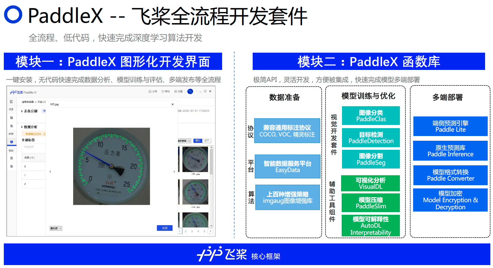

# PaddleX全面升级动态图，2.0.0-rc1发布！

  

 
 PaddleX -- 飞桨全流程开发工具，以低代码的形式支持开发者快速实现产业实际项目落地 

## :heart:重磅功能升级
### 全新发布Manufacture SDK，提供工业级多端多平台部署加速的预编译飞桨部署开发包（SDK），通过配置业务逻辑流程文件即可以低代码方式快速完成推理部署。[欢迎体验](https://github.com/PaddlePaddle/PaddleX/tree/develop/dygraph/deploy/cpp/docs/manufacture_sdk)

### PaddleX部署全面升级，支持飞桨视觉套件PaddleDetection、PaddleClas、PaddleSeg、PaddleX的端到端统一部署能力。[欢迎体验](https://github.com/PaddlePaddle/PaddleX/tree/develop/dygraph/deploy/cpp)

### 发布产业实践案例：钢筋计数、缺陷检测、机械手抓取、工业表计读数、Windows系统下使用C#语言部署。[欢迎体验](https://github.com/PaddlePaddle/PaddleX/tree/develop/dygraph/examples)

### 升级PaddleX GUI，支持30系列显卡、新增模型PP-YOLO V2、PP-YOLO Tiny 、BiSeNetV2。[欢迎体验](https://github.com/FlyingQianMM/PaddleX/blob/develop_qh/dygraph/docs/install.md#2-padldex-gui%E5%BC%80%E5%8F%91%E6%A8%A1%E5%BC%8F%E5%AE%89%E8%A3%85)

   
 

:hugs: PaddleX 集成飞桨智能视觉领域**图像分类**、**目标检测**、**语义分割**、**实例分割**任务能力，将深度学习开发全流程从**数据准备**、**模型训练与优化**到**多端部署**端到端打通，并提供**统一任务API接口**及**图形化开发界面Demo**。开发者无需分别安装不同套件，以**低代码**的形式即可快速完成飞桨全流程开发。

:factory: **PaddleX** 经过**质检**、**安防**、**巡检**、**遥感**、**零售**、**医疗**等十多个行业实际应用场景验证，沉淀产业实际经验，**并提供丰富的案例实践教程**，全程助力开发者产业实践落地。

## PaddleX 使用文档

### 1. 快速上手PaddleX

* [快速安装PaddleX](./docs/install.md)
  * [PaddleX API开发模式安装](./docs/install.md#1-paddlex-api开发模式安装)
  * [PadldeX GUI开发模式安装](./docs/install.md#2-padldex-gui开发模式安装)
  * [PaddleX Restful开发模式安装](./docs/install.md#3-paddlex-restful开发模式安装)
* [10分钟快速上手使用](./docs/quick_start.md)

### 2. 数据准备

* [数据格式说明](./docs/data/format/README.md)
* [标注工具LabelMe的安装和启动](./docs/data/annotation/labelme.md)
* [数据标注](./docs/data/annotation/README.md)
  * [手机拍照图片旋转](./docs/data/annotation/README.md)
  * [开始数据标注](./docs/data/annotation/README.md)
* [数据格式转换](./docs/data/convert.md)
* [数据划分](./docs/data/split.md)

### 3. 模型训练/评估/预测

* **PaddleX API开发模式：**

    * [API文档](./docs/apis)
      * [数据集读取API](./docs/apis/datasets.md)
      * [数据预处理和数据增强API](./docs/apis/transforms/transforms.md)
      * [图像分类模型API](./docs/apis/models/classification.md)
      * [目标检测模型API](./docs/apis/models/detection.md)
      * [实例分割模型API](./docs/apis/models/instance_segmentation.md)
      * [图像分割模型API](./docs/apis/models/semantic_segmentation.md)
    * [模型训练与参数调整](tutorials/train)
      * [模型训练](tutorials/train)
      * [训练参数调整](./docs//parameters.md)
    * [VisualDL可视化训练指标](../docs/train/visualdl.md)
    * [加载训好的模型完成预测及预测结果可视化](./docs/apis/prediction.md)

* **PaddleX GUI开发模式：**

    - [图像分类](https://www.bilibili.com/video/BV1nK411F7J9?from=search&seid=3068181839691103009)
    - [目标检测](https://www.bilibili.com/video/BV1HB4y1A73b?from=search&seid=3068181839691103009)
    - [实例分割](https://www.bilibili.com/video/BV1M44y1r7s6?from=search&seid=3068181839691103009)
    - [语义分割](https://www.bilibili.com/video/BV1qQ4y1Z7co?from=search&seid=3068181839691103009)

### 4. 模型剪裁和量化

- [模型剪裁](tutorials/slim/prune)
- [模型量化](tutorials/slim/quantize)

### 5. 模型部署

- [部署模型导出](./docs/apis/export_model.md)
- [PaddleX Manufacture SDK低代码高效部署](./deploy/cpp/docs/manufacture_sdk)
- [PaddleX/PaddleClas/PaddleDetection/PaddleSeg端到端高性能统一部署](./deploy/cpp)

### 6. 产业级应用示例

- [钢筋计数](examples/rebar_count)
- [缺陷检测](examples/defect_detection)
- [机械手抓取](examples/robot_grab)
- [工业表计读数](examples/meter_reader)
- [Windows系统下使用C#语言部署](examples/C#_deploy)

## 版本更新

- **2021.07.05 v2.0.0-rc1**

  PaddleX部署全面升级，支持飞桨视觉套件PaddleDetection、PaddleClas、PaddleSeg、PaddleX的端到端统一部署能力。全新发布Manufacture SDK，提供工业级多端多平台部署加速的预编译飞桨部署开发包（SDK），通过配置业务逻辑流程文件即可以低代码方式快速完成推理部署。发布产业实践案例：钢筋计数、缺陷检测、机械手抓取、工业表计读数、Windows系统下使用C#语言部署。升级PaddleX GUI，支持30系列显卡、新增模型PP-YOLO V2、PP-YOLO Tiny 、BiSeNetV2。详细内容请参考[版本更新文档](./docs/CHANGELOG.md)

- **2021.05.19 v2.0.0-rc**

  全面支持飞桨2.0动态图，更易用的开发模式。 目标检测任务新增PP-YOLOv2, COCO test数据集精度达到49.5%、V100预测速度达到68.9 FPS。目标检测任务新增4.2MB的超轻量级模型PP-YOLO tiny。语义分割任务新增实时分割模型BiSeNetV2。C++部署模块全面升级，PaddleInference部署适配2.0预测库，支持飞桨PaddleDetection、PaddleSeg、PaddleClas以及PaddleX的模型部署；新增基于PaddleInference的GPU多卡预测；GPU部署新增基于ONNX的的TensorRT高性能加速引擎部署方式；GPU部署新增基于ONNX的Triton服务化部署方式。详情内容请参考[版本更新文档](./docs/CHANGELOG.md)。

## 交流与反馈

- 项目官网：https://www.paddlepaddle.org.cn/paddle/paddlex

- PaddleX用户交流群：957286141 (手机QQ扫描如下二维码快速加入)  

  

    
  

## :hugs: 贡献代码:hugs:

我们非常欢迎您为PaddleX贡献代码或者提供使用建议。如果您可以修复某个issue或者增加一个新功能，欢迎给我们提交Pull Requests。

### 开发者贡献项目

* [工业相机实时目标检测GUI](https://github.com/xmy0916/SoftwareofIndustrialCameraUsePaddle)
（windows系统，基于pyqt5开发）
* [工业相机实时目标检测GUI](https://github.com/LiKangyuLKY/PaddleXCsharp)
（windows系统，基于C#开发）
