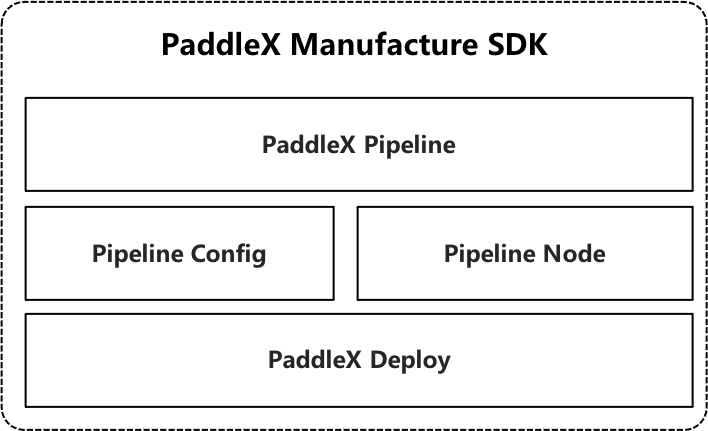
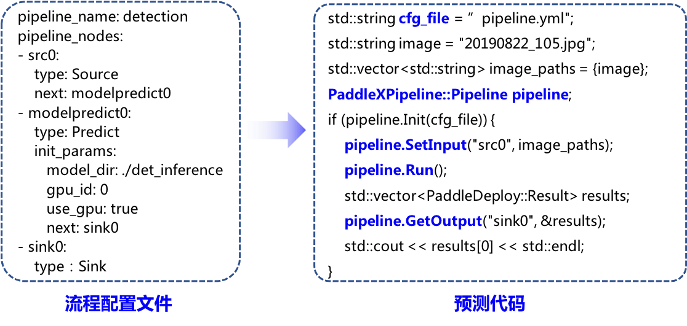

# 工业级多端多平台预编译部署开发包

PaddleX-Deploy全面升级，支持飞桨视觉套件PaddleX、PaddleDetection、PaddleClas、PaddleSeg的统一部署能力，端到端打通PaddleInference、PaddleLite、OpenVINO、Triton等多种高性能预测引擎，如果需要从**源码编译使用**，可至目录[PaddlePaddle模型C++部署](https://github.com/PaddlePaddle/PaddleX/tree/develop/dygraph/deploy/cpp)。

在工业部署的开发过程中，常常因环境问题导致在部署代码编译环节中耗费较多的时间和人力成本。如果产线上的业务逻辑稍微复杂一点，尤其是串联多个模型时，则需要在模型推理前插入预处理、中间结果处理等操作，如此复杂的逻辑对应的部署代码开发工程量是很大的。

为更进一步地提升部署效率，**:heart:PaddleX部署全新发布Manufacture SDK，提供工业级多端多平台部署加速的预编译飞桨部署开发包（SDK），通过配置业务逻辑流程文件即可以低代码方式快速完成推理部署。:heart:**


## 目录
* [1 Manufactue SDK简介](#1)
* [2 下载安装Manufacture SDK](#2)
* [3 Pipeline配置文件说明](#3)
* [4 Pipeline Node说明](#4)
* [5 多模型串联的工业表计读数部署](#5)

## <h2 id="1">1 Manufactue SDK简介</h2>

PaddleX Manufacture基于[PaddleX-Deploy](https://github.com/PaddlePaddle/PaddleX/tree/develop/dygraph/deploy/cpp)的端到端高性能部署能力，将应用深度学习模型的业务逻辑抽象成Pipeline，而接入深度学习模型前的数据前处理、模型预测、模型串联时的中间结果处理等操作都对应于Pipeline中的节点PipelineNode，用户只需在Pipeline配置文件中编排好各节点的前后关系，就可以给Pipeline发送数据并快速地获取相应的推理结果。Manufacture SDK的架构设计如下图所示：

<div align="center">
              </div>

* **PaddleX Pipeline**：完成业务逻辑的推理预测，同时提供向其发送数据和获取结果的接口。
* **PaddleX Config**: 定义Pipeline的节点类型和前后关系。
* **PaddleX Node**：功能节点，例如图像解码节点、图像缩放节点、兴趣区域提取节点、模型推理节点。
* **PaddleX Deploy**：高性能模型推理能力。

以PaddleX导出后的单一检测模型（无数据前处理、无中间结果处理）为例，配置好流程配置文件后使用简单几行代码就可以完成预测：

<div align="center">
              </div>

## <h2 id="2">2 下载安装Manufacture SDK</h2>

Manufature SDK的文件夹结构如下所示：

```
```

### 下载安装Windows Manufacture SDK

| 版本说明 | Manufacture SDK | 编译器 | 构建工具 | cuDNN | CUDA |
| -- | -- | -- | -- | -- | -- |
| | | | | | |

### 下载安装Linux Manufacture SDK

| 版本说明 | Manufacture SDK |
| -- | -- |
| | |

## <h2 id="3">3 Pipeline配置文件说明</h2>

PaddleX的模型导出后都会在模型文件夹中自动生成一个名为`pipeline.yml`流程编排文件，下面展示单一检测模型的流程配置文件：

```
pipeline_name: detection
pipeline_nodes:
- src0:
    type: Source
    next: decode0
- decode0:
    type: Decode
    next: modelpredict0
- modelpredict0:
    type: Predict
    init_params:
       model_dir: ./det_inference
       gpu_id: 0
       use_gpu: true
       next: sink0
- sink0:
    type：Sink
```

从上面示例可以看出，Pipeline配置文件是一个存储字典的`yaml`文件，文件中**必须包含`pipeline_name`和`pipeline_nodes`两个关键字**。每个关键词和键值说明如下：

| 关键字 | 键值 |
| -- | -- |
| pipeline_name | Pipeline的名称 |
| pipeline_nodes | Pipeline的节点列表。列表中**必须包含输入节点（Source）和输出节点（Sink）**。**列表中每个节点还是一个字典，关键字是该节点的名字，键值用于定义节点类型(type)、节点初始化参数(init_params)、连接的下一个节点的名字(next)，需要注意的是，每个节点的名字是独语无二的**。|

## <h2 id="4">4 Pipeline Node说明</h2>

目前支持的功能节点有：输入、图像解码、图像缩放、感兴趣区域提取、模型推理、检测框过滤、检测/分割结果可视化、输出。各功能节点的类型、初始化参数说明如下：

| 功能类型 type | 功能作用 |初始化参数 init_params | 下一个节点 next | 上一个节点 |
| -- | -- | -- | -- | -- |
| Source | 接收Pipeline所需的输入数据 | 无 | `str/List(str)`: 可以是单个节点名字或多个节点名字组成的列表 | 无 |
| Decode | 图像解码 | 无 | `str/List(str)`: 可以是单个节点名字或多个节点名字组成的列表 | 只能有一个 |
| Resize | 图像大小缩放 | `width (int)`: 目标宽；<br>`height (int)`: 目标高；<br>`interp (int)`：差值类型，默认为`1`；| str/List(str): 可以是单个节点名字或多个节点名字组成的列表 | 只能有一个 |
| Predict | PaddleX导出的分类/检测/分割模型预测 | `model_dir (str)`: PaddleX导出后的模型文件夹所在路径；<br>`use_gpu (bool)`: 是否使用GPU，默认为`false`；<br>`gpu_id (int)`：GPU卡号，在`use_gpu`为`true`时有效；<br>`use_trt (bool)`: 是否开启TensorRT加速GPU端预测 | `str/List(str)`: 可以是单个节点名字或多个节点名字组成的列表 | 只能有一个 |
| FilterBbox | 过滤置信度低于阈值的检测框 | `score_thresh (float)`: 置信度阈值 | `str/List(str)`: 可以是单个节点名字或多个节点名字组成的列表 | 只能有一个 |
| RoiCrop | 感兴趣区域提取 | 无 | `str/List(str)`: 可以是单个节点名字或多个节点名字组成的列表 | 必须有两个：能给出图像数据的节点、能给出检测模型预测结果的节点 |
| Visualize | 目标检测/实例分割/语义分割模型预测结果可视化 | `save_dir (str)`: 存储可视化结果的文件夹路径 | 无 (可视化结果只能本地保存) | 必须有两个：能给出图像数据的节点、能给目标检测/实例分割/语义分割模型预测结果的节点 |
| Sink | 获取Pipeline的输出数据 | 无 | 无 | 只能有一个 |

**注意：上一个节点不需要在Pipeline配置文件中指定，只需要指定下一个节点即可，实际运行时程序解析连接至上一个节点**。

## <h2 id="5">多模型串联的工业表计读数部署</h2>
