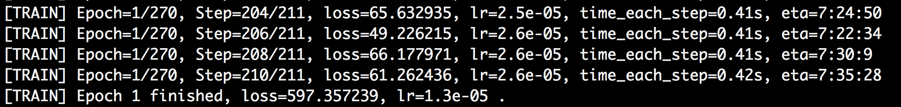
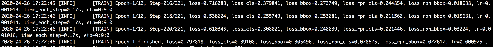
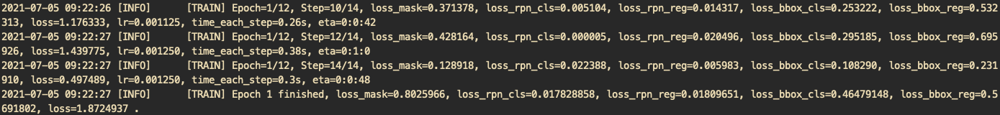
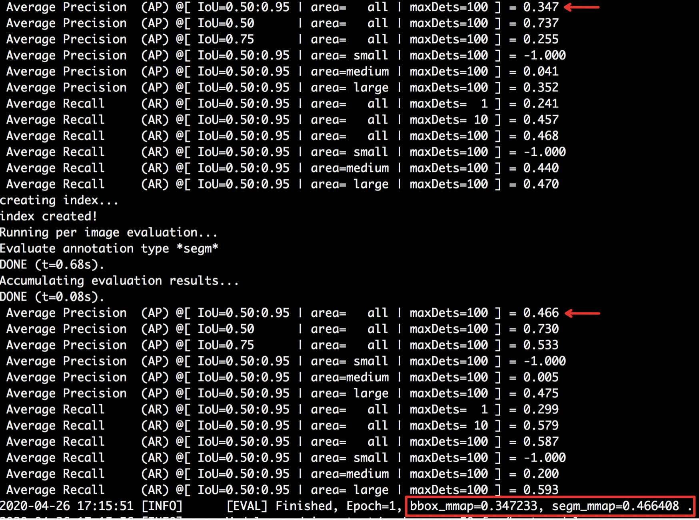

# PaddleX指标及日志

PaddleX在模型训练、评估过程中，都会有相应的日志和指标反馈，本文档用于说明这些日志和指标的含义。

## 训练通用统计信息

PaddleX所有模型在训练过程中，输出的日志信息都包含了6个通用的统计信息，用于辅助用户进行模型训练，例如**分割模型**的训练日志，如下图所示。

各字段含义如下:

| 字段           | 字段值示例           | 含义                                                         |
| -------------- | -------------------- | ------------------------------------------------------------ |
| Epoch          | Epoch=4/20           | [迭代轮数]所有训练数据会被训练20轮，当前处于第4轮                  |
| Step           | Step=62/66            | [迭代步数]所有训练数据被训练一轮所需要的迭代步数为66，当前处于第62步  |
| loss           | loss=0.007226          | [损失函数值]参与当前迭代步数的训练样本的平均损失函数值loss，loss值越低，表明模型在训练集上拟合的效果越好(如上日志中第1行表示第4个epoch的第62个Batch的loss值为0.007226) |
| lr             | lr=0.008215          | [学习率]当前模型迭代过程中的学习率                           |
| time_each_step | time_each_step=0.41s | [每步迭代时间]训练过程计算得到的每步迭代平均用时             |
| eta            | eta=0:9:44          | [剩余时间]模型训练完成所需剩余时间预估为0小时9分钟44秒      |
|                |                      |                                                              |

不同模型的日志中除了上述通用字段外，还有其它字段，这些字段含义可见文档后面对各任务模型的描述。

## 评估通用统计信息

PaddleX所有模型在训练过程中会根据用户设定的`save_interval_epochs`参数，每间隔一定轮数进行评估和保存。例如**分类模型**的评估日志，如下图所示。

上图中第1行表明验证数据集中样本数为240，需要迭代8步才能评估完所有验证数据；第5行用于表明第2轮的模型已经完成保存操作；第6行则表明当前保存的模型中，第2轮的模型在验证集上指标最优（分类任务看`acc1`，此时`acc1`值为0.258333），最优模型会保存在`best_model`目录中。

## 分类特有统计信息

### 训练日志字段

分类任务的训练日志除了通用统计信息外，还包括`acc1`和`acc5`两个特有字段。

> 注： acck准确率是针对一张图片进行计算的：把模型在各个类别上的预测得分按从高往低进行排序，取出前k个预测类别，若这k个预测类别包含了真值类，则认为该图片分类正确。

上图中第1行中的`acc1`表示参与当前迭代步数的训练样本的平均top1准确率，值越高代表模型越优；`acc5`表示参与当前迭代步数的训练样本的平均top5（若类别数n少于5，则为topn）准确率，值越高代表模型越优。第4行中的`loss`表示整个训练集的平均损失函数值，`acc1`表示整个训练集的平均top1准确率，`acc5`表示整个训练集的平均top5准确率。

### 评估日志字段

上图中第3行中的`acc1`表示整个验证集的平均top1准确率，`acc5`表示整个验证集的平均top5准确率。

## 检测特有统计信息

### 训练日志字段

#### YOLOv3

YOLOv3的训练日志除了通用统计信息外（见上文训练通用统计信息），还包括`loss_xy`、`loss_wh`、`loss_obj`、`loss_cls`，这些字段的含义如下:

| 字段           | 含义                                          |
| -------------- | --------------------------------------------- |
| loss_xy          | 检测框位置损失函数值                  |
| loss_wh          | 检测框尺寸损失函数值  |
| loss_obj       | 检测框置信度损失函数值   |
| loss_cls      | 检测框类别损失函数值 |
| loss              | 所有子网络损失函数值之和          |

上图中第5行`loss`表示整个训练集的平均损失函数loss值。

#### FasterRCNN

FasterRCNN的训练日志除了通用统计信息外，还包括`loss_cls`、`loss_bbox`、`loss_rpn_cls`和`loss_rpn_bbox`，这些字段的含义如下:

| 字段           | 含义                                          |
| -------------- | --------------------------------------------- |
| loss_cls          | RCNN子网络中分类损失函数值                  |
| loss_bbox          | RCNN子网络中检测框回归损失函数值  |
| loss_rpn_cls       | RPN子网络中分类损失函数值   |
| loss_rpn_bbox      | RPN子网络中检测框回归损失函数值  |
| loss              | 所有子网络损失函数值之和          |

上图中第1行`loss`, `loss_cls`、`loss_bbox`、`loss_rpn_clss`、`loss_rpn_bbox`都是参与当前迭代步数的训练样本的损失值，而第7行是针整个训练集的损失函数值。

#### MaskRCNN

MaskRCNN的训练日志除了通用统计信息外，还包括`loss_cls`、`loss_bbox`、`loss_mask`、`loss_rpn_cls`和`loss_rpn_bbox`，这些字段的含义如下:

| 字段           | 含义                                          |
| -------------- | --------------------------------------------- |
| loss_cls          | RCNN子网络中分类损失函数值                  |
| loss_bbox          | RCNN子网络中检测框回归损失函数值  |
| loss_mask          | RCNN子网络中Mask回归损失函数值  |
| loss_rpn_cls       | RPN子网络中分类损失函数值   |
| loss_rpn_bbox      | RPN子网络中检测框回归损失函数值  |
| loss              | 所有子网络损失函数值之和          |

上图中第1行`loss`, `loss_cls`、`loss_bbox`、`loss_mask`、`loss_rpn_clss`、`loss_rpn_bbox`都是参与当前迭代步数的训练样本的损失值，而第7行是针整个训练集的损失函数值。

### 评估日志字段

检测可以使用两种评估标准：VOC评估标准和COCO评估标准。

#### VOC评估标准

> 注：`map`为平均准确率的平均值，即IoU(Intersection Over Union)取0.5时各个类别的准确率-召回率曲线下面积的平均值。

上图中第3行`bbox_map`表示检测任务中整个验证集的平均准确率平均值。

#### COCO评估标准

> 注：COCO评估指标可参见[COCO官网解释](http://cocodataset.org/#detection-eval)。PaddleX主要反馈`mmAP`，即AP at IoU=.50:.05:.95这项指标，为在各个IoU阈值下平均准确率平均值（mAP）的平均值。

COCO格式的数据集不仅可以用于训练目标检测模型，也可以用于训练实例分割模型。在目标检测中，PaddleX主要反馈针对检测框的`bbox_mmAP`指标；在实例分割中，还包括针对Mask的`seg_mmAP`指标。如下所示，第一张日志截图为目标检测的评估结果，第二张日志截图为实例分割的评估结果。

上图中红框标注的`bbox_mmap`表示整个验证集的检测框平均准确率平均值。

上图中红框标注的`bbox_mmap`和`seg_mmap`分别表示整个验证集的检测框平均准确率平均值、Mask平均准确率平均值。

## 分割特有统计信息

### 训练日志字段

语义分割的训练日志只包括训练通用统计信息（见上文训练通用统计信息）。

### 评估日志字段

语义分割的评估日志包括了`miou`、`category_iou`、`oacc`、`category_acc`、`kappa`，这些字段的含义如下：

| 字段           | 含义                                          |
| -------------- | --------------------------------------------- |
| miou          | 各类IoU(Intersection Over Union)的平均值         |
| category_iou          | 各类别的IoU  |
| oacc          | 整体准确率，即预测正确的像素数/总像素数  |
| category_acc       | 各类别的准确率，即各类别预测正确的像素数/预测为该类别的总像素数  |
| kappa      | kappa系数，用于一致性检验  |
| category_F1-score | 各类别的F1-score, F1-score为2*(准确率*召回率)/(准确率+召回率)，其中召回率为各类别预测正确的像素数/该类别的总像素数 |

