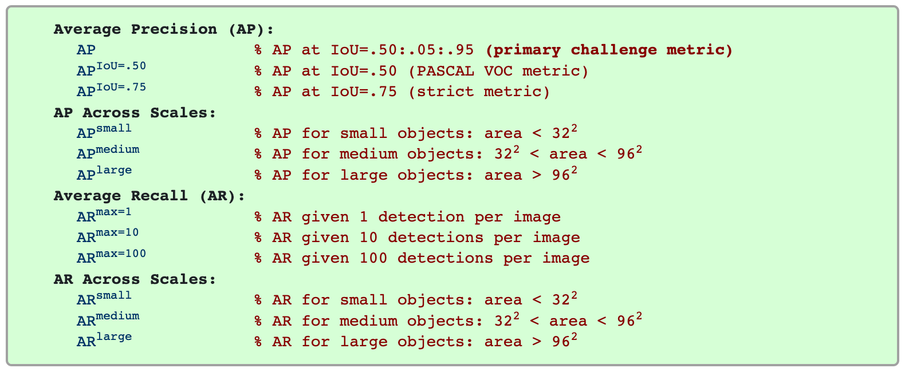

# COCO数据集说明
## 1、存储形式
## 2、划分训练集验证集
## 3、json文件参数解释
## 4、COCO数据集性能指标
-------------

### **1 存储形式**

在PaddleX中，实例分割支持MSCOCO数据集格式（MSCOCO格式同样也可以用于目标检测）。建议用户将数据集按照如下方式进行组织，原图均放在同一目录，如JPEGImages，标注文件（如annotations.json）放在与JPEGImages所在目录同级目录下，示例结构如下
```bash
dataset/ # 实例分割数据集根目录
|--JPEGImages/ # 原图文件所在目录
|  |--1.jpg
|  |--2.jpg
|  |--...
|  |--...
|
|--annotations.json # 标注文件所在目录
  ```

### **2 划分训练集验证集**

在PaddleX中，为了区分训练集和验证集，在`dataset`同级目录，使用不同的json表示数据的划分，例如`train.json`和`val.json`。

可使用PaddleX自带工具，对数据集进行随机划分，**在数据集按照上面格式组织后**，使用如下命令，将训练集、验证集和测试集按照7：2：1的比例划分。
``` shell
paddlex --split_dataset --format COCO --dataset_dir dataset --val_value 0.2 --test_value 0.1
```
数据文件夹切分后的状态如下:

```bash
dataset/ # 实例分割数据集根目录
|--JPEGImages/ # 原图文件所在目录
|  |--1.jpg
|  |--2.jpg
|  |--...
|  |--...
|
|--annotations.json # 标注文件所在目录
|--test.json # 划分出的测试集标注文件所在目录
|--train.json # 划分出的训练集标注文件所在目录
|--val.json # 划分出的验证集标注文件所在目录
  ```

### **3 json文件参数解释**
COCO数据集的实例分割json文件包含三个模块，分别存储图像、类别和标注信息。

详细情况如下：
```bash
|--images:         ... # 图像信息
|--categories:     ... # 类别信息
|--annotations:    ... # 标注信息
```
* 图像信息

`images`目录下是由0开始的连续序号，最大序号代表着该json文件指引的图片数。`images`下的每个分目录包含着每张图片的信息----图片名称、长和宽，并为图像分配了一个id，由0开始，该id会在`annotations`目录下用到。

详细情况如下：
```bash
|--images: # 图像信息
|  |--0: 
|  |  |--height:      2048
|  |  |--width:       2448
|  |  |--id:          0
|  |  |--file_name:   "IMAGE_14.jpg"
|  |--1: 
|  |  |--height:      2048
|  |  |--width:       2448
|  |  |--id:          1
|  |  |--file_name:   "IMAGE_15.jpg"
|  |--2: ...
|  |--3: ...
|  |--...
|  |--...
```
* 类别信息

`categories`目录下是由0开始的连续序号，最大序号代表着标注小类别总数。`categories`下的每个分目录包含着每种小类别的信息---小类别名称，所属大类别名称，比如钢筋数据集中，小类别名称为'bai_dian'（白点缺陷），大类别为'component'（缺陷成分）。并为类别分配了一个类别id，由1开始，该类别id会在`annotations`目录下用到。

详细情况如下：
```bash
|--categories: # 类别信息
|  |--0: 
|  |  |--supercategory: "component"
|  |  |--id:            1
|  |  |--name:          "bai_dian"
|  |--1: 
|  |  |--supercategory: "component"
|  |  |--id:            2
|  |  |--name:          "hua_shang"
|  |--2: ...
|  |--3: ...
|  |--...
|  |--...
```
* 标注信息

`annotations`目录下是由0开始的连续序号，最大序号代表着小类别总个数，注意到小类别数和图片数没有固定的对应关系，即一张图片既可以不含任何标注，也可以含一个或多个标注。

`annotations`下的每个分目录包含着每个标注的信息。详细情况如下：
```bash
|--annotations: # 类别信息
|  |--0: 
|  |  |--iscrowd:       0 # 0代表着标注单一对象
|  |  |--image_id:      0 # 图片的id
|  |  |--bbox:            #目标检测框位置
|  |  |  |--0:          1376.9561948173 # 左上角横坐标
|  |  |  |--1:          835.0766374645 # 左上角纵坐标
|  |  |  |--2:          16.520056013499925 # 目标宽度
|  |  |  |--3:          13.760934944399992 # 目标高度
|  |  |--area:          227.3314160791633 # 目标检测框的面积
|  |  |--catagory_id:   1 # 该标注对应的小类别id
|  |  |--id:            1 # 该标注的id序列号，由1开始
|  |  |--segmentation:    #分割标注信息
|  |  |  |--0:
|  |  |  |  |--0:       1381.0948764209 # 第一个标注点的横坐标
|  |  |  |  |--1:       846.4580118743 # 第一个标注点的纵坐标
|  |  |  |  |--2:       1377.301084951 # 第二个标注点的横坐标
|  |  |  |  |--3:       845.7682316071 # 第二个标注点的纵坐标
|  |  |  |  |--4:       ...
|  |  |  |  |--5:       ...
|  |  |  |  |--...
|  |  |  |  |--...
|  |--1: ...
|  |--2: ...
|  |--3: ...
|  |--...
|  |--...
```

**注意**：在目标检测任务中，segmentation下每项中有 0 至 7 这八个值，对应着目标检测框四个边界点的八个横纵坐标。在实例分割任务中，segmentation下每项中有 0 至 2n-1 这 2n 个值，对应着分割图像的 n 个分割点的 2n 个横纵坐标。
### **4 COCO数据集性能指标**
以下12个度量用于表征COCO上的目标检测器的性能：
<div align="center">
              </div>
* 指标说明

(1)AP和AR是在多个交并比（IoU）值上取平均值。具体来说，我们使用10个IoU阈值0.50：0.05：0.95。传统的AP是在一个单一的0.50的IoU上计算。设置多个阈值可以使评判标准更全面准确。

(2)AP是所有类别的平均值。之前也被称为“平均精确度”（mAP，mean average precision）。在COCO评价指标中，并没有区分AP和mAP（AR和mAR同理）。

(3)在考虑COCO性能时，AP被认为是最重要的一个评价指标，它是所有10个IoU阈值和所有类别的平均值。

(4)在COCO中，物体体积不平均，小物体比大物体多。具体地说，大约41％的物体很小（面积<32^2），34％是中等面积（32^2 < area < 96^2)），24％的物体很大（area > 96^2），故分别评价了大、中、小物体所对应的AP指标，这样可以更细化的判断网络对不同大小物体的检测性能。测量的面积是分割掩码（segmentation mask）中的像素数量。

(5)AR是在每个图像中检测到固定数量目标物体的最大召回（recall），在类别和IoU上平均。固定数量分别设置为1，10和100，数量设置越大，对应的召回率就越高。

(6)除了IoU计算是分别在框（box）或掩码（mask）上执行之外，用边界框和分割掩码检测的评估度量在所有方面是相同的。


