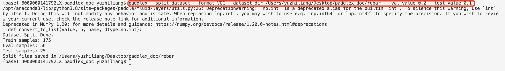
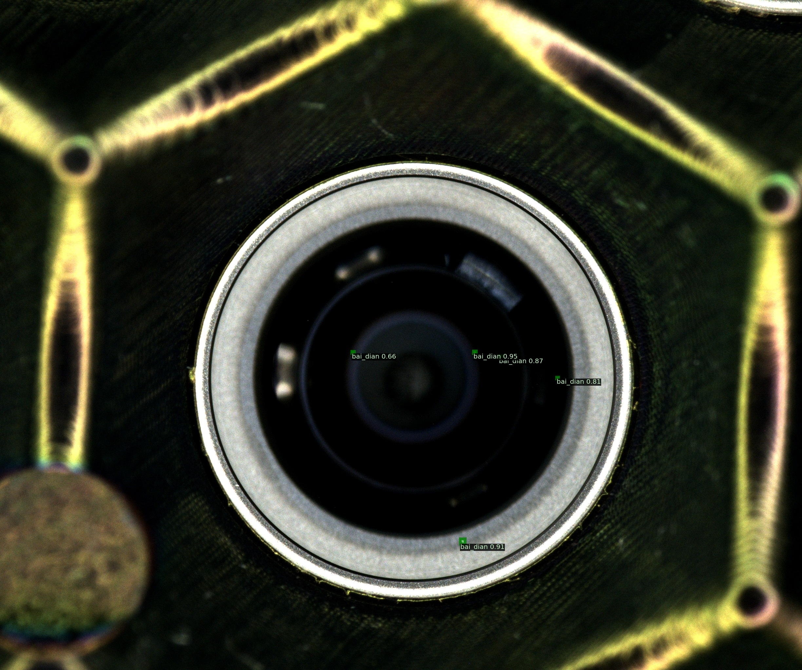

# 镜头缺陷检测
### 1 项目说明
摄像头模组是智能手机最为重要的组成部分之一。随着智能手机行业的快速发展,摄像头模组的需求量增加。高像素摄像头的出现,对模组检测精度要求提出了新的挑战。

项目中以手机镜头为例，向大家介绍如何快速使用实例分割方式进行缺陷检测。


### 2 数据准备
数据集中包含了992张已经标注好的数据，标注形式为MSCOCO的实例分割格式。[点击此处下载数据集](https://bj.bcebos.com/paddlex/examples2/defect_detection/dataset_lens_defect_detection.zip)

<div align="center">
              </div>

更多数据格式信息请参考[数据标注说明文档](https://paddlex.readthedocs.io/zh_CN/develop/data/annotation/index.html)
* **数据切分**
将训练集、验证集和测试集按照7：2：1的比例划分。
``` shell
paddlex --split_dataset --format COCO --dataset_dir dataset --val_value 0.2 --test_value 0.1
```
<div align="center">
              </div>
数据文件夹切分前后的状态如下:

```bash
  dataset/                      dataset/
  ├── JPEGImages/       -->     ├── JPEGImages/
  ├── annotations.json          ├── annotations.json
                                ├── test.json
                                ├── train.json
                                ├── val.json
  ```


### 3 模型选择
PaddleX提供了丰富的视觉模型，在实例分割中提供了MaskRCNN系列模型.在本项目中采用Mask-RCNN算法

### 4 模型训练
在项目中，我们采用Mask-RCNN作为镜头缺陷检测的模型。具体代码请参考[train.py](./code/train.py)
运行如下代码开始训练模型：
``` shell
python code/train.py
```
若输入如下代码，则可在log文件中查看训练日志
``` shell
python code/train.py > log
```
* 训练过程说明
<div align="center">
              </div>

``` bash
# 定义训练和验证时的transforms
# API说明：https://github.com/PaddlePaddle/PaddleX/blob/release/2.0-rc/paddlex/cv/transforms/operators.py
train_transforms = T.Compose([
    T.RandomResizeByShort(
        short_sizes=[640, 672, 704, 736, 768, 800],
        max_size=1333,
        interp='CUBIC'), T.RandomHorizontalFlip(), T.Normalize(
            mean=[0.485, 0.456, 0.406], std=[0.229, 0.224, 0.225])
])

eval_transforms = T.Compose([
    T.ResizeByShort(
        short_size=800, max_size=1333, interp='CUBIC'), T.Normalize(
            mean=[0.485, 0.456, 0.406], std=[0.229, 0.224, 0.225])
])
```

```bash
# 定义训练和验证所用的数据集
# API说明：https://github.com/PaddlePaddle/PaddleX/blob/develop/dygraph/paddlex/cv/datasets/coco.py#L26
train_dataset = pdx.datasets.CocoDetection(
    data_dir='dataset/JPEGImages',
    ann_file='dataset/train.json',
    # num_workers=0, # 注意：若运行时报错则添加该句
    transforms=train_transforms,
    shuffle=True)
eval_dataset = pdx.datasets.CocoDetection(
    data_dir='dataset/JPEGImages',
    ann_file='dataset/val.json',
    # num_workers=0, # 注意：若运行时报错则添加该句
    transforms=eval_transforms)
```
``` bash
# 初始化模型，并进行训练
# 可使用VisualDL查看训练指标，参考https://github.com/PaddlePaddle/PaddleX/tree/release/2.0-rc/tutorials/train#visualdl可视化训练指标
num_classes = len(train_dataset.labels)
model = pdx.models.MaskRCNN(
    num_classes=num_classes, backbone='ResNet50', with_fpn=True)
```
``` bash
# API说明：https://github.com/PaddlePaddle/PaddleX/blob/release/2.0-rc/paddlex/cv/models/detector.py#L155
# 各参数介绍与调整说明：https://paddlex.readthedocs.io/zh_CN/develop/appendix/parameters.html
model.train(
    num_epochs=12,
    train_dataset=train_dataset,
    train_batch_size=1,
    eval_dataset=eval_dataset,
    learning_rate=0.00125,
    lr_decay_epochs=[8, 11],
    warmup_steps=10,
    warmup_start_lr=0.0,
    save_dir='output/mask_rcnn_r50_fpn',
    use_vdl=True)
 ```

### 5 训练可视化

在模型训练过程，在`train`函数中，将`use_vdl`设为True，则训练过程会自动将训练日志以VisualDL的格式打点在`save_dir`（用户自己指定的路径）下的`vdl_log`目录。

用户可以使用如下命令启动VisualDL服务，查看可视化指标

```
visualdl --logdir output/mask_rcnn_r50_fpn/vdl_log --port 8001
```

<div align="center">
              </div>

服务启动后，按照命令行提示，使用浏览器打开 http://localhost:8001/

### 6 模型导出
模型训练处理被保存在了output文件夹，此时模型文件还是动态图文档,需要导出成静态图的模型才可以进一步部署预测,运行如下命令，会自动在output文件夹下创建一个`inference_model`的文件夹，用来存放预测好的模型。

``` bash
paddlex --export_inference --model_dir=output/mask_rcnn_r50_fpn/best_model --save_dir=output/inference_model
```
### 7 模型预测

运行如下代码：
``` bash
python code/infer.py
```
文件内容如下：
``` bash
import glob
import numpy as np
import threading
import time
import random
import os
import base64
import cv2
import json
import paddlex as pdx

image_name = 'dataset/JPEGImages/Image_370.jpg'
model = pdx.load_model('output/mask_rcnn_r50_fpn/best_model')


img = cv2.imread(image_name)
result = model.predict(img)

keep_results = []
areas = []
f = open('result.txt','a')
count = 0
for dt in np.array(result):
    cname, bbox, score = dt['category'], dt['bbox'], dt['score']
    if score < 0.5:
        continue
    keep_results.append(dt)
    count+=1
    f.write(str(dt)+'\n')
    f.write('\n')
    areas.append(bbox[2] * bbox[3])
areas = np.asarray(areas)
sorted_idxs = np.argsort(-areas).tolist()
keep_results = [keep_results[k]
                for k in sorted_idxs] if len(keep_results) > 0 else []
print(keep_results)
print(count)
f.write("the total number is :"+str(int(count)))
f.close()

pdx.det.visualize(image_name, result, threshold=0.5, save_dir='./output/mask_rcnn_r50_fpn')
```
则可生成result.txt文件并显示预测结果图片，result.txt文件中会显示图片中每个检测框的位置、类别及置信度，并给出检测框的总个数.

预测结果如下：
<div align="center">
              </div>
